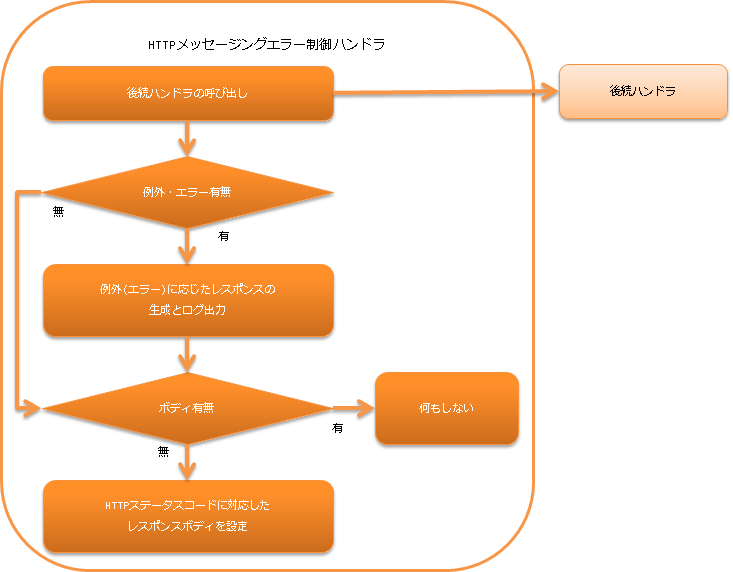

# HTTPメッセージングエラー制御ハンドラ

**目次**

* ハンドラクラス名
* モジュール一覧
* 制約
* 例外の種類に応じたログ出力とレスポンス生成

  * nablarch.fw.Result.Errorのログ出力について
* レスポンスボディが空の場合のデフォルトレスポンスの設定

本ハンドラでは後続のハンドラで発生した例外及びエラーを補足し、例外(エラー)に応じたログ出力とレスポンスの生成を行う。
また、後続のハンドラでレスポンスボディが設定されていない場合には、HTTPステータスコードに対応したデフォルトのボディをレスポンスに設定する。

本ハンドラでは、以下の処理を行う。

* 例外(エラー)に応じたログ出力とレスポンスの生成を行う。
  詳細は、 [例外の種類に応じたログ出力とレスポンス生成](../../component/handlers/handlers-http-messaging-error-handler.md#例外の種類に応じたログ出力とレスポンス生成) を参照。
* デフォルトのレスポンスボディを設定する。
  詳細は、 [レスポンスボディが空の場合のデフォルトレスポンスの設定](../../component/handlers/handlers-http-messaging-error-handler.md#レスポンスボディが空の場合のデフォルトレスポンスの設定) を参照。

処理の流れは以下のとおり。



## ハンドラクラス名

* nablarch.fw.messaging.handler.HttpMessagingErrorHandler

## モジュール一覧

```xml
<dependency>
  <groupId>com.nablarch.framework</groupId>
  <artifactId>nablarch-fw-messaging-http</artifactId>
</dependency>
```

## 制約

[HTTPレスポンスハンドラ](../../component/handlers/handlers-http-response-handler.md#httpレスポンスハンドラ) より後ろに配置すること

本ハンドラで生成した HttpResponse を [HTTPレスポンスハンドラ](../../component/handlers/handlers-http-response-handler.md#httpレスポンスハンドラ) が処理する。
このため、本ハンドラを [HTTPレスポンスハンドラ](../../component/handlers/handlers-http-response-handler.md#httpレスポンスハンドラ) より後ろに設定する必要がある。

## 例外の種類に応じたログ出力とレスポンス生成

nablarch.fw.NoMoreHandlerException

INFO

404

リクエストを処理すべきハンドラが存在しなかったことを意味するため、証跡ログとして記録する。
また、処理すべき *action class* が存在しなかったことを意味するため、HTTPステータスコードが *404*  のレスポンスを生成する。

nablarch.fw.web.HttpErrorResponse

ログ出力なし

HttpErrorResponse#getResponse()

後続のハンドラで業務例外(バリデーションなどを行った結果の例外)が発生したことを意味するので、ログ出力は行わない。

nablarch.fw.Result.Error

設定による

Error#getStatusCode()

[nablarch.fw.Result.Errorのログ出力について](../../component/handlers/handlers-http-messaging-error-handler.md#nablarchfwresulterrorのログ出力について) を参照

nablarch.core.message.ApplicationException と nablarch.fw.messaging.MessagingException

-

400

クライアントからのリクエストが不正であることを示す例外のため、HTTPステータスコードが *400* のレスポンスを生成する。

上記以外の例外及びエラー

FATAL

500

上記に該当しない例外及びエラーの場合には、障害扱いとしてログ出力を行う。
また、予期しない例外やエラーであるため、レスポンスは **500** としている。

### nablarch.fw.Result.Errorのログ出力について

後続のハンドラで発生した例外が、 Error の場合はログ出力を行うかどうかは、
writeFailureLogPattern に設定した値によって変わる。
このプロパティには正規表現が設定でき、その正規表現が Error#getStatusCode() とマッチした場合に FATAL レベルのログを出力する。

## レスポンスボディが空の場合のデフォルトレスポンスの設定

詳細は、 [HTTPエラー制御ハンドラのデフォルトページの設定](../../component/handlers/handlers-HttpErrorHandler.md#デフォルトページの設定) を参照。
