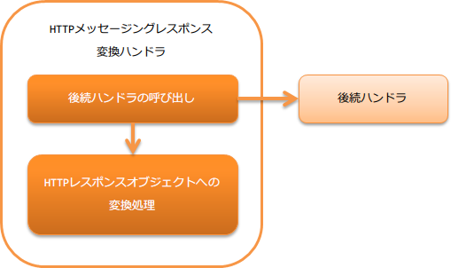

# HTTPメッセージングレスポンス変換ハンドラ

**目次**

* ハンドラクラス名
* モジュール一覧
* 制約
* レスポンスヘッダに設定される値
* フレームワーク制御ヘッダのレイアウトを変更する

本ハンドラでは、後続のハンドラが作成した応答電文オブジェクトをHTTPレスポンスオブジェクトに変換する。
また、応答電文オブジェクト内のプロトコルヘッダの値を、対応するHTTPヘッダに設定及びXMLやJSONなどの形式への直列化を行う。

本ハンドラでは、以下の処理を行う。

* 応答電文オブジェクトの内容をHTTPレスポンスオブジェクトに変換する。

処理の流れは以下のとおり。



## ハンドラクラス名

* nablarch.fw.messaging.handler.HttpMessagingResponseBuildingHandler

## モジュール一覧

```xml
<dependency>
  <groupId>com.nablarch.framework</groupId>
  <artifactId>nablarch-fw-messaging-http</artifactId>
</dependency>
```

## 制約

[HTTPレスポンスハンドラ](../../component/handlers/handlers-http-response-handler.md#httpレスポンスハンドラ) よりも後ろに設定すること

このハンドラで生成した HTTPレスポンスオブジェクト を
[HTTPレスポンスハンドラ](../../component/handlers/handlers-http-response-handler.md#httpレスポンスハンドラ) がクライアントに返却するため。

## レスポンスヘッダに設定される値

後続のハンドラで作成された応答電文オブジェクトを元に以下のレスポンスヘッダを設定する。

応答電文オブジェクトのステータスコードを設定する。

応答電文オブジェクトの持つフォーマッタ(InterSystemMessage.getFormatter())から以下の値を取得し設定する。

* MIME(DataRecordFormatterSupport#getMimeType()
* cherset(DataRecordFormatterSupport#getDefaultEncoding()

MIMEが `application/json` でcharsetが `utf-8` の場合、Content-Typeは以下の値となる。

**application/json;charset=utf-8**

レスポンスヘッダの `X-Correlation-Id` に、応答電文オブジェクトのヘッダに設定された `CorrelationId` の値を設定する。

> **Important:**
> このハンドラでは、上記に記載のないレスポンスヘッダを設定できない。

> 上記外のレスポンスヘッダを使用したい場合は、プロジェクトでハンドラを作成し対応すること。

## フレームワーク制御ヘッダのレイアウトを変更する

応答電文内のフレームワーク制御ヘッダの定義を変更する場合には、プロジェクトで拡張したフレームワーク制御ヘッダの定義を設定する必要がある。
設定しない場合は、デフォルトの StructuredFwHeaderDefinition が使用される。

フレームワーク制御ヘッダの詳細は、 [フレームワーク制御ヘッダ](../../component/libraries/libraries-http-system-messaging.md#送受信電文のデータモデル) を参照。

以下に設定例を示す。

```xml
<component class="nablarch.fw.messaging.handler.HttpMessagingResponseBuildingHandler">
  <!-- フレームワーク制御ヘッダの設定 -->
  <property name="fwHeaderDefinition">
    <component class="sample.SampleFwHeaderDefinition" />
  </property>
</component>
```
