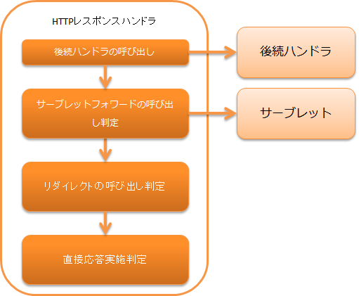

# HTTPレスポンスハンドラ

**公式ドキュメント**: [1](https://nablarch.github.io/docs/LATEST/doc/application_framework/application_framework/handlers/web/http_response_handler.html) [2](https://nablarch.github.io/docs/LATEST/javadoc/nablarch/fw/web/HttpResponse.html) [3](https://nablarch.github.io/docs/LATEST/javadoc/nablarch/fw/web/ResourceLocator.html) [4](https://nablarch.github.io/docs/LATEST/javadoc/nablarch/fw/web/handler/responsewriter/CustomResponseWriter.html) [5](https://nablarch.github.io/docs/LATEST/javadoc/nablarch/fw/web/i18n/DirectoryBasedResourcePathRule.html) [6](https://nablarch.github.io/docs/LATEST/javadoc/nablarch/fw/web/i18n/FilenameBasedResourcePathRule.html) [7](https://nablarch.github.io/docs/LATEST/javadoc/nablarch/fw/web/i18n/ResourcePathRule.html)

## ハンドラクラス名

**クラス名**: `nablarch.fw.web.handler.HttpResponseHandler`

<details>
<summary>keywords</summary>

HttpResponseHandler, nablarch.fw.web.handler.HttpResponseHandler, HTTPレスポンスハンドラ, ハンドラクラス

</details>

## モジュール一覧

**モジュール**:
```xml
<dependency>
  <groupId>com.nablarch.framework</groupId>
  <artifactId>nablarch-fw-web</artifactId>
</dependency>
```

<details>
<summary>keywords</summary>

nablarch-fw-web, モジュール依存関係, Maven依存関係

</details>

## 制約

なし。

<details>
<summary>keywords</summary>

制約なし, HTTPレスポンスハンドラ制約

</details>

## 応答の変換方法

応答の方法には4通りある:

1. **サーブレットフォワード**: サーブレットにフォワードし、JSPでレスポンスを描画
2. **カスタムレスポンスライター**: `customResponseWriter` プロパティで設定した任意の出力処理（テンプレートエンジン等）
3. **リダイレクト**: クライアントにリダイレクト応答を返す
4. **直接レスポンス**: `ServletResponse#getOutputStream()` を使用して直接レスポンス



スキームとステータスコードによるレスポンス変換:

| 変換条件 | 応答の方法 |
|---|---|
| スキームが `servlet` | カスタムレスポンスライターが処理対象と判定した場合は委譲、それ以外はコンテンツパス別サーブレットへフォワード |
| スキームが `redirect` | 指定したURLへのリダイレクト |
| スキームが `http` または `https` | 指定したURLへのリダイレクト |
| スキームが上記以外で、ステータスコードが400以上 | ステータスコードに合うエラー画面を表示 |
| 上記以外 | `HttpResponse#getBodyStream()` の結果を応答 |

スキーム: `HttpResponse#getContentPath()` で取得した `ResourceLocator` の `getScheme()` の戻り値。明示的に指定しない場合のデフォルトスキームは `servlet`。

ステータスコード: `HttpResponse#getStatusCode()` の戻り値。

<details>
<summary>keywords</summary>

HttpResponse, ResourceLocator, スキーム変換, サーブレットフォワード, リダイレクト, 直接レスポンス, servletスキーム, redirectスキーム, httpスキーム, httpsスキーム, ステータスコード変換条件

</details>

## カスタムレスポンスライター

プロパティ `customResponseWriter` に `CustomResponseWriter` の実装クラスを設定することで、任意のレスポンス出力処理を実行できる。

Nablarchが提供する実装として [web_thymeleaf_adaptor](../adapters/adapters-web_thymeleaf_adaptor.md) がある。

<details>
<summary>keywords</summary>

CustomResponseWriter, nablarch.fw.web.handler.responsewriter.CustomResponseWriter, customResponseWriter, テンプレートエンジン対応, カスタムレスポンス出力

</details>

## HTTPステータスコードの変更

ステータスコードの変換条件と応答コード:

| 変換条件 | エラーコード |
|---|---|
| Ajaxのリクエストの場合 | 元のステータスコードそのままを返す |
| 元のステータスコードが400の場合 | ステータスコード200を返す |
| 上記以外の場合 | ステータスコードの結果そのままを返す |

<details>
<summary>keywords</summary>

ステータスコード変換, Ajaxリクエスト処理, 400→200変換, HTTPステータスコード変更

</details>

## 言語毎のコンテンツパスの切り替え

HTTPリクエストに含まれる言語設定をもとにフォワード先を動的に切り替える機能。`contentPathRule` プロパティに以下いずれかを設定:

**DirectoryBasedResourcePathRule**: コンテキストルート直下のディレクトリを言語切り替えに使用するクラス。

`/management/user/search.jsp` を日本語(ja)と英語(en)に対応する場合の配置例（コンテキストルート直下に言語名のディレクトリを作成する）:

```
コンテキストルート
├─en
│  └─management
│      └─user
│           search.jsp
└─ja
    └─management
        └─user
             search.jsp
```

**FilenameBasedResourcePathRule**: ファイル名を言語切り替えに使用するクラス。ファイル名にサフィックス `_言語名` を付ける。

`/management/user/search.jsp` を日本語(ja)と英語(en)に対応する場合の配置例:

```
コンテキストルート
└─management
        └─user
             search_en.jsp
             search_ja.jsp
```

設定例:

```xml
<component name="resourcePathRule" class="nablarch.fw.web.i18n.DirectoryBasedResourcePathRule" />
<component class="nablarch.fw.web.handler.HttpResponseHandler">
  <property name="contentPathRule" ref="resourcePathRule" />
</component>
```

独自の切り替え方法を使う場合は `ResourcePathRule` を継承したクラスを作成し、`contentPathRule` に設定する。

> **補足**: カスタムレスポンスライターでレスポンス出力を行う場合、本機能は使用できない。テンプレートエンジン等が持っている多言語対応機能と混在させないため。

<details>
<summary>keywords</summary>

DirectoryBasedResourcePathRule, FilenameBasedResourcePathRule, ResourcePathRule, contentPathRule, 多言語対応, コンテンツパス切り替え, 言語別JSP, nablarch.fw.web.i18n.DirectoryBasedResourcePathRule, nablarch.fw.web.i18n.FilenameBasedResourcePathRule, nablarch.fw.web.i18n.ResourcePathRule

</details>

## 本ハンドラ内で発生した致命的エラーの対応

以下の事象が発生した場合、ステータスコード500で固定的なレスポンスを返す:

- サーブレットフォワード時に `ServletException` が発生した場合
- `RuntimeException` およびそのサブクラスの例外が発生した場合
- `Error` およびそのサブクラスの例外が発生した場合

固定レスポンスHTML:

```html
<html>
  <head>
    <title>A system error occurred.</title>
  </head>
  <body>
    <p>
      We are sorry not to be able to proceed your request.<br/>
      Please contact the system administrator of our system.
    </p>
  </body>
</html>
```

> **重要**: 上記HTMLのレスポンスは固定的で設定による変更はできない。このレスポンスは、本ハンドラ内で例外が発生するレアケースのみでしか使われることはない。このため、通常この仕様が問題になることはないが、どんなことがあってもこのレスポンスを出してはいけないシステムにおいては、本ハンドラを参考にハンドラの自作を検討すること。

<details>
<summary>keywords</summary>

ServletException, RuntimeException, Error, ステータスコード500, 致命的エラー処理, 固定エラーレスポンス

</details>
