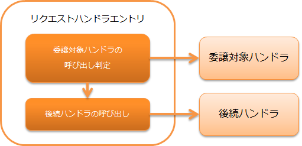

# リクエストハンドラエントリ

**目次**

* ハンドラクラス名
* モジュール一覧
* 制約
* 本ハンドラの使用例
* リクエストパターン指定のバリエーション

本ハンドラは、特定のリクエストパスのみ委譲先のハンドラを呼び出す特殊なハンドラである。
本ハンドラを使用することで、「ウェブアプリケーションで特定のURLのみハンドラの処理を行う」といった機能を、
ハンドラを修正することなく実現できる。

本ハンドラの主な用途は、 [リソースマッピングハンドラ](../../component/handlers/handlers-resource-mapping.md#リソースマッピングハンドラ) を使用した、「静的コンテンツのダウンロードを一括処理する」機能の実現である。
その他にも、 [データベース接続管理ハンドラ](../../component/handlers/handlers-database-connection-management-handler.md#データベース接続管理ハンドラ) や [トランザクション制御ハンドラ](../../component/handlers/handlers-transaction-management-handler.md#トランザクション制御ハンドラ) と同時に使用することで
「特定のURLのみ使用するデータベース接続を変える」といった用途にも使用できる。

本ハンドラでは、以下の処理を行う。

* リクエストパスがマッチするか判定し、対象であれば委譲先のハンドラを呼び出す。

処理の流れは以下のとおり。



## ハンドラクラス名

* nablarch.fw.RequestHandlerEntry

## モジュール一覧

```xml
<dependency>
  <groupId>com.nablarch.framework</groupId>
  <artifactId>nablarch-core</artifactId>
</dependency>
```

## 制約

なし。

## 本ハンドラの使用例

本ハンドラを使用する際は、処理対象とするリクエストパスを指定する `requestPattern` プロパティと、
委譲先のハンドラを指定する `handler` プロパティを設定する。

[リソースマッピングハンドラ](../../component/handlers/handlers-resource-mapping.md#リソースマッピングハンドラ) を使用して、JPEGファイルの静的コンテンツをダウンロードする設定例を以下に示す。

```xml
<!-- 画像ファイルの静的リソースダウンロードを行うハンドラ -->
<component name="imgMapping"
           class="nablarch.fw.web.handler.ResourceMapping">
  <property name="baseUri" value="/"/>
  <property name="basePath" value="servlet:///"/>
</component>

<!-- ハンドラキュー構成 -->
<component name="webFrontController"
           class="nablarch.fw.web.servlet.WebFrontController">

  <property name="handlerQueue">
    <list>

      <component class="nablarch.fw.handler.GlobalErrorHandler"/>
      <component class="nablarch.fw.web.handler.HttpCharacterEncodingHandler"/>
      <component class="nablarch.common.io.FileRecordWriterDisposeHandler" />
      <component class="nablarch.fw.web.handler.HttpResponseHandler"/>

      <!-- 拡張子が ".jpg" である静的JPGファイルのダウンロードを行う設定 -->
      <component class="nablarch.fw.RequestHandlerEntry">
        <property name="requestPattern" value="//*.jpg"/>
        <property name="handler" ref="imgMapping"/>
      </component>

      <!--
        "*.jpg" で終わるJPEGファイルのダウンロード以外のリクエストでは、
        以下のハンドラの呼び出しが行われる
        -->
      <component-ref name="multipartHandler"/>
      <component-ref name="sessionStoreHandler" />
```

## リクエストパターン指定のバリエーション

[本ハンドラの使用例](../../component/handlers/handlers-request-handler-entry.md#本ハンドラの使用例) の設定例からわかるとおり、本ハンドラに指定する `requestPattern` プロパティ
には、 `//*.jpg` のようなGlob式に似た書式での設定が行える。

ワイルドカードの設定例を以下に示す。

| requestPattern | リクエストパス | 結果 |
|---|---|---|
| / | / | 呼ばれる |
|  | /index.jsp | 呼ばれない |
| /* | / | 呼ばれる |
|  | /app | 呼ばれる |
|  | /app/ | 呼ばれない (* は'/'にはマッチしない) |
|  | /index.jsp | 呼ばれない (* は'.'にはマッチしない) |
| /app/*.jsp | /app/index.jsp | 呼ばれる |
|  | /app/admin | 呼ばれない |
| /app/*/test | /app/admin/test | 呼ばれる |
|  | /app/test/ | 呼ばれない |

また、最後尾の’/’が’//’と重ねられていた場合、それ以前の文字列について前方一致すればマッチ成功と判定する記法も使用できる。

以下に設定例を示す。

| requestPattern | リクエストパス | 結果 |
|---|---|---|
| /app// | / | 呼ばれない |
|  | /app/ | 呼ばれる |
|  | /app/admin/ | 呼ばれる |
|  | /app/admin/index.jsp | 呼ばれる |
| //*.jsp | /app/index.jsp | 呼ばれる |
|  | /app/admin/index.jsp | 呼ばれる |
|  | /app/index.html | 呼ばれない('*.jsp'がマッチしない) |
