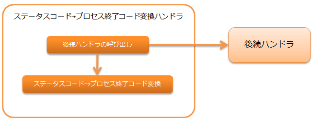

# ステータスコード→プロセス終了コード変換ハンドラ

**目次**

* ハンドラクラス名
* モジュール一覧
* 制約
* ステータスコード→プロセス終了コード変換

後続ハンドラによる処理結果のステータスコードをプロセスの終了コードに変換するハンドラ。

処理の流れは以下のとおり。



## ハンドラクラス名

* nablarch.fw.handler.StatusCodeConvertHandler

## モジュール一覧

```xml
<dependency>
  <groupId>com.nablarch.framework</groupId>
  <artifactId>nablarch-fw-standalone</artifactId>
</dependency>
```

## 制約

[共通起動ランチャ](../../component/handlers/handlers-main.md#main) の直後に設定すること
本ハンドラが処理結果のステータスコードをプロセスの終了コードに変換するため。

## ステータスコード→プロセス終了コード変換

ステータスコード→プロセス終了コード変換は、以下のルールで行う。

> **Important:**
> アプリケーションのエラー処理でステータスコードを指定する場合は、
> 100～199を使用する。

| ステータスコード | プロセス終了コード |
|---|---|
| -1以下 | 1 |
| 0～199 | 0～199(変換は行わない) |
| 200～399 | 0 |
| 400 | 10 |
| 401 | 11 |
| 403 | 12 |
| 404 | 13 |
| 409 | 14 |
| 上記以外の400～499 | 15 |
| 500以上 | 20 |

> **Tip:**
> このハンドラは、設定などで変換ルールを切り替えることはできない。
> このため、この変換ルールで要件を満たすことができない場合は、
> プロジェクト固有の変換用ハンドラを作成し対応すること。
