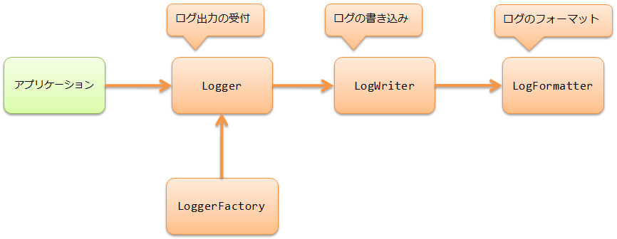

# ログ出力

**目次**

* 機能概要

  * ログ出力機能の実装を差し替えることができる
  * 各種ログの出力機能を予め提供している
* モジュール一覧
* 使用方法

  * ログを出力する
  * ログ出力の設定
  * ログ出力の設定を上書く
  * ログのフォーマットを指定する
  * 各種ログの設定
  * ログファイルのローテーションを行う
* 拡張例

  * LogWriterを追加する
  * LogFormatterを追加する
  * ログの出力項目(プレースホルダ)を追加する
  * ログの初期化メッセージを出力しないようにする
* JSON形式の構造化ログとして出力する

  * LogWriterで使用するフォーマッタをJsonLogFormatterに変更する
  * 各種ログで使用するフォーマッタをJSONログ用に差し替える
  * NablarchバッチのログをJSON形式にする

    * ApplicationSettingLogFormatterをJSON用に切り替える
    * LauncherLogFormatterをJSON用に切り替える
    * CommitLoggerをJSON用に切り替える
* SynchronousFileLogWriterを使用するにあたっての注意事項
* LogPublisherの使い方
* ログレベルの定義
* フレームワークのログ出力方針
* log4jとの機能比較

ログ出力を行う機能を提供する。

## 機能概要

### ログ出力機能の実装を差し替えることができる

ログ出力は、３つの処理から構成されており、それぞれの実装を差し替えることができる。



アプリケーションの要件に応じて、
LogWriter や
LogFormatter
の単位で差し替えることもできるし、
これらだけでは要件を満たせなければ
Logger /
LoggerFactory
を実装してほぼ全ての処理を差し替えることもできる。

例えば、オープンソースのログ出力ライブラリを使用したい場合などは
Logger /
LoggerFactory を差し替えればよい。

なお、オープンソースで使用実績の多いロギングフレームワークは、専用のLogger/LoggerFactoryを既に用意している。

詳細は、[logアダプタ](../../component/adapters/adapters-log-adaptor.md#log-adaptor) を参照。

本機能と使用実績の多いlog4jとの機能比較は、 [log4jとの機能比較](../../component/libraries/libraries-log.md#log-functional-comparison) を参照。

ログ出力機能がデフォルトで提供しているクラスを示す。

Logger/LoggerFactory
* BasicLogger
* BasicLoggerFactory

LogWriter
* FileLogWriter (ファイルへ出力。ログのローテーション。)
* SynchronousFileLogWriter (複数プロセスから1ファイルへの出力)
* StandardOutputLogWriter (標準出力へ出力)
* LogPublisher (任意のリスナーへ出力)

LogFormatter
* BasicLogFormatter (パターン文字列によるフォーマット)

RotatePolicy
* DateRotatePolicy (日時によるログのローテーション)
* FileSizeRotatePolicy (ファイルサイズによるログのローテーション)

> **Important:**
> SynchronousFileLogWriter
> を使う場合は、 [SynchronousFileLogWriterを使用するにあたっての注意事項](../../component/libraries/libraries-log.md#log-synchronous-file-log-writer-attention) を参照すること。

> **Tip:**
> ログ出力機能で使用するログレベルについては、 [ログレベルの定義](../../component/libraries/libraries-log.md#log-log-level) を参照。

### 各種ログの出力機能を予め提供している

本フレームワークでは、アプリケーションに共通で必要とされる各種ログの出力機能を予め提供している。
アプリケーションの要件に応じて、ログのフォーマットを設定で変更して使用できる。
なお、[各種ログの設定](../../component/libraries/libraries-log.md#log-app-log-setting) にも記載の通り、各種ログの出力機能はフォーマット処理のみを行っており、
ログの出力処理自体は本機能を使用している。
Nablarchの提供するアーキタイプから生成したブランクプロジェクトでは各種ログのフォーマットが設定してある。
各設定値は [デフォルト設定一覧](../../../knowledge/assets/libraries-log/デフォルト設定一覧.xlsx) を参照。

log/failure_log
log/sql_log
log/performance_log
log/http_access_log
log/jaxrs_access_log
log/messaging_log

ログの種類

| ログの種類 | 説明 |
|---|---|
| [障害通知ログ](../../component/libraries/libraries-failure-log.md#failure-log) | 障害発生時に1次切り分け担当者を特定するのに必要な情報を出力する。 |
| [障害解析ログ](../../component/libraries/libraries-failure-log.md#failure-log) | 障害原因の特定に必要な情報を出力する。 |
| [SQLログ](../../component/libraries/libraries-sql-log.md#sql-log) | 深刻なパフォーマンス劣化の要因となりやすいSQL文の実行について、 パフォーマンスチューニングに使用するために、SQL文の実行時間とSQL文を出力する。 |
| [パフォーマンスログ](../../component/libraries/libraries-performance-log.md#performance-log) | 任意の処理について、パフォーマンスチューニングに使用するために実行時間とメモリ使用量を出力する。 |
| [HTTPアクセスログ](../../component/libraries/libraries-http-access-log.md#http-access-log) | ウェブアプリケーションで、アプリケーションの実行状況を把握するための情報を出力する。 アプリケーションの性能測定に必要な情報、アプリケーションの負荷測定に必要な情報の出力も含む。 さらに、アプリケーションの不正使用を検知するために、 全てのリクエスト及びレスポンス情報を出力する証跡ログとしても使用する。 |
| [HTTPアクセスログ（RESTfulウェブサービス用）](../../component/libraries/libraries-jaxrs-access-log.md#jaxrs-access-log) | RESTfulウェブサービスアプリケーションで、アプリケーションの実行状況を把握するための情報を出力する。 アプリケーションの性能測定に必要な情報、アプリケーションの負荷測定に必要な情報の出力も含む。 さらに、アプリケーションの不正使用を検知するために、 全てのリクエスト及びレスポンス情報を出力する証跡ログとしても使用する。 |
| [メッセージングログ](../../component/libraries/libraries-messaging-log.md#messaging-log) | メッセージング処理において、メッセージ送受信の状況を把握するための情報を出力する。 |

> **Tip:**
> 本フレームワークでは、 [障害通知ログ](../../component/libraries/libraries-failure-log.md#failure-log) と [障害解析ログ](../../component/libraries/libraries-failure-log.md#failure-log) を合わせて障害ログと呼ぶ。

## モジュール一覧

```xml
<dependency>
  <groupId>com.nablarch.framework</groupId>
  <artifactId>nablarch-core</artifactId>
</dependency>
<dependency>
  <groupId>com.nablarch.framework</groupId>
  <artifactId>nablarch-core-applog</artifactId>
</dependency>

<!-- SQLログを使用する場合のみ -->
<dependency>
  <groupId>com.nablarch.framework</groupId>
  <artifactId>nablarch-core-jdbc</artifactId>
</dependency>

<!-- HTTPアクセスログを使用する場合のみ -->
<dependency>
  <groupId>com.nablarch.framework</groupId>
  <artifactId>nablarch-fw-web</artifactId>
</dependency>

<!-- HTTPアクセスログ（RESTfulウェブサービス用）を使用する場合のみ -->
<dependency>
  <groupId>com.nablarch.framework</groupId>
  <artifactId>nablarch-fw-jaxrs</artifactId>
</dependency>

<!-- メッセージングログを使用する場合のみ -->
<dependency>
  <groupId>com.nablarch.framework</groupId>
  <artifactId>nablarch-fw-messaging</artifactId>
</dependency>
```

## 使用方法

### ログを出力する

ログの出力には Logger を使用する。
Logger は
LoggerManager から取得する。

```java
// クラスを指定してLoggerを取得する。
// Loggerはクラス変数に保持する。
private static final Logger LOGGER = LoggerManager.get(UserManager.class);
```

```java
// ログの出力有無を事前にチェックし、ログ出力を行う。
if (LOGGER.isDebugEnabled()) {
    String message = "userId[" + user.getId() + "],name[" + user.getName() + "]";
    LOGGER.logDebug(message);
}
```

Logger の取得ではロガー名を指定する。
ロガー名には文字列またはクラスが指定できる。
クラスが指定された場合は、指定されたクラスのFQCNがロガー名となる。

> **Important:**
> アプリケーションにおいて、常にログを出力することになっているレベルは、
> ソースコードの可読性が落ちるため、事前チェックをしなくてよい。
> 例えば、本番運用時に出力するログレベルをINFOレベルにするのであれば、
> FATALレベルからINFOレベルまでは事前チェックしなくてよい。

> **Tip:**
> ロガー名には、SQLログや監視ログなど、特定の用途向けのログ出力を行う場合は、
> その用途を表す名前(SQLやMONITOR等)を指定し、それ以外はクラスのFQCNを指定する。

### ログ出力の設定

ログ出力の設定は、プロパティファイルに行う。

プロパティファイルの場所
クラスパス直下の **log.properties** を使用する。
場所を変更したい場合は、システムプロパティで **nablarch.log.filePath** をキーにファイルパスを指定する。
ファイルパスの指定方法は
FileUtil#getResource を参照。

```bash
>java -Dnablarch.log.filePath=classpath:nablarch/example/log.properties ...
```
プロパティファイルの記述ルール
プロパティファイルの記述ルールを以下に示す。

LoggerFactory
記述ルール
loggerFactory.className
LoggerFactoryを実装したクラスのFQCNを指定する。
本機能を使う場合は、 BasicLoggerFactory を指定する。
記述例
```properties
# LoggerFactoryにより、ログ出力に使用する実装(本機能やLog4Jなど)が決まる。
loggerFactory.className=nablarch.core.log.basic.BasicLoggerFactory
```
LogWriter
記述ルール
writerNames
使用する全てのLogWriterの名前を指定する。複数指定する場合はカンマ区切り。
writer.<名前>.className
LogWriterを実装したクラスのFQCNを指定する。
writer.<名前>.<プロパティ名>
LogWriter毎のプロパティに設定する値を指定する。
指定できるプロパティについては使用するLogWriterのJavadocを参照。
記述例
```properties
# 2つの名前を定義する。
writerNames=appLog,stdout

# appLogの設定を行う。
writer.appLog.className=nablarch.core.log.basic.FileLogWriter
writer.appLog.filePath=/var/log/app/app.log

# stdoutの設定を行う。
writer.stdout.className=nablarch.core.log.basic.StandardOutputLogWriter
```
ロガー設定
記述ルール
availableLoggersNamesOrder
使用する全てのロガー設定の名前を指定する。複数指定する場合はカンマ区切り。

> **Important:**
> availableLoggersNamesOrderプロパティは、記述順に意味があるので注意すること。

> Logger の取得では、ログ出力を行うクラスが指定したロガー名に対して、
> ここに記述した順番で Logger のマッチングを行い、
> 最初にマッチした Logger を返す。

> 例えば、以下の記述例にあるavailableLoggersNamesOrderの記述順をavailableLoggersNamesOrder=root,sqlと記述した場合、
> 全てのロガー取得がロガー設定 `root` にマッチしてしまう。
> その結果、ロガー名 `SQL` でログ出力しても `sqlLog` に出力されず、ロガー設定 `root` に指定された `appLog` に出力される。

> したがって、availableLoggersNamesOrderプロパティは、より限定的な正規表現を指定したロガー設定から順に記述すること。

> **Important:**
> availableLoggersNamesOrderとloggers.*で指定するロガー設定の名称は、必ず一致させる必要がある。
> BasicLoggerFactory の初期処理で一致しているかチェックを行い、
> 一致しない場合は例外をスローする。
> 例えば、上記の設定にあるavailableLoggersNamesOrderから `access` を取り除くと、例外がスローされる。

> このチェックは、設定漏れの発生を防ぐために行っている。
> 上記の設定にあるavailableLoggersNamesOrderから `access` を取り除いた場合は、明示的にloggers.access.*の設定も取り除く必要がある。
loggers.<名前>.nameRegex
ロガー名とのマッチングに使用する正規表現を指定する。
正規表現は、ロガー設定の対象となるロガーを絞り込むために使用する。
ロガーの取得時に指定されたロガー名(つまり LoggerManager#get
の引数に指定されたロガー名)に対してマッチングを行う。
loggers.<名前>.level
LogLevel の名前を指定する。
ここで指定したレベル以上のログを全て出力する。
loggers.<名前>.writerNames
出力先とするLogWriterの名前を指定する。
複数指定する場合はカンマ区切り。
ここで指定した全てのLogWriterに対してログの書き込みを行う。
記述例
```properties
# 2つのロガー設定の名前を定義する。
availableLoggersNamesOrder=sql,root

# rootの設定を行う。
loggers.root.nameRegex=.*
loggers.root.level=WARN
loggers.root.writerNames=appLog

# sqlの設定を行う。
loggers.sql.nameRegex=SQL
loggers.sql.level=DEBUG
loggers.sql.writerNames=sqlLog
```
プロパティファイルの記述例
プロパティファイル全体の記述例を以下に示す。

```properties
loggerFactory.className=nablarch.core.log.basic.BasicLoggerFactory

writerNames=appLog,sqlLog,monitorLog,stdout

# アプリケーション用のログファイルの設定例
writer.appLog.className=nablarch.core.log.basic.FileLogWriter
writer.appLog.filePath=/var/log/app/app.log

# SQL出力用のログファイルの設定例
writer.sqlLog.className=nablarch.core.log.basic.FileLogWriter
writer.sqlLog.filePath=/var/log/app/sql.log

# 監視用のログファイルの設定例
writer.monitorLog.className=nablarch.core.log.basic.FileLogWriter
writer.monitorLog.filePath=/var/log/app/monitoring.log

# 標準出力の設定例
writer.stdout.className=nablarch.core.log.basic.StandardOutputLogWriter

availableLoggersNamesOrder=sql,monitoring,access,validation,root

# 全てのロガー名をログ出力の対象にする設定例
# 全てのロガー取得を対象に、WARNレベル以上をappLogに出力する。
loggers.root.nameRegex=.*
loggers.root.level=WARN
loggers.root.writerNames=appLog

# 特定のロガー名をログ出力の対象にする設定例。
# ロガー名に"MONITOR"を指定したロガー取得を対象に、
# ERRORレベル以上をappLog,monitorLogに出力する。
loggers.monitoring.nameRegex=MONITOR
loggers.monitoring.level=ERROR
loggers.monitoring.writerNames=appLog,monitorLog

# 特定のロガー名をログ出力の対象にする設定例。
# ロガー名に"SQL"を指定したロガー取得を対象に、
# DEBUGレベル以上をsqlLogに出力する。
loggers.sql.nameRegex=SQL
loggers.sql.level=DEBUG
loggers.sql.writerNames=sqlLog

# 特定のクラスをログ出力の対象にする設定例。
# ロガー名に"app.user.UserManager"を指定したロガー取得を対象に、
# INFOレベル以上をappLogとstdoutに出力する。
loggers.access.nameRegex=app\\.user\\.UserManager
loggers.access.level=INFO
loggers.access.writerNames=appLog,stdout

# 特定のパッケージ以下をログ出力の対象にする設定例。
# ロガー名に"nablarch.core.validation"から始まる名前を指定したロガー取得を対象に、
# DEBUGレベル以上をstdoutに出力する。
loggers.validation.nameRegex=nablarch\\.core\\.validation\\..*
loggers.validation.level=DEBUG
loggers.validation.writerNames=stdout
```

> **Tip:**
> ロガー設定では、全てのログ出力にマッチするロガー設定を1つ用意し、availableLoggersNamesOrderの最後に指定することを推奨する。
> 万が一設定が漏れた場合でも、重要なログの出力を逃してしまう事態を防ぐことができる。
> 設定例としては、上記の記述例にあるロガー設定 `root` を参照。

### ログ出力の設定を上書く

ログ出力の設定は、システムプロパティを使用して、
プロパティファイルと同じキー名で値を指定することにより上書きできる。
これにより、共通のプロパティファイルを用意しておき、プロセス毎にログ出力設定を変更するといったことができる。

ロガー設定 `root` のログレベルをINFOに変更したい場合の例を以下に示す。

```bash
>java -Dloggers.root.level=INFO ...
```

### ログのフォーマットを指定する

本機能では、汎用的に使用できる LogFormatter として、
BasicLogFormatter を提供している。

BasicLogFormatter では、
プレースホルダを使用してフォーマットを指定する。
使用できるプレースホルダについては、
BasicLogFormatter
のJavadocを参照。

フォーマットの設定例を以下に示す。
フォーマットはLogWriterのプロパティに指定する。

```properties
# フォーマットを指定する場合はBasicLogFormatterを明示的に指定する。
writer.appLog.formatter.className=nablarch.core.log.basic.BasicLogFormatter

# プレースホルダを使ってフォーマットを指定する。
writer.appLog.formatter.format=$date$ -$logLevel$- $loggerName$ $message$

# 日時のフォーマットに使用するパターンを指定する。
# 指定しなければ"yyyy-MM-dd HH:mm:ss.SSS"となる。
writer.appLog.formatter.datePattern=yyyy/MM/dd HH:mm:ss[SSS]

# ログレベルの文言を指定する。
# 指定しなければLogLevel列挙型の名前(FATAL、INFOなど)となる。
writer.appLog.formatter.label.fatal=F
writer.appLog.formatter.label.error=E
writer.appLog.formatter.label.warn=W
writer.appLog.formatter.label.info=I
writer.appLog.formatter.label.debug=D
writer.appLog.formatter.label.trace=T
```

BasicLogFormatter
では、出力されたログの状況を特定するために、以下の項目を出力できる。
これらの出力項目について説明しておく。

* [起動プロセス](../../component/libraries/libraries-log.md#log-boot-process)
* [処理方式](../../component/libraries/libraries-log.md#log-processing-system)
* [実行時ID](../../component/libraries/libraries-log.md#log-execution-id)

起動プロセス
起動プロセスとは、アプリケーションを起動した実行環境を特定するために使用する名前である。
起動プロセスにサーバ名とJOBIDなどの識別文字列を組み合わせた名前を使用することで、
同一サーバの複数プロセスから出力されたログの実行環境を特定できる。
起動プロセスは、プロジェクト毎にID体系などで体系を規定することを想定している。

起動プロセスは、システムプロパティに `nablarch.bootProcess` というキーで指定する。
システムプロパティの指定がない場合、起動プロセスはブランクとなる。

処理方式
処理方式とは、ウェブ、バッチなどを意味する。
アプリケーションの処理方式を識別したい場合に、プロジェクト毎に規定して使用する。

処理方式は、 [ログ出力の設定](../../component/libraries/libraries-log.md#log-basic-setting) で説明したプロパティファイルに
`nablarch.processingSystem` というキーで指定する。
プロパティの指定がない場合はブランクとなる。

実行時ID
実行時IDとは、リクエストIDに対するアプリケーションの個々の実行を識別するためにつけるIDである。
1つのリクエストIDに対して実行された数だけ実行時IDが発行されるため、
リクエストIDと実行時IDの関係は1対多となる。

実行時IDは、複数のログを出力している場合に、出力された複数のログを紐付けるために使用する。

実行時IDは、各処理方式の ThreadContext
を初期化するタイミングで発行し、 ThreadContext に設定される。

実行時IDのID体系
```none
# 起動プロセスは指定された場合のみ付加する。
起動プロセス＋システム日時(yyyyMMddHHmmssSSS)＋連番(4桁)
```

> **Important:**
> リクエストID、実行時ID、ユーザIDを出力する場合は、
> これらの取得元が ThreadContext なので、
> ハンドラ構成に [スレッドコンテキスト変数管理ハンドラ](../../component/handlers/handlers-thread-context-handler.md#thread-context-handler) が含まれている必要がある。
> 特にユーザIDについては、 [ユーザIDを設定する](../../component/handlers/handlers-thread-context-handler.md#thread-context-handler-user-id-attribute-setting) を参照して
> アプリケーションでセッションに値を設定する必要がある。

改行コードとタブ文字を含めたい場合
フォーマットに改行コードとタブ文字を含めたい場合は、以下に示すように、Javaと同様の記述を使用する。

```none
改行コード \n
タブ文字   \t
```

改行コードは、Java標準のシステムプロパティに含まれる `line.separator` から取得する。
このため、システムプロパティの `line.separator` を変更しなければOSの改行コードが使用される。

> **Tip:**
> BasicLogFormatter では
> `\n` と `\t` という文字列は出力できない。

### 各種ログの設定

各種ログの出力機能は、各種ログの用途に合わせたフォーマット処理のみを行っており、
ログの出力処理自体は本機能を使用している。
つまり、各種ログの出力機能では、 Logger
に指定するメッセージを作成する。

このため、各種ログの出力機能を使うには、 [ログ出力の設定](../../component/libraries/libraries-log.md#log-basic-setting) に加えて、各種ログの設定が必要となる。
各種ログの設定は、プロパティファイルに行う。

プロパティファイルの場所
クラスパス直下の **app-log.properties** を使用する。
場所を変更したい場合は、システムプロパティで **nablarch.appLog.filePath** をキーにファイルパスを指定する。
ファイルパスの指定方法は
FileUtil#getResource を参照。

```bash
>java -Dnablarch.appLog.filePath=file:/var/log/app/app-log.properties ...
```
プロパティファイルの記述ルール
各種ログごとに異なるので、以下を参照。

* [障害ログの設定](../../component/libraries/libraries-failure-log.md#failure-log-setting)
* [SQLログの設定](../../component/libraries/libraries-sql-log.md#sql-log-setting)
* [パフォーマンスログの設定](../../component/libraries/libraries-performance-log.md#performance-log-setting)
* [HTTPアクセスログの設定](../../component/libraries/libraries-http-access-log.md#http-access-log-setting)
* [HTTPアクセスログ（RESTfulウェブサービス用）の設定](../../component/libraries/libraries-jaxrs-access-log.md#jaxrs-access-log-setting)
* [メッセージングログの設定](../../component/libraries/libraries-messaging-log.md#messaging-log-setting)

### ログファイルのローテーションを行う

本機能で提供するFileLogWiterは、設定したポリシーに従ってログファイルのローテーションを行う。

ローテーションポリシーはデフォルトではファイルサイズによるローテーションを行う FileSizeRotatePolicy
が使用される。 RotatePolicy の実装クラスを作成することで、ローテーションポリシーを変更することができる。

本機能が提供している RotatePolicy の実装クラスは以下。
各 RotatePolicy の設定はそれぞれのJavadocを参照。

* FileSizeRotatePolicy
* DateRotatePolicy

ローテーションポリシーの設定例を以下に示す。ローテーションポリシーはLogWriterのプロパティに指定する。

```properties
writerNames=sample

# writerのrotatePolicyにRotatePolicyが実装されたクラスのFQCNを指定する
writer.sample.rotatePolicy=nablarch.core.log.basic.DateRotatePolicy
# 更新時刻。オプション。
writer.sample.rotateTime=12:00
```

## 拡張例

### LogWriterを追加する

新しいLogWriterを追加する場合は、 LogWriter
インタフェースを実装したクラスを作成する。
また、 LogFormatter を使用するLogWriterを作成する場合は、
共通処理を提供する LogWriterSupport を継承して作成する。

### LogFormatterを追加する

新しいLogFormatterを追加する場合は、 LogFormatter
インタフェースを実装したクラスを作成する。
また、ログレベルを表す文言を設定で変更可能にしたい場合は、
LogLevelLabelProvider を使用する。

新しいLogFormatterの追加に伴い、ログ出力時に指定するパラメータを増やし、
LogFormatterで増やしたパラメータを受け取りたいことがある。
本機能では、ログ出力時に指定するパラメータを増やす目的で、
Logger インタフェースのログ出力メソッドに
Object型の可変長引数optionsを設けている。

```java
// Logger#logInfoメソッドのシグネチャ
public void logInfo(String message, Object... options)
public void logInfo(String message, Throwable cause, Object... options)
```

ログ出力時のパラメータを増やしたい場合は、options引数を規定して使用すること。

### ログの出力項目(プレースホルダ)を追加する

BasicLogFormatter は、
LogItem インタフェースを使用して、
各プレースホルダに対応する出力項目を取得する。
そのため、新規にプレースホルダを追加したい場合は、以下のとおり対応する。

* LogItem を実装したクラスを作る
* BasicLogFormatter を継承したクラスを作り、プレースホルダを追加する

LogFormatterの設定から起動プロセスを取得するように変更する場合の例を示す。
LogFormatterの設定は、下記を想定する。

```properties
# カスタムのLogFormatterを指定する。
writer.appLog.formatter.className=nablarch.core.log.basic.CustomLogFormatter

# フォーマットを指定する。
writer.appLog.formatter.format=$date$ -$logLevel$- $loggerName$ [$bootProcess$] $message$

# LogFormatterの設定で起動プロセスを指定する。
# ここで指定した起動プロセスを$bootProcess$に出力する。
writer.appLog.formatter.bootProcess=CUSTOM_PROCESS
```

LogItem を実装したクラスを作る
```java
// カスタムの起動プロセスを取得するクラス。
public class CustomBootProcessItem implements LogItem<LogContext> {

    private String bootProcess;

    public CustomBootProcessItem(ObjectSettings settings) {
        // LogFormatterの設定から起動プロセスを取得する。
        bootProcess = settings.getProp("bootProcess");
    }

    @Override
    public String get(LogContext context) {
        // 設定から取得した起動プロセスを返す。
        return bootProcess;
    }
}
```
BasicLogFormatter を継承したクラスを作り、プレースホルダを追加する
```java
public class CustomLogFormatter extends BasicLogFormatter {

    // フォーマット対象のログ出力項目を取得するメソッドをオーバーライドする。
    @Override
    protected Map<String, LogItem<LogContext>> getLogItems(ObjectSettings settings) {

        // 起動プロセスのプレースホルダを上書きで設定する。
        Map<String, LogItem<LogContext>> logItems = super.getLogItems(settings);
        logItems.put("$bootProcess$", new CustomBootProcessItem(settings));
        return logItems;
    }
}
```

### ログの初期化メッセージを出力しないようにする

本機能では、各ロガーの初期化時に初期化メッセージをログに出力している。
監視対象のログなどで、初期化メッセージが不要な場合には本機能が提供するWriterを元に、
初期化メッセージを出力しないWriterを作成し対応する必要がある。

なお、WebアプリケーションサーバなどやOSS製品とロガーを統一する目的などで [logアダプタ](../../component/adapters/adapters-log-adaptor.md#log-adaptor) を使用した場合は初期化メッセージは出力されないため、本対応は必要無い。

対応例を以下に示す。

1. ベースとなるWriterクラスのソースコードをプロジェクト側に取り込む(コピーする)。
  例えば、ファイルに出力するログの場合には、 FileLogWriter をコピーする。
2. 初期化ログを出力している箇所を削除する。

  FileLogWriter の場合は、
  以下の修正例のように初期化メッセージを出力している箇所を削除する。

  ```java
  private void initializeWriter() {
    try {
      out = new BufferedOutputStream(new FileOutputStream(filePath, true), outputBufferSize);
      currentFileSize = new File(filePath).length();
  
      // ここで行っていた初期化メッセージの出力処理を削除する
  
    } catch (IOException e) {
      throw new IllegalArgumentException(String.format("failed to create %s. file name = [%s], encoding = [%s], buffer size =[%s]",
          Writer.class.getName(), filePath, charset.displayName(), outputBufferSize), e);
    }
  }
  ```
3. ログ機能初期化後の初期化メッセージを出力しないよう変更する。

needsToWrite をオーバライドし、
初回に呼び出される初期化メッセージの出力を行わないよう変更する。

```java
/** 初回判定を行う為のフラグを定義する */
private boolean suppressionWriting = true;

@Override
public boolean needsToWrite(final LogContext context) {
  final String message = context.getMessage();
  if (suppressionWriting) {
    // 出力対象のログが「initialized.」から始まっていた場合は、
    // 初期化メッセージであるため出力対象外であることを示す「false」を戻す。
    if (StringUtil.hasValue(message) && message.startsWith("initialized.")) {
      suppressionWriting = false;
      return false;
    }
  }
  return super.needsToWrite(context);
}
```

1. 作成したクラスをlog.propertiesに設定する。

プロジェクト側で作成したWriterのクラス名を、log.propertiesに設定する。

設定例を以下に示す。

```properties
writerNames=sample

# writerのクラス名に作成したクラスを指定する
# クラスの完全修飾名が「sample.CustomFileLogWriter」の場合の設定例
writer.sample.className = sample.CustomFileLogWriter
```

## JSON形式の構造化ログとして出力する

LogWriterや各種ログで使用するフォーマッタをJSON出力用のクラスに差し替えることで、ログの出力をJSON形式にできる。

具体的には、以下のとおり修正することで、ログをJSON形式にできる。

* [LogWriterで使用するフォーマッタをJsonLogFormatterに変更する](../../component/libraries/libraries-log.md#log-json-set-jsonlogformatter-for-logwriter)
* [各種ログで使用するフォーマッタをJSONログ用に差し替える](../../component/libraries/libraries-log.md#log-json-app-logs)
* [NablarchバッチのログをJSON形式にする](../../component/libraries/libraries-log.md#log-json-for-batch)

### LogWriterで使用するフォーマッタをJsonLogFormatterに変更する

LogWriterで使用するフォーマッタを JsonLogFormatter に変更することで、
ログの出力をJSON形式にできる。

使用方法
JsonLogFormatter の設定例を以下に示す。

```properties
# JSON形式でログを出力する場合はJsonLogFormatterを指定する。
writer.appLog.formatter.className=nablarch.core.log.basic.JsonLogFormatter

# 出力項目を指定する。
writer.appLog.formatter.targets=date,logLevel,message,information,stackTrace

# 日時のフォーマットに使用するパターンを指定する。
# 指定しなければ"yyyy-MM-dd HH:mm:ss.SSS"となる。
writer.appLog.formatter.datePattern=yyyy-MM-dd'T'HH:mm:ss.SSS'Z'
```

JsonLogFormatter では、
`targets` プロパティにカンマ区切りで出力項目を指定する。
使用できる出力項目については、下記の通り。
なお、デフォルトでは全ての項目が出力される。

targetsプロパティで指定できる出力項目

| 出力項目 | 説明 |
|---|---|
| date | このログ出力を要求した時点の日時。 |
| logLevel | このログ出力のログレベル。 |
| loggerName | このログ出力が対応するロガー設定の名称。 |
| runtimeLoggerName | 実行時に、 LoggerManager からロガー取得に指定した名称。 |
| bootProcess | 起動プロセスを識別する名前。 |
| processingSystem | 処理方式を識別する名前。 |
| requestId | このログ出力を要求した時点のリクエストID。 |
| executionId | このログ出力を要求した時点の実行時ID。 |
| userId | このログ出力を要求した時点のログインユーザのユーザID。 |
| message | このログ出力のメッセージ。 |
| stackTrace | エラー情報に指定された例外オブジェクトのスタックトレース。 |
| payload | オプション情報に指定されたオブジェクト。 |

> **Tip:**
> `datePattern` および `label` (ログレベルの文言指定)は、 BasicLogFormatter と同様に機能する。

記述例
```java
// クラスを指定してLoggerを取得する。
// Loggerはクラス変数に保持する。
private static final Logger LOGGER = LoggerManager.get(UserManager.class);
```

```java
LOGGER.logInfo("hello");
```

(出力結果)

```none
{"date":"2021-02-04 12:34:56.789","logLevel":"INFO","message":"hello"}
```
項目を独自に追加する
出力対象に `payload` を含む場合、オプション情報に指定されたMap<String, Object>オブジェクトをJSONオブジェクトとして出力する。
オブジェクトの変換ルールは下記の通り。

出力可能なオブジェクト

| 出力可能なJavaのクラス | JSONによる出力 |
|---|---|
| String | JSONの文字列として出力する。 |
| Number 及びそのサブクラス   （ Integer , Long , Short , Byte , Float , Double , BigDecimal , BigInteger , AtomicInteger , AtomicLong ） | `toString()` メソッドの戻り値をJSONの数値として出力する。 NaN及び無限大はJSONの文字列として出力する。 |
| Boolean | JSONの真理値（ `true` / `false` ）として出力する。 |
| Date   Calendar  及びそのサブクラス   LocalDateTime ※Java8以降 | JSONの文字列として出力する。デフォルトの書式は、 `"yyyy-MM-dd HH:mm:ss.SSS"` 。 書式を変更する場合は、 `datePattern` プロパティにて指定する。 |
| Map  の実装クラス | JSONのオブジェクトとして出力する。 キーが String ではない場合や値が `null` となる場合は、キーも含め出力されない。 値として `null` を出力する場合は、プロパティ `ignoreNullValueMember` に `false` をセットする。 |
| List の実装クラス、及び配列 | JSONの配列として出力する。 |
| `null` | JSONの `null` として出力する。 Map の値が `null` のとき、デフォルトでは出力対象外となる。 |
| その他のオブジェクト | `toString()` メソッドの戻り値をJSONの文字列として出力する。 |

記述例
```java
Map<String, Object> structuredArgs = new HashTable<String, Object>();
structuredArgs.put("key1", "value1");
structuredArgs.put("key2", 123);
structuredArgs.put("key3", true);
structuredArgs.put("key4", null);
structuredArgs.put("key5", new Date());
LOGGER.logInfo("addition fields", structuredArgs);
```

(出力結果)

```none
{"date":"2021-02-04 12:34:56.789","logLevel":"INFO","message":"addition fields","key1":"value1","key2":123,"key3":true,"key5":"2021-02-04 12:34:56.789"}
```

> **Tip:**
> JsonLogFormatter を使用する場合、
> オプション情報に Map < String
> , Object >以外のオプション情報をセットしないこと。
> Map オブジェクトは複数指定することが出来るが、
> キーが重複した場合はいずれかの値は無視され、出力されない。

### 各種ログで使用するフォーマッタをJSONログ用に差し替える

各種ログは、メッセージ部分を個別の方法でフォーマットしている。
それぞれのフォーマットで使用しているフォーマッタをJSON用のフォーマッタに差し替えることで、各種ログが出力する内容もJSONログとして出力できるようになる。

各フォーマッタの具体的な設定方法については、下記表のそれぞれのリンク先を参照のこと。

各種ログのJSON版フォーマッタ

| ログの種類 | 対応するフォーマッタ |
|---|---|
| [障害ログ](../../component/libraries/libraries-failure-log.md#failure-log-json-setting) | FailureJsonLogFormatter |
| [SQLログ](../../component/libraries/libraries-sql-log.md#sql-log-json-setting) | SqlJsonLogFormatter |
| [パフォーマンスログ](../../component/libraries/libraries-performance-log.md#performance-log-json-setting) | PerformanceJsonLogFormatter |
| [HTTPアクセスログ](../../component/libraries/libraries-http-access-log.md#http-access-log-json-setting) | HttpAccessJsonLogFormatter |
| [HTTPアクセスログ（RESTfulウェブサービス用）](../../component/libraries/libraries-jaxrs-access-log.md#jaxrs-access-log-json-setting) | JaxRsAccessJsonLogFormatter |
| [メッセージングログ](../../component/libraries/libraries-messaging-log.md#messaging-log-json-setting) | MessagingJsonLogFormatter |

### NablarchバッチのログをJSON形式にする

Nablarchバッチで出力するログをJSON形式にするには、上述のフォーマッタの設定に加えて下記のとおり修正する必要がある。

* [ApplicationSettingLogFormatterをJSON用に切り替える](../../component/libraries/libraries-log.md#log-json-set-applicationsettingsjsonlogformatter)
* [LauncherLogFormatterをJSON用に切り替える](../../component/libraries/libraries-log.md#log-json-set-launcherjsonlogformatter)
* [CommitLoggerをJSON用に切り替える](../../component/libraries/libraries-log.md#log-json-set-jsoncommitlogger)

以下で、それぞれの設定方法について説明する。

#### ApplicationSettingLogFormatterをJSON用に切り替える

ApplicationSettingLogFormatter は、システム設定値をログに出力するときに用いられる。
これをJSON形式で出力するには、フォーマッタを ApplicationSettingJsonLogFormatter に切り替える。
設定は、 [各種ログの設定](../../component/libraries/libraries-log.md#log-app-log-setting) で説明したプロパティファイルに行う。

記述ルール
ApplicationSettingJsonLogFormatter を用いる際に
指定するプロパティは以下の通り。

applicationSettingLogFormatter.className `必須`
JSON形式でログを出力する場合、
ApplicationSettingJsonLogFormatter を指定する。
applicationSettingLogFormatter.appSettingTargets
アプリケーション設定ログで出力する項目（業務日付なし）。カンマ区切りで指定する。

指定可能な出力項目およびデフォルトの出力項目
systemSettings `デフォルト`

businessDate
applicationSettingLogFormatter.appSettingWithDateTargets
アプリケーション設定ログで出力する項目（業務日付あり）。カンマ区切りで指定する。

指定可能な出力項目
systemSettings

businessDate

デフォルトは全ての出力項目が対象となる。
applicationSettingLogFormatter.systemSettingItems
出力するシステム設定値の名前の一覧。カンマ区切りで指定する。
デフォルトは空なので、何も出力しない。
applicationSettingLogFormatter.structuredMessagePrefix
フォーマット後のメッセージ文字列が JSON 形式に整形されていることを識別できるようにするために、メッセージの先頭に付与するマーカー文字列。
メッセージの先頭にこのマーカーがある場合、 JsonLogFormatter はメッセージを JSON データとして処理する。
デフォルトは `"$JSON$"` となる。
記述例
```properties
applicationSettingLogFormatter.className=nablarch.core.log.app.ApplicationSettingJsonLogFormatter
applicationSettingLogFormatter.structuredMessagePrefix=$JSON$
applicationSettingLogFormatter.appSettingTargets=systemSettings
applicationSettingLogFormatter.appSettingWithDateTargets=systemSettings,businessDate
applicationSettingLogFormatter.systemSettingItems=dbUser,dbUrl,threadCount
```

#### LauncherLogFormatterをJSON用に切り替える

LauncherLogFormatter は、バッチの開始・終了ログを出力するときに用いられる。
これをJSON形式で出力するには、フォーマッタを LauncherJsonLogFormatter に切り替える。
設定は、 [各種ログの設定](../../component/libraries/libraries-log.md#log-app-log-setting) で説明したプロパティファイルに行う。

記述ルール
LauncherJsonLogFormatter を用いる際に
指定するプロパティは以下の通り。

launcherLogFormatter.className `必須`
JSON形式でログを出力する場合、
LauncherJsonLogFormatter を指定する。
launcherLogFormatter.startTargets
バッチの開始ログに出力する項目。カンマ区切りで指定する。

指定可能な出力項目
label

commandLineOptions

commandLineArguments

デフォルトは全ての出力項目が対象となる。
launcherLogFormatter.endTargets
バッチの終了ログに出力する項目。カンマ区切りで指定する。

指定可能な出力項目
label

exitCode

executeTime

デフォルトは全ての出力項目が対象となる。
launcherLogFormatter.startLogMsgLabel
開始ログのlabelで出力する値。デフォルトは `"BATCH BEGIN"`。
launcherLogFormatter.endLogMsgLabel
終了ログのlabelで出力する値。デフォルトは `"BATCH END"`。
launcherLogFormatter.structuredMessagePrefix
フォーマット後のメッセージ文字列が JSON 形式に整形されていることを識別できるようにするために、メッセージの先頭に付与するマーカー文字列。
メッセージの先頭にこのマーカーがある場合、 JsonLogFormatter はメッセージを JSON データとして処理する。
デフォルトは `"$JSON$"` となる。
記述例
```properties
launcherLogFormatter.className=nablarch.fw.launcher.logging.LauncherJsonLogFormatter
launcherLogFormatter.structuredMessagePrefix=$JSON$
launcherLogFormatter.startTargets=label,commandLineOptions,commandLineArguments
launcherLogFormatter.endTargets=label,exitCode,executionTime
launcherLogFormatter.startLogMsgLabel=BATCH BEGIN
launcherLogFormatter.endLogMsgLabel=BATCH END
```

#### CommitLoggerをJSON用に切り替える

CommitLogger は、コミット件数をログに出力するために用いられる。
デフォルトでは、 BasicCommitLogger というクラスが使用される。

これをJSON形式で出力するには、 JsonCommitLogger をコンポーネントとして定義する。
以下に、コンポーネント定義の例を示す。

コンポーネント定義の例
```xml
<component name="commitLogger" class="nablarch.core.log.app.JsonCommitLogger">
  <property name="interval" value="${nablarch.commitLogger.interval}" />
</component>
```

コンポーネント名は `commitLogger` で定義する必要がある。

## SynchronousFileLogWriterを使用するにあたっての注意事項

> **Important:**
> SynchronousFileLogWriter
> は複数プロセスからの書き込み用に作成したものであるが、 [障害通知ログ](../../component/libraries/libraries-failure-log.md#failure-log) のように出力頻度が低いログ出力にのみ使用することを想定している。
> 頻繁にログの出力が行われる場面で SynchronousFileLogWriter を使用すると
> ロック取得待ちによる性能劣化や競合によるログの消失が発生する可能性があるので、アプリケーションログやアクセスログのように出力頻度の高いログの出力に
> SynchronousFileLogWriter を使用してはいけない。

> また、SynchronousFileLogWriter
> には以下の制約があるため、使用にあたっては十分検討すること。

> * >   ログのローテーションができない。
> * >   出力されるログの内容が正常でない場合がある。

SynchronousFileLogWriter は、
ロックファイルを用いて排他制御を行いながらファイルにログを書き込む。
そして、ロック取得の待機時間を超えてもロックを取得できない場合、強制的にロックファイルを削除し、
自身のスレッド用のロックファイルを生成してからログを出力する。

もし強制的にロックファイルを削除できない場合は、ロックを取得していない状態で強制的にログを出力する。
また、ロックファイルの生成に失敗した場合および、ロック取得待ちの際に割り込みが発生した場合も、
ロックを取得していない状態で強制的にログを出力する。

**ロックを取得しない状態で強制的にログを出力する場合に、複数プロセスからのログ出力が競合するとログが正常に出力されない場合がある点に注意すること。**

このような障害が発生した場合には、強制出力したログに加えて、同一のログファイルに障害のログを出力する。
デフォルトでは本フレームワークが用意したログが出力されるが、
SynchronousFileLogWriter
のプロパティに障害コードを設定することで、障害通知ログのフォーマット(障害コードを含む)でログを出力できる。
障害通知ログのフォーマットで出力することで通常の障害通知ログと同様の方法でログの監視が可能となるので、
障害コードを設定することを推奨する。

障害コードを設定するプロパティ名を以下に示す。

failureCodeCreateLockFile
ロックファイルが生成できない

FATAL

ロックファイルの生成に失敗しました。おそらくロックファイルのパスが間違っています。ロックファイルパス=[{0}]。

failed to create lock file. perhaps lock file path was invalid. lock file path=[{0}].
failureCodeReleaseLockFile
生成したロックファイルを解放(削除)できない

FATAL

ロックファイルの削除に失敗しました。ロックファイルパス=[{0}]。

failed to delete lock file. lock file path=[{0}].
failureCodeForceDeleteLockFile
解放されないロックファイルを強制削除できない

FATAL

ロックファイルの強制削除に失敗しました。ロックファイルが不正に開かれています。ロックファイルパス=[{0}]。

failed to delete lock file forcedly. lock file was opened illegally. lock file path=[{0}].
failureCodeInterruptLockWait
ロック取得待ちでスレッドをスリープしている際に、割り込みが発生

FATAL

ロック取得中に割り込みが発生しました。

interrupted while waiting for lock retry.

> **Important:**
> 障害コードを設定した場合、障害通知ログのフォーマットで同一のログファイルにログが出力されるが、
> 障害解析ログは出力されない点に注意すること。

SynchronousFileLogWriter
の設定例を以下に示す。

```properties
writerNames=monitorLog

# SynchronousFileLogWriterクラスを指定する。
writer.monitorLog.className=nablarch.core.log.basic.SynchronousFileLogWriter
# 書き込み先のファイルパスを指定する。
writer.monitorLog.filePath=/var/log/app/monitor.log
# 書き込み時に使用する文字エンコーディングを指定する。
writer.monitorLog.encoding=UTF-8
# 出力バッファのサイズを指定する。(単位はキロバイト。1000バイトを1キロバイトと換算する。指定しなければ8KB)
writer.monitorLog.outputBufferSize=8
# ログフォーマッタのクラス名を指定する。
writer.monitorLog.formatter.className=nablarch.core.log.basic.BasicLogFormatter
# LogLevel列挙型の名称を指定する。ここで指定したレベル以上のログを全て出力する。
writer.monitorLog.level=ERROR
# ロックファイルのファイル名を指定する。
writer.monitorLog.lockFilePath=/var/log/lock/monitor.lock
# ロック取得の再試行間隔(ミリ秒)を指定する。
writer.monitorLog.lockRetryInterval=10
# ロック取得の待機時間(ミリ秒)を指定する。
writer.monitorLog.lockWaitTime=3000
# ロックファイルが生成できない場合の障害通知コードを指定する。
writer.monitorLog.failureCodeCreateLockFile=MSG00101
# 生成したロックファイルを解放(削除)できない場合の障害通知コードを指定する。
writer.monitorLog.failureCodeReleaseLockFile=MSG00102
# 解放されないロックファイルを強制削除できない場合の障害通知コードを指定する。
writer.monitorLog.failureCodeForceDeleteLockFile=MSG00103
# ロック待ちでスレッドをスリープしている際に、割り込みが発生した場合の障害通知コードを指定する。
writer.monitorLog.failureCodeInterruptLockWait=MSG00104
```

> **Important:**
> maxFileSizeプロパティを指定するとログのローテーションが発生し、
> ログの出力が出来なくなることがあるので指定しないこと。

## LogPublisherの使い方

LogPublisher は、出力されたログの情報(LogContext)を登録された LogListener に連携する機能を提供する。
出力されたログ情報に対して何らかの処理をプログラム的に行いたい場合に、この機能が使用できる。

`LogPublisher` を使用するには、まず `LogPublisher` を `LogWriter` として設定する。

```properties
# ...省略

# writerNames に LogPublisher の writer を追加する
writerNames=monitorFile,appFile,stdout,logPublisher

# logPublisher を定義する
writer.logPublisher.className=nablarch.core.log.basic.LogPublisher
writer.logPublisher.formatter.className=nablarch.core.log.basic.BasicLogFormatter
# ...省略

# ログ情報を処理したい logger の writerNames に、 LogPublisher の writer を追加する
# ROO
loggers.ROO.nameRegex=.*
loggers.ROO.level=INFO
loggers.ROO.writerNames=appFile,stdout,logPublisher

# MON
loggers.MON.nameRegex=MONITOR
loggers.MON.level=ERROR
loggers.MON.writerNames=monitorFile,logPublisher

# ...省略
```

次に、 `LogWriter` に登録する `LogListener` の実装クラスを作成する。

```java
package example.micrometer.log;

import nablarch.core.log.basic.LogContext;
import nablarch.core.log.basic.LogListener;

public class CustomLogListener implements LogListener {

    @Override
    public void onWritten(LogContext context) {
        // LogContext を使った処理を実装する
    }
}
```

最後に、作成した `LogListener` のインスタンスを `LogPublisher` に登録する。
`LogListener` の登録は、 `LogPublisher` の `static` メソッドを介して行う。

```java
LogListener listener = new CustomLogListener();
LogPublisher.addListener(listener);
```

以上で、 `LogPublisher` に対して出力されたログ情報が `CustomLogListener` に連携されるようになる。

登録した `LogListener` は、 removeListener(LogListener) または removeAllListeners() で削除できる。

## ログレベルの定義

本機能では、以下のログレベルを使用する。

ログレベルの定義

| ログレベル | 説明 |
|---|---|
| FATAL | アプリケーションの継続が不可能になる深刻な問題が発生したことを示す。 監視が必須で即通報および即対応が必要となる。 |
| ERROR | アプリケーションの継続に支障をきたす問題が発生したことを示す。 監視が必須であるが、通報および対応にFATALレベルほどの緊急性がない。 |
| WARN | すぐには影響を与えないが、放置しておくとアプリケーションの継続に支障をきたす問題になる恐れがある事象が発生したことを示す。 できれば監視した方がよいが、ERRORレベルほどの緊急性がない。 |
| INFO | 本番運用時にアプリケーションの情報を出力するログレベル。アクセスログや統計ログが該当する。 |
| DEBUG | 開発時にデバッグ情報を出力するログレベル。SQLログや性能ログが該当する。 |
| TRACE | 開発時にデバッグ情報より、さらに細かい情報を出力したい場合に使用するログレベル。 |

ログレベルは、6段階とし、FATALからTRACEに向かって順にレベルが低くなる。
そして、ログ出力機能では、設定で指定されたレベル以上のログを全て出力する。
例えば、WARNレベルが設定で指定された場合は、FATALレベル,ERRORレベル,WARNレベルが指定されたログのみ出力する。

> **Tip:**
> 本番運用時は、INFOレベルでログを出力することを想定している。
> ログファイルのサイズが肥大化しないように、プロジェクト毎にログの出力内容を規定すること。

> **Tip:**
> 本フレームワークでも、ログ出力機能を使ってログを出力している。
> フレームワークが出力するログについては、 [フレームワークのログ出力方針](../../component/libraries/libraries-log.md#log-fw-log-policy) を参照すること。

## フレームワークのログ出力方針

本フレームワークでは、下記の出力方針に基づきログ出力を行う。

フレームワークのログ出力方針

| ログレベル | 出力方針 |
|---|---|
| FATAL/ERROR | 障害ログの出力時にFATAL/ERRORレベルで出力する。  障害ログは、障害監視の対象であり、障害発生時の1次切り分けの起点ともなる為、 原則として1件の障害に対して、1件の障害ログを出力する方針としている。  このため、実行制御基盤では単一のハンドラ(例外を処理するハンドラ)により、 障害通知ログを出力する方針としている。 |
| WARN | 障害発生時に連鎖して例外が発生した場合など、 障害ログとして出力できない例外をWARNレベルで出力する。  例えば、業務処理とトランザクションの終了処理の2つで例外が発生した場合は、 業務処理の例外を障害ログに出力し、トランザクションの終了処理の例外をWARNレベルで出力する。 |
| INFO | アプリケーションの実行状況に関連するエラーを検知した場合にINFOレベルで出力する。  例えば、URLパラメータの改竄エラーや認可チェックエラーが発生した場合にINFOレベルで出力する。 |
| DEBUG | アプリケーション開発時に使用するデバッグ情報を出力する。  アプリケーション開発時は、DEBUGレベルを設定することで開発に必要な情報が出力されるよう考慮している。 |
| TRACE | フレームワーク開発時に使用するデバッグ情報を出力する。アプリケーション開発での使用は想定していない。 |

## log4jとの機能比較

ここでは、本機能と [log4j(外部サイト、英語)](https://logging.apache.org/log4j/1.x/) との機能比較を示す。

機能比較（○：提供あり　△：一部提供あり　×：提供なし　－:対象外）

| 機能 | Nablarch | log4j |
|---|---|---|
| ログの出力有無をログレベルで制御できる | ○  [解説書へ](../../component/libraries/libraries-log.md#log-basic-setting) | ○ |
| ログの出力有無をカテゴリ(パッケージ単位や名前など)で制御できる | ○  [解説書へ](../../component/libraries/libraries-log.md#log-basic-setting) | ○ |
| 1つのログを複数の出力先に出力できる | ○  [解説書へ](../../component/libraries/libraries-log.md#log-basic-setting) | ○ |
| ログを標準出力に出力できる | ○  [解説書へ](../../component/libraries/libraries-log.md#log-log-writers) | ○ |
| ログをファイルに出力できる | ○  [解説書へ](../../component/libraries/libraries-log.md#log-log-writers) | ○ |
| ファイルサイズによるログファイルのローテーションができる | △ [1]  [解説書へ](../../component/libraries/libraries-log.md#log-rotation) | ○ |
| 日時によるログファイルのローテーションができる | △ [1]  [解説書へ](../../component/libraries/libraries-log.md#log-rotation) | ○ |
| ログをメールで送信できる | × [2] | ○ |
| ログをTelnetで送信できる | × [2] | ○ |
| ログをSyslogで送信できる | × [2] | ○ |
| ログをWindows NTのイベントログに追加できる | × [2] | ○ |
| データベースにログを出力できる | × [2] | ○ |
| ログを非同期で出力できる | × [2] | ○ |
| ログのフォーマットをパターン文字列で指定できる | ○  [解説書へ](../../component/libraries/libraries-log.md#log-log-format) | ○ |
| 障害ログを出力できる | ○  [解説書へ](../../component/libraries/libraries-failure-log.md#failure-log) | － |
| HTTPアクセスログを出力できる | ○  [解説書へ](../../component/libraries/libraries-http-access-log.md#http-access-log) | － |
| SQLログを出力できる | ○  [解説書へ](../../component/libraries/libraries-sql-log.md#sql-log) | － |
| パフォーマンスログを出力できる | ○  [解説書へ](../../component/libraries/libraries-performance-log.md#performance-log) | － |
| メッセージングログを出力できる | ○  [解説書へ](../../component/libraries/libraries-messaging-log.md#messaging-log) | － |

Nablarchのログ出力は、ファイルの世代管理を提供していないので、一部提供ありとしている。

[logアダプタ](../../component/adapters/adapters-log-adaptor.md#log-adaptor) を使用する。
または、プロジェクトで作成する。作成方法は、 [LogWriterを追加する](../../component/libraries/libraries-log.md#log-add-log-writer) を参照。
