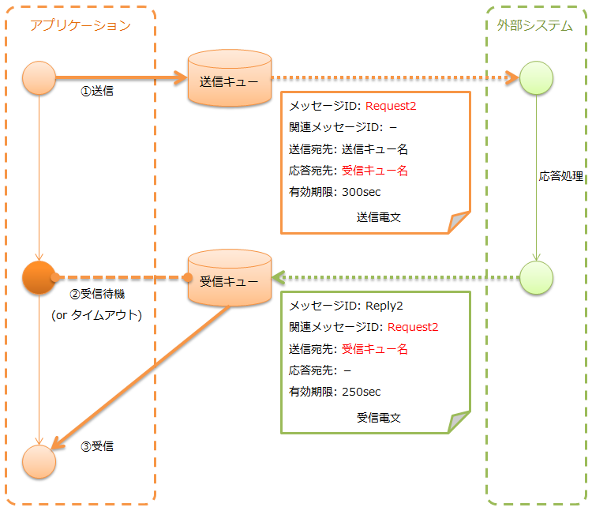
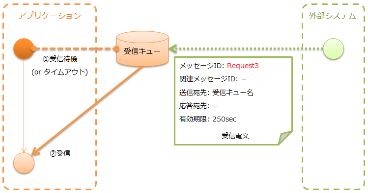
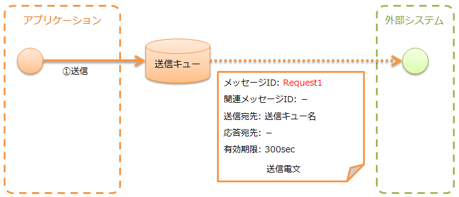

# MOMメッセージング

**公式ドキュメント**: [1](https://nablarch.github.io/docs/LATEST/doc/application_framework/application_framework/libraries/system_messaging/mom_system_messaging.html) [2](https://nablarch.github.io/docs/LATEST/javadoc/nablarch/fw/messaging/MessagingProvider.html) [3](https://nablarch.github.io/docs/LATEST/javadoc/nablarch/fw/messaging/provider/JmsMessagingProvider.html) [4](https://nablarch.github.io/docs/LATEST/javadoc/nablarch/fw/messaging/reader/MessageReader.html) [5](https://nablarch.github.io/docs/LATEST/javadoc/nablarch/fw/messaging/reader/FwHeaderReader.html) [6](https://nablarch.github.io/docs/LATEST/javadoc/nablarch/fw/messaging/action/AsyncMessageSendAction.html) [7](https://nablarch.github.io/docs/LATEST/javadoc/nablarch/fw/messaging/action/AsyncMessageSendActionSettings.html) [8](https://nablarch.github.io/docs/LATEST/javadoc/nablarch/fw/messaging/MessageSender.html) [9](https://nablarch.github.io/docs/LATEST/javadoc/nablarch/fw/messaging/SyncMessage.html) [10](https://nablarch.github.io/docs/LATEST/javadoc/nablarch/fw/messaging/MessageSenderSettings.html) [11](https://nablarch.github.io/docs/LATEST/javadoc/nablarch/fw/messaging/SyncMessageConvertor.html) [12](https://nablarch.github.io/docs/LATEST/javadoc/nablarch/fw/messaging/action/AsyncMessageReceiveAction.html) [13](https://nablarch.github.io/docs/LATEST/javadoc/nablarch/fw/messaging/action/AsyncMessageReceiveActionSettings.html) [14](https://nablarch.github.io/docs/LATEST/javadoc/nablarch/fw/messaging/RequestMessage.html) [15](https://nablarch.github.io/docs/LATEST/javadoc/nablarch/fw/messaging/action/MessagingAction.html) [16](https://nablarch.github.io/docs/LATEST/javadoc/nablarch/fw/messaging/FwHeaderDefinition.html) [17](https://nablarch.github.io/docs/LATEST/javadoc/nablarch/fw/messaging/StandardFwHeaderDefinition.html) [18](https://nablarch.github.io/docs/LATEST/javadoc/nablarch/fw/messaging/handler/MessageReplyHandler.html)

## 機能概要

> **重要**: [フレームワーク制御ヘッダ](#) はNablarch独自仕様で [メッセージボディ](#) に含めることを想定している。外部システムにより電文フォーマットが既に規定されている場合、この想定が適合しないことがある。この場合は [mom_system_messaging-change_fw_header](#) を参照してプロジェクトで実装を追加する。

メッセージのフォーマットには [data_format](libraries-data_format.md) を使用する。

送受信の種類と実行制御基盤:

| 送受信の種類 | 実行制御基盤 |
|---|---|
| [応答不要メッセージ送信](#s3) | [nablarch_batch](../../processing-pattern/nablarch-batch/nablarch-batch-nablarch_batch.md) |
| [同期応答メッセージ送信](#s4) | 実行制御基盤に依存しない |
| [応答不要メッセージ受信](#) | :ref:`mom_messaging` |
| [同期応答メッセージ受信](#) | :ref:`mom_messaging` |

多様なMOMに対応するため `MessagingProvider` インタフェースを設けている。MOMに依存するMQ接続やメッセージ送受信はこのインタフェースの実装クラスが行う。実装クラスを作成することで本機能を様々なMOMで使用できる。

JMS対応: `JmsMessagingProvider` を提供。

IBM MQ対応: [webspheremq_adaptor](../adapters/adapters-webspheremq_adaptor.md) を参照。

外部システムにメッセージを送信し応答を待機する（応答受信またはタイムアウトまでブロック）。[mom_system_messaging-async_message_send](#s3) と異なり応答電文を受信するため通信先での処理完了をある程度保証できる。タイムアウト時はエラー処理（再試行・障害通知など）が必要。



**送信電文の [共通プロトコルヘッダ](#)**: 送信宛先ヘッダに加え、応答宛先ヘッダの設定が必要。

| ヘッダ | 設定内容 |
|---|---|
| メッセージID | 設定不要（送信後採番） |
| 関連メッセージID | 設定不要 |
| 送信宛先 | 送信宛先の論理名 |
| 応答宛先 | 応答宛先の論理名（必須） |
| 有効期間 | 任意 |

**応答電文の [共通プロトコルヘッダ](#)（外部システムが設定）**: 送信後、アプリは送信電文のメッセージIDと同じ関連メッセージIDを持つ電文を応答宛先で待機する。外部システムは応答電文に関連メッセージIDを設定する必要がある。

| ヘッダ | 設定内容 |
|---|---|
| メッセージID | 設定不要（送信後採番） |
| 関連メッセージID | 送信電文のメッセージIDヘッダの値 |
| 送信宛先 | 送信電文の応答宛先ヘッダの値 |
| 応答宛先 | 設定不要 |
| 有効期間 | 任意 |

**クラス**: `MessageSender`

`MessageSender` を使用することで以下の成果物のみ作成すればよい:
- 送受信に使用するフォーマット定義ファイル
- `MessageSender` を使った送受信処理

フォーマット定義ファイル命名規則:
- 送信用: `<電文のリクエストID>_SEND.fmt`
- 受信用: `<電文のリクエストID>_RECEIVE.fmt`
- レコードタイプ名は `data` 固定

送受信処理のポイント:
- 要求電文は `SyncMessage` で作成
- 送信は `MessageSender#sendSync` を使用
- `MessagingException` をキャッチしてエラー処理を行う
- 応答データは `responseMessage.getDataRecord()` で取得する

```java
SyncMessage responseMessage = null;
try {
    responseMessage = MessageSender.sendSync(
        new SyncMessage("ProjectInsertMessage").addDataRecord(inputData));
} catch (MessagingException e) {
    // 送信エラー
    throw new TransactionAbnormalEnd(100, e, "error.sendServer.fail");
}

Map<String, Object> responseDataRecord = responseMessage.getDataRecord();
```

MessageSenderの設定は [repository-environment_configuration](libraries-repository.md) で行う。設定項目は `MessageSenderSettings` を参照。

```properties
messageSender.DEFAULT.messagingProviderName=defaultMessagingProvider
messageSender.DEFAULT.destination=TEST.REQUEST
messageSender.DEFAULT.replyTo=TEST.RESPONSE
messageSender.DEFAULT.retryCount=10
messageSender.DEFAULT.formatDir=format
messageSender.DEFAULT.headerFormatName=HEADER
```

```xml
<config-file file="messaging/messaging.properties"/>
```

電文変換処理を変更する場合は `SyncMessageConvertor` を継承したクラスをコンポーネント定義し、コンポーネント名を `messageSender.DEFAULT.messageConvertorName` に指定する。詳細は [mom_system_messaging-change_fw_header_sync_ex](#) を参照。

通信先から特定の宛先に送信されるメッセージを受信し、受信電文の応答宛先に応答電文を送信する。受信電文のメッセージIDヘッダの値を応答電文の関連メッセージIDヘッダに設定する。

送信電文の [共通プロトコルヘッダ](#) :

| ヘッダ | 設定値 |
|---|---|
| メッセージID | 設定不要（送信後に採番） |
| 関連メッセージID | 受信電文のメッセージIDヘッダの値 |
| 送信宛先 | 受信電文の応答宛先ヘッダの値 |
| 応答宛先 | 設定不要 |
| 有効期間 | 任意 |

テンプレートクラス: `MessagingAction` (:ref:`mom_messaging` で動作するアクションクラス)

`MessagingAction` を使用する場合に作成する成果物:
- 電文のレイアウトを表すフォーマット定義ファイル
- 電文受信時とエラー発生時の処理（アクションクラス）

フォーマット定義ファイルの命名規則:
- 受信用: `<電文のリクエストID>_RECEIVE.fmt`
- 送信用: `<電文のリクエストID>_SEND.fmt`

ProjectInsertMessage_RECEIVE.fmt の例:
```bash
file-type:        "Fixed" # 固定長
text-encoding:    "MS932" # 文字列型フィールドの文字エンコーディング
record-length:    2120    # 各レコードの長さ
record-separator: "\r\n"  # 改行コード
```

ProjectInsertMessage_SEND.fmt の例:
```bash
file-type:        "Fixed" # 固定長
text-encoding:    "MS932" # 文字列型フィールドの文字エンコーディング
record-length:    130     # 各レコードの長さ
record-separator: "\r\n"  # 改行コード
```

アクションクラス実装ポイント:
- `MessagingAction` を継承し、以下をオーバーライドする:
  - `MessagingAction#onReceive`
  - `MessagingAction#onError`
- 応答電文は `RequestMessage#reply` で作成する
- 要求電文・応答電文それぞれに対応したフォームクラスを作成する

```java
public class ProjectInsertMessageAction extends MessagingAction {
    @Override
    protected ResponseMessage onReceive(RequestMessage request, ExecutionContext context) {
        ProjectInsertMessageForm form = BeanUtil.createAndCopy(
            ProjectInsertMessageForm.class, request.getParamMap());
        ValidatorUtil.validate(form);
        ProjectTemp projectTemp = BeanUtil.createAndCopy(ProjectTemp.class, form);
        UniversalDao.insert(projectTemp);
        return request.reply().addRecord(new ProjectInsertMessageResponseForm("success", ""));
    }

    @Override
    protected ResponseMessage onError(Throwable e, RequestMessage request, ExecutionContext context) {
        if (e instanceof InvalidDataFormatException) {
            resForm = new ProjectInsertMessageResponseForm("fatal", "invalid layout.");
        } else if (e instanceof ApplicationException) {
            resForm = new ProjectInsertMessageResponseForm("error.validation", "");
        } else {
            resForm = new ProjectInsertMessageResponseForm("fatal", "unexpected exception.");
        }
        return request.reply().addRecord(resForm);
    }
}
```

<details>
<summary>keywords</summary>

MessagingProvider, JmsMessagingProvider, MOMメッセージング, フレームワーク制御ヘッダ, 応答不要メッセージ送信, 同期応答メッセージ送信, 応答不要メッセージ受信, 同期応答メッセージ受信, IBM MQ, JMS対応, data_format, メッセージフォーマット, MessageSender, SyncMessage, MessagingException, TransactionAbnormalEnd, MessageSenderSettings, SyncMessageConvertor, sendSync, 外部システム連携, フォーマット定義ファイル, 応答宛先, MessagingAction, onReceive, onError, RequestMessage, ResponseMessage, reply, RECEIVE.fmt, SEND.fmt, 応答電文, InvalidDataFormatException, ApplicationException, BeanUtil, ValidatorUtil, UniversalDao

</details>

## モジュール一覧

**モジュール**:
```xml
<dependency>
  <groupId>com.nablarch.framework</groupId>
  <artifactId>nablarch-fw-messaging</artifactId>
</dependency>
<dependency>
  <groupId>com.nablarch.framework</groupId>
  <artifactId>nablarch-fw-messaging-mom</artifactId>
</dependency>
```

特定宛先のメッセージを受信する（受信またはタイムアウトまでブロック）。



**受信電文の [共通プロトコルヘッダ](#)（外部システムが設定）**:

| ヘッダ | 設定内容 |
|---|---|
| メッセージID | 設定不要（送信後採番） |
| 関連メッセージID | 設定不要 |
| 送信宛先 | 宛先の論理名 |
| 応答宛先 | 設定不要 |
| 有効期間 | 任意 |

**クラス**: `AsyncMessageReceiveAction`（:ref:`mom_messaging` で動作する共通アクション。受信電文を電文受信テーブルに保存する）

> **補足**: 一時テーブルに保存したデータは [batch_application](../../processing-pattern/nablarch-batch/nablarch-batch-batch.md) を用いてシステムの本テーブルに取り込むことを想定している。

`AsyncMessageReceiveAction` 使用時の必要成果物:
- 電文を登録するための一時テーブル
- フォーマット定義ファイル
- INSERT文（SQLファイル）
- フォームクラス

**一時テーブル設計ポイント**:
- 電文種類ごとに専用の一時テーブルを作成
- 主キーは電文一意識別IDカラム（[generator](libraries-generator.md) で採番）
- テーブルの属性情報には、受信した電文の各項目に対応するカラムを定義する
- 各プロジェクトの方式に合わせて共通項目（登録ユーザIDや登録日時など）を定義する

**フォーマット定義ファイル**: ファイル名 `<受信電文のリクエストID>_RECEIVE.fmt`、レコードタイプ名は `userData`

**SQLファイル**: ファイル名 `<受信電文のリクエストID>.sql`、SQL_IDは `INSERT_MESSAGE`

**フォームクラス要件**:
- クラス名: `<受信電文のリクエストID>Form`
- コンストラクタ引数: `String`（受信電文連番）と `RequestMessage`（受信電文）の2引数
- `message.getRecordOf("userData")` で `DataRecord` を取得し、`data.getString("projectName")` 等でフィールド値を取得する

```java
public class ProjectInsertMessageForm {

    /** 受信電文連番 */
    private String receivedMessageSequence;

    /** プロジェクト名 */
    private String projectName;

    // 他のフィールドは省略

    public ProjectInsertMessageForm(
            String receivedMessageSequence, RequestMessage message) {
        this.receivedMessageSequence = receivedMessageSequence;

        DataRecord data = message.getRecordOf("userData");

        projectName = data.getString("projectName");

        // 以降の処理は省略
    }

    // アクセッサは省略
}
```

**AsyncMessageReceiveActionSettings設定**（`AsyncMessageReceiveActionSettings` をコンポーネント定義に追加）:

```xml
<component name="asyncMessageReceiveActionSettings"
           class="nablarch.fw.messaging.action.AsyncMessageReceiveActionSettings">
  <property name="formClassPackage" value="com.nablarch.example.form" />
  <property name="receivedSequenceFormatter">
    <component class="nablarch.common.idgenerator.formatter.LpadFormatter">
      <property name="length" value="10" />
      <property name="paddingChar" value="0" />
    </component>
  </property>
  <property name="receivedSequenceGenerator" ref="idGenerator" />
  <property name="targetGenerateId" value="9991" />
  <property name="sqlFilePackage" value="com.nablarch.example.sql" />
</component>
```

:ref:`mom_messaging` で動作させるには [request_path_java_package_mapping](../handlers/handlers-request_path_java_package_mapping.md) のコンポーネント定義で `AsyncMessageReceiveAction` を指定する:

```xml
<component class="nablarch.fw.handler.RequestPathJavaPackageMapping">
  <property name="basePackage"
            value="nablarch.fw.messaging.action.AsyncMessageReceiveAction" />
  <property name="immediate" value="false" />
</component>
```

フレームワーク制御ヘッダの読み書きを変更する方法（送受信の種類別対応）。

**応答不要メッセージ送信の場合**

以下のメソッドをオーバーライドする:
- `AsyncMessageSendAction#createHeaderRecordFormatter`
- `AsyncMessageSendAction#createHeaderRecord`

**同期応答メッセージ送信の場合** ([mom_system_messaging-change_fw_header_sync_ex](#))

`SyncMessageConvertor` を継承したクラスを作成し、`MessageSender` の設定に指定する。設定については `MessageSenderSettings` を参照。

**応答不要メッセージ受信の場合** ([mom_system_messaging-change_fw_header_async_receive](#))

`FwHeaderDefinition` インタフェースを実装したクラスを作成し、コンポーネント定義で `FwHeaderReader#fwHeaderDefinition` プロパティに指定する。デフォルト実装: `StandardFwHeaderDefinition`

**同期応答メッセージ受信の場合**

- 読み込みは [mom_system_messaging-change_fw_header_async_receive](#) と同じ（`FwHeaderDefinition` 実装クラスを `FwHeaderReader#fwHeaderDefinition` プロパティに指定）
- 書き込みも `FwHeaderDefinition` インタフェースを実装したクラスを作成するが、コンポーネント定義で [message_reply_handler](../handlers/handlers-message_reply_handler.md) の `fwHeaderDefinition` プロパティに指定する

<details>
<summary>keywords</summary>

nablarch-fw-messaging, nablarch-fw-messaging-mom, MOMメッセージングモジュール, Maven依存関係, AsyncMessageReceiveAction, AsyncMessageReceiveActionSettings, RequestMessage, DataRecord, RequestPathJavaPackageMapping, LpadFormatter, formClassPackage, receivedSequenceFormatter, receivedSequenceGenerator, targetGenerateId, sqlFilePackage, 応答不要メッセージ受信, 電文受信テーブル, フォームクラス, AsyncMessageSendAction, createHeaderRecordFormatter, createHeaderRecord, SyncMessageConvertor, MessageSender, MessageSenderSettings, FwHeaderDefinition, FwHeaderReader, StandardFwHeaderDefinition, MessageReplyHandler, フレームワーク制御ヘッダ変更, ヘッダ読み書きカスタマイズ

</details>

## MOMメッセージングを使うための設定

コンポーネント定義に追加するクラス:
- `MessagingProvider` 実装クラス（MQ接続、MQに対する送受信）
- [messaging_context_handler](../handlers/handlers-messaging_context_handler.md)（MQ接続の管理）

```xml
<component name="messagingProvider"
           class="nablarch.fw.messaging.provider.JmsMessagingProvider">
  <!-- 設定項目はJavadocを参照 -->
</component>

<component name="messagingContextHandler"
           class="nablarch.fw.messaging.handler.MessagingContextHandler">
  <property name="messagingProvider" ref="messagingProvider" />
</component>
```

メッセージ受信の場合、追加でデータリーダの設定が必要:
- `MessageReader`（MQから電文の読み込み）
- `FwHeaderReader`（電文からフレームワーク制御ヘッダの読み込み）

> **補足**: データリーダのコンポーネント名には `dataReader` を指定する。`MessageReader` は `FwHeaderReader` の `messageReader` プロパティに指定する。

```xml
<component name="dataReader"
           class="nablarch.fw.messaging.reader.FwHeaderReader">
  <property name="messageReader">
    <component class="nablarch.fw.messaging.reader.MessageReader">
      <!-- 設定項目はJavadocを参照 -->
    </component>
  </property>
</component>
```

MOMメッセージングでは、送受信電文の内容を以下のデータモデルで表現する。


**プロトコルヘッダ** ([mom_system_messaging-protocol_header](#))

MOMによるメッセージ送受信処理で使用される情報を格納したヘッダ領域。Mapインターフェースでアクセス可能。

**共通プロトコルヘッダ** ([mom_system_messaging-common_protocol_header](#))

フレームワークが使用するヘッダ。特定のキー名でアクセス可能。

| ヘッダ（キー名） | 説明 | 送信時 | 受信時 |
|---|---|---|---|
| メッセージID (MessageId) | MOMが採番する文字列 | MOMが採番した値 | 送信側MOMが発番した値 |
| 関連メッセージID (CorrelationId) | 関連する電文のメッセージID (応答電文: 要求電文のメッセージID / 再送要求: 応答再送を要求する要求電文のメッセージID) | — | — |
| 送信宛先 (Destination) | 送信宛先の論理名 | 送信キューの論理名 | 受信キューの論理名 |
| 応答宛先 (ReplyTo) | 応答送信先の論理名 | 同期応答: 応答受信キューの論理名 / 応答不要: 設定不要 | 同期応答: 応答宛先キューの論理名 / 応答不要: 通常設定なし |
| 有効期間 (TimeToLive) | 電文有効期間(msec) | 送信電文の有効期間 | 設定なし |

> **補足**: 共通プロトコルヘッダ以外のヘッダは各メッセージングプロバイダ側で任意に定義可能（個別プロトコルヘッダ）。JMSプロバイダの場合、全JMSヘッダ・JMS拡張ヘッダ・任意属性が個別プロトコルヘッダとして扱われる。

**メッセージボディ** ([mom_system_messaging-message_body](#))

プロトコルヘッダを除いたデータ領域。`MessagingProvider` はプロトコルヘッダ領域のみを使用し、それ以外は未解析バイナリとして扱う。解析は [data_format](libraries-data_format.md) により行い、フィールド名をキーとするMap形式で読み書き可能。

**フレームワーク制御ヘッダ** ([mom_system_messaging-fw_header](#))

電文中に特定の制御項目（フレームワーク制御ヘッダ）の定義が前提となっている機能が多数ある。デフォルトではメッセージボディの最初のデータレコード中に以下のフィールド名で定義する。

| 制御項目 | フィールド名 | 使用する主要なハンドラ |
|---|---|---|
| リクエストID | requestId | [request_path_java_package_mapping](../handlers/handlers-request_path_java_package_mapping.md), [message_resend_handler](../handlers/handlers-message_resend_handler.md), :ref:`permission_check_handler`, :ref:`ServiceAvailabilityCheckHandler` |
| ユーザID | userId | :ref:`permission_check_handler` |
| 再送要求フラグ | resendFlag | [message_resend_handler](../handlers/handlers-message_resend_handler.md) |
| ステータスコード | statusCode | [message_reply_handler](../handlers/handlers-message_reply_handler.md) |

標準的なフレームワーク制御ヘッダ定義例:

```
[NablarchHeader]
1   requestId   X(10)       # リクエストID
11  userId      X(10)       # ユーザID
21  resendFlag  X(1)  "0"   # 再送要求フラグ (0: 初回送信 1: 再送要求)
22  statusCode  X(4)  "200" # ステータスコード
26 ?filler      X(25)       # 予備領域
```

フォーマット定義にフレームワーク制御ヘッダ以外の項目を含めると、フレームワーク制御ヘッダの任意ヘッダ項目としてアクセスでき、プロジェクト毎の簡易拡張に使用できる。将来の任意項目追加に備えて予備領域を設けることを強く推奨する。

<details>
<summary>keywords</summary>

MessagingProvider, MessagingContextHandler, MessageReader, FwHeaderReader, MOMメッセージング設定, データリーダ設定, コンポーネント定義, messagingProvider, messagingContextHandler, dataReader, プロトコルヘッダ, 共通プロトコルヘッダ, MessageId, CorrelationId, Destination, ReplyTo, TimeToLive, メッセージボディ, フレームワーク制御ヘッダ, requestId, userId, resendFlag, statusCode, データモデル

</details>

## 応答不要でメッセージを送信する(応答不要メッセージ送信)



送信電文の [共通プロトコルヘッダ](#) 設定:

| ヘッダ項目 | 設定内容 |
|---|---|
| メッセージID | 設定不要（送信後に採番） |
| 関連メッセージID | 設定不要 |
| 送信宛先 | 送信宛先の論理名 |
| 応答宛先 | 設定不要 |
| 有効期間 | 任意 |

`AsyncMessageSendAction` は [nablarch_batch](../../processing-pattern/nablarch-batch/nablarch-batch-nablarch_batch.md) で動作し、一時テーブルからデータ取得→電文作成→送信を行う共通アクションクラス。

> **補足**: 一時テーブルへの送信電文の登録は、[web_application](../../processing-pattern/web-application/web-application-web.md) や [batch_application](../../processing-pattern/nablarch-batch/nablarch-batch-batch.md) で [database_management](libraries-database_management.md) を使用して行うことを想定。

必要な成果物:
1. 送信電文データを保持する一時テーブル（主キー: 電文を一意に識別するID、送信電文の各項目に対応するカラム、ステータスカラムを含む）
2. フォーマット定義ファイル（ファイル名: `<送信電文のリクエストID>_SEND.fmt`）
3. SQLファイル（ファイル名: `<送信電文のリクエストID>.sql`）、SQL_IDは次の通り:
   - `SELECT_SEND_DATA`: ステータスが未送信のデータを取得するSELECT文
   - `UPDATE_NORMAL_END`: 電文送信成功時にステータスを処理済みに更新するUPDATE文
   - `UPDATE_ABNORMAL_END`: 電文送信失敗時にステータスを送信失敗に更新するUPDATE文
4. ステータス更新用フォームクラス（ステータス更新に必要なテーブル項目のみプロパティとして保持すればよい）

> **補足**: 一時テーブルのテーブルレイアウトをプロジェクト共通で定義することにより、単一のフォームクラスを全ての応答不要メッセージ送信処理で使用可能。

フォームクラス例:
```java
public class SendMessagingForm {
    /** 送信電文連番 */
    private String sendMessageSequence;
    /** 更新ユーザID */
    @UserId
    private String updatedUserId;
    /** 更新日時 */
    @CurrentDateTime
    private java.sql.Timestamp updatedDate;
    // コンストラクタとアクセッサは省略
}
```

`AsyncMessageSendActionSettings` をコンポーネント定義に追加して設定する:

```xml
<component name="asyncMessageSendActionSettings"
           class="nablarch.fw.messaging.action.AsyncMessageSendActionSettings">
  <property name="formatDir" value="format" />
  <property name="headerFormatName" value="header" />
  <property name="queueName" value="TEST.REQUEST" />
  <property name="sqlFilePackage" value="com.nablarch.example.sql" />
  <property name="formClassName"
            value="com.nablarch.example.form.SendMessagingForm" />
  <property name="headerItemList">
    <list>
      <value>sendMessageSequence</value>
    </list>
  </property>
</component>
```

[nablarch_batch](../../processing-pattern/nablarch-batch/nablarch-batch-nablarch_batch.md) で動作させるには [request_path_java_package_mapping](../handlers/handlers-request_path_java_package_mapping.md) のコンポーネント定義で `AsyncMessageSendAction` を指定する:

```xml
<component class="nablarch.fw.handler.RequestPathJavaPackageMapping">
  <property name="basePackage"
            value="com.nablarch.example.action.ExampleAsyncMessageSendAction" />
  <property name="immediate" value="false" />
</component>
```

<details>
<summary>keywords</summary>

AsyncMessageSendAction, AsyncMessageSendActionSettings, SendMessagingForm, 応答不要メッセージ送信, 一時テーブル, フォーマット定義ファイル, SELECT_SEND_DATA, UPDATE_NORMAL_END, UPDATE_ABNORMAL_END, @UserId, @CurrentDateTime, RequestPathJavaPackageMapping

</details>
