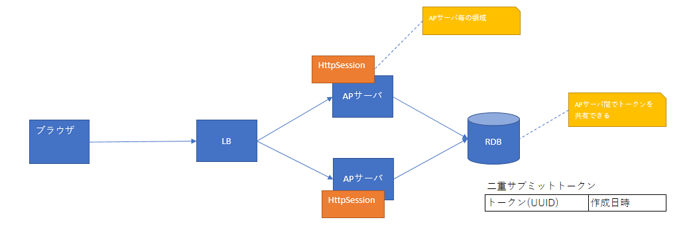
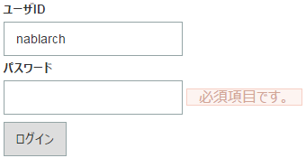

# JSPカスタムタグ

**公式ドキュメント**: [1](https://nablarch.github.io/docs/LATEST/doc/application_framework/application_framework/libraries/tag.html) [2](https://nablarch.github.io/docs/LATEST/javadoc/nablarch/common/web/tag/CustomTagConfig.html) [3](https://nablarch.github.io/docs/LATEST/javadoc/java/lang/Object.html) [4](https://nablarch.github.io/docs/LATEST/javadoc/nablarch/common/encryption/Encryptor.html) [5](https://nablarch.github.io/docs/LATEST/javadoc/nablarch/common/web/compositekey/CompositeKeyConvertor.html) [6](https://nablarch.github.io/docs/LATEST/javadoc/nablarch/common/web/compositekey/CompositeKeyArrayConvertor.html) [7](https://nablarch.github.io/docs/LATEST/javadoc/nablarch/common/web/compositekey/CompositeKey.html) [8](https://nablarch.github.io/docs/LATEST/javadoc/nablarch/fw/web/HttpResponse.html) [9](https://nablarch.github.io/docs/LATEST/javadoc/nablarch/common/web/download/StreamResponse.html) [10](https://nablarch.github.io/docs/LATEST/javadoc/nablarch/common/web/download/DataRecordResponse.html) [11](https://nablarch.github.io/docs/LATEST/javadoc/nablarch/core/db/statement/SqlRow.html) [12](https://nablarch.github.io/docs/LATEST/javadoc/nablarch/common/web/token/UUIDV4TokenGenerator.html) [13](https://nablarch.github.io/docs/LATEST/javadoc/java/text/SimpleDateFormat.html) [14](https://nablarch.github.io/docs/LATEST/javadoc/nablarch/core/ThreadContext.html) [15](https://nablarch.github.io/docs/LATEST/javadoc/java/util/Date.html) [16](https://nablarch.github.io/docs/LATEST/javadoc/java/lang/Number.html) [17](https://nablarch.github.io/docs/LATEST/javadoc/java/text/DecimalFormat.html) [18](https://nablarch.github.io/docs/LATEST/javadoc/nablarch/common/date/YYYYMMDDConvertor.html) [19](https://nablarch.github.io/docs/LATEST/javadoc/nablarch/common/date/YYYYMMDD.html) [20](https://nablarch.github.io/docs/LATEST/javadoc/nablarch/core/message/ApplicationException.html) [21](https://nablarch.github.io/docs/LATEST/javadoc/nablarch/core/validation/convertor/BigDecimalConvertor.html) [22](https://nablarch.github.io/docs/LATEST/javadoc/nablarch/core/validation/convertor/IntegerConvertor.html) [23](https://nablarch.github.io/docs/LATEST/javadoc/nablarch/core/validation/convertor/LongConvertor.html) [24](https://nablarch.github.io/docs/LATEST/javadoc/nablarch/common/code/CodeUtil.html) [25](https://nablarch.github.io/docs/LATEST/javadoc/nablarch/fw/web/i18n/ResourcePathRule.html) [26](https://nablarch.github.io/docs/LATEST/javadoc/nablarch/common/web/tag/ValueFormatter.html) [27](https://nablarch.github.io/docs/LATEST/javadoc/nablarch/common/web/tag/DisplayControlChecker.html) [28](https://nablarch.github.io/docs/LATEST/javadoc/nablarch/common/web/token/TokenGenerator.html)

## 機能概要

**制約**:
- JSP 2.1以降をサポートしているWebコンテナで動作する
- 条件分岐やループなどの制御にはJSTLを使用する
- XHTML 1.0 Transitionalに対応した属性をサポートする
- クライアントのJavaScriptが必須（:ref:`tag-onclick_override`）
- GETリクエストで一部のカスタムタグが使用できない（:ref:`tag-using_get`）

> **重要**: カスタムタグは単純な画面遷移（検索→詳細、入力→確認→完了、ポップアップ）のウェブアプリケーションを対象にしている。リッチな画面作成やSPA（シングルページアプリケーション）には対応していない。JavaScriptを多用する場合は、カスタムタグが出力するJavaScript（:ref:`tag-onclick_override`）との副作用が起きないよう注意する。

> **重要**: HTML5で追加された属性は [動的属性](#) を使用して記述できる。頻繁に使用される以下の属性は予めカスタムタグの属性として定義している: autocomplete（input、password、form）、autofocus（input、textarea、select、button）、placeholder（text、password、textarea）、maxlength（textarea）、multiple（input）。HTML5で追加されたinput要素（[tag-search_tag](libraries-tag_reference.md)、[tag-tel_tag](libraries-tag_reference.md)、[tag-url_tag](libraries-tag_reference.md)、[tag-email_tag](libraries-tag_reference.md)、[tag-date_tag](libraries-tag_reference.md)、[tag-month_tag](libraries-tag_reference.md)、[tag-week_tag](libraries-tag_reference.md)、[tag-time_tag](libraries-tag_reference.md)、:ref:`tag-datetimeLocal_tag`、[tag-number_tag](libraries-tag_reference.md)、[tag-range_tag](libraries-tag_reference.md)、[tag-color_tag](libraries-tag_reference.md)）は [tag-text_tag](libraries-tag_reference.md) をベースに追加。各input要素固有の属性はカスタムタグで個別定義していないため、動的属性で指定する必要がある。

### HTMLエスケープ漏れを防げる

JSPでEL式を使って値を出力すると、HTMLエスケープされない。そのため、EL式を使用する場合は値の出力時にHTMLエスケープを考慮した実装が常に必要になり、生産性の低下につながる。

カスタムタグはデフォルトでHTMLエスケープするため、カスタムタグを使用している限りHTMLエスケープ漏れを防げる。

> **重要**: JavaScriptに対するエスケープ処理は提供していない。scriptタグのボディやonclick属性など、JavaScriptを記述する部分には動的な値（入力データなど）を埋め込まないこと。埋め込む場合はプロジェクトの責任でエスケープ処理を実施すること。

### 入力画面と確認画面のJSPを共通化して実装を減らす

入力画面向けに作成したJSPに確認画面との差分（ボタンなど）のみを追加実装するだけで確認画面を作成できる（:ref:`tag-make_common`）。

## 選択項目(プルダウン/ラジオボタン/チェックボックス)を表示する

使用するカスタムタグ:
- [tag-select_tag](libraries-tag_reference.md)（プルダウン）
- [tag-radio_buttons_tag](libraries-tag_reference.md)（ラジオボタン）
- [tag-checkboxes_tag](libraries-tag_reference.md)（チェックボックス）

アクション側で選択肢リストをリクエストスコープに設定し、カスタムタグで表示する。

> **補足**: 選択状態の判定は、選択された値と選択肢の値をともに `Object#toString` してから行う。

選択肢クラス（`planId`: 値、`planName`: ラベル）:

```java
public class Plan {
    private String planId;
    private String planName;
    public String getPlanId() { return planId; }
    public String getPlanName() { return planName; }
}
```

アクションでリクエストスコープに設定:

```java
List<Plan> plans = Arrays.asList(new Plan("A", "フリー"), new Plan("B", "ベーシック"), new Plan("C", "プレミアム"));
context.setRequestScopedVar("plans", plans);
```

カスタムタグの属性:
- `listName`: 選択肢リストの名前
- `elementLabelProperty`: ラベルを表すプロパティ名
- `elementValueProperty`: 値を表すプロパティ名

プルダウン (`n:select`):
```jsp
<n:select name="form.plan1" listName="plans" elementLabelProperty="planName" elementValueProperty="planId" />
```

出力されるHTML（`form.plan1` の値が `"A"` の場合）:
```html
<select name="form.plan1">
  <option value="A" selected="selected">フリー</option>
  <option value="B">ベーシック</option>
  <option value="C">プレミアム</option>
</select>
```

ラジオボタン (`n:radioButtons`):
```jsp
<n:radioButtons name="form.plan2" listName="plans" elementLabelProperty="planName" elementValueProperty="planId" />
```

出力されるHTML（`form.plan2` の値が `"B"` の場合）。IDは `nablarch_radio1`、`nablarch_radio2`、... の連番で生成される:
```html
<input id="nablarch_radio1" type="radio" name="form.plan2" value="A" />
<label for="nablarch_radio1">フリー</label><br />
<input id="nablarch_radio2" type="radio" name="form.plan2" value="B" checked="checked" />
<label for="nablarch_radio2">ベーシック</label><br />
<input id="nablarch_radio3" type="radio" name="form.plan2" value="C" />
<label for="nablarch_radio3">プレミアム</label><br />
```

デフォルトは `<br>` タグで区切り。`listFormat` 属性でdiv/span/ul/ol/スペース区切りに変更可能。

チェックボックス (`n:checkboxes`):
```jsp
<n:checkboxes name="form.plan4" listName="plans" elementLabelProperty="planName" elementValueProperty="planId" />
```

出力されるHTML（`form.plan4` の値が `"C"` の場合）。IDは `nablarch_checkbox1`、`nablarch_checkbox2`、... の連番で生成される:
```html
<input id="nablarch_checkbox1" type="checkbox" name="form.plan4" value="A" checked="checked" />
<label for="nablarch_checkbox1">フリー</label><br />
<input id="nablarch_checkbox2" type="checkbox" name="form.plan4" value="B" />
<label for="nablarch_checkbox2">ベーシック</label><br />
<input id="nablarch_checkbox3" type="checkbox" name="form.plan4" value="C" />
<label for="nablarch_checkbox3">プレミアム</label><br />
```

デフォルトは `<br>` タグで区切り。`listFormat` 属性で変更可能。

> **重要**: [tag-radio_buttons_tag](libraries-tag_reference.md) と [tag-checkboxes_tag](libraries-tag_reference.md) はカスタムタグが選択肢をすべて出力するため出力HTMLに制限がある。デザイン会社が作成したHTMLベースで開発するなどプロジェクトでデザインをコントロールできない場合は、JSTLの `c:forEach` タグと [tag-radio_tag](libraries-tag_reference.md) または [tag-checkbox_tag](libraries-tag_reference.md) を使って自由にHTMLを実装すること。

`c:forEach` + `n:radioButton` の実装例:
```jsp
<c:forEach items="${plans}" var="plan">
  <n:radioButton name="form.plan3" label="${plan.planName}" value="${plan.planId}" />
</c:forEach>
```

複合キーに対応したラジオボタン・チェックボックスを提供する。

- [tag-composite_key_radio_button_tag](libraries-tag_reference.md) （複合キーに対応したラジオボタン）
- [tag-composite_key_checkbox_tag](libraries-tag_reference.md) （複合キーに対応したチェックボックス）

> **重要**: この機能を使用するには、`CompositeKeyConvertor` と `CompositeKeyArrayConvertor` をコンポーネント定義に追加する必要がある。設定方法は [nablarch_validation-definition_validator_convertor](libraries-nablarch_validation.md) を参照。

> **重要**: この機能は [nablarch_validation](libraries-nablarch_validation.md) でのみ使用可能。[bean_validation](libraries-bean_validation.md) は対応していない。

**フォーム**: `CompositeKey` の配列プロパティに `@CompositeKeyType(keySize = N)` アノテーションを指定する。

```java
public class OrderItemsForm {
    public CompositeKey[] orderItems;

    @CompositeKeyType(keySize = 2)
    public void setOrderItems(CompositeKey[] orderItems) {
        this.orderItems = orderItems;
    }
}
```

**JSP**: `<n:compositeKeyCheckbox>` タグの属性：

| 属性 | 説明 |
|---|---|
| name | フォームのプロパティ名 |
| valueObject | 複合キーの値を持つオブジェクト |
| keyNames | valueObjectから複合キー値を取得するプロパティ名（カンマ区切り、この順でCompositeKeyに設定） |
| namePrefix | リクエストパラメータ展開時のプレフィクス（name属性と異なる値を指定） |

```jsp
<n:compositeKeyCheckbox
  name="form.orderItems"
  label=""
  valueObject="${orderItem}"
  keyNames="orderId,productId"
  namePrefix="orderItems" />
```

> **重要**: これらのタグ（popupSubmit/popupButton/popupLink）は非推奨。理由: (1) 外部サイトへのリンク/ボタン作成時、一部ブラウザ（IEの保護モード等）で新しいウィンドウが開けない。回避策: [tag-a_tag](libraries-tag_reference.md) やHTMLタグを使用。(2) サブウィンドウを用いた画面遷移は利便性が低く、ページ内ポップアップが一般的。

提供タグ:
- [tag-popup_submit_tag](libraries-tag_reference.md) (inputタグのボタン)
- [tag-popup_button_tag](libraries-tag_reference.md) (buttonタグのボタン)
- [tag-popup_link_tag](libraries-tag_reference.md) (リンク)

ポップアップは `window.open` 関数で実現。元画面のフォームの全input要素を動的追加してサブミット。

| 属性 | 説明 |
|---|---|
| `popupWindowName` | ポップアップのウィンドウ名（`window.open`の第2引数）。未指定時は `CustomTagConfig` の `popupWindowName` プロパティのデフォルト値、未設定なら現在時刻(ミリ秒)を使用。 |
| `popupOption` | ポップアップのオプション情報（`window.open`の第3引数）。 |

`popupWindowName` デフォルト値の動作:
- デフォルト値あり: 常に同じウィンドウ名 → ウィンドウは1つ
- デフォルト値なし: 常に異なるウィンドウ名 → 毎回新しいウィンドウをオープン

```jsp
<n:popupButton uri="/action/person/list"
               popupWindowName="postalCodeSupport"
               popupOption="width=400, height=300, menubar=no, toolbar=no, scrollbars=yes">
  検索
</n:popupButton>
```

**パラメータ名変更**: 元画面のアクションとポップアップ先のアクションでパラメータ名が一致しない場合、 [tag-change_param_name_tag](libraries-tag_reference.md) でパラメータ名を変更可能。

```jsp
<n:form>
  <n:text name="form.postalCode" />
  <n:popupButton uri="/action/postalCode/show">
    検索
    <n:changeParamName inputName="form.postalCode" paramName="condition.postalCode" />
    <n:param paramName="condition.max" value="10" />
  </n:popupButton>
</n:form>
```

**オープンしたウィンドウへのアクセス**: オープンしたウィンドウの参照はJavaScriptグローバル変数 `nablarch_opened_windows`（keyはウィンドウ名）に保持される。

```javascript
var nablarch_opened_windows = {};

// 元画面遷移時に全ポップアップを閉じる例
onunload = function() {
  for (var key in nablarch_opened_windows) {
    var openedWindow = nablarch_opened_windows[key];
    if (openedWindow && !openedWindow.closed) {
      openedWindow.close();
    }
  }
  return true;
};
```

二重サブミット防止はデータベースコミットを伴う処理でクライアント側とサーバ側の両方を併用する。

> **重要**: どちらか一方のみ使用した場合の懸念:
> - クライアント側のみ: リクエストを重複して処理する恐れがある
> - サーバ側のみ: ダブルクリックで2回リクエスト送信時、サーバ側の処理順によっては二重サブミットエラーが返されユーザに処理結果が返されない恐れがある

## クライアント側の二重サブミット防止

JavaScriptで実現。1回目のサブミット時に対象要素のonclick属性を書き換え、2回目以降のサブミットをサーバに送信しない。ボタンの場合はdisabled属性も設定。

対応するカスタムタグ:
- フォームのサブミット: [tag-submit_tag](libraries-tag_reference.md) (inputタグのボタン)、[tag-button_tag](libraries-tag_reference.md) (buttonタグのボタン)、[tag-submit_link_tag](libraries-tag_reference.md) (リンク)
- ダウンロード用のサブミット: [tag-download_submit_tag](libraries-tag_reference.md) (inputタグのボタン)、[tag-download_button_tag](libraries-tag_reference.md) (buttonタグのボタン)、[tag-download_link_tag](libraries-tag_reference.md) (リンク)

`allowDoubleSubmission="false"` を指定することで特定のボタン/リンクのみを対象に二重サブミットを防止できる（デフォルト: `true`）。

```jsp
<n:submit type="button" name="back" value="戻る" uri="./back" />
<n:submit type="button" name="register" value="登録" uri="./register"
          allowDoubleSubmission="false" />
```

> **補足**: サーバ処理が返ってこない間にユーザがブラウザの中止ボタンを押した場合、ボタンがdisabled状態のままになり再サブミットできなくなる。この場合、サブミットに使用したボタン以外のボタンまたはリンクで処理を継続できる。

> **補足**: 二重サブミット発生時の振る舞いを追加したい場合は :ref:`tag-double_submission_client_side_change` を参照。

## サーバ側の二重サブミット防止

サーバ側で発行した一意なトークンをセッション（サーバ側）とhiddenタグ（クライアント側）に保持し、サーバ側で突合して実現。トークンは1回のチェックに限り有効。

**JSPでのトークン設定**: [tag-form_tag](libraries-tag_reference.md) の `useToken` 属性を指定（デフォルト: `false`）。入力画面と確認画面を共通化した場合、確認画面ではデフォルトが `true` となるため指定不要。

```jsp
<n:form useToken="true">
```

**JSP以外のテンプレートエンジンの場合**: [use_token_interceptor](../handlers/handlers-use_token.md) を使用。

**トークンチェック**: [on_double_submission_interceptor](../handlers/handlers-on_double_submission.md) を使用。

**キー/名前の変更（コンポーネント設定ファイル）**:

| 変更対象 | プロパティ名 | デフォルト値 |
|---|---|---|
| セッションスコープのキー | `doubleSubmissionTokenSessionAttributeName` | `/nablarch_session_token` |
| リクエストスコープのキー | `doubleSubmissionTokenRequestAttributeName` | `nablarch_request_token` |
| hiddenのname属性値 | `doubleSubmissionTokenParameterName` | `nablarch_token` |

```xml
<component name="webConfig" class="nablarch.common.web.WebConfig">
  <property name="doubleSubmissionTokenSessionAttributeName" value="sessionToken" />
</component>
```

> **重要**: トークンはセッションに格納されるため、同一ユーザの複数リクエストを別々にチェックできない。同一ユーザが登録確認→登録完了などの画面遷移を複数ウィンドウ/タブで並行して行った場合、後に確認画面に遷移した画面のみ処理継続でき、先に確認画面に遷移した画面はトークンが古いため二重サブミットエラーとなる。

> **補足**: トークン発行は `UUIDV4TokenGenerator` が行い、36文字のランダムな文字列を生成。変更したい場合は :ref:`tag-double_submission_server_side_change` を参照。

URLの長さ制限や不要なパラメータ付与の問題を避けるため、[tag-form_tag](libraries-tag_reference.md) でGETが指定された場合、hiddenパラメータを出力しない。その結果、:ref:`hidden暗号化<tag-hidden_encryption>` や :ref:`パラメータ追加<tag-submit_change_parameter>` 機能が使用できなくなり、以下のカスタムタグに制限が生じる。

## 使用制限のあるカスタムタグ

- [tag-checkbox_tag](libraries-tag_reference.md)
- [tag-code_checkbox_tag](libraries-tag_reference.md)

:ref:`チェックなしの場合にリクエストパラメータを設定する機能 <tag-checkbox_off_value>` は :ref:`hidden暗号化<tag-hidden_encryption>` を使用しているため、GETリクエストでは使用できない。**対応方法**: [バリデーション](libraries-validation.md) 後に該当項目の値をnull判定し、アクション側でチェックなしに対する値を設定する。

## 使用不可となるカスタムタグと対応方法

**hiddenタグ**: [tag-plain_hidden_tag](libraries-tag_reference.md) を使用する。

```jsp
<%-- GETの場合 --%>
<n:plainHidden name="test" />
```

**submitタグ**: HTMLのinput(type="submit")を使用。サブミット先のURIは [tag-form_tag](libraries-tag_reference.md) のaction属性に指定する。

```jsp
<%-- GETの場合 --%>
<n:form method="GET" action="search">
  <input type="submit" value="検索" />
</n:form>
```

**buttonタグ**: HTMLのbuttonタグ(type="submit")を使用。サブミット先のURIは [tag-form_tag](libraries-tag_reference.md) のaction属性に指定する。

```jsp
<%-- GETの場合 --%>
<n:form method="GET" action="search">
  <button type="submit" value="検索" />
</n:form>
```

**submitLinkタグ**: [tag-a_tag](libraries-tag_reference.md) を使用し、onclick属性に画面遷移するJavaScript関数を指定する。関数は [tag-script_tag](libraries-tag_reference.md) 内に記述する。

```jsp
<%-- GETの場合 --%>
<input type="text" name="test" id="test" />
<n:a href="javascript:void(0);" onclick="searchTest();">検索</n:a>
<n:script type="text/javascript">
  var searchTest = function() {
    var test = document.getElementById('test').value;
    location.href = 'search?test=' + test;
  }
</n:script>
```

**popupSubmitタグ**: HTMLのinput(type="button")を使用し、onclick属性にJavaScriptのwindow.open()を指定する。

```jsp
<%-- GETの場合 --%>
<n:form method="GET">
  <input type="button" value="検索"
    onclick="window.open('search', 'popupWindow', 'width=700,height=500')" />
</n:form>
```

**popupButtonタグ**: HTMLのbuttonタグ(type="button")を使用し、onclick属性にJavaScriptのwindow.open()を指定する。

```jsp
<%-- GETの場合 --%>
<n:form method="GET">
  <button type="button" value="検索"
    onclick="window.open('search', 'popupWindow', 'width=700,height=500')" />
</n:form>
```

**popupLinkタグ**: [tag-a_tag](libraries-tag_reference.md) を使用し、onclick属性にポップアップウィンドウを表示するJavaScript関数を指定する。関数は [tag-script_tag](libraries-tag_reference.md) 内に記述する。

```jsp
<%-- GETの場合 --%>
<input type="text" name="test" id="test" />
<n:a href="javascript:void(0);" onclick="openTest();" >検索</n:a>
<n:script type="text/javascript">
  var openTest = function() {
    var test = document.getElementById('test').value;
    window.open('search?test=' + test, 'popupWindow', 'width=700,height=500')
  }
</n:script>
```

**paramタグ**: パラメータを追加したいボタンやリンクごとに [tag-form_tag](libraries-tag_reference.md) を記述し、form内にパラメータを設定する。

```jsp
<%-- GETの場合（複数ボタン例） --%>
<n:form method="GET" action="search">
  <n:set var="test" value="テスト１" />
  <input type="hidden" name="changeParam" value="<n:write name='test' />" />
  <input type="submit" value="検索" />
</n:form>

<n:form method="GET" action="search">
  <n:set var="test" value="テスト２" />
  <input type="hidden" name="changeParam" value="<n:write name='test' />" />
  <input type="submit" value="検索" />
</n:form>
```

**changeParamNameタグ**: :ref:`popupLinkタグ <tag-using_get_popup_link_tag>` と同様。window.open()の第一引数に、クエリストリングのキーを変更したいパラメータ名で指定する。

```jsp
<%-- GETの場合 --%>
<input type="text" name="test" id="test" />
<input type="button" value="検索" onclick="openTest();" />
<n:script type="text/javascript">
  var openTest = function() {
    var test = document.getElementById('test').value;
    window.open('search?changeParam=' + test, 'popupWindow', 'width=700,height=500');
  }
</n:script>
```

フォーマット出力には :ref:`format`（推奨）と valueFormat属性の2種類の方法がある。

> **重要**: :ref:`format` を推奨する理由: (1) ファイル出力やメッセージングなど他の出力機能と共通部品を使用するため、フォーマット設定を1箇所に集約でき、使用できるタグに制限がない。(2) valueFormat属性はカスタムタグ独自の実装で [tag-write_tag](libraries-tag_reference.md) と [tag-text_tag](libraries-tag_reference.md) にのみ使用でき、他の出力機能では別途設定が必要となりフォーマット設定が複数箇所に存在することになる。

## :ref:`format` を使用する方法

EL式内で `n:formatByDefault`（デフォルトパターン）または `n:format`（パターン指定）を使用して :ref:`format` の `FormatterUtil` を呼び出し、フォーマットした文字列を value 属性に設定する。

```html
<!-- デフォルトパターンでフォーマット: 第一引数=フォーマッタ名, 第二引数=対象値 -->
<n:write value="${n:formatByDefault('dateTime', project.StartDate)}" />

<!-- 指定パターンでフォーマット: 第一引数=フォーマッタ名, 第二引数=対象値, 第三引数=パターン -->
<n:text name="project.StartDate" value="${n:format('dateTime', project.StartDate, 'yyyy年MM月dd日')}" />
```

> **重要**: EL式ではリクエストパラメータを参照できない。[bean_validation](libraries-bean_validation.md) でユーザ入力値チェックを行う場合は [bean_validation_onerror](libraries-bean_validation.md) の設定をすること。設定が使用できない場合は、`n:set` で値をリクエストパラメータからページスコープにセットしてから出力すること。

```jsp
<n:set var="projectEndDate" name="form.projectEndDate" scope="page" />
<n:text name="form.projectEndDate" nameAlias="form.date"
  value="${n:formatByDefault('dateTime', projectEndDate)}"
  cssClass="form-control datepicker" errorCss="input-error" />
```

## valueFormat属性を使用する方法

`データタイプ{パターン}` 形式で指定。使用できるタグは [tag-write_tag](libraries-tag_reference.md) と [tag-text_tag](libraries-tag_reference.md) のみ。valueFormat属性の指定がない場合はフォーマットせずに値を出力する。

**yyyymmdd（年月日）**

値はyyyyMMdd形式またはパターン形式。`SimpleDateFormat` のy/M/dのみ使用可。パターン文字列を省略した場合は、:ref:`tag-setting` のyyyymmddPatternプロパティに設定されたデフォルトのパターンを使用する。ロケール未指定時は `ThreadContext` の言語、未設定時はシステムデフォルトロケール。

```
valueFormat="yyyymmdd"                          # デフォルトパターン＋ThreadContextロケール
valueFormat="yyyymmdd{yyyy/MM/dd}"              # 明示的パターン＋ThreadContextロケール
valueFormat="yyyymmdd{|ja}"                     # デフォルトパターン＋ロケール明示
valueFormat="yyyymmdd{yyyy年MM月dd日|ja}"        # パターン＋ロケール両方指定
```

> **重要**: [tag-text_tag](libraries-tag_reference.md) のvalueFormat属性指定時、入力画面にもフォーマット値が出力される。アクションで年月日を取得する場合は :ref:`ウィンドウスコープ <tag-window_scope>` と `YYYYMMDDConvertor` を使用すること。[bean_validation](libraries-bean_validation.md) は [tag-text_tag](libraries-tag_reference.md) のvalueFormat属性に対応していない。

> **重要**: :ref:`ウィンドウスコープ <tag-window_scope>` を使用しない場合、valueFormat属性の値がサーバサイドに送信されずバリデーションエラーが発生する。その場合は `YYYYMMDD` アノテーションのallowFormat属性で入力値チェックを行うこと。

**yyyymm（年月）**

値はyyyyMM形式またはパターン形式。使用方法は :ref:`yyyymmdd (年月日)<tag-format_yyyymmdd>` と同じ（パターン省略時は :ref:`tag-setting` のyyyymmddPatternプロパティのデフォルトパターンを使用）。

**dateTime（日時）**

値は `Date` 型。`SimpleDateFormat` のパターン構文を使用。デフォルトは `ThreadContext` の言語・タイムゾーンに応じた日時。`|` 区切りでロケールおよびタイムゾーンを明示指定可能。:ref:`tag-setting` のdateTimePatternプロパティ・patternSeparatorプロパティでデフォルト値と区切り文字を変更可能。

```
valueFormat="dateTime"                                                  # デフォルト
valueFormat="dateTime{|ja|Asia/Tokyo}"                                  # ロケール＋タイムゾーン指定
valueFormat="dateTime{||Asia/Tokyo}"                                    # タイムゾーンのみ指定
valueFormat="dateTime{yyyy年MMM月d日(E) a hh:mm|ja|America/New_York}"   # 全指定
valueFormat="dateTime{yy/MM/dd HH:mm:ss||Asia/Tokyo}"                  # パターン＋タイムゾーン
```

**decimal（10進数）**

値は `Number` 型または数字文字列（3桁区切りカンマは除去後フォーマット）。`DecimalFormat` のパターン構文を使用。デフォルトは `ThreadContext` の言語に応じた形式。`|` 区切りで言語を指定可能。:ref:`tag-setting` のpatternSeparatorプロパティで区切り文字変更可能。

```
valueFormat="decimal{###,###,###.000}"        # ThreadContextの言語でフォーマット
valueFormat="decimal{###,###,###.000|ja}"     # 言語を明示指定
```

> **重要**: 値のフォーマットのみ行い、丸め動作の設定は行わない（`DecimalFormat` のデフォルトが使用される）。丸め処理はアプリケーション側で行うこと。

> **重要**: [tag-text_tag](libraries-tag_reference.md) のvalueFormat属性指定時、入力画面にもフォーマット値が出力される。数値をアクションで取得する場合は `BigDecimalConvertor`、`IntegerConvertor`、`LongConvertor` を使用すること。[bean_validation](libraries-bean_validation.md) は対応していない。

> **補足**: パターンに桁区切りと小数点を指定する場合は、言語に関係なく常に桁区切りにカンマ、小数点にドットを使用すること。`valueFormat="decimal{###.###.###,000|es}"` のような指定は不正なパターンのため実行時例外がスローされる。

[code](libraries-code.md) から取得したコード値を表示するカスタムタグ。

利用可能なタグ:
- [tag-code_tag](libraries-tag_reference.md) (コード値)
- [tag-code_select_tag](libraries-tag_reference.md) (コード値のプルダウン)
- [tag-code_checkbox_tag](libraries-tag_reference.md) (コード値のチェックボックス)
- [tag-code_radio_buttons_tag](libraries-tag_reference.md) (コード値の複数のラジオボタン)
- [tag-code_checkboxes_tag](libraries-tag_reference.md) (コード値の複数のチェックボックス)

`n:code` / `n:codeSelect` の主要属性:
- `codeId`: コードID
- `pattern`: 使用するパターンのカラム名（デフォルト: 指定なし）
- `optionColumnName`: オプション名称のカラム名
- `labelPattern`: ラベル整形パターン。プレースホルダ: `$NAME$`（コード名称）、`$SHORTNAME$`（略称）、`$OPTIONALNAME$`（オプション名称、`optionColumnName` 指定必須）、`$VALUE$`（コード値）。デフォルト: `$NAME$`
- `listFormat`: 出力フォーマット（例: `div`）

実装例:
```jsp
<n:code name="user.gender" codeId="GENDER" pattern="PATTERN1"
        labelPattern="$VALUE$:$NAME$($SHORTNAME$)" listFormat="div" />
<!-- user.gender="FEMALE"の場合 → <div>FEMALE:女性(女)</div> -->

<n:codeSelect name="form.gender" codeId="GENDER" pattern="PATTERN2"
              labelPattern="$VALUE$-$SHORTNAME$" listFormat="div" />
<!-- 入力画面: <select name="form.gender"><option value="MALE">MALE-男</option><option value="FEMALE" selected="selected">FEMALE-女</option></select> -->
<!-- 確認画面: <div>FEMALE-女</div> -->
```

> **重要**: カスタムタグでは言語指定によるコード値取得は不可。`CodeUtil` のロケール未指定APIを使用しているため。言語指定が必要な場合は、アクションで `CodeUtil` を使用すること。

Content-Security-Policyをセキュアに保ちながら、カスタムタグが生成する要素へのJavaScript処理を追加する手順:

1. `id`属性や`name`属性などを使用し、カスタムタグが生成する要素を特定できるように設定する
2. 生成された要素をセレクタで特定し、追加の処理を実装するスクリプトを外部ファイルまたはnonce付きのscript要素として作成する
3. カスタムタグが :ref:`JavaScriptを生成する<tag-onclick_override>` ものの場合は、`suppressDefaultSubmit`属性を`true`に設定してカスタムタグによるJavaScriptの生成を抑制する

> **重要**: onclick属性などでインラインスクリプトを要素に直接指定すると、Content-Security-Policyのポリシーを緩めセキュリティレベルが低下する。

JSP例:
```jsp
<n:form>
  <%-- suppressDefaultSubmitをtrueに設定してカスタムタグによるデフォルトのJavaScriptの生成を抑制する --%>
  <n:submit id="register_button" type="submit" uri="register" suppressDefaultSubmit="true" value="登録" />
</n:form>
```

JavaScript例:
```javascript
function popUpConfirmation(event) {
  // フォーム本来のサブミット処理をキャンセルする
  event.preventDefault();

  if (window.confirm('登録します。よろしいですか？')) {
    // カスタムタグが出力するJavaScript関数を明示的に呼び出す。第2引数のelementはnablarch_submit関数内でeventから導出する
    nablarch_submit(event);
  }
}

// idを指定して処理を登録する
document.querySelector('#register_button').addEventListener('click', popUpConfirmation);
```

<details>
<summary>keywords</summary>

HTMLエスケープ, XSS防止, JSPカスタムタグ制約, HTML5属性, 動的属性, 入力画面と確認画面共通化, SPA非対応, JavaScript副作用, EL式HTMLエスケープなし, n:select, n:radioButtons, n:checkboxes, n:radioButton, n:checkbox, Plan, listName, elementLabelProperty, elementValueProperty, listFormat, 選択項目表示, プルダウン, ラジオボタン, チェックボックス, カスタムタグ, nablarch_radio1, nablarch_checkbox1, 生成HTML, CompositeKeyConvertor, CompositeKeyArrayConvertor, CompositeKey, @CompositeKeyType, compositeKeyCheckbox, compositeKeyRadio, 複合キー, nablarch_validation専用, bean_validation非対応, ポップアップ, 別ウィンドウ, popupButton, popupSubmit, popupLink, changeParamName, パラメータ名変更, nablarch_opened_windows, CustomTagConfig, window.open, 非推奨, 二重サブミット防止, クライアント側二重サブミット防止, サーバ側二重サブミット防止, allowDoubleSubmission, useToken, UUIDV4TokenGenerator, doubleSubmissionTokenSessionAttributeName, doubleSubmissionTokenRequestAttributeName, doubleSubmissionTokenParameterName, トークン, disabled, WebConfig, GETリクエスト, hiddenパラメータ, checkboxタグ, code_checkboxタグ, submitタグ, plainHiddenタグ, popupSubmitタグ, popupLinkタグ, paramタグ, changeParamNameタグ, フォームGET送信, 使用不可カスタムタグ, hiddenタグ, buttonタグ, submitLinkタグ, popupButtonタグ, フォーマット出力, valueFormat属性, n:formatByDefault, n:format, EL式, yyyymmdd, yyyymm, dateTime, decimal, 日付フォーマット, 数値フォーマット, SimpleDateFormat, ThreadContext, FormatterUtil, YYYYMMDDConvertor, YYYYMMDD, BigDecimalConvertor, IntegerConvertor, LongConvertor, DecimalFormat, yyyymmddPatternプロパティ, dateTimePatternプロパティ, patternSeparatorプロパティ, Date, Number, code_tag, code_select_tag, code_checkbox_tag, code_radio_buttons_tag, code_checkboxes_tag, CodeUtil, コード値表示, コードプルダウン, labelPattern, codeId, pattern, Content-Security-Policy, CSP, suppressDefaultSubmit, JavaScript処理追加, インラインスクリプト抑制, nablarch_submit, onclick属性

</details>

## モジュール一覧

**モジュール**:
```xml
<dependency>
  <groupId>com.nablarch.framework</groupId>
  <artifactId>nablarch-fw-web-tag</artifactId>
</dependency>
```

hidden暗号化を使う場合のみ:
```xml
<dependency>
  <groupId>com.nablarch.framework</groupId>
  <artifactId>nablarch-common-encryption</artifactId>
</dependency>
```

ファイルダウンロードを使う場合のみ:
```xml
<dependency>
  <groupId>com.nablarch.framework</groupId>
  <artifactId>nablarch-fw-web-extension</artifactId>
</dependency>
```

## チェックボックスでチェックなしに対する値を指定する

HTMLの `checkbox` タグはチェックなしの場合にリクエストパラメータが送信されない。[tag-checkbox_tag](libraries-tag_reference.md) ではチェックなしに対応する値を指定できる機能を提供する。

実装例:
```jsp
<n:checkbox name="form.useMail" value="true" label="使用する"
            offLabel="使用しない" offValue="false" />
```

| 属性名 | デフォルト値 | 説明 |
|---|---|---|
| useOffValue | true | チェックなしの値設定を使用するか否か。一括削除など複数選択の場合は `false` を指定 |
| offLabel | | チェックなしの場合のラベル（入力画面と確認画面を共通化した場合に確認画面で表示） |
| offValue | 0 | チェックなしの場合の値 |

> **補足**: この機能は [nablarch_tag_handler](../handlers/handlers-nablarch_tag_handler.md) と :ref:`hidden暗号化 <tag-hidden_encryption>` で実現。checkboxタグ出力時にオフ値をhiddenタグに出力し、[nablarch_tag_handler](../handlers/handlers-nablarch_tag_handler.md) がリクエスト受付時にチェックなしの場合のみリクエストパラメータにオフ値を設定する。

フォームのサブミットに使用するカスタムタグ。name属性（フォーム内で一意）とuri属性を指定する。name属性未指定時はカスタムタグが自動生成する。URIの指定方法は :ref:`tag-specify_uri` を参照。

**通常サブミット**:
- [tag-submit_tag](libraries-tag_reference.md) （inputタグのボタン）
- [tag-button_tag](libraries-tag_reference.md) （buttonタグのボタン）
- [tag-submit_link_tag](libraries-tag_reference.md) （リンク）

**別ウィンドウへのサブミット（ポップアップ）**:
- [tag-popup_submit_tag](libraries-tag_reference.md) （inputタグのボタン）
- [tag-popup_button_tag](libraries-tag_reference.md) （buttonタグのボタン）
- [tag-popup_link_tag](libraries-tag_reference.md) （リンク）

**ダウンロード用サブミット**:
- [tag-download_submit_tag](libraries-tag_reference.md) （inputタグのボタン）
- [tag-download_button_tag](libraries-tag_reference.md) （buttonタグのボタン）
- [tag-download_link_tag](libraries-tag_reference.md) （リンク）

詳細: :ref:`tag-submit_popup`、:ref:`tag-submit_download`

```jsp
<!-- name属性は自動で出力されるので指定しなくてよい。 -->
<n:submit type="submit" uri="login" value="ログイン" />
```

> **重要**: カスタムタグのサブミット制御はJavaScriptを使用しているため、通常のサブミットタグ（[tag-submit_tag](libraries-tag_reference.md) 等）でダウンロードすると同じフォーム内の他のサブミットが機能しなくなる。ダウンロードするボタン/リンクには必ずダウンロードタグを使用すること。

ダウンロードタグ（新しいフォームを作成してサブミット、パラメータ名変更可能）:
- [tag-download_submit_tag](libraries-tag_reference.md) (inputタグのボタン)
- [tag-download_button_tag](libraries-tag_reference.md) (buttonタグのボタン)
- [tag-download_link_tag](libraries-tag_reference.md) (リンク)

パラメータ名変更は [tag-change_param_name_tag](libraries-tag_reference.md) を使用（使い方は :ref:`tag-submit_change_param_name` 参照）。

ダウンロードユーティリティ:

**クラス**: `nablarch.common.web.download.StreamResponse`  
ストリームからHTTPレスポンス生成。ファイルシステムのファイルやDBのBLOBデータのダウンロードに使用。`java.io.File` または `java.sql.Blob` をサポート。

**クラス**: `nablarch.common.web.download.DataRecordResponse`  
データレコードからHTTPレスポンス生成。 [data_format](libraries-data_format.md) を使用してフォーマット。`Map<String, ?>` 型データ（`SqlRow` 等）をサポート。

Fileのダウンロード実装例:
```java
// コンストラクタ第2引数: true=ダウンロード後にフレームワークがファイルを削除
StreamResponse response = new StreamResponse(file, true);
response.setContentType("application/pdf");
response.setContentDisposition(file.getName());
return response;
```

BLOB型カラムのダウンロード実装例（テーブル行ごとにリンクを表示し、選択されたリンクに対応するデータをダウンロード）:

JSP（`c:forEach` でリスト行ごとに `n:downloadLink` を生成し、`n:param` で `fileId` を渡す）:
```jsp
<!-- recordsという名前で行データのリストがリクエストスコープに設定されているものとする。 -->
<c:forEach var="record" items="${records}" varStatus="status">
  <n:set var="fileId" name="record.fileId" />
  <div>
    <!-- downloadLinkタグを使用してリンクを作成する。 -->
    <n:downloadLink uri="/action/download/tempFile">
      <n:write name="record.fileName" />(<n:write name="fileId" />)
      <!-- 選択されたリンクを判別するためにfileIdパラメータをparamタグで設定する。 -->
      <n:param paramName="fileId" name="fileId" />
    </n:downloadLink>
  </div>
</c:forEach>
```

アクション:
```java
SqlRow record = getRecord(request); // fileIdパラメータで対象行を取得
StreamResponse response = new StreamResponse((Blob) record.get("FILE_DATA"));
response.setContentType("image/jpeg");
response.setContentDisposition(record.getString("FILE_NAME"));
return response;
```

データレコード(CSV)のダウンロード実装例（コンストラクタ引数: フォーマット定義のベースパス論理名とファイル名）:
```java
DataRecordResponse response = new DataRecordResponse("format", "N11AA001");
response.write("header", Collections.<String, Object>emptyMap()); // デフォルトヘッダ使用時は空マップ
for (SqlRow record : records) {
    response.write("data", record);
}
response.setContentType("text/csv; charset=Shift_JIS");
response.setContentDisposition("メッセージ一覧.csv");
return response;
```

デフォルトではサーバ側トークンはHTTPセッションに保存される。アプリケーションサーバのスケールアウト時にはスティッキーセッションやセッションレプリケーションが必要となる。

データベースへのトークン保存実装を使用することで、アプリケーションサーバの特別な設定なしに複数サーバ間でトークンを共有できる。

詳細は :ref:`db_double_submit` を参照。



値の出力には [tag-write_tag](libraries-tag_reference.md) を使用する。name属性でリクエストスコープに設定したオブジェクトにアクセスする。name属性の指定方法は :ref:`tag-access_rule` を参照。

**アクション**:
```java
Person person = new Person();
person.setPersonName("名前");
context.setRequestScopedVar("person", person);
```

**JSP**:
```jsp
<n:write name="person.personName" />
```

カスタムタグのエラー表示では以下3機能を提供する。リクエストスコープから `ApplicationException` を取得してエラーメッセージを出力する（[on_error_interceptor](../handlers/handlers-on_error.md) でリクエストスコープに設定）。

**エラーメッセージの一覧表示**

画面上部にエラーメッセージを一覧表示する場合は [tag-errors_tag](libraries-tag_reference.md) を使用。

- `filter="all"`: すべてのエラーメッセージを表示
- `filter="global"`: 入力項目に対応しないエラーメッセージのみ表示（データベースとの相関バリデーション等で `ApplicationException` を送出した場合など）

```jsp
<n:errors filter="all" errorCss="alert alert-danger" />
<n:errors filter="global" errorCss="alert alert-danger" />
```

**エラーメッセージの個別表示**

入力項目ごとにエラーメッセージを表示する場合は [tag-error_tag](libraries-tag_reference.md) を使用。name属性に入力項目と同じ名前を指定する。[bean_validation-correlation_validation](libraries-bean_validation.md) のエラーメッセージを特定の項目近くに表示する場合も [tag-error_tag](libraries-tag_reference.md) を使用し、相関バリデーションで指定されるプロパティ名をname属性に指定する。

```jsp
<n:error name="form.userName" messageFormat="span" errorCss="alert alert-danger" />

<!-- 相関バリデーション（@AssertTrue等）の場合: バリデーションで指定されるプロパティ名をname属性に指定 -->
<n:error name="form.comparePassword" messageFormat="span" errorCss="alert alert-danger" />
```

**入力項目のハイライト表示**

エラー原因の入力項目のclass属性に "nablarch_error"（デフォルト）のCSSクラス名が追記される。CSSでスタイルを指定することでエラーがあった入力項目をハイライト表示できる。

```css
input.nablarch_error, select.nablarch_error { background-color: #FFFFB3; }
```

nameAlias属性を指定することで複数の入力項目を紐付け、[bean_validation-correlation_validation](libraries-bean_validation.md) でエラーとなった場合に複数の入力項目をハイライト表示できる。

```jsp
<!-- nameAlias属性に相関バリデーションのプロパティ名を指定 -->
<n:password name="form.password" nameAlias="form.comparePassword" />
<n:password name="form.confirmPassword" nameAlias="form.comparePassword" />
```

[tag-message_tag](libraries-tag_reference.md) で [message](libraries-message.md) から取得したメッセージを出力する。国際化対応アプリケーションで1つのJSPから多言語表示が可能。

主要属性:
- `messageId`: メッセージID
- `var`: 埋め込み用文言取得時の変数名（スコープに設定）
- `option0`〜: 埋め込み用文言（`var` で取得した値を指定）
- `language`: 画面内で一部のメッセージのみ言語を切り替えたい場合に指定
- `htmlEscape`: HTMLエスケープ制御。`false` を指定するとエスケープしない

実装例:
```jsp
<!-- 基本 -->
<n:message messageId="page.not.found" />

<!-- オプション埋め込み -->
<n:message var="title" messageId="title.user.register" />
<n:message var="appName" messageId="title.app" />
<n:message messageId="title.template" option0="${title}" option1="${appName}" />

<!-- 言語指定 -->
<n:message messageId="page.not.found" language="ja" />

<!-- HTMLエスケープ無効 -->
<n:message messageId="page.not.found" htmlEscape="false" />
```

### フォーマッタを追加する

:ref:`format` を使用する場合は :ref:`format` の「フォーマッタを追加する」項を参照。

`valueFormat`属性を使用する場合、`ValueFormatter` インタフェースを実装したクラスを作成し、`valueFormatters`という名前のMapコンポーネントとしてコンポーネント定義に追加する。

```xml
<map name="valueFormatters">
  <entry key="yyyymmdd">
    <value-component class="nablarch.common.web.tag.YYYYMMDDFormatter" />
  </entry>
  <entry key="yyyymm">
    <value-component class="nablarch.common.web.tag.YYYYMMFormatter" />
  </entry>
  <entry key="dateTime">
    <value-component class="nablarch.common.web.tag.DateTimeFormatter" />
  </entry>
  <entry key="decimal">
    <value-component class="nablarch.common.web.tag.DecimalFormatter" />
  </entry>
</map>
```

### ボタン/リンクの表示制御に使う判定処理を変更する

:ref:`tag-submit_display_control` に使用する判定処理を変更するには、`DisplayControlChecker` インタフェースを実装し、:ref:`tag-setting` の `displayControlCheckersプロパティ` に指定する。

```xml
<list name="displayControlCheckers">
  <!-- サービス提供可否についてはデフォルトのDisplayControlCheckerを指定する -->
  <component class="nablarch.common.web.tag.ServiceAvailabilityDisplayControlChecker" />
  <!-- 認可チェックについてはプロジェクトでカスタマイズしたDisplayControlCheckerを指定する -->
  <component class="com.sample.app.CustomPermissionDisplayControlChecker" />
</list>

<component name="customTagConfig" class="nablarch.common.web.tag.CustomTagConfig">
  <property name="displayControlCheckers" ref="displayControlCheckers" />
</component>
```

### クライアント側の二重サブミット防止で振る舞いを追加する

:ref:`クライアント側の二重サブミット防止 <tag-double_submission_client_side>` 使用時に二重サブミット発生時の振る舞いを追加する場合は、以下のシグネチャのコールバック関数をJavaScriptで実装する。2回目以降のサブミット要求時にコールバック関数が存在すれば呼び出される。

```js
/**
 * @param element 二重サブミットが行われた対象要素(ボタン又はリンク)
 */
function nablarch_handleDoubleSubmission(element) {
  // ここに処理を記述する。
}
```

### サーバ側の二重サブミット防止でトークン発行処理を変更する

:ref:`サーバ側の二重サブミット防止 <tag-double_submission_server_side>` 使用時にトークン発行処理を変更するには、`TokenGenerator` インタフェースを実装し、コンポーネント定義に`tokenGenerator`という名前で追加する。

<details>
<summary>keywords</summary>

nablarch-fw-web-tag, nablarch-common-encryption, nablarch-fw-web-extension, hidden暗号化, ファイルダウンロード, n:checkbox, useOffValue, offLabel, offValue, チェックボックスオフ値, チェックなし値, nablarch_tag_handler, フォームサブミット, ポップアップサブミット, ダウンロードサブミット, name属性, uri属性, submitタグ, buttonタグ, submitLinkタグ, StreamResponse, DataRecordResponse, SqlRow, downloadButton, downloadSubmit, downloadLink, BLOBダウンロード, データレコードダウンロード, nablarch.common.web.download.StreamResponse, nablarch.common.web.download.DataRecordResponse, データベーストークン保存, スケールアウト, スティッキーセッション, セッションレプリケーション, db_double_submit, トークン共有, writeタグ, リクエストスコープ, 値の出力, tag-write_tag, tag-access_rule, エラー表示, エラーメッセージ一覧表示, エラーメッセージ個別表示, ハイライト表示, nablarch_error, errors_tag, error_tag, ApplicationException, nameAlias, 相関バリデーション, filter属性, message_tag, メッセージ出力, 国際化, 多言語, messageId, htmlEscape, language, option0, ValueFormatter, DisplayControlChecker, CustomTagConfig, TokenGenerator, ServiceAvailabilityDisplayControlChecker, valueFormatters, displayControlCheckers, tokenGenerator, フォーマッタ追加, 表示制御, 二重サブミット防止, nablarch_handleDoubleSubmission, YYYYMMDDFormatter, YYYYMMFormatter, DateTimeFormatter, DecimalFormatter

</details>

## カスタムタグの設定

カスタムタグの設定は [nablarch_tag_handler](../handlers/handlers-nablarch_tag_handler.md) と `CustomTagConfig` により行う。

**[nablarch_tag_handler](../handlers/handlers-nablarch_tag_handler.md)**: カスタムタグを使用する場合に必須のハンドラ。以下の機能に必要な前処理を行う:
- :ref:`tag-checkbox_off_value`
- :ref:`tag-hidden_encryption`
- :ref:`tag-submit_change_parameter`
- :ref:`tag-composite_key`

**クラス**: `CustomTagConfig` - カスタムタグのデフォルト値（選択項目のラベルパターンなど）を設定するクラス。`customTagConfig` という名前でコンポーネント定義に追加する。

## 入力データを画面間で持ち回る(ウィンドウスコープ)

> **重要**: 画面間での入力データ保持には、ウィンドウスコープではなく :ref:`session_store` を使用すること。理由: (1) ウィンドウスコープはキー/値ペアのみ保持のためBeanをそのまま格納できず実装が煩雑になる (2) カスタムタグの属性指定で動きが把握しにくく実装難易度が高い。

ウィンドウスコープは入力データをクライアント側のhiddenタグとして保持する。データは :ref:`hidden暗号化<tag-hidden_encryption>` により暗号化される。

> **重要**: ウィンドウスコープの内容はhidden暗号化により暗号化されているため、Ajaxで取得したデータによる書き換えなど、クライアント側での書き換えはできない。

ウィンドウスコープへの設定は [tag-form_tag](libraries-tag_reference.md) の `windowScopePrefixes` 属性で行う。

> **重要**: `windowScopePrefixes` 属性はパラメータ名の**前方一致**で一致したパラメータをウィンドウスコープに設定する。例えば `windowScopePrefixes="user"` と指定すると `users` で始まるパラメータもウィンドウスコープに設定される。

実装例（検索条件パラメータ: `searchCondition.*`、入力データパラメータ: `user.*`）:

```jsp
<!-- 検索画面: ウィンドウスコープのデータを送信しない -->
<n:form>

<!-- 更新画面: 検索条件だけ送信 -->
<n:form windowScopePrefixes="searchCondition">

<!-- 更新確認画面: 検索条件と入力データを送信。複数はカンマ区切り -->
<n:form windowScopePrefixes="searchCondition,user">

<!-- 更新完了画面: 検索条件だけ送信 -->
<n:form windowScopePrefixes="searchCondition">
```

> **重要**: データベースのデータは主キーや楽観ロック用データなど必要最低限に留めること。表示のみのデータはhiddenで引き回さず必要な都度データベースから取得すること。hiddenデータ量の増加は通信速度低下・メモリ圧迫につながる。

> **重要**: ウィンドウスコープに格納したデータをアクション側で使用する場合は、[バリデーション](libraries-validation.md) を行うこと。

> **補足**: [tag-form_tag](libraries-tag_reference.md) は既に入力項目として出力したリクエストパラメータはhiddenタグの出力から除外する。ログイン情報など全業務で必要な情報はサーバ側（セッション）に保持すること。

カスタムタグは `nablarch_submit(event, element)` JavaScript関数をグローバル領域に出力し、ボタン/リンクのonclick属性に設定する。

onclick属性にカスタムJavaScript関数を指定した場合、カスタムタグはサブミット用JavaScript関数を呼び出さない。この場合、アプリケーション側で :ref:`tag-submit_function` を明示的に呼び出す必要がある。

> **重要**: CSP（Content Security Policy）対応時は、onclick属性へのインラインJavaScript記述は `unsafe-inline` または `unsafe-hashes` が必要になりセキュリティレベルが低下する。[tag-content_security_policy](#s8) の手順に従い外部スクリプトまたはnonce属性を指定したscript要素に実装することを推奨する。

**JavaScript関数シグネチャ**:

```javascript
/**
 * @param event イベントオブジェクト
 * @param element イベント元の要素。未指定時はeventのcurrentTarget/targetプロパティから取得
 * @return 常にfalse（イベント伝搬させない）
 */
function nablarch_submit(event, element)
```

**カスタムタグが生成するHTMLの出力例**:

JSP:
```jsp
<n:form>
  <!-- 省略 -->
  <n:submit type="submit" uri="login" value="ログイン" />
</n:form>
```

生成されるHTML:
```html
<script type="text/javascript">
<!--
function nablarch_submit(event, element) {
  // 省略
}
-->
</script>
<form name="nablarch_form1" method="post">
  <!-- onclick属性にサブミット制御を行うJavaScript関数が設定される。 -->
  <input type="submit" name="nablarch_form1_1" value="ログイン"
         onclick="return window.nablarch_submit(event, this);" />
</form>
```

フォーム名は `nablarch_form1` のように自動採番され、ボタン名は `nablarch_form1_1` のようにフォーム名＋連番で生成される。onclick属性には `return window.nablarch_submit(event, this);` が設定される。

**確認ダイアログ付きサブミットの実装例**:

```javascript
function popUpConfirmation(event, element) {
  if (window.confirm("登録します。よろしいですか？")) {
    // カスタムタグが出力するJavaScript関数を明示的に呼び出す
    return nablarch_submit(event, element);
  } else {
    return false;
  }
}
```

```jsp
<n:submit type="submit" uri="register" value="登録"
          onclick="return popUpConfirmation(event, this);" />
```

入力項目のカスタムタグは、入力画面と全く同じJSP記述のまま確認画面用を出力できる。

使用するカスタムタグ:
- [tag-confirmation_page_tag](libraries-tag_reference.md): 確認画面のJSPで入力画面JSPへのパスを指定して共通化を行う
- [tag-for_input_page_tag](libraries-tag_reference.md): 入力画面でのみ表示したい部分を指定
- [tag-for_confirmation_page_tag](libraries-tag_reference.md): 確認画面でのみ表示したい部分を指定
- [tag-ignore_confirmation_tag](libraries-tag_reference.md): 確認画面で確認画面向けの表示を無効化したい部分に指定（例: チェックボックスを確認画面でもチェック欄表示したい場合）

> **補足**: 入力・確認画面の表示制御は入力系タグが対象。ただし以下は異なる動作:
> - [tag-plain_hidden_tag](libraries-tag_reference.md): 画面間の状態受け渡し目的のため、入力・確認画面ともに出力する
> - [tag-hidden_store_tag](libraries-tag_reference.md): :ref:`session_store` のデータ受け渡し目的のため、入力・確認画面ともに出力する

```jsp
<!-- 入力画面JSP -->
<n:form>
  <n:text name="form.name" />
  <n:checkbox name="form.useMail" label="使用する" offLabel="使用しない" />
  <n:select name="form.plan" listName="plans"
            elementLabelProperty="planName" elementValueProperty="planId" />
  <n:forInputPage>
    <n:submit type="submit" uri="/action/sample/confirm" value="確認" />
  </n:forInputPage>
  <n:forConfirmationPage>
    <n:submit type="submit" uri="/action/sample/showNew" value="戻る" />
    <n:submit type="submit" uri="/action/sample/register" value="登録" />
  </n:forConfirmationPage>
</n:form>

<!-- 確認画面JSP -->
<n:confirmationPage path="./input.jsp" />
```


HTMLエスケープせずに出力したい場合は以下のカスタムタグを使用する（システム管理者がメンテナンス情報を設定するような特定画面・表示領域のみで使用を想定）。

- [tag-pretty_print_tag](libraries-tag_reference.md): `<b>` や `<del>` のような装飾系HTMLタグをエスケープせずに出力。使用可能なタグ・属性は :ref:`tag-setting` で `safeTagsプロパティ` / `safeAttributesプロパティ` で設定可能。
- [tag-raw_write_tag](libraries-tag_reference.md): 変数中の文字列をエスケープせずそのまま出力。

> **重要**: [tag-pretty_print_tag](libraries-tag_reference.md) は非推奨。理由: (1) 使用可能なタグだけでなく属性も含めて全て `CustomTagConfig` に設定しなければならない（例: `a` タグを使用可能にするには `CustomTagConfig#safeTags` に `a` タグ追加だけでなく、`CustomTagConfig#safeAttributes` にも `href` 等の属性を全て定義が必要）。(2) 入力文字列がHTMLとして正しいかのチェックを行っていない。代替方法: OSSのHTMLパーサで入力値をバリデーションし [tag-raw_write_tag](libraries-tag_reference.md) で出力する。または、Markdownで入力しOSSのJavaScriptライブラリでクライアントサイド変換する方法もある。

> **重要**: [tag-pretty_print_tag](libraries-tag_reference.md) で不特定ユーザが任意に設定できる値を出力する場合、使用可能なHTMLタグ・属性の選択に十分注意すること。`<script>` タグやonclick属性を使用可能とした場合、XSS脆弱性の直接要因となるためこれらは使用不可とすること。

> **重要**: [tag-raw_write_tag](libraries-tag_reference.md) で不特定ユーザが任意に設定できる値を出力する場合、XSS脆弱性の直接の要因となる。使用には十分な考慮が必要。

以下のカスタムタグは、`ResourcePathRule` のサブクラスを使用して言語設定に基づきリソースパスを動的に切り替える機能を持つ。

対応タグ:
- [tag-a_tag](libraries-tag_reference.md)
- [tag-img_tag](libraries-tag_reference.md)
- [tag-link_tag](libraries-tag_reference.md)
- [tag-script_tag](libraries-tag_reference.md)
- [tag-confirmation_page_tag](libraries-tag_reference.md) (入力画面と確認画面を共通化)
- [tag-include_tag](libraries-tag_reference.md) (インクルード)

デフォルト提供のサブクラスについては [http_response_handler-change_content_path](../handlers/handlers-http_response_handler.md) を参照。

> **補足**: [tag-include_tag](libraries-tag_reference.md) は動的なJSPインクルードを言語毎のリソースパス切り替えに対応させるために提供している。インクルード時の追加パラメータは [tag-include_param_tag](libraries-tag_reference.md) で指定する。

```jsp
<!-- path属性にインクルードするリソースのパスを指定 -->
<n:include path="/app_header.jsp">
    <!-- paramName属性にパラメータ名、value属性に値を指定。スコープ上の値を使う場合はname属性を指定 -->
    <n:includeParam paramName="title" value="ユーザ情報詳細" />
</n:include>
```

### 命名ルール

カスタムタグが規定する名前にはプレフィックス`nablarch_`を使用する。個別アプリケーションでは`nablarch_`から始まる名前を使用しないこと。

対象:
- HTMLの属性値
- CSSのクラス名
- JavaScriptの関数名とグローバル変数名
- ページスコープ、リクエストスコープ、セッションスコープの変数名

### 入力/出力データへのアクセスルール

`name`属性の値に基づきデータにアクセスする。

- オブジェクト/Mapのプロパティ: ドット区切り（例: `form.personName`）
- List/配列の要素: 角括弧でインデックス指定（例: `form.persons[${status.index}].personName`）

検索順序（最初に見つかった値を使用。値が取得できない場合は空文字列を出力）:
1. Pageスコープ
2. リクエストスコープ
3. リクエストパラメータ
4. セッションスコープ

> **補足**: 検索対象にリクエストパラメータが含まれているのは、入力フォームを再表示した場合に入力値を復元するためである。JSTLタグはリクエストパラメータにアクセスできないため、JSTLタグ使用時はアクション側で明示的にリクエストスコープに値を設定する必要がある。

> **補足**: リクエストパラメータより先にリクエストスコープを検索するのは、入力フォームを再表示した場合に入力値を変更できるようにするためである。例: ラジオボタンを未選択状態に戻したい場合は、アクション側でリクエストスコープに空文字を設定する。

### URIの指定方法

| 種別 | パターン | 動作 |
|---|---|---|
| 絶対URL | `http`/`https`から始まるパス | 指定されたパスをそのまま使用 |
| コンテキストからの相対パス | `/`（スラッシュ）から始まるパス | 先頭にコンテキストパスを付加 |
| 現在のパスからの相対パス | `/`から始まらないパス（絶対URL除く） | 指定されたパスをそのまま使用 |

コンテキストからの相対パスを指定している場合、`secure`属性でhttps/httpを切り替え可能。`secure`属性を使用する場合は :ref:`tag-setting` で `portプロパティ` / `securePortプロパティ` / `hostプロパティ` を指定する。

> **補足**: `secure`属性は、遷移先のプロトコルを切り替えるボタンやリンクのみで使用する。遷移先のプロトコルが同じ場合（http→http、https→https）は`secure`属性を指定しない。

**secure属性の実装例**（カスタムタグの設定値: http用ポート=8080、https用ポート=443、ホスト=sample.co.jp）:

http→httpsに切り替える場合（`secure="true"`）:
```jsp
<!-- secure属性にtrueを指定する。 -->
<n:submit type="button" name="login" value="ログイン" uri="/action/login" secure="true" />
```
組み立てられるURI: `https://sample.co.jp:443/<コンテキストパス>/action/login`

https→httpに切り替える場合（`secure="false"`）:
```jsp
<!-- secure属性にfalseを指定する。 -->
<n:submitLink name="logout" uri="/action/logout" secure="false">ログアウト</n:submitLink>
```
組み立てられるURI: `https://sample.co.jp:8080/<コンテキストパス>/action/logout`

> **注意**: カスタムタグの設定（CustomTagConfig）でhttp用のポート番号（`portプロパティ`）を指定しなかった場合、組み立てられるURIにポート番号が出力されない。
> 例: `https://sample.co.jp/<コンテキストパス>/action/logout`

### HTMLエスケープと改行、半角スペース変換

カスタムタグは出力時に全HTML属性をHTMLエスケープする。

変換内容:
- `&` → `&amp;`
- `<` → `&lt;`
- `>` → `&gt;`
- `"` → `&#034;`
- `'` → `&#039;`

> **重要**: EL式はHTMLエスケープを実施しないため、値を出力する場合はEL式を使用せず [tag-write_tag](libraries-tag_reference.md) などのカスタムタグを使用すること。JSTLのforEachタグやカスタムタグの属性へのオブジェクト設定など直接出力しない箇所ではEL式を使用可能。

確認画面などの入力データ出力時は、HTMLエスケープに加えて改行と半角スペースも変換する:
- `改行コード(\n、\r、\r\n)` → `<br />`
- `半角スペース` → `&nbsp;`

<details>
<summary>keywords</summary>

NablarchTagHandler, CustomTagConfig, customTagConfig, カスタムタグ設定, チェックボックスOFF値, hidden暗号化, サブミット時パラメータ変更, 複合キー, n:form, windowScopePrefixes, ウィンドウスコープ, 入力データ引き回し, hiddenタグ, 画面間データ保持, session_store, 前方一致, nablarch_submit, onclick属性, サブミット前処理, Content Security Policy, CSP, 確認ダイアログ, nablarch_form1, 生成HTML, 入力確認画面共通化, confirmationPage, forInputPage, forConfirmationPage, ignoreConfirmation, plain_hidden_tag, hidden_store_tag, confirmation_page_tag, prettyPrintタグ, rawWriteタグ, HTMLエスケープ, XSS, safeTagsプロパティ, safeAttributesプロパティ, tag-pretty_print_tag, tag-raw_write_tag, ResourcePathRule, a_tag, img_tag, link_tag, script_tag, include_tag, include_param_tag, 言語切り替え, リソースパス, 国際化, 命名ルール, nablarch_プレフィックス, アクセスルール, URI指定方法, secure属性, 改行変換, 半角スペース変換, portプロパティ, securePortプロパティ, hostプロパティ, ポート番号省略

</details>

## カスタムタグを使用する(taglibディレクティブの指定方法)

カスタムタグとJSTLを使用する場合、以下のtaglibディレクティブを指定する:

```jsp
<%@ taglib prefix="c" uri="http://java.sun.com/jsp/jstl/core" %>
<%@ taglib prefix="n" uri="http://tis.co.jp/nablarch" %>
```

## クライアントに保持するデータを暗号化する(hidden暗号化)

> **重要**: 仕様が複雑で容易に使用できず、:ref:`ウィンドウスコープ <tag-window_scope>` の使用も非推奨のため本機能も非推奨。特に理由がない限り :ref:`useHiddenEncryption <tag-use_hidden_encryption>` には `false` を設定すること。

hidden暗号化は [tag-form_tag](libraries-tag_reference.md)（暗号化）と [nablarch_tag_handler](../handlers/handlers-nablarch_tag_handler.md)（復号・改竄チェック）により実現する。

**暗号化処理**:
- 暗号化クラス: `Encryptor` インタフェースを実装
- デフォルトアルゴリズム: AES(128bit)
- アルゴリズム変更: `Encryptor` 実装クラスをコンポーネント定義に `hiddenEncryptor` という名前で追加
- [tag-form_tag](libraries-tag_reference.md) ごとに以下をまとめて暗号化し1つのhiddenタグで出力:
  1. [tag-hidden_tag](libraries-tag_reference.md) で明示的に指定したhiddenパラメータ
  2. :ref:`ウィンドウスコープ<tag-window_scope>` の値
  3. [サブミットを行うカスタムタグ](libraries-tag_reference.md) で指定したリクエストID
  4. [サブミットを行うカスタムタグ](libraries-tag_reference.md) で追加したパラメータ
- 改竄検知のため、リクエストIDとハッシュ値を含める（それぞれ異なる改竄を検知）:
  - **リクエストID**: 異なる入力フォーム間で暗号化した値を入れ替えた場合の改竄を検知
  - **ハッシュ値**: 値の書き換えによる改竄を検知
- 暗号化した結果はBASE64エンコードしてhiddenタグに出力

> **補足**: [tag-hidden_tag](libraries-tag_reference.md) で明示的に指定したhiddenパラメータは暗号化対象のためクライアント側JavaScriptで値を操作できない。クライアント側でJavaScriptによる操作が必要な場合は [tag-plain_hidden_tag](libraries-tag_reference.md) を使用すること。

**復号処理**: [nablarch_tag_handler](../handlers/handlers-nablarch_tag_handler.md) が行う。以下の場合に改竄と判定し設定された画面に遷移:
- 暗号化したhiddenパラメータ（nablarch_hidden）が存在しない
- BASE64のデコードに失敗
- 復号に失敗
- 暗号化時のハッシュ値と復号後のハッシュ値が一致しない
- 暗号化時のリクエストIDと受け付けたリクエストIDが一致しない

**暗号化キー**: セッションごとに生成。同じユーザでもログインし直すとログイン前の画面から処理を継続できない。

**設定プロパティ** (:ref:`tag-setting` で設定):

| プロパティ名 | デフォルト値 | 説明 |
|---|---|---|
| useHiddenEncryption | true | hidden暗号化を使用するか否か |
| noHiddenEncryptionRequestIds | | hidden暗号化を行わないリクエストID |

`noHiddenEncryptionRequestIds` に指定すべきリクエスト（暗号化したhiddenパラメータが存在しないかセッションキーが存在しないため、未設定だと改竄エラーとなる）:
- ログイン画面などアプリケーションの入口
- ブックマークから遷移してくるリクエスト
- 外部サイトから遷移してくるリクエスト

[tag-form_tag](libraries-tag_reference.md): 暗号化対象のリクエストIDが1つでも含まれていれば暗号化する。1つも含まれていない場合は暗号化しない。

[nablarch_tag_handler](../handlers/handlers-nablarch_tag_handler.md): リクエストされたリクエストIDが暗号化対象の場合のみ復号する。

カスタムタグのサブミット制御はボタン/リンクのonclick属性を前提に動作するため、プルダウン変更などでサブミットする場合はサブミットボタンのクリックイベントを発生させる。JavaScriptの詳細は :ref:`tag-onclick_override` を参照。

> **重要**: CSP対応時は、onchangeイベントハンドラへのインラインJavaScript記述は `unsafe-inline` または `unsafe-hashes` が必要になりセキュリティレベルが低下する。[tag-content_security_policy](#s8) の手順に従い外部スクリプトまたはnonce属性を指定したscript要素に実装することを推奨する。

```jsp
<!-- onchange属性にて、サブミットしたいボタン要素のclick関数を呼ぶ。 -->
<n:select name="form.plan"
          listName="plans"
          elementLabelProperty="planName"
          elementValueProperty="planId"
          onchange="window.document.getElementById('register').click(); return false;" />

<n:submit id="register" type="submit" uri="register" value="登録" />
```

> **重要**: 上記の実装例ではonchangeイベントハンドラに直接JavaScriptを記載しているが、実際のプロジェクトではオープンソースのJavaScriptライブラリを使うなどして、処理を動的にバインドすることを推奨する。

[tag-set_tag](libraries-tag_reference.md) を使用してJSP上の変数に値を設定し、ページ内の複数箇所で同じ内容を参照できる。

> **重要**: [tag-set_tag](libraries-tag_reference.md) はHTMLエスケープ処理を行わないため、変数を出力する際は必ず [tag-write_tag](libraries-tag_reference.md) を使用すること。

```jsp
<n:set var="title" value="ユーザ情報登録" />
<title><n:write name="title" /></title>
<h1><n:write name="title" /></h1>
```

**scope属性**: `request`（リクエストスコープ）または `page`（ページスコープ）を指定。デフォルトはリクエストスコープ。ページスコープはアプリケーション全体で使用されるUI部品作成時に他JSPの変数とのバッティングを防ぐ目的で使用。

**bySingleValue属性**: `name`属性指定時、デフォルトは単一値として取得（配列・コレクションの場合は先頭要素を返す）。`bySingleValue="false"` を指定することで配列やコレクションをそのまま取得できる。

ブラウザの戻るボタンによる個人情報・機密情報の漏洩を防ぐため、キャッシュを防止したい画面のJSPの `<head>` 内に [tag-no_cache_tag](libraries-tag_reference.md) を使用する。

```jsp
<head>
  <n:noCache/>
</head>
```

出力されるレスポンスヘッダ:
```
Expires: Thu, 01 Jan 1970 00:00:00 GMT
Cache-Control: no-store, no-cache, must-revalidate, post-check=0, pre-check=0
Pragma: no-cache
```

出力されるHTML（古いブラウザ対応のため）:
```html
<meta http-equiv="pragma" content="no-cache">
<meta http-equiv="cache-control" content="no-cache">
<meta http-equiv="expires" content="0">
```

> **重要**: [tag-no_cache_tag](libraries-tag_reference.md) は [tag-include_tag](libraries-tag_reference.md)（`<jsp:include>`）でincludeされるJSPでは指定不可。必ずforwardされるJSPで指定すること。システム全体で使用する場合は、各JSPでの実装漏れを防ぐため、プロジェクトで [ハンドラ](../../about/about-nablarch/about-nablarch-architecture.md) を作成し一律設定すること。ハンドラでは上記のレスポンスヘッダをレスポンスに設定する。

> **補足**: IE6/IE7/IE8ではHTTP/1.0かつSSL未適用の通信でキャッシュ防止が有効にならない。キャッシュ防止を使用する画面には必ずSSL通信を適用すること。

カスタムタグの各タグのリファレンスは [tag_reference](libraries-tag_reference.md) を参照。

<details>
<summary>keywords</summary>

taglibディレクティブ, JSTL, JSPカスタムタグ使用方法, prefix n, nablarch taglib uri, Encryptor, nablarch.common.encryption.Encryptor, hiddenEncryptor, nablarch_tag_handler, useHiddenEncryption, noHiddenEncryptionRequestIds, hidden暗号化, 改竄チェック, AES暗号化, nablarch_hidden, BASE64, リクエストID改竄検知, ハッシュ値改竄検知, プルダウン変更サブミット, onchange, 画面操作サブミット, clickイベント, Content Security Policy, CSP, JavaScriptライブラリ, 動的バインド, 変数設定, set_tag, write_tag, bySingleValue, ページスコープ, リクエストスコープ, HTMLエスケープ, no_cache_tag, noCache, Cache-Control, Pragma, ブラウザキャッシュ防止, キャッシュ制御, 戻るボタン, SSL, タグリファレンス, tag_reference, カスタムタグ一覧

</details>

## 入力フォームを作る

入力フォームは以下のカスタムタグで作成する（詳細は [tag_reference](libraries-tag_reference.md)）:
- [tag-form_tag](libraries-tag_reference.md)
- [tag-text_tag](libraries-tag_reference.md) などの入力タグ
- [tag-submit_tag](libraries-tag_reference.md) などのサブミットタグ
- [tag-error_tag](libraries-tag_reference.md) などのエラー表示タグ

**入力値の復元**: バリデーションエラーなどで入力フォームを再表示した場合、カスタムタグによりリクエストパラメータから入力値が復元される。

**初期値の出力**: アクション側でリクエストスコープに初期値を設定したオブジェクトを設定し、カスタムタグのname属性とリクエストスコープ上の変数名が対応するようにname属性を指定する（:ref:`tag-access_rule`）。

**サブミット先のURI指定**: フォームに配置された複数のボタン/リンクから、それぞれ別々のURIにサブミットできる。サブミット先URIはuri属性に指定する（:ref:`tag-specify_uri`）。

実装例:
```jsp
<n:form>
  <div>
    <label>ユーザID</label>
    <n:text name="form.userId" />
    <n:error name="form.userId" messageFormat="span" errorCss="alert alert-danger" />
  </div>
  <div>
    <label>パスワード</label>
    <n:password name="form.password" />
    <n:error name="form.password" messageFormat="span" errorCss="alert alert-danger" />
  </div>
  <div style="padding: 8px 0;">
    <n:submit type="submit" uri="/action/login" value="ログイン" />
  </div>
</n:form>
```



> **補足**: [tag-form_tag](libraries-tag_reference.md) のname属性の制約:
> - 画面内で一意な名前を指定する（カスタムタグはサブミット対象フォームの特定にname属性を使用する。指定しない場合はカスタムタグが一意な値を設定する）
> - JavaScriptの変数名の構文に則った値を指定する（先頭は英字始まり、以降は英数字またはアンダーバー）

ボタン/リンク毎に異なるパラメータを追加するには [tag-param_tag](libraries-tag_reference.md) を使用する。

```jsp
<n:form>
  <c:forEach var="person" items="${persons}">
    <tr>
      <td>
        <n:submitLink uri="/action/person/show">
          <n:write name="person.personName" />
          <!-- パラメータ名に"personId"を指定 -->
          <n:param paramName="personId" name="person.personId" />
        </n:submitLink>
      </td>
    </tr>
  </c:forEach>
</n:form>
```

> **重要**: パラメータを追加するとリクエストのデータ量が増大する。一覧画面での詳細リンクにパラメータを追加する場合は、プライマリキーのみなど必要最小限のパラメータに限定すること。

> **重要**: この機能は非推奨。`static_content_version` はアプリケーション内で1つしか定義できないため、値を変更すると変更していない静的コンテンツを含む全ての静的コンテンツのキャッシュが無効化される。静的コンテンツ変更時のキャッシュ問題は、この機能を使わずファイル名変更等で対応すること。

概要（参考）: 以下のカスタムタグの `href` / `src` 属性のURIにバージョンパラメータを付加する機能:
- [tag-link_tag](libraries-tag_reference.md)
- [tag-img_tag](libraries-tag_reference.md)
- [tag-script_tag](libraries-tag_reference.md)
- [tag-submit_tag](libraries-tag_reference.md)
- [tag-popup_submit_tag](libraries-tag_reference.md)
- [tag-download_submit_tag](libraries-tag_reference.md)

設定: [設定ファイル(propertiesファイル)](libraries-repository.md) に `static_content_version` キーで指定。未設定の場合はこの機能は無効。

```properties
# 静的コンテンツのバージョン
static_content_version=1.0
```

<details>
<summary>keywords</summary>

入力フォーム, form_tag, text_tag, submit_tag, error_tag, 入力値復元, 初期値設定, サブミット先URI, form name属性, JSP入力フォーム実装, n:param, paramタグ, ボタンパラメータ追加, リンクパラメータ, 一覧画面パラメータ, submitLink, static_content_version, link_tag, img_tag, script_tag, 静的コンテンツ, キャッシュバスター, 非推奨, バージョン

</details>

## 認可チェック/サービス提供可否に応じてボタン/リンクの表示/非表示を切り替える

:ref:`permission_check` と :ref:`service_availability` の結果に応じて、サブミット用ボタン/リンク（[tag_reference_submit](libraries-tag_reference.md)）の表示を切り替える機能。`権限なし` または `サービス提供不可` の場合に表示切り替えを行う。

**表示方法の3パターン**:

| 表示方法 | 動作 |
|---|---|
| NODISPLAY（非表示） | タグを出力しない |
| DISABLED（非活性） | ボタンはdisabled属性有効化、リンクはラベルのみ表示または非活性リンク描画用JSPをインクルード |
| NORMAL（通常表示） | 通常どおりタグ出力（表示切り替えなし） |

- デフォルトは `NORMAL`
- :ref:`tag-setting` の `displayMethodプロパティ` でデフォルト変更可
- 非活性リンクのJSPインクルードには :ref:`tag-setting` の `submitLinkDisabledJspプロパティ` を指定
- 個別変更は `displayMethod` 属性で指定（NODISPLAY / DISABLED / NORMAL）

```jsp
<!-- NODISPLAY(非表示)、DISABLED(非活性)、NORMAL(通常表示)のいずれかを指定する。 -->
<n:submit type="button" uri="login" value="ログイン" displayMethod="NORMAL" />
```

表示制御の判定処理を変更する場合は :ref:`tag-submit_display_control_change` を参照。

カスタムタグで定義されている論理属性は、値に `true` / `false` を指定することで出力有無を制御できる。

`disabled` を例に示す:

```jsp
<!-- 論理属性にtrueを指定 -->
<n:text name="form.userId" disabled="true" />
```
出力HTML:
```html
<input type="text" name="form.userId" disabled="disabled" />
```

```jsp
<!-- 論理属性にfalseを指定 -->
<n:text name="form.userId" disabled="false" />
```
出力HTML:
```html
<input type="text" name="form.userId" />
```

<details>
<summary>keywords</summary>

CustomTagConfig, displayMethod, submitLinkDisabledJsp, 認可チェック, サービス提供可否, ボタン表示制御, NODISPLAY, DISABLED, NORMAL, 論理属性, disabled, boolean attribute, true/false, HTML属性出力制御

</details>

## 任意の属性を指定する

カスタムタグは `javax.servlet.jsp.tagext.DynamicAttributes` インタフェースを使用して動的属性を扱う。HTMLを出力するタグは動的属性を使用可能。HTML5で追加された属性を含む任意の属性をカスタムタグで出力できる。

<details>
<summary>keywords</summary>

DynamicAttributes, 動的属性, HTML5属性, カスタム属性, javax.servlet.jsp.tagext.DynamicAttributes

</details>

## 論理属性の扱い

動的属性のうち論理属性として扱うものは、カスタムタグで定義されている論理属性と同様に `true` / `false` で出力有無を制御できる。

デフォルトで論理属性として扱う動的属性:
`async`, `autofocus`, `checked`, `disabled`, `formnovalidate`, `hidden`, `ismap`, `itemscope`, `multiple`, `nomodule`, `novalidate`, `readonly`, `required`, `reversed`, `selected`

論理属性として扱う動的属性を変更する場合: `CustomTagConfig` の `dynamicBooleanAttributesプロパティ` に変更後のリストを設定する。

<details>
<summary>keywords</summary>

CustomTagConfig, dynamicBooleanAttributes, async, autofocus, checked, disabled, readonly, required, 動的属性論理属性, 論理属性リスト変更

</details>

## Content Security Policy(CSP)に対応する

[セキュアハンドラでnonceを生成する設定](../handlers/handlers-secure_handler.md) を行うと、カスタムタグの動作が以下のように変化する:

1. [tag-form_tag](libraries-tag_reference.md) が生成するJavaScript（onclick属性の関数呼び出し含む）をscript要素にまとめ、セキュアハンドラが生成したnonceをnonce属性に設定する
2. [tag-script_tag](libraries-tag_reference.md) が生成するscript要素のnonce属性にセキュアハンドラが生成したnonceを設定する
3. セキュアハンドラが生成したnonceを [tag-csp_nonce_tag](libraries-tag_reference.md) で出力できるようになる

> **重要**: NablarchでのCSP対応はnonceを利用する。nonceはHTML内に埋め込まれるため、JSPから生成されるHTMLはリクエストの都度変化する。

<details>
<summary>keywords</summary>

CSP, Content Security Policy, nonce, form_tag, script_tag, csp_nonce_tag, セキュアハンドラ, XSS対策, nonce生成

</details>

## セキュアハンドラが生成したnonceを任意の要素に埋め込む

既存コンテンツにインラインスクリプト/スタイルがあり外部ファイルへの移行が困難な場合は、[tag-csp_nonce_tag](libraries-tag_reference.md) を使用して対象要素にnonce属性を設定することで対応できる。[tag-csp_nonce_tag](libraries-tag_reference.md) は [セキュアハンドラ](../handlers/handlers-secure_handler.md) で生成したnonceを出力するカスタムタグ。

style要素での使用例:
```jsp
<%-- cspNonceタグを使用してnonce属性を設定 --%>
<style nonce="<n:cspNonce />">
  <!-- 省略 -->
</style>
```
出力HTML:
```html
<style nonce="DhcnhD3khTMePgXwdayK9BsMqXjhguVV">
  <!-- 省略 -->
</style>
```

> **補足**: [tag-script_tag](libraries-tag_reference.md) で作成したscript要素には、nonceの生成が有効な場合は自動でnonce属性が付与される。script要素にnonce属性を付与したい場合は [tag-csp_nonce_tag](libraries-tag_reference.md) ではなく [tag-script_tag](libraries-tag_reference.md) を使用すること。

> **補足**: Content-Security-Policyをレスポンスヘッダで設定できない場合はmeta要素で設定する。この場合、[tag-csp_nonce_tag](libraries-tag_reference.md) の `sourceFormat` 属性を `true` に設定すると `nonce-[セキュアハンドラが生成したnonce]` フォーマットで出力されるので、これをmeta要素に埋め込む。

<details>
<summary>keywords</summary>

csp_nonce_tag, nonce, sourceFormat, インラインスクリプト, インラインスタイル, CSP, meta要素, style要素

</details>
