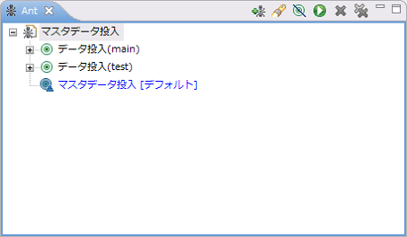

# マスタデータ投入ツール

## 概要

データベースにマスタデータを投入する機能を提供する。

## 特徴

* 自動テストのテストデータと同じ形式で記述できる。
* Nablarch Application Frameworkのコンポーネント設定ファイルを使用するので、別途設定ファイルを用意する必要がない。
* バックアップ用スキーマ [1] へのデータ投入が同時に実行できる。

バックアップ用スキーマとは、自動テストフレームワークの [マスタデータ復旧機能](../../development-tools/testing-framework/testing-framework-04-MasterDataRestore.md) にて使用するスキーマのことである。バックアップ用スキーマには、自動テスト用スキーマと同じマスタデータを投入する必要があり、本ツールを使用することで2つのスキーマに同時にデータ投入ができる。

> **Important:**
> 本ツールは、マルチスレッド機能には対応していない。
> マルチスレッド機能のテストは、テスティングフレームワークを使用しないテスト(結合テストなど)で行うこと。

## 使用方法

### 前提条件

[マスタデータ投入ツール インストールガイド](../../development-tools/testing-framework/testing-framework-02-ConfigMasterDataSetupTool.md) の [前提事項](../../development-tools/testing-framework/testing-framework-02-ConfigMasterDataSetupTool.md#前提事項) 参照

### データ作成方法

投入したいデータをMASTER_DATA.xlsxに記載する。記載方法は自動テストと同じ。
データ記載方法については、『 [データベースに事前登録する準備データ](../../development-tools/testing-framework/testing-framework-02-DbAccessTest.md#データベースに事前登録する準備データ) 』を参照。

### 実行方法

Antビューから、実行したいターゲットをダブルクリックする。

> **Tip:**
> Antビューの設定については、 [Eclipseとの連携設定](../../development-tools/testing-framework/testing-framework-02-ConfigMasterDataSetupTool.md#eclipseとの連携設定) を参照。

ターゲットの詳細は下表を参照。

| ターゲット名 | 説明 |
|---|---|
| データ投入(main) | mainプロジェクトの設定ファイルを使用してデータベース投入を行う。 取引単体テスト等、APサーバ上でアプリケーションを動作させる際の スキーマにデータが投入される。 |
| データ投入(test) | testプロジェクトの設定ファイルを使用してデータベース投入を行う。 自動テストで使用するスキーマにデータが投入される。 マスタデータバックアップスキーマにも同時にデータ投入を行う。 |
| マスタデータ投入 | 上記２つのターゲットをまとめて実行する。 |
