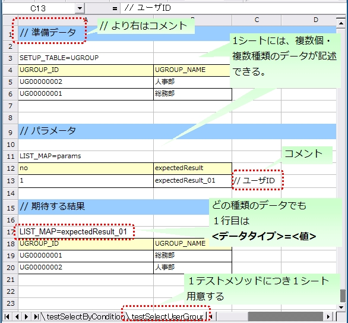

# 自動テストフレームワーク

**公式ドキュメント**: [自動テストフレームワーク](https://nablarch.github.io/docs/LATEST/doc/development_tools/testing_framework/guide/development_guide/06_TestFWGuide/01_Abstract.html)

## 特徴

自動テストフレームワークはJUnit4ベース。各種アノテーション・assertメソッド・Matcherクラスなど、JUnit4が提供する機能を使用可能。

> **補足**: JUnit 5上で自動テストフレームワークを動かしたい場合は [run_ntf_on_junit5_with_vintage_engine](#) を参照。

テストデータをExcelファイルに記述可能。DBの準備データや期待するテスト結果を、自動テストフレームワークのAPIを通じて使用できる。

トランザクション制御やシステム日付設定など、Nablarchアプリケーションに特化したAPIを提供。

1テストメソッドにつき1シートを用意し、シート名はテストメソッド名と同名にする（推奨）。

| テストメソッド | `@Test public void testInsert()` |
|---|---|
| Excelシート名 | `testInsert` |

> **補足**: シートに関する規約は「制約」ではない。テストメソッド名とExcelシート名が同名でなくても正しく動作する。今後の機能追加は上記規約をデフォルトとして開発されるため、命名規約への準拠を推奨する。命名規約を変更する場合はプロジェクト内で統一すること。

## テストメソッドの実行順序に依存しないテストを作成する

テストメソッドの実行順序によってテスト結果が変わらないようにすること。クラス単体でテストしても、複数まとめてテストしても同じ結果になる必要がある。

> **重要**: フレームワークではテスト中にコミットが行われるため、前後のテストによってDBの内容が変更される可能性が高い。自テストクラスで必要な事前条件は全て自テストクラス内で準備すること。

これにより、以下のような効果が得られる。

- テストの実行順序によって偶然テストが失敗したり偶然成功する、という事態を防ぐ。
- そのテストのデータまたはソースコードだけで、事前条件が分かる。

マスタデータのような基本的に読み取り専用のテーブルの準備は、共通のExcelファイルに記載し、テスト実行前に1回だけ実行するか、事前に準備済みという前提でテストを実行すること。

この手法には、以下のようなメリットがある。

- マスタ系のデータを、プロジェクト全体で再利用できる。
- テストデータのメンテナンスが容易になる。
- テスト実行速度が上がる。

> **補足**: マスタデータの投入には [master_data_setup_tool](testing-framework-01_MasterDataSetupTool.md) を使用する。また、[04_MasterDataRestore](testing-framework-04_MasterDataRestore.md) により、テスト内で発生したマスタデータの変更をテスト終了時に自動的に元の状態に戻すことができる。これにより、マスタデータに変更が必要なテストケースであっても、他のテストケースに影響なく実行できる。

<details>
<summary>keywords</summary>

JUnit4, JUnit5, テストデータの外部化, Excelファイル, 自動テストフレームワーク, トランザクション制御, システム日付設定, Nablarch特化API, run_ntf_on_junit5_with_vintage_engine, Excelシート命名規約, テストメソッド名, シート名ルール, テストデータシート, 命名規則, テスト実行順序非依存, データベーステスト, マスタデータ準備, master_data_setup_tool, MasterDataRestore, 事前条件, 実行順序効果

</details>

## 自動テストフレームワークの構成


| 構成物 | 説明 | 作成者 |
|---|---|---|
| テストクラス | テスト処理を記述する | アプリケーションプログラマ |
| テスト対象クラス | テスト対象となるクラス | アプリケーションプログラマ |
| Excelファイル | テストデータを記載する。自動テストフレームワークAPIでデータを読み取る | アプリケーションプログラマ |
| コンポーネント設定ファイル・環境設定ファイル | テスト実行時の各種設定を記載する | アプリケーションプログラマ（個別テストに固有の設定が必要な場合） |
| 自動テストフレームワーク | テストに必要な機能を提供する | — |
| Nablarch Application Framework | フレームワーク本体（本機能の対象外） | — |

テストデータの種類を識別するために「データタイプ」メタ情報を付与する。データの1行目は「データタイプ=値」形式で記述し、2行目以降の書式はデータタイプにより異なる。



## データタイプ一覧

| データタイプ名 | 説明 | 設定する値 |
|---|---|---|
| SETUP_TABLE | テスト実行前にデータベースに登録するデータ | 登録対象のテーブル名 |
| EXPECTED_TABLE | テスト実行後の期待するデータベースのデータ（省略したカラムは比較対象外） | 確認対象のテーブル名 |
| EXPECTED_COMPLETE_TABLE | テスト実行後の期待するデータベースのデータ（省略したカラムには`default_values_when_column_omitted`が設定されているものとして扱われる） | 確認対象のテーブル名 |
| LIST_MAP | List<Map<String,String>>形式のデータ | シート内で一意になるID / 期待値のID（任意の文字列） |
| SETUP_FIXED | 事前準備用の固定長ファイル | 準備ファイルの配置場所 |
| EXPECTED_FIXED | 期待値を示す固定長ファイル | 比較対象ファイルの配置場所 |
| SETUP_VARIABLE | 事前準備用の可変長ファイル | 準備ファイルの配置場所 |
| EXPECTED_VARIABLE | 期待値を示す可変長ファイル | 比較対象ファイルの配置場所 |
| MESSAGE | メッセージング処理のテストで使用するデータ | 固定値（`setUpMessages`または`expectedMessages`） |
| EXPECTED_REQUEST_HEADER_MESSAGES | 要求電文（ヘッダ）の期待値を示す固定長ファイル | リクエストID |
| EXPECTED_REQUEST_BODY_MESSAGES | 要求電文（本文）の期待値を示す固定長ファイル | リクエストID |
| RESPONSE_HEADER_MESSAGES | 応答電文（ヘッダ）を示す固定長ファイル | リクエストID |
| RESPONSE_BODY_MESSAGES | 応答電文（本文）を示す固定長ファイル | リクエストID |

## コメント

セル内に`//`から開始する文字列を記載した場合、そのセルから右のセルは全て読み込み対象外となる。

## マーカーカラム

カラム名が半角角括弧で囲まれている場合（例: `[no]`）、そのカラムは「マーカーカラム」とみなされ、テスト実行時に読み込まれない。コメントと異なり、左端や中央のカラムにも指定できる。すべてのデータタイプで使用可能。

## セルの書式

セルの書式には文字列のみを使用すること。テストデータを作成する前に全てのセルの書式を文字列に設定しておくこと。

> **重要**: Excelファイルに文字列以外の書式でデータを記述した場合、正しくデータが読み取れなくなる。

## 日付の記述方法

日付は以下の形式で記述できる:
- `yyyyMMddHHmmssSSS`
- `yyyy-MM-dd HH:mm:ss.SSS`

時刻の省略ルール:

| 省略方法 | 省略した場合の動作 |
|---|---|
| ミリ秒を省略（`yyyyMMddHHmmss` / `yyyy-MM-dd HH:mm:ss`） | ミリ秒として0を指定したものとして扱われる |
| 時刻全部を省略（`yyyyMMdd` / `yyyy-MM-dd`） | 時刻として0時0分0秒000を指定したものとして扱われる |

例:

| 記述例 | 評価結果 |
|---|---|
| `20210123123456789` | 2021年1月23日 12時34分56秒789 |
| `20210123123456` | 2021年1月23日 12時34分56秒000 |
| `20210123` | 2021年1月23日 00時00分00秒000 |
| `2021-01-23 12:34:56.789` | 2021年1月23日 12時34分56秒789 |
| `2021-01-23 12:34:56` | 2021年1月23日 12時34分56秒000 |
| `2021-01-23` | 2021年1月23日 00時00分00秒000 |

## セルへの特殊な記述方法

| 記述方法 | 自動テスト内での値 | 説明 |
|---|---|---|
| `null` / `Null` | null | null値として扱う（大文字小文字区別なし） |
| `"null"` / `"NULL"` | 文字列のnull | 前後のダブルクォートを除去した文字列として扱う |
| `"1⊔"` | `1⊔` | スペースを含む文字列の明示的な記述（⊔は半角スペース） |
| `"⊔"` | `⊔` | 半角スペース単体の明示的な記述 |
| `"１△"` | `１△` | 全角スペースを含む文字列の明示的な記述（△は全角スペース） |
| `"△△"` | `△△` | 全角スペース2文字の明示的な記述 |
| `"""` | `"` | ダブルクォート1文字を表す（前後のダブルクォートが除去される） |
| `""` | 空文字列 | 空文字列を表す |
| `${systemTime}` | システム日時 | SystemTimeProvider実装クラスから取得したTimestampの文字列形式（例: `2011-04-11 01:23:45.0`） |
| `${updateTime}` | システム日時 | `${systemTime}`の別名。特にDBタイムスタンプ更新時の期待値として使用する |
| `${setUpTime}` | コンポーネント設定ファイルに記載された固定値 | DBセットアップ時のタイムスタンプに決まった値を使用したい場合 |
| `${文字種,文字数}` | 指定した文字種を指定文字数分増幅した値 | 使用可能文字種: 半角英字、半角数字、半角記号、半角カナ、全角英字、全角数字、全角ひらがな、全角カタカナ、全角漢字、全角記号その他、外字。単独でも組み合わせても使用可能 |
| `${binaryFile:ファイルパス}` | BLOB列に格納するバイナリデータ | ファイルパスはExcelファイルからの相対パスで記述 |
| `\r` | CR(0x0D) | 改行コードCRの明示的な記述 |
| `\n` | LF(0x0A) | 改行コードLFの明示的な記述（Excelセル内のAlt+EnterもLFとして扱われる） |

> **補足（ダブルクォート囲み記法）**: ダブルクォートで囲まれた記法を使用した場合であっても、文字列中のダブルクォートをエスケープする必要はない。先頭と末尾のダブルクォートのみが除去される。
>
> | 記述例 | 扱われ方 |
> |---|---|
> | `"ab"c"` | `ab"c`として扱われる（前後のダブルクォートが除去される） |
> | `"abc""` | `abc"`として扱われる（前後のダブルクォートが除去される） |
> | `ab"c` | `ab"c`として扱われる（前後がダブルクォートではないため、そのまま扱われる） |
> | `abc"` | `abc"`として扱われる（前後がダブルクォートではないため、そのまま扱われる） |

## テストデータは全てExcelシートに記述する

Excelとテストソースコードとでテストデータが混在していると、可読性・保守性が低下する。テストソースコード中にはテストデータを記載せず、テストデータは全てExcelシートに記載すること。

- Excelシートを見れば、テストケースのバリエーションを把握できる。
- テストデータはExcelシート、テストロジックはテストソースコードと役割分担が明確になる。
- Excelシートを読み込む構造にしておくことで、容易にテストケースを追加できる。
- テストソースコードの重複を大幅に削減できる（テストソースコード中に単純にリテラル値でデータを記載すると、データのバリエーションが増加すると重複したコードが作られてしまう）。

<details>
<summary>keywords</summary>

テストクラス, テスト対象クラス, Excelファイル, コンポーネント設定ファイル, 環境設定ファイル, Nablarch Application Framework, フレームワーク構成, testing_fw_components, データタイプ, SETUP_TABLE, EXPECTED_TABLE, EXPECTED_COMPLETE_TABLE, LIST_MAP, MESSAGE, SETUP_FIXED, EXPECTED_FIXED, SETUP_VARIABLE, EXPECTED_VARIABLE, EXPECTED_REQUEST_HEADER_MESSAGES, EXPECTED_REQUEST_BODY_MESSAGES, RESPONSE_HEADER_MESSAGES, RESPONSE_BODY_MESSAGES, コメント, マーカーカラム, セルの書式, 日付記述方法, 特殊記述方法, null値, ${systemTime}, ${updateTime}, ${binaryFile}, ${setUpTime}, テストデータ書式, 文字種増幅, テストデータ管理, Excelシート, テストケースバリエーション, 役割分担, テストソースコード重複削減

</details>

## テストメソッド記述方法

テストメソッドに `@Test` アノテーションを付与する（JUnit4アノテーションを使用）。

```java
public class SampleTest {

    @Test
    public void testSomething() {
        // テスト処理
    }
}
```

## 複数のデータタイプ使用時はデータタイプごとにまとめてデータを記述する

複数のデータタイプを使用する場合、データタイプごとにまとめてデータを記述すること。複数のデータタイプを混在させると、データの読み込みが途中で終了してテストが正しく実行されない。

**誤った記述例（TABLE3以降が評価されない）:**

```text
EXPECTED_TABLE=TABLE1
:
EXPECTED_COMPLETE_TABLE=TABLE2
:
EXPECTED_TABLE=TABLE3
:
EXPECTED_COMPLETE_TABLE=TABLE4
:
```

**正しい記述例（データタイプごとにまとめる）:**

```text
EXPECTED_TABLE=TABLE1
:
EXPECTED_TABLE=TABLE3
:
EXPECTED_COMPLETE_TABLE=TABLE2
:
EXPECTED_COMPLETE_TABLE=TABLE4
:
```

<details>
<summary>keywords</summary>

@Test, JUnit4アノテーション, テストメソッド, SampleTest, テストクラス作成, データタイプ, EXPECTED_TABLE, EXPECTED_COMPLETE_TABLE, auto-test-framework_multi-datatype

</details>

## JUnitアノテーション（@Before/@After）

> **補足**: `@Before`や`@After`などのアノテーションも使用できる。テストメソッド前後にリソースの取得解放などの共通処理を行いたい場合は [using_junit_annotation](testing-framework-03_Tips.md) を参照。

## JUnit Vintage

JUnit 5にはJUnit Vintageというプロジェクトがあり、JUnit 5の上でJUnit 4で書かれたテストを実行できる。この機能を利用することで、自動テストフレームワークをJUnit 5の上で動かすことができる。

> **重要**: この機能はあくまでもJUnit 4のテストをJUnit 4として動かしているにすぎない。JUnit 4のテストの中でJUnit 5の機能は使えない。この機能は、JUnit 4からJUnit 5への移行を段階的に進めるための補助として利用できる。JUnit 4からJUnit 5に移行するときの手順については、[公式のガイド（外部サイト、英語）](https://junit.org/junit5/docs/5.8.2/user-guide/#migrating-from-junit4) を参照。

> **補足**: JUnit 5のテストで自動テストフレームワークを使用する方法については [ntf_junit5_extension](testing-framework-JUnit5_Extension.md) を参照。

## 前提条件

- Java 8 以上
- maven-surefire-plugin 2.22.0 以上

## 依存関係の追加

pom.xmlに以下2つのアーティファクトを依存関係に追加:

- `org.junit.jupiter:junit-jupiter`
- `org.junit.vintage:junit-vintage-engine`

**モジュール**:
```xml
<dependencyManagement>
  <dependencies>
    <!-- バージョンを揃えるため、JUnitが提供しているbomを読み込む -->
    <dependency>
      <groupId>org.junit</groupId>
      <artifactId>junit-bom</artifactId>
      <version>5.8.2</version>
      <type>pom</type>
      <scope>import</scope>
    </dependency>
  </dependencies>
</dependencyManagement>

<dependencies>
  <dependency>
    <groupId>org.junit.jupiter</groupId>
    <artifactId>junit-jupiter</artifactId>
    <scope>test</scope>
  </dependency>
  <dependency>
    <groupId>org.junit.vintage</groupId>
    <artifactId>junit-vintage-engine</artifactId>
    <scope>test</scope>
  </dependency>
</dependencies>
```

<details>
<summary>keywords</summary>

@Before, @After, using_junit_annotation, 共通処理, リソース取得解放, JUnit Vintage, JUnit 4, JUnit 5, maven-surefire-plugin, junit-jupiter, junit-vintage-engine, junit-bom, ntf_junit5_extension, JUnit移行, run_ntf_on_junit5_with_vintage_engine

</details>

## Excelによるテストデータ記述

DBの準備データやDB検索結果などのデータを表すには、Javaソースコードよりスプレッドシートの方が可読性・編集のしやすさで有利。Excelファイルを使用することで、このようなデータをスプレッドシート形式で扱える。

<details>
<summary>keywords</summary>

スプレッドシート, テストデータ, 可読性, Excelファイル, データベース検索結果, how_to_write_excel

</details>

## 命名規約

ExcelファイルのファイルパスやExcelファイル名には推奨される命名規約が存在する。規約に従うことで、テストクラスで明示的にディレクトリ名やファイル名を指定せずにExcelファイルを読み込めるようになり、テストソースコードを簡潔に記述できる。明示的なパス指定により任意の場所のExcelファイルを読み込むことも可能。

<details>
<summary>keywords</summary>

Excelファイル名, 命名規約, テストソースコード, ファイルパス

</details>

## パス、ファイル名に関する規約

- Excelファイル名はテストソースコードと同じ名前にする（拡張子のみ異なる）
- Excelファイルをテストソースコードと同じディレクトリに配置する

| ファイルの種類 | 配置ディレクトリ | ファイル名 |
|---|---|---|
| テストソースファイル | `<PROJECT_ROOT>/test/jp/co/tis/example/db/` | ExampleDbAcessTest.java |
| Excelファイル | `<PROJECT_ROOT>/test/jp/co/tis/example/db/` | ExampleDbAcessTest.xlsx |

ExcelファイルはExcel2003以前（拡張子 xls）およびExcel2007以降（拡張子 xlsx）の形式に対応。

<details>
<summary>keywords</summary>

Excelファイル名, テストソースコード, 配置ディレクトリ, xls, xlsx, Excel2003, Excel2007, 拡張子, ファイル命名規約

</details>
