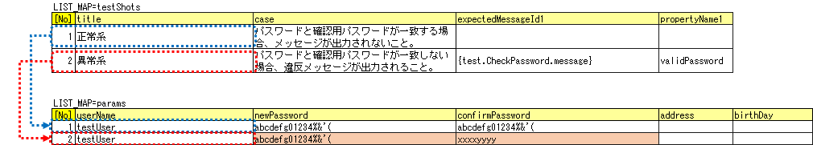
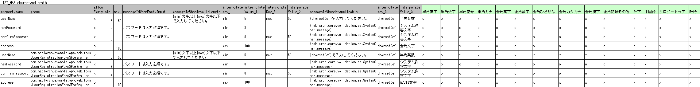
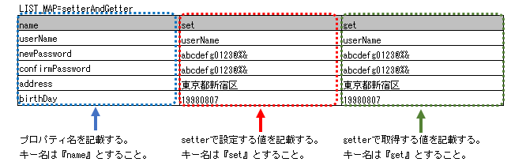
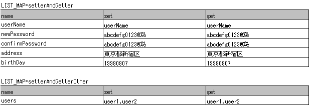
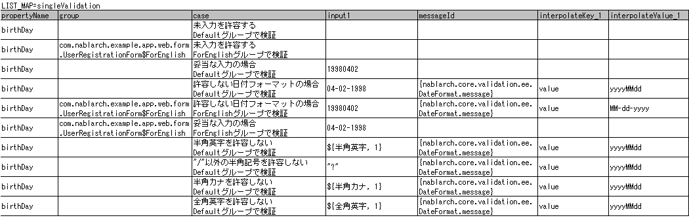

# Bean Validationに対応したForm/Entityのクラス単体テスト

**公式ドキュメント**: [1](https://nablarch.github.io/docs/LATEST/doc/development_tools/testing_framework/guide/development_guide/05_UnitTestGuide/01_ClassUnitTest/01_entityUnitTest/01_entityUnitTestWithBeanValidation.html) [2](https://nablarch.github.io/docs/LATEST/javadoc/javax/validation/constraints/AssertTrue.html)

## Bean Validationに対応したForm/Entityのクラス単体テスト

Bean Validationを使用したForm/Entityクラス単体テスト（Form単体テスト/Entity単体テスト）。FormとEntityはほぼ同じ方法でテストを実施できる。

スーパークラスの `testSingleValidation` メソッドを呼び出して単項目精査をテストする。

**メソッドシグネチャ**: `void testSingleValidation(Class entityClass, String sheetName, String id)`

```java
public class UserRegistrationFormTest extends EntityTestSupport {
    private static final Class<?> TARGET_CLASS = UserRegistrationForm.class;

    @Test
    public void testSingleValidation() {
        String sheetName = "testSingleValidation";
        String id = "singleValidation";
        testSingleValidation(TARGET_CLASS, sheetName, id);
    }
}
```

<details>
<summary>keywords</summary>

Bean Validation, Form単体テスト, Entity単体テスト, EntityTestSupport, クラス単体テスト, bean_validation, testSingleValidation, 単項目精査テスト, Bean Validationテスト

</details>

## Form/Entity単体テストの書き方

## テストデータの作成

- テストデータExcelファイルはテストソースコードと同じディレクトリに同名で格納（拡張子のみ異なる）
- 精査のテストケースとsetter/getterのテストケースそれぞれ1シート使用
- メッセージデータやコードマスタなどDB格納の静的マスタデータはプロジェクト管理データが事前投入されている前提

テストデータ参照: :download:`テストクラス(UserRegistrationFormTest.java)<../_download/UserRegistrationFormTest.java>` / :download:`テストデータ(UserRegistrationFormTest.xlsx)<../_download/UserRegistrationFormTest.xlsx>` / :download:`テスト対象クラス(UserRegistrationForm.java)<../_download/UserRegistrationForm.java>`

## テストクラスの作成

テストクラス作成ルール:
1. テスト対象Form/Entityと同一パッケージ
2. クラス名は`{Form/Entity名}Test`
3. `nablarch.test.core.db.EntityTestSupport`を継承

```java
package com.nablarch.example.app.web.form;
import nablarch.test.core.db.EntityTestSupport;
public class UserRegistrationFormTest extends EntityTestSupport {
```

`@AssertTrue` などを使った項目間精査は単項目精査テストでカバーできないため別途テストを作成する。

**テストケース表**: ID は `testShots` 固定。

| カラム名 | 記載内容 |
|---|---|
| title | テストケースのタイトル |
| description | テストケースの簡単な説明 |
| group | Bean Validationのグループ（省略可） |
| expectedMessageId*n* | 期待するメッセージ（*n* は1からの連番） |
| propertyName*n* | 期待するプロパティ（*n* は1からの連番） |
| interpolateKey*n*_*k* | 埋め込み文字のキー名（*n* はexpectedMessageIdの連番に対応、*k* は1からの連番、省略可） |
| interpolateValue*n*_*k* | 埋め込み文字の値（省略可） |

複数メッセージを期待する場合: `expectedMessageId2`, `propertyName2` のように数値を増やして右側に追加。複数メッセージに対応する埋め込み文字がある場合も同様に `interpolateKey2_1`, `interpolateValue2_1` のように数値を増やす。

グループの指定方法・メッセージの指定方法は :ref:`entityUnitTest_CharsetAndLengthInputData_BeanValidation` に記載の方法と同じ。

テストケース表には、精査エラーが発生するプロパティ名とそのプロパティの精査エラーメッセージを記載する。精査エラーが発生しないプロパティは記載しない。

**入力パラメータ表**: ID は `params` 固定。テストケース表に対応する入力値を1行ずつ記載。:ref:`special_notation_in_cell` の記法を使用して効率的に入力値を作成できる。

入力パラメータ表には、項目間精査で検証したいプロパティの値を記載する。項目間精査で検証したいプロパティ以外に、入力必須のプロパティが存在する場合は、それも記載する必要がある。



> **補足**: Formが保持する別Formのプロパティをテストデータで指定する場合、以下の記法を使用する。
> - 通常のネストプロパティ（例: `SystemUserEntity.userId` を指定する場合）: `sampleForm.systemUser.userId`
> - 配列要素のプロパティ（例: `UserTelEntity[]` の先頭要素を指定する場合）: `sampleForm.userTelArray[0].telNoArea`

<details>
<summary>keywords</summary>

EntityTestSupport, テストデータ作成, テストクラス作成, UserRegistrationFormTest, テストデータExcel, nablarch.test.core.db.EntityTestSupport, testShots, params, @AssertTrue, javax.validation.constraints.AssertTrue, special_notation_in_cell, 項目間精査テストケース, ネストプロパティ指定, 項目間精査テストデータ

</details>

## テストケース表の作成方法（文字種と文字列長）

単項目精査テストの代表例（「フリガナ」プロパティの場合）:

| ケース | 観点 |
|---|---|
| 全角カタカナ50文字を入力し精査が成功する | 最大文字列長、文字種の確認 |
| 全角カタカナ51文字を入力し精査が失敗する | 最大文字列長の確認 |
| 全角カタカナ1文字を入力し精査が成功する | 最小文字列長、文字種の確認 |
| 空文字を入力し精査が失敗する | 必須精査の確認 |
| 半角カタカナを入力し精査が失敗する | 文字種の確認（同様に半角英字、全角ひらがな、漢字等も必要） |

> **補足**: プロパティとして別のFormを保持するFormには使用不可。`<親Form>.<子Form>.<子フォームのプロパティ名>`形式でプロパティにアクセスする場合は独自実装が必要。

テストケース表のカラム定義:

| カラム名 | 記載内容 |
|---|---|
| propertyName | テスト対象のプロパティ名 |
| allowEmpty | 未入力を許容するか |
| group | Bean Validationのグループ（省略可）。FQCNで指定。内部クラスは`$`で区切る |
| min | 最小文字列長（省略可） |
| max | 最大文字列長（省略可） |
| messageIdWhenEmptyInput | 未入力時に期待するメッセージ（省略可） |
| messageIdWhenInvalidLength | 文字列長不適合時に期待するメッセージ（省略可） |
| messageIdWhenNotApplicable | 文字種不適合時に期待するメッセージ |
| interpolateKey_n | 埋め込み文字のキー名（nは1からの連番、省略可）。複数ある場合はinterpolateKey_2, interpolateKey_3と追加 |
| interpolateValue_n | 埋め込み文字の値（nは1からの連番、省略可） |
| 半角英字 | 半角英字を許容するか |
| 半角数字 | 半角数字を許容するか |
| 半角記号 | 半角記号を許容するか |
| 半角カナ | 半角カナを許容するか |
| 全角英字 | 全角英字を許容するか |
| 全角数字 | 全角数字を許容するか |
| 全角ひらがな | 全角ひらがなを許容するか |
| 全角カタカナ | 全角カタカナを許容するか |
| 全角漢字 | 全角漢字を許容するか |
| 全角記号その他 | 全角記号その他を許容するか |
| 外字 | 外字を許容するか |

許容するか欄の値: `o`（許容する）/ `x`（許容しない）

messageIdWhenEmptyInput省略時: :ref:`entityUnitTest_EntityTestConfiguration_BeanValidation` で設定したemptyInputMessageIdを使用。

messageIdWhenInvalidLength省略時のデフォルト値:

| max欄 | min欄 | 大小関係 | 使用するデフォルト値 |
|---|---|---|---|
| あり | なし | — | maxMessageId |
| あり | あり | max > min | maxAndMinMessageId（超過時）/ underLimitMessageId（不足時） |
| あり | あり | max = min | fixLengthMessageId |
| なし | あり | — | minMessageId |

メッセージ指定方法:
- 直接記載: `入力必須です。` / `{min}文字以上{max}文字以下で入力してください。`（埋め込み文字あり）
- メッセージIDとして指定: 全体を`{}`で囲む（例: `{nablarch.core.validation.ee.SystemChar.message}`）



項目間精査のテストはスーパークラスの `testBeanValidation` メソッドを呼び出す。

**メソッドシグネチャ**: `void testBeanValidation(Class entityClass, String sheetName)`

```java
public class UserRegistrationFormTest extends EntityTestSupport {
    private static final Class<?> TARGET_CLASS = UserRegistrationForm.class;

    @Test
    public void testWholeFormValidation() {
        String sheetName = "testWholeFormValidation";
        testBeanValidation(TARGET_CLASS, sheetName);
    }
}
```

<details>
<summary>keywords</summary>

testValidateCharsetAndLength, 文字種精査, 文字列長精査, allowEmpty, propertyName, group, min, max, messageIdWhenEmptyInput, messageIdWhenInvalidLength, messageIdWhenNotApplicable, interpolateKey, interpolateValue, テストケース表, testBeanValidation, EntityTestSupport, 項目間精査テスト, Bean Validationテスト

</details>

## テストメソッドの作成方法

スーパークラスのメソッドを呼び出す:

```java
void testValidateCharsetAndLength(Class entityClass, String sheetName, String id)
```

```java
@Test
public void testCharsetAndLength() {
    String sheetName = "testCharsetAndLength";
    String id = "charsetAndLength";
    testValidateCharsetAndLength(TARGET_CLASS, sheetName, id);
}
```

メソッド実行時のテスト観点（テストデータの各行に対して）:

| 観点 | 入力値 | 備考 |
|---|---|---|
| 文字種（半角英字/半角数字/半角記号/半角カナ/全角英字/全角数字/全角ひらがな/全角カタカナ/全角漢字/全角記号その他/外字） | max欄の長さの文字列 | max省略時はmin欄の長さ。両方省略時は長さ1 |
| 未入力 | 空文字（長さ0） | |
| 最小文字列 | 最小文字列長の文字列 | o印の文字種で構成 |
| 最長文字列 | 最大文字列長の文字列 | max省略時は最長・超過テストは実行されない |
| 文字列長不足 | 最小文字列長-1の文字列 | min省略時は実行されない |
| 文字列長超過 | 最大文字列長+1の文字列 | |

setter/getterテスト: setterで設定した値とgetterで取得した値が期待通りか確認する。対象はFormに定義されている全てのプロパティ。

> **補足**: Entityは自動生成されるため未使用のsetter/getterが生成される可能性があり、Entity単体テストでsetter/getterのテストを必ず実施すること。一般的なFormはアプリで使用するsetter/getterのみ作成するためリクエスト単体テストでカバー可能なので、Formのクラス単体テストでのsetter/getterテストは不要。



```java
public class UserRegistrationFormTest extends EntityTestSupport {
    private static final Class<?> TARGET_CLASS = UserRegistrationForm.class;

    @Test
    public void testSetterAndGetter() {
        String sheetName = "testSetterAndGetter";
        String id = "setterAndGetter";
        testSetterAndGetter(TARGET_CLASS, sheetName, id);
    }
}
```

> **補足**: `testSetterAndGetter` でテスト可能なプロパティ型に制限あり。以下の型以外は各テストクラスで個別にsetter/getterを明示的に呼び出してテストすること。
> - `String` および `String[]`
> - `BigDecimal` および `BigDecimal[]`
> - `java.util.Date` および `java.util.Date[]`（Excelへはyyyy-MM-dd形式またはyyyy-MM-dd HH:mm:ss形式で記述）
> - `valueOf(String)` メソッドを持つクラスおよびその配列（例: `Integer`, `Long`, `java.sql.Date`, `java.sql.Timestamp`）

上記対象外の型のプロパティは、`getParamMap`（単一）または `getListParamMap`（複数）でテストデータを取得し個別テストを実施する。



```java
@Test
public void testSetterAndGetter() {
    Class<?> entityClass = UserRegistrationForm.class;
    String sheetName = "testSetterAndGetter";
    String id = "setterAndGetter";
    testSetterAndGetter(entityClass, sheetName, id);

    Map<String, String[]> data = getParamMap(sheetName, "setterAndGetterOther");
    List<String> users = Arrays.asList(data.get("set"));
    UserRegistrationForm form = new UserRegistrationForm();
    form.setUsers(users);
    assertEquals(form.getUsers(), Arrays.asList(data.get("get")));
}
```

> **補足**: setter/getterにロジックを記述した場合（例: setterは郵便番号上3桁・下4桁を受け取り、getterは7桁でまとめて返す）は、そのロジックを確認するテストケースを別途作成すること。


<details>
<summary>keywords</summary>

testValidateCharsetAndLength, テストメソッド, 文字種テスト実行, 文字列長テスト実行, EntityTestSupport, testCharsetAndLength, testSetterAndGetter, getParamMap, getListParamMap, BigDecimal, java.util.Date, java.sql.Date, java.sql.Timestamp, setter/getterテスト, プロパティ型制限, valueOf

</details>

## テストケース表の作成方法（その他の単項目精査）

日付フォーマット精査など文字種・文字列長以外の単項目精査のテスト。各プロパティに対して1入力値と期待メッセージIDのペアを記述する。

> **補足**: プロパティとして別のFormを保持するFormには使用不可。独自実装が必要。

| カラム名 | 記載内容 |
|---|---|
| propertyName | テスト対象のプロパティ名 |
| case | テストケースの簡単な説明 |
| group | Bean Validationのグループ（省略可） |
| input1 | 入力値（複数パラメータはinput2, input3と追加） |
| messageId | 精査エラー時に期待するメッセージ（精査エラーなしの場合は空欄） |
| interpolateKey_n | 埋め込み文字のキー名（nは1からの連番、省略可） |
| interpolateValue_n | 埋め込み文字の値（nは1からの連番、省略可） |

- :ref:`special_notation_in_cell` の記法で効率的に入力値を作成可能
- グループ・メッセージ指定方法は :ref:`entityUnitTest_CharsetAndLengthInputData_BeanValidation` と同じ



**クラス**: `nablarch.test.core.entity.EntityTestConfiguration`

:ref:`entityUnitTest_ValidationCase_BeanValidation` を実施する際に必要な初期値設定。

| 設定項目名 | 説明 |
|---|---|
| maxMessageId | 最大文字列長超過時のメッセージのデフォルト値 |
| maxAndMinMessageId | 最長最小文字列長範囲外のメッセージのデフォルト値（可変長、超過時） |
| underLimitMessageId | 最長最小文字列長範囲外のメッセージのデフォルト値（可変長、不足時） |
| fixLengthMessageId | 最長最小文字列長範囲外のメッセージのデフォルト値（固定長） |
| minMessageId | 文字列長不足時のメッセージのデフォルト値（maxを省略したテストケースを作成する場合は指定必須） |
| emptyInputMessageId | 未入力時のメッセージのデフォルト値 |
| characterGenerator | `nablarch.test.core.util.generator.CharacterGenerator` の実装クラスを指定。通常は `nablarch.test.core.util.generator.BasicJapaneseCharacterGenerator` を使用 |
| validationTestStrategy | Bean Validationを使用する場合は `nablarch.test.core.entity.BeanValidationTestStrategy` を固定で指定 |

<details>
<summary>keywords</summary>

単項目精査, 日付フォーマット精査, propertyName, case, group, messageId, interpolateKey, interpolateValue, input1, テストケース表, special_notation_in_cell, EntityTestConfiguration, nablarch.test.core.entity.EntityTestConfiguration, maxMessageId, maxAndMinMessageId, underLimitMessageId, fixLengthMessageId, minMessageId, emptyInputMessageId, characterGenerator, validationTestStrategy, BeanValidationTestStrategy, BasicJapaneseCharacterGenerator, CharacterGenerator, 自動テストフレームワーク設定

</details>

## コンポーネント設定ファイルの記述例

```xml
<component name="entityTestConfiguration" class="nablarch.test.core.entity.EntityTestConfiguration">
  <property name="maxMessageId"        value="{nablarch.core.validation.ee.Length.max.message}"/>
  <property name="maxAndMinMessageId"  value="{nablarch.core.validation.ee.Length.min.max.message}"/>
  <property name="fixLengthMessageId"  value="{nablarch.core.validation.ee.Length.fixed.message}"/>
  <property name="underLimitMessageId" value="{nablarch.core.validation.ee.Length.min.max.message}"/>
  <property name="minMessageId"        value="{nablarch.core.validation.ee.Length.min.message}"/>
  <property name="emptyInputMessageId" value="{nablarch.core.validation.ee.Required.message}"/>
  <property name="characterGenerator">
    <component name="characterGenerator"
               class="nablarch.test.core.util.generator.BasicJapaneseCharacterGenerator"/>
  </property>
  <property name="validationTestStrategy">
    <component class="nablarch.test.core.entity.BeanValidationTestStrategy"/>
  </property>
</component>
```

<details>
<summary>keywords</summary>

EntityTestConfiguration, BeanValidationTestStrategy, nablarch.test.core.entity.BeanValidationTestStrategy, BasicJapaneseCharacterGenerator, nablarch.test.core.util.generator.BasicJapaneseCharacterGenerator, コンポーネント設定ファイル, Bean Validation設定例

</details>
