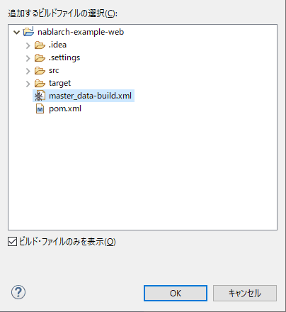

# マスタデータ投入ツール インストールガイド

[マスタデータ投入ツール](../../development-tools/testing-framework/testing-framework-guide-development-guide-08-TestTools-02-MasterDataSetup.md) のインストール方法について説明する。

## 前提事項

* 以下のツールがインストール済みであること

  * Eclipse
  * Maven
* [Nablarchのアーキタイプ](../../setup/blank-project/blank-project-blank-project.md#ブランクプロジェクト) から生成されたプロジェクトであること
* テーブルが作成済みであること
* バックアップ用スキーマにテーブルが作成済みであること [1]

バックアップ用スキーマおよびそのテーブルの作成については、
『 [マスタデータ復旧機能](../../development-tools/testing-framework/testing-framework-04-MasterDataRestore.md) 』の [環境構築](../../development-tools/testing-framework/testing-framework-04-MasterDataRestore.md#環境構築) を参照。

## 提供方法

本ツールはnablarch-testing-XXX.jar にて提供する。

ツール使用前に、プロジェクトのユニットテストと同じDB設定を使用できるようにするためにプロジェクトのコンパイルと、ツールの実行に必要なjarファイルのダウンロードを行なう。
以下のコマンドを実行する。

```text
mvn compile
mvn dependency:copy-dependencies -DoutputDirectory=lib
```

以下のファイルをダウンロードし、プロジェクトのディレクトリ(pom.xmlが存在するディレクトリ）にディレクトリ付きで展開する。

* [master-data-setup-tool.zip](../../../knowledge/assets/testing-framework-02-ConfigMasterDataSetupTool/master-data-setup-tool.zip)

上記ファイルに含まれる設定ファイルを下記に示す。

| ファイル名 | 説明 |
|---|---|
| tool/db/data/master_data-build.properties | 環境設定用プロパティファイル |
| tool/db/data/master_data-build.xml | Antビルドファイル |
| tool/db/data/master_data-log.properties | ログ出力プロパティファイル |
| tool/db/data/master_data-app-log.properties | ログ出力プロパティファイル |
| tool/db/data/MASTER_DATA.xlsx | マスタデータファイル |

本ツールを実行する前に以下のコマンドを実行する。

```text
mvn compile
mvn dependency:copy-dependencies -DoutputDirectory=lib
```

### プロパティファイルの書き換え

マスタデータ自動復旧機能が使用する、バックアップスキーマ名を設定する。

```bash
# テスト用マスタデータバックアップスキーマ名
masterdata.test.backup-schema=nablarch_test_master
```

その他の設定値については、ディレクトリ構造が変わらない限り修正の必要はない。

## Eclipseとの連携設定

以下の設定をすることでEclipseから本ツールを起動できる。

### Antビュー起動

ツールバーから、ウィンドウ(Window)→設定(Show View)を選択し、Antビューを開く。


### ビルドファイル登録

＋印のアイコンを押下し、ビルドスクリプトを選択する。


Antビルドファイル(master_data-build.xml)を選択する。



Antビューに登録したビルドファイルが表示されることを確認する。


