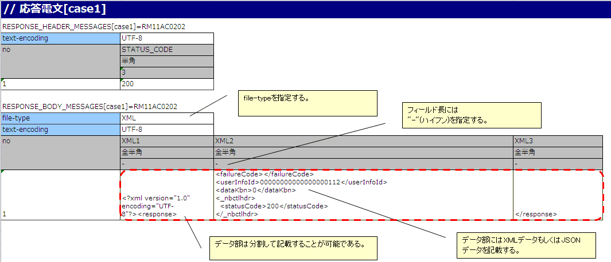
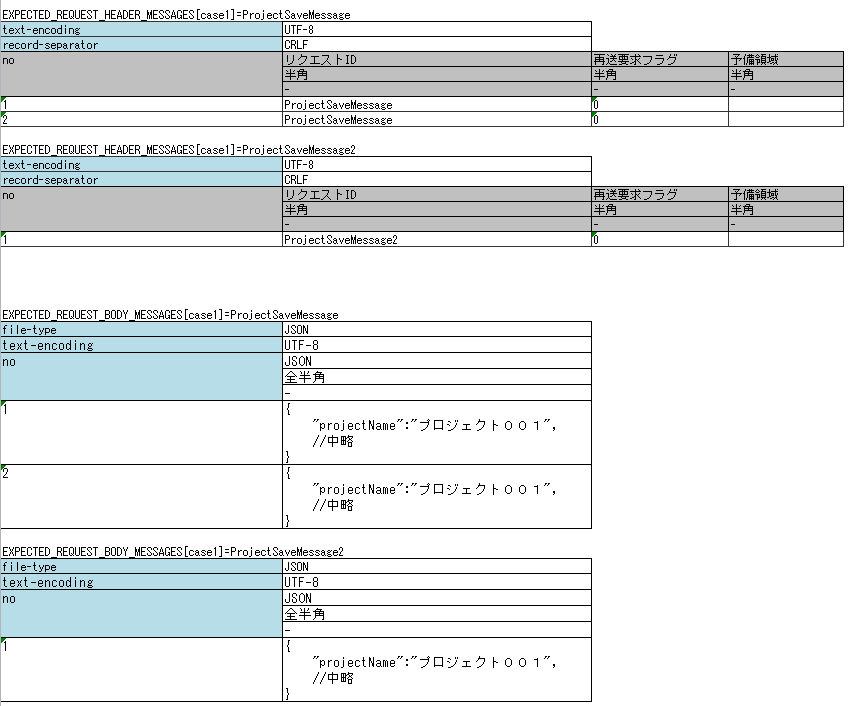
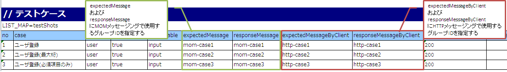

# リクエスト単体テストの実施方法(HTTP同期応答メッセージ送信処理)

リクエスト単体テスト実施方法は、 [リクエスト単体テストの実施方法(同期応答メッセージ送信処理)](../../development-tools/testing-framework/testing-framework-02-requestunittest-send-sync.md#message-sendsyncmessage-test) を参照すること。

ただし、「送信キュー」「受信キュー」を「通信先」と読み替えること。

本項では、 [リクエスト単体テストの実施方法(同期応答メッセージ送信処理)](../../development-tools/testing-framework/testing-framework-02-requestunittest-send-sync.md#message-sendsyncmessage-test) と異なる箇所を解説する。

## テストデータの書き方

### 電文を1回送信する場合の要求電文の期待値および、返却する応答電文（レスポンスメッセージ）の例

以下に、電文を1回送信する場合の返却する応答電文の記述例を示す。



> **Tip:**
> RESPONSE_BODY_MESSAGES(及び後の例で使用するEXPECTED_REQUEST_BODY_MESSAGES)は、複数フィールドに分割して記述可能である。

> 文字列が長く、1セルに全部記述すると可読性が落ちる場合に分割して記述する。

> 分割する際、「フィールド名」は任意の文字列を指定する。上記の例では `XML1` 、 `XML2` 、 `XML3` としている。

以下に、電文を1回送信する場合の要求電文の期待値の記述例を示す。


> **Tip:**
> JSON及びXMLデータ形式使用時は、1Excelシートに1テストケースのみ記述すること。

> これはメッセージボディについて、Excelの各行の文字列長が同一であることを期待しているというNTFの制約によるものである。JSON及びXMLデータ形式は、要求電文の長さがリクエスト毎に異なるのが一般的なので、事実上1テストケースしか記述できない。

### 電文を2回以上送信する場合の要求電文の期待値および、返却する応答電文（レスポンスメッセージ）の例

複数回電文を送信する場合のテストは、テスティングフレームワークの以下の仕様に注意をして記述すること。

* 同一データタイプ(以下の例では `RESPONSE_HEADER_MESSAGES` と `RESPONSE_BODY_MESSAGES` )は、それぞれ、まとめて記述する。詳細は、  [一つのシートに複数テストケースのデータを記載したい](../../development-tools/testing-framework/testing-framework-03-Tips.md#tips-groupid) 及び、  [複数のデータタイプ使用時はデータタイプごとにまとめてデータを記述する](../../development-tools/testing-framework/testing-framework-01-Abstract.md#auto-test-framework-multi-datatype) を参照。
* 同一リクエストIDの電文については、noの値を変えてまとめて記述する。
* 同一リクエストIDの電文の場合は、電文の長さを合わせる(電文を1回送信する場合と同様の制約である。テストケース上、同一の長さにできない場合は、手動でテストを行うこと)

以下に複数回電文を送信する際の、返却する応答電文の記述例を示す。


以下に複数回電文を送信する際の、要求電文の期待値の記述例を示す。



> **Tip:**
> 送信対象のリクエストIDが複数存在する場合、送信順のテストは不可能である。上記の例の場合、 `ProjectSaveMessage` より先に、 `ProjectSaveMessage2` が送信された場合であってもテストは成功となる。

#### 障害系のテスト

応答電文の表に「errorMode:」から始まる特定の値を設定することで、障害系のテストを行うことができる [1] 。

以下に、設定値と、障害系のテストの対応を示す。

| 最初のフィールドに設定する値 | 障害内容 | 自動テストフレームワークの動作 |
|---|---|---|
| `errorMode:timeout` | メッセージ送信中にタイムアウトエラーが発生する場合のテスト | **HttpMessagingTimeoutException** (**MessagingException** のサブクラス)を送出する。  [2] |
| `errorMode:msgException` | メッセージ送受信エラーが発生する場合のテスト | **MessagingException** をスローする。 |

この値は、応答電文の表の **ヘッダおよび本文両方の、「no」を除く最初のフィールド** に記載すること。

業務アクション内で、明示的に **MessagingException** を制御していないのであれば、
個別のリクエスト単体テストにおいて障害系のテストを行う必要は無い。

 [リクエスト単体テストの実施方法(同期応答メッセージ送信処理)](../../development-tools/testing-framework/testing-framework-02-requestunittest-send-sync.md#message-sendsyncmessage-test) と異なるクラスを送出する。

### モックアップを使用するための記述

testShotsに `expectedMessageByClient` および `responseMessageByClient` にグループIDを設定する。モックアップ自体については、 [同期応答メッセージ送信処理を伴う取引単体テストの実施方法](../../development-tools/testing-framework/testing-framework-03-dealunittest-send-sync.md#dealunittest-send-sync) を参照。

グループIDの関連については [リクエスト単体テストの実施方法(同期応答メッセージ送信処理)](../../development-tools/testing-framework/testing-framework-02-requestunittest-send-sync.md#message-sendsyncmessage-test) における `expectedMessage` および `responseMessage` の場合と同様であるため割愛する。


同一アクション内でMOMによる同期応答メッセージ送信処理とHTTP同期応答メッセージ送信処理が同時に行われる場合、
"expectedMessage"、"responseMessage"にMOMによる同期応答メッセージ送信処理で使用するグループIDを、
"expectedMessageByClient"、"responseMessageByClient"にHTTP同期応答メッセージ送信処理で使用するグループIDを
それぞれ個別に指定する。



> **Tip:**
> グループIDはMOMによる同期応答メッセージ送信処理とHTTP同期応答メッセージ送信処理でそれぞれ別の値を設定する必要がある。
> 同一のグループIDを指定した場合、正しく結果検証が行われないため、注意すること。

### 要求電文のアサート

テストデータのディレクティブ行に設定されたfile-typeの値により、要求電文のアサート方法が変化する。

設定方法やアサート内容についての詳細は [リクエスト単体テストの実施方法(同期応答メッセージ受信処理)](../../development-tools/testing-framework/testing-framework-02-requestunittest-real.md#real-request-test) のレスポンスメッセージの項を参照すること。

## フレームワークで使用するクラスの設定

通常、これらの設定はアーキテクトが行うものでありアプリケーションプログラマが設定する必要はない。

### モックアップクラスの設定

コンポーネント設定ファイルに、リクエスト単体テストで使用するモックアップクラスを設定する。

```xml
<!-- HTTP通信用クライアント -->
<component name="defaultMessageSenderClient"
           class="nablarch.test.core.messaging.RequestTestingMessagingClient">
  <property name="charset" value="Shift-JIS"/>
</component>
```

なお、 `charset` に、文字コード名を指定することでログに出力する文字コードを変更できる。
通常は省略可能で、省略した場合はUTF-8が使用される。
