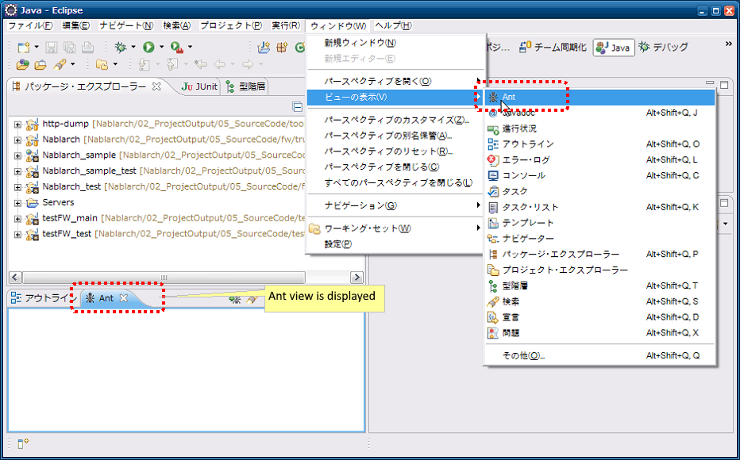

# マスタデータ投入ツール インストールガイド

**公式ドキュメント**: [マスタデータ投入ツール インストールガイド](https://nablarch.github.io/docs/LATEST/doc/development_tools/testing_framework/guide/development_guide/08_TestTools/02_MasterDataSetup/02_ConfigMasterDataSetupTool.html)

## インストール手順（前提事項・提供方法・プロパティ設定）

**前提条件**:
- Eclipse、Mavenがインストール済みであること
- [Nablarchのアーキタイプ](../../setup/blank-project/blank-project-blank_project.md) から生成されたプロジェクトであること
- テーブルが作成済みであること
- バックアップ用スキーマにテーブルが作成済みであること

本ツールはnablarch-testing-XXX.jarにて提供。ツール使用前に、プロジェクトのコンパイルと必要なjarファイルのダウンロードを行うために以下を実行する:

```text
mvn compile
mvn dependency:copy-dependencies -DoutputDirectory=lib
```

[master-data-setup-tool.zip](../../../knowledge/development-tools/testing-framework/assets/testing-framework-02_ConfigMasterDataSetupTool/master-data-setup-tool.zip) をプロジェクトのディレクトリ（pom.xmlが存在するディレクトリ）に展開する。含まれるファイル:

| ファイル名 | 説明 |
|---|---|
| tool/db/data/master_data-build.properties | 環境設定用プロパティファイル |
| tool/db/data/master_data-build.xml | Antビルドファイル |
| tool/db/data/master_data-log.properties | ログ出力プロパティファイル |
| tool/db/data/master_data-app-log.properties | ログ出力プロパティファイル |
| tool/db/data/MASTER_DATA.xlsx | マスタデータファイル |

本ツールを実行する前に以下のコマンドを実行する。

```text
mvn compile
mvn dependency:copy-dependencies -DoutputDirectory=lib
```

`master_data-build.properties` にマスタデータ自動復旧機能が使用するバックアップスキーマ名を設定する:

```bash
masterdata.test.backup-schema=nablarch_test_master
```

その他の設定値はディレクトリ構造が変わらない限り修正不要。

<details>
<summary>keywords</summary>

master_data-build.properties, masterdata.test.backup-schema, nablarch-testing, master-data-setup-tool, マスタデータ投入ツール, バックアップスキーマ設定, マスタデータセットアップ, Mavenビルド, 前提事項, Eclipse, Maven, インストール

</details>

## Antビュー起動

以下の設定をすることでEclipseから本ツールを起動できる。

EclipseのAntビューを起動: ツールバーから ウィンドウ(Window) → 設定(Show View) を選択してAntビューを開く。



<details>
<summary>keywords</summary>

Antビュー, Eclipse連携, Antビュー起動, Show View

</details>

## ビルドファイル登録

EclipseのAntビューにビルドファイルを登録する手順:

1. Antビューの＋印アイコンを押下し、ビルドスクリプトを選択


2. Antビルドファイル `master_data-build.xml` を選択


3. Antビューに登録したビルドファイルが表示されることを確認


<details>
<summary>keywords</summary>

Antビルドファイル, master_data-build.xml, ビルドファイル登録, Eclipse連携

</details>
