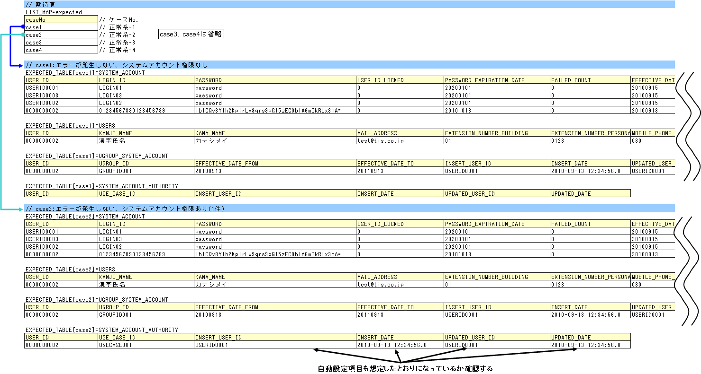

# Action/Componentのクラス単体テスト

**公式ドキュメント**: [Action/Componentのクラス単体テスト](https://nablarch.github.io/docs/LATEST/doc/development_tools/testing_framework/guide/development_guide/05_UnitTestGuide/01_ClassUnitTest/02_componentUnitTest.html)

## 

Action/ComponentのクラスのComponent単体テストを説明する。Action単体テストとの違いはテストクラス名のみ。

<details>
<summary>keywords</summary>

Component単体テスト, Action単体テスト, クラス単体テスト, テストクラス名の違い

</details>

## Action/Component単体テストの書き方

テストケースは以下の4パターンに分類し、パターンに応じてテストクラスとデータの作成方法が異なる:

| パターン | 当てはまる処理の例 |
|---|---|
| 戻り値(DBの検索結果)を確認 | 検索処理 |
| 戻り値(DB検索結果以外)を確認 | 計算、判定処理 |
| 処理終了後のDBの状況を確認 | 更新(挿入、削除含む)処理 |
| メッセージIDを確認 | エラー処理 |

DB挿入処理と2重登録時のエラー処理がある場合は、「処理終了後のDBの状況を確認」と「メッセージIDを確認」の2パターンに分類される。

<details>
<summary>keywords</summary>

テストケース実行パターン, テストケース分類, 検索処理, 更新処理, メッセージID確認

</details>

## テストデータの作成

- テストデータ(Excelファイル)はテストソースコードと同じディレクトリに同名で格納(拡張子のみ異なる)
- 全テストデータは同一Excelシートに記載する前提
- メッセージデータやコードマスタなどの静的マスタデータはプロジェクトで管理されたデータがあらかじめ投入されている前提とし、個別のテストデータとして作成しない

詳細: [../../06_TestFWGuide/01_Abstract](testing-framework-01_Abstract.md)、[../../06_TestFWGuide/02_DbAccessTest](testing-framework-02_DbAccessTest.md)

<details>
<summary>keywords</summary>

テストデータ格納場所, Excelファイル, 静的マスタデータ, テストデータ作成ルール

</details>

## テストクラスの作成

Component単体テストのテストクラス作成ルール:
1. パッケージはテスト対象のAction/Componentと同じ
2. クラス名は`<Action/Componentクラス名>Test`
3. `nablarch.test.core.db.DbAccessTestSupport`を継承

**クラス**: `nablarch.test.core.db.DbAccessTestSupport`

```java
package nablarch.sample.management.user;
// ...
public class UserComponentTest extends DbAccessTestSupport {
```

詳細: [../../06_TestFWGuide/02_DbAccessTest](testing-framework-02_DbAccessTest.md)

<details>
<summary>keywords</summary>

DbAccessTestSupport, テストクラス命名規則, テストクラス作成, クラス単体テスト継承クラス

</details>

## 事前準備データの作成処理

事前データ投入に使用するメソッド:
- `setThreadContextValues(sheetName, "threadContext")`: スレッドコンテキストの設定
- `setUpDb(sheetName)`: 事前データの投入。各テストケースごとに初期化するためループ内で実行

採番テーブル(ID_GENERATE)は事前に初期化すること。初期化しないとテスト実行時の採番結果が不定になり、挿入結果の検証ができなくなる。

```java
setThreadContextValues(sheetName, "threadContext");
// ...
setUpDb(sheetName); // 各ケースごとに初期化するためループ中で実行
```


<details>
<summary>keywords</summary>

setThreadContextValues, setUpDb, 事前データ投入, スレッドコンテキスト設定, 採番テーブル初期化

</details>

## 処理終了後のデータベースの状況を確認しなければならないもの

## 入力データの取得

`getListMap(sheetName, "dataName")`でExcelシートからデータを読み込む。配列型プロパティはIDをキーに別表のデータを取得して配列を構築し、エンティティのコンストラクタに渡す。


## トランザクションのコミット

> **重要**: クラス単体テストではフレームワークによるトランザクション制御は行われない。処理終了後のDBの状況を確認する場合は`commitTransactions()`を呼び出してコミットすること。コミットしない場合、テスト結果の確認が正常に行われない。参照系テストはコミット不要。

```java
target.registerUser(sysAcct, users, grpSysAcct);
commitTransactions();
```

## 想定結果の検証

`assertTableEquals(expectedGroupId, sheetName, expectedGroupId)`でDB内容を検証する。アプリケーションで設定する項目だけでなく、自動設定項目([database-common_bean](../../component/libraries/libraries-database.md) 参照)も想定結果を用意すること。グループIDを定義したデータ(expected)を用意し`assertTableEquals`の引数に渡すことで複数の想定結果に対応できる。



<details>
<summary>keywords</summary>

commitTransactions, assertTableEquals, getListMap, トランザクションコミット, DB検証

</details>

## メッセージIDを確認しなければならないもの

異常系テストデータは正常系と同一Excelシートに混載する。入力データのIDの末尾に"Err"を付加して識別する。

> **重要**: キャッチする例外は発生を想定する具体的な例外クラスを指定すること。`RuntimeException`などの上位例外クラスは使わないこと。メッセージIDは正しいが例外クラスが誤っているバグを検出できなくなる。

```java
try {
    target.registerUser(sysAcct, users, grpSysAcct);
    fail();
} catch (ApplicationException ae) {
    assertEquals(expected.get(i).get("messageId"), ae.getMessages().get(0).getMessageId());
}
```


<details>
<summary>keywords</summary>

ApplicationException, メッセージID検証, 異常系テスト, 例外クラス指定, エラー処理テスト

</details>
