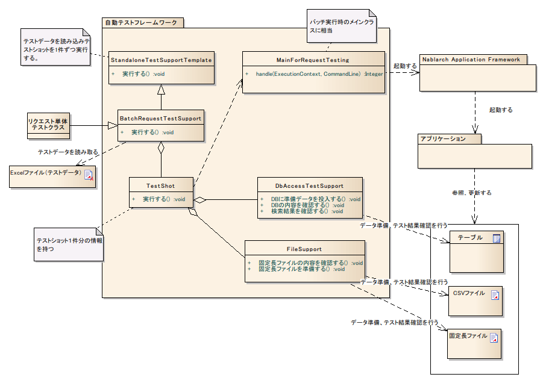

# リクエスト単体テスト（バッチ処理）

**公式ドキュメント**: [リクエスト単体テスト（バッチ処理）](https://nablarch.github.io/docs/LATEST/doc/development_tools/testing_framework/guide/development_guide/06_TestFWGuide/RequestUnitTest_batch.html)

## 全体像・主なクラスとリソース

リクエスト単体テスト（バッチ処理）では、実際にバッチをコマンドラインから起動したときの動作を擬似的に再現し、テストを行う。



| 名称 | 役割 | 作成単位 |
|---|---|---|
| リクエスト単体テストクラス | テストロジックを実装する。 | テスト対象クラス(Action)につき１つ作成 |
| Excelファイル（テストデータ） | テーブルに格納する準備データや期待する結果、入力ファイルなど、テストデータを記載する。 | テストクラスにつき１つ作成 |
| `StandaloneTestSupportTemplate` | バッチやメッセージング処理などコンテナ外で動作する処理のテスト実行環境を提供する。 | － |
| `BatchRequestTestSupport` | バッチリクエスト単体テストで必要となるテスト準備機能、各種アサートを提供する。 | － |
| `TestShot` | データシートに定義されたテストケース1件分の情報を格納するクラス。 | － |
| `MainForRequestTesting` | テスト用メインクラス。テスト実行時の差分を吸収する。 | － |
| `DbAccessTestSupport` | DB準備データ投入などデータベースを使用するテストに必要な機能を提供する。 | － |
| `FileSupport` | 入力ファイル作成などファイルを使用するテストに必要な機能を提供する。 | － |

<details>
<summary>keywords</summary>

バッチリクエスト単体テスト, 概要, クラス構成, 全体像, StandaloneTestSupportTemplate, BatchRequestTestSupport, TestShot, DbAccessTestSupport, FileSupport, MainForRequestTesting, リクエスト単体テストクラス, 作成単位, コマンドライン起動, 擬似再現

</details>

## StandaloneTestSupportTemplate

**クラス**: `StandaloneTestSupportTemplate`

バッチやメッセージング処理などコンテナ外で動作する処理のテスト実行環境を提供する。テストデータを読み取り、全`TestShot`を実行する。

<details>
<summary>keywords</summary>

StandaloneTestSupportTemplate, テスト実行環境, TestShot, コンテナ外処理, テストショット実行

</details>

## TestShot

**クラス**: `TestShot`

1テストショットの情報保持と実行を担う。テストショットは以下の要素で構成される:

1. 入力データの準備
2. メインクラス起動
3. 出力結果の確認

| 準備処理 | 結果確認 |
|---|---|
| データベースのセットアップ | データベース更新内容確認 |
| | ログ出力結果確認 |
| | ステータスコード確認 |

入力データ準備や結果確認ロジックはバッチや各種メッセージング処理ごとに異なるため、方式に応じたカスタマイズが可能。

<details>
<summary>keywords</summary>

TestShot, テストショット, 入力データ準備, メインクラス起動, データベースセットアップ, ログ出力結果確認, ステータスコード確認, カスタマイズ

</details>

## BatchRequestTestSupport

**クラス**: `BatchRequestTestSupport`

バッチ処理テスト用スーパークラス。アプリケーションプログラマは本クラスを継承してテストクラスを作成する。

`TestShot`が提供する準備処理・結果確認に以下を追加:

| 準備処理 | 結果確認 |
|---|---|
| 入力ファイルの作成 | 出力ファイルの内容確認 |

具体的な使用方法は [../05_UnitTestGuide/02_RequestUnitTest/batch](testing-framework-batch.md) を参照。

<details>
<summary>keywords</summary>

BatchRequestTestSupport, バッチ処理テスト, スーパークラス, 入力ファイル作成, 出力ファイル内容確認, テストクラス継承

</details>

## MainForRequestTesting

**クラス**: `MainForRequestTesting`

リクエスト単体テスト用メインクラス。本番用メインクラスとの主な差異:

- テスト用のコンポーネント設定ファイルからシステムリポジトリを初期化する
- 常駐化機能を無効化する

<details>
<summary>keywords</summary>

MainForRequestTesting, テスト用メインクラス, 常駐化無効化, システムリポジトリ初期化, テスト用コンポーネント設定

</details>

## FileSupport

**クラス**: `FileSupport`

ファイル操作を提供するクラス。バッチ処理以外（ファイルダウンロード等）でも使用可能な独立クラスとして提供。主な機能:

- テストデータから入力ファイルを作成する
- テストデータの期待値と実際に出力されたファイルの内容を比較する

<details>
<summary>keywords</summary>

FileSupport, ファイル操作, 入力ファイル作成, ファイル内容比較, 期待値検証

</details>

## DbAccessTestSupport

**クラス**: `DbAccessTestSupport`

DB準備データ投入などデータベースを使用するテストに必要な機能を提供する。

<details>
<summary>keywords</summary>

DbAccessTestSupport, データベーステスト, DB準備データ投入, データベース使用テスト

</details>

## 固定長ファイル

基本的な記述方法は :ref:`batch_request_test` を参照。

**パディング**: フィールド長に対してデータのバイト長が短い場合、フィールドのデータ型に応じたパディングが行われる。アルゴリズムはNablarch Application Framework本体と同様。

**バイナリデータの記述方法**: バイナリデータは16進数形式で記述する。例: `0x4AD` と記述した場合、`0x04AD` という2バイトのバイト配列に解釈される。

> **補足**: プレフィックス`0x`が付与されていない場合、そのデータを文字列とみなし、ディレクティブの文字コードでエンコードしてバイト配列に変換する。例: 文字コードがWindows-31Jのファイルでバイナリフィールドに`4AD`と記載した場合、`0x344144`という3バイトのバイト配列に変換される。

<details>
<summary>keywords</summary>

固定長ファイル, パディング, バイナリデータ, 16進数形式, 0x プレフィックス, 文字コードエンコード, batch_request_test

</details>

## 可変長ファイル

基本的な記述方法は :ref:`batch_request_test` を参照。

<details>
<summary>keywords</summary>

可変長ファイル, batch_request_test, テストデータ記述方法

</details>

## 常駐バッチのテスト用ハンドラ構成

常駐バッチのテスト実施時、プロダクション用ハンドラ構成をテスト用に変更する必要がある。変更しない場合、テスト対象の常駐バッチアプリケーションの処理が終わらないためテストが正常に実施できなくなる。

| 変更対象のハンドラ | 変更後のハンドラ | 変更理由 |
|---|---|---|
| `RequestThreadLoopHandler` | `OneShotLoopHandler` | `RequestThreadLoopHandler`でテストを実施するとバッチ実行が終わらずテストコードに制御が戻らなくなる。`OneShotLoopHandler`に差し替えることで、セットアップした要求データを全件処理後にバッチ実行が終了しテストコードに制御が戻る。 |

プロダクション用設定:
```xml
<component name="requestThreadLoopHandler" class="nablarch.fw.handler.RequestThreadLoopHandler">
  <!-- プロパティへの値設定は省略 -->
</component>
```

テスト用設定（プロダクション用設定と同名でコンポーネントを設定し上書き）:
```xml
<component name="requestThreadLoopHandler" class="nablarch.test.OneShotLoopHandler" />
```

<details>
<summary>keywords</summary>

常駐バッチ, RequestThreadLoopHandler, OneShotLoopHandler, ハンドラ構成変更, テスト用設定, コンポーネント設定上書き

</details>

## ディレクティブのデフォルト値

ファイルのディレクティブをコンポーネント設定ファイルにmap形式で記載することで、個々のテストデータでのディレクティブ記述を省略できる。ネーミングルール:

| 対象ファイル種別 | name属性 |
|---|---|
| 共通 | `defaultDirectives` |
| 固定長ファイル | `fixedLengthDirectives` |
| 可変長ファイル | `variableLengthDirectives` |

```xml
<!-- ディレクティブ（共通） -->
<map name="defaultDirectives">
  <entry key="text-encoding" value="Windows-31J" />
</map>

<!-- ディレクティブ（固定長） -->
<map name="variableLengthDirectives">
  <entry key="record-separator" value="NONE"/>
</map>

<!-- ディレクティブ（可変長） -->
<map name="variableLengthDirectives">
  <entry key="quoting-delimiter" value="" />
  <entry key="record-separator" value="CRLF"/>
</map>
```

<details>
<summary>keywords</summary>

ディレクティブ, defaultDirectives, fixedLengthDirectives, variableLengthDirectives, デフォルト値, コンポーネント設定ファイル

</details>
