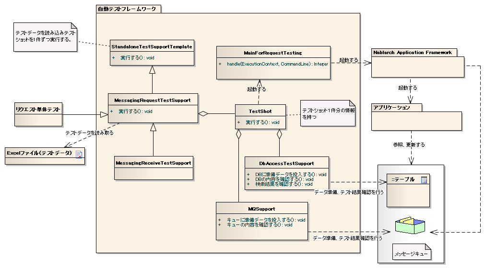

# リクエスト単体テスト（メッセージ受信処理）

**公式ドキュメント**: [リクエスト単体テスト（メッセージ受信処理）](https://nablarch.github.io/docs/LATEST/doc/development_tools/testing_framework/guide/development_guide/06_TestFWGuide/RequestUnitTest_real.html)

## 全体像

要求電文1件を受信したときの動作を擬似的に再現してテストを行う。

**主なクラス・リソース**

| 名称 | 役割 | 作成単位 |
|---|---|---|
| リクエスト単体テストクラス | テストロジックを実装する | テスト対象クラス(Action)につき1つ |
| Excelファイル（テストデータ） | テーブルに格納する準備データや期待する結果、入力ファイルなどテストデータを記載する | テストクラスにつき1つ |
| `StandaloneTestSupportTemplate` | バッチやメッセージング処理などコンテナ外で動作する処理のテスト実行環境を提供する | — |
| `MessagingRequestTestSupport` | 同期応答メッセージ受信処理のリクエスト単体テストで必要となるテスト準備機能・各種アサートを提供する | — |
| `MessagingReceiveTestSupport` | 応答不要メッセージ受信処理のリクエスト単体テストで必要となるテスト準備機能・各種アサートを提供する | — |
| `TestShot` | データシートに定義されたテストケース1件分の情報を格納するクラス | — |
| `MainForRequestTesting` | テスト用メインクラス。テスト実行時の差分を吸収する | — |
| `DbAccessTestSupport` | DB準備データ投入などデータベースを使用するテストに必要な機能を提供する | — |
| `MQSupport` | 電文作成などメッセージングのテストに必要な機能を提供する | — |
| `TestDataConvertor` | Excelから読み込んだテストデータを編集するためのインタフェース。データ種別ごとにアーキテクトが実装する | — |

keywords

リクエスト単体テスト, メッセージ受信処理, StandaloneTestSupportTemplate, MessagingRequestTestSupport, MessagingReceiveTestSupport, TestShot, MainForRequestTesting, DbAccessTestSupport, MQSupport, TestDataConvertor, テスト全体像

## StandaloneTestSupportTemplate

**クラス**: `StandaloneTestSupportTemplate`

バッチやメッセージング処理などコンテナ外で動作する処理のテスト実行環境を提供する。テストデータを読み取り、全`TestShot`を実行する。

keywords

StandaloneTestSupportTemplate, コンテナ外テスト実行環境, バッチテスト, メッセージングテスト, TestShot実行

## TestShot

**クラス**: `TestShot`

1テストショットの情報保持とテストショットを実行する。テストショットの要素:

1. 入力データの準備
2. メインクラス起動
3. 出力結果の確認

コンテナ外で動作する処理のテストにおける共通の準備処理・結果確認機能:

| 準備処理 | 結果確認 |
|---|---|
| データベースのセットアップ | データベース更新内容確認 |
| | ログ出力結果確認 |
| | ステータスコード確認 |

入力データ準備や結果確認ロジックはバッチや各種メッセージング処理ごとに異なるので、方式に応じたカスタマイズが可能となっている。

keywords

TestShot, テストショット, 入力データ準備, メインクラス起動, データベースセットアップ, ステータスコード確認, ログ出力結果確認, カスタマイズ

## MessagingRequestTestSupport

**クラス**: `MessagingRequestTestSupport`

同期応答メッセージ受信処理テスト用のスーパクラス。アプリケーションプログラマは本クラスを継承してテストクラスを作成する。

本クラスを使用することで、リクエスト単体テストのテストソース、テストデータを定型化でき、テストソース記述量を大きく削減できる。

`TestShot`が提供する準備処理・結果確認に加え、以下の機能を追加する:

| 準備処理 | 結果確認 |
|---|---|
| 要求電文の作成 | 応答電文の内容確認 |

> **補足**: 本クラスは入力データをキューにPUTする際、main側のコンポーネント設定ファイルを読み込む。`nablarch.fw.messaging.FwHeaderDefinition`実装クラスは`fwHeaderDefinition`という名前で登録されていなければならない。別の名称を使用する場合は、`getFwHeaderDefinitionName()`をオーバライドすることで本クラスが使用するFwHeaderDefinitionコンポーネント名を変更できる。

keywords

MessagingRequestTestSupport, 同期応答メッセージ受信処理, 要求電文作成, 応答電文確認, FwHeaderDefinition, fwHeaderDefinition, getFwHeaderDefinitionName

## MessagingReceiveTestSupport

**クラス**: `MessagingReceiveTestSupport`

応答不要メッセージ処理テスト用のスーパクラス。アプリケーションプログラマは本クラスを継承してテストクラスを作成する。

本クラスを使用することで、リクエスト単体テストのテストソース、テストデータを定型化でき、テストソース記述量を大きく削減できる。

`TestShot`が提供する準備処理に加え、以下の機能を追加する:

| 準備処理 |
|---|
| 要求電文の作成 |

keywords

MessagingReceiveTestSupport, 応答不要メッセージ処理, 要求電文作成, テストスーパクラス

## MainForRequestTesting

**クラス**: `MainForRequestTesting`

リクエスト単体テスト用のメインクラス。本番用メインクラスとの差異:

- テスト用のコンポーネント設定ファイルからシステムリポジトリを初期化する
- 常駐化機能を無効化する

keywords

MainForRequestTesting, テスト用メインクラス, 常駐化無効化, テスト用コンポーネント設定ファイル

## MQSupport

**クラス**: `MQSupport`

メッセージに関する操作を提供するクラス。主な機能:

- テストデータから要求電文を作成し、受信キューにPUTする
- 応答電文を送信キューからGETし、テストデータの期待値と内容を比較する

keywords

MQSupport, 受信キューPUT, 送信キューGET, 要求電文作成, 応答電文比較

## TestDataConvertor

**クラス**: `TestDataConvertor`（インタフェース）

Excelから読み込んだテストデータを編集するためのインタフェース。XMLやJSONなどデータ種別ごとにアーキテクトが実装する。

実装クラスで実装する機能:
- Excelから読み込んだデータに対して任意で編集する
- 編集したデータを読み込むためのレイアウト定義データを動的に生成する

本インタフェースを実装することで、例えばExcelに日本語で記述されたデータをURLエンコーディングする等の処理を追加可能である。

実装クラスは `"TestDataConverter_<データ種別>"` というキー名でテスト用のコンポーネント設定ファイルに登録する必要がある。

keywords

TestDataConvertor, TestDataConverter_, テストデータ変換, レイアウト定義データ動的生成, コンポーネント設定ファイル登録, URLエンコーディング

## メッセージ

メッセージング処理固有のテストデータ（メッセージ）の記述方法は [../05_UnitTestGuide/02_RequestUnitTest/real](testing-framework-real.md) を参照。

> **補足**: パディングおよびバイナリデータの扱いは :ref:`about_fixed_length_file` と同様である。

keywords

メッセージング固有テストデータ, パディング, バイナリデータ, about_fixed_length_file

