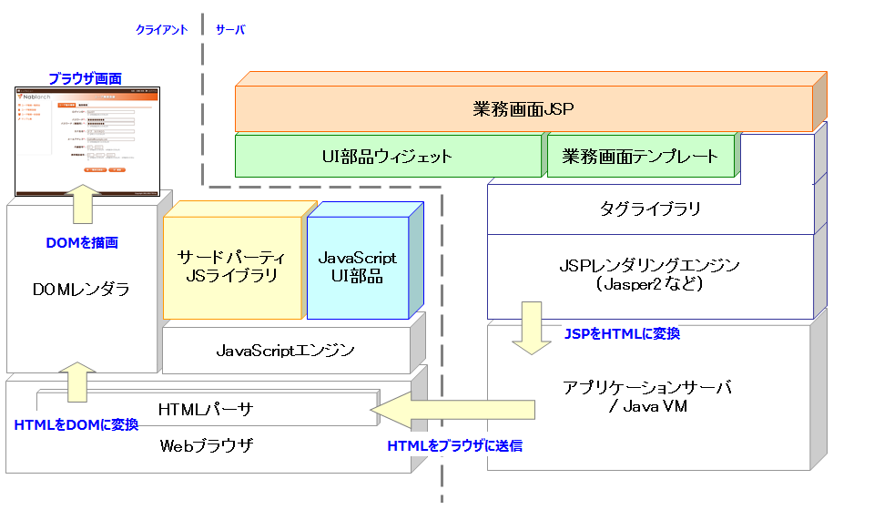
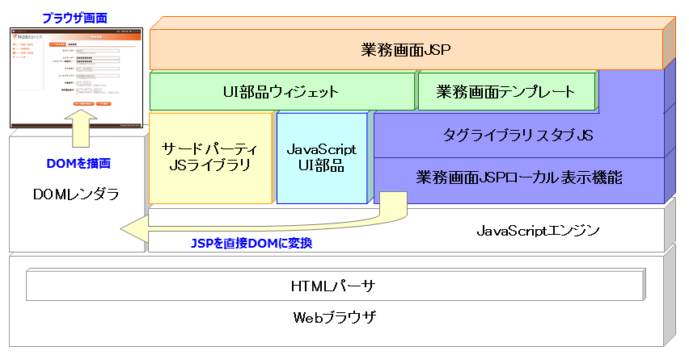

# 全体構造

本節では業務機能JSPから使用する以下の各機能の構造について述べる。

[業務画面テンプレート](../../development-tools/testing-framework/testing-framework-jsp-page-templates.md)
業務画面の内容のうち、業務機能領域を除く各共通領域の描画やHTMLヘッダ等の各種宣言について、
**UI標準** に準拠した形で実装するJSPタグファイルおよびインクルードファイル群。
[UI部品ウィジェット](../../development-tools/testing-framework/testing-framework-jsp-widgets.md)
ボタンや検索結果テーブル、各種入力フィールドといった業務画面内に配置するUI部品について、
**UI標準** に準拠した形で実装するJSPタグファイル群。
[CSSフレームワーク](../../development-tools/testing-framework/testing-framework-css-framework.md)
[業務画面テンプレート](../../development-tools/testing-framework/testing-framework-jsp-page-templates.md) および [UI部品ウィジェット](../../development-tools/testing-framework/testing-framework-jsp-widgets.md) などの共通部品に対し
**UI標準** に沿った統一的な外観を与える共通スタイル定義。
また、デバイスサイズに応じた動的な表示調整を行う。
[JavaScript UI部品](../../development-tools/testing-framework/testing-framework-js-framework.md)
**UI標準** の内容のうち、カレンダー日付入力部品のような、
通常のHTMLの範疇では実現できないUI機能を実装するために、 [UI部品ウィジェット](../../development-tools/testing-framework/testing-framework-jsp-widgets.md)
が使用する JavaScript部品群である。
[業務画面JSPローカル表示機能](../../development-tools/testing-framework/testing-framework-inbrowser-jsp-rendering.md)
業務画面のJSPソースファイルをJavaScriptでレンダリングすることにより
[業務画面テンプレート](../../development-tools/testing-framework/testing-framework-jsp-page-templates.md) および [UI部品ウィジェット](../../development-tools/testing-framework/testing-framework-jsp-widgets.md) を用いて作成した
ローカルディスク上のJSPファイルを通常のブラウザで直接開けるようにする仕組みである。
これにより設計中の画面のイメージや動作デモを簡単に確認することができる。

## 本番環境での外部ライブラリへの依存

上記機能の実装において、本番環境で下記の外部ライブラリを使用している。

| ライブラリ名 | 類別 | 用途 | ライセンス |
|---|---|---|---|
| require.js | JavaScript | JavaScriptの分割モジュール管理 | MIT |
| sugar.js | JavaScript | ECMAScript5互換関数を含むユーティリティAPI群の提供 | ライセンスフリー |
| jQuery | JavaScript | DOM関連APIの簡易化およびブラウザ互換レイヤの提供 | MIT |
| font-awesome | css/webフォント | 各種アイコン画像の提供 | MIT,SIL OFL 1.1 |

なお、これらのライブラリを業務画面JSPから直接使用することは想定していない。

## サーバ動作時の構成

以下の図は、サーバ上の業務画面JSPをブラウザ上に表示する際、これらの機能がどのように
使用されるかを表す構成図である。
( [CSSフレームワーク](../../development-tools/testing-framework/testing-framework-css-framework.md) はこの図には記述していない。)

以下は、上図の依存関係を詳しく解説したものである。

| モジュール | 依存対象 | 詳細 |
|---|---|---|
| **業務画面JSP** | UI部品ウィジェット 業務画面テンプレート タグライブラリ | UI標準の画面構成のうち業務機能領域を除く共通領域は [業務画面テンプレート](../../development-tools/testing-framework/testing-framework-jsp-page-templates.md) を使用して描画する。 業務画面領域内のUI要素の描画には [UI部品ウィジェット](../../development-tools/testing-framework/testing-framework-jsp-widgets.md) を使用する。 業務画面JSPから直接使用するタグライブラリは以下のものに限る。  **変数管理・フロー制御に関するタグ** **<n:write>** / **<n:set>** / **<c:if>** / **<n:forInputPage>** など **ページ遷移制御に関するタグ** **<n:form>** / **<n:param>** など  また、JavaScriptを業務画面JSPに直接記述することはせず、 [UI部品ウィジェット](../../development-tools/testing-framework/testing-framework-jsp-widgets.md) を通じて使用する。 |
| [業務画面テンプレート](../../development-tools/testing-framework/testing-framework-jsp-page-templates.md) | UI部品ウィジェット タグライブラリ | 基本的に業務画面JSPと同等の扱いとなる。 ただし、HTMLのヘッドタグなどを記述するために **<n:script>** **<n:nocache>** などのタグライブラリを使用する。 |
| [UI部品ウィジェット](../../development-tools/testing-framework/testing-framework-jsp-widgets.md) | JavaScript UI部品 タグライブラリ | 各種のタグライブラリ及びHTMLにより記述される。 HTMLのみで実現できないクライアントのUIについては **JavaScript UI部品** に依存する。 [UI部品ウィジェット](../../development-tools/testing-framework/testing-framework-jsp-widgets.md) が出力するHTMLとクライアント側の [JavaScript UI部品](../../development-tools/testing-framework/testing-framework-js-framework.md) との紐付けは **マーカーCSS** によって行うため、 [UI部品ウィジェット](../../development-tools/testing-framework/testing-framework-jsp-widgets.md) が直接JavaScriptを使用することは無い。 (詳細は [JavaScript UI部品](../../development-tools/testing-framework/testing-framework-js-framework.md) の項を参照すること。) |
| [JavaScript UI部品](../../development-tools/testing-framework/testing-framework-js-framework.md) | サードパーティJS | 標準のJavaScript(ECMA)および、DOM APIに加えて上述した **サードパーティJSライブラリ** を使用する。 |

## ローカル動作時の構成

ローカルデモ動作では、 web_project/ui_demo/ローカル画面確認.bat で起動されるHTTPサーバで
業務画面JSPを表示することで、JavaScript上でJSPタグをレンダリングして表示できる。

以下の図はローカルデモ動作におけるアーキテクチャ構成を表した図である。

この図と、先のサーバ動作での構成図とを比較した場合、
ローカルデモ動作では全てブラウザ上で動作するという点を除けば、以下の構成は全く同じであることがわかる。

* 業務画面JSP
* [業務画面テンプレート](../../development-tools/testing-framework/testing-framework-jsp-page-templates.md)
* [UI部品ウィジェット](../../development-tools/testing-framework/testing-framework-jsp-widgets.md)
* [JavaScript UI部品](../../development-tools/testing-framework/testing-framework-js-framework.md)
* サードパーティJSライブラリ

両者で異なるのは、JSPの解釈(HTMLへの変換)を担う部分である。
サーバ動作時ではJSPの解釈は **タグライブラリ** およびアプリケーションサーバ上の
**JSPレンダリングエンジン** が行っているが、ローカル動作ではこの処理を [業務画面JSPローカル表示機能](../../development-tools/testing-framework/testing-framework-inbrowser-jsp-rendering.md) および
そこから呼び出される **タグライブラリ スタブJS** が代替する。

**タグライブラリ スタブJS** は [業務画面JSPローカル表示機能](../../development-tools/testing-framework/testing-framework-inbrowser-jsp-rendering.md) 機能の一部であり、
JSPタグライブラリの挙動についてブラウザ上で一定のエミュレーションを行う機能である。
サポートするタグライブラリの一覧および、エミュレーション処理の内容については [UI部品ウィジェット一覧](../../development-tools/testing-framework/testing-framework-ui-dev-doc-reference-jsp-widgets.md) を参照すること。
