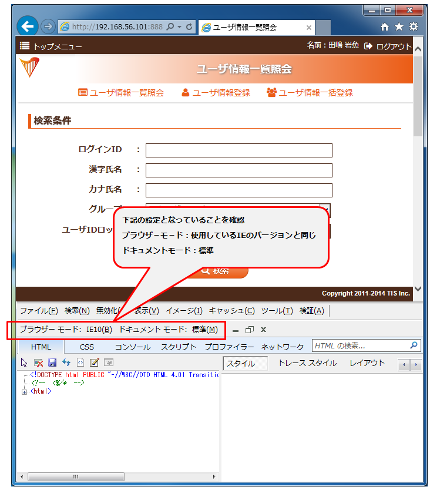
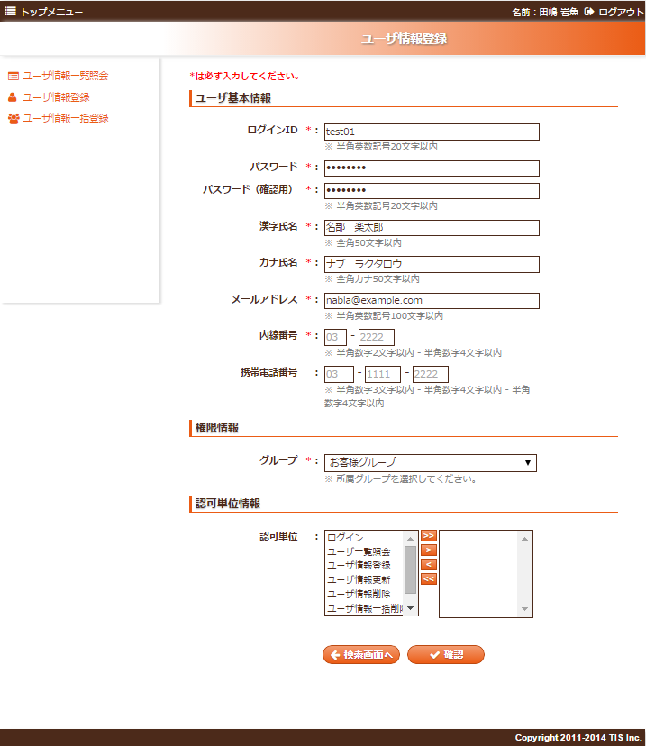
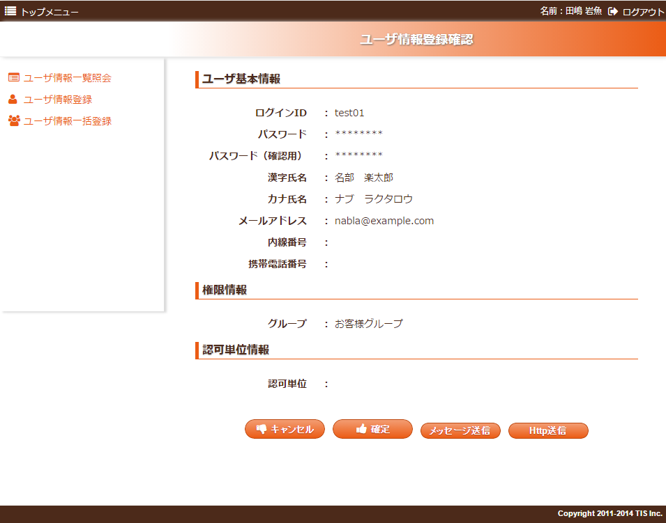
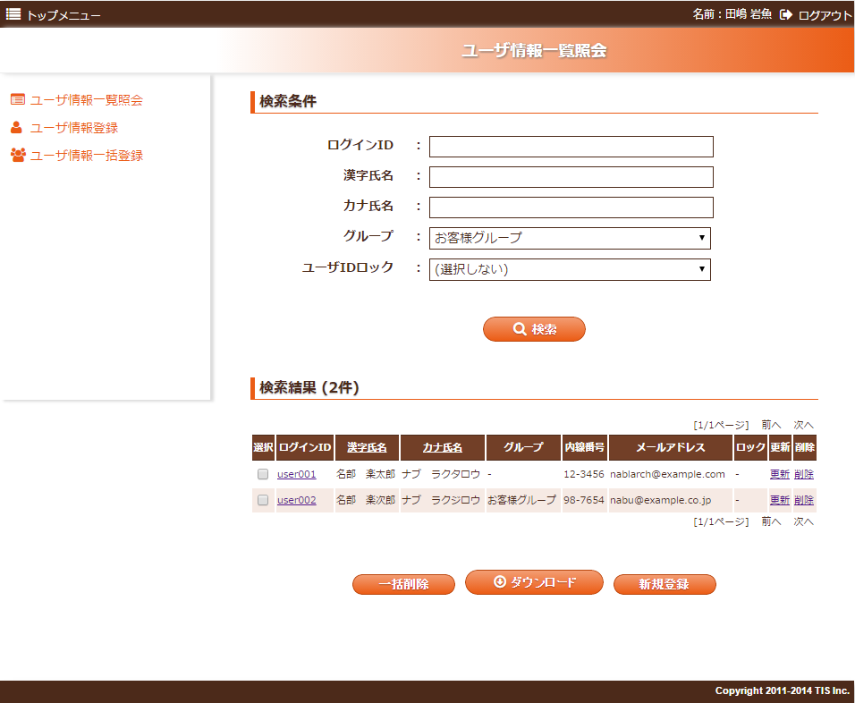
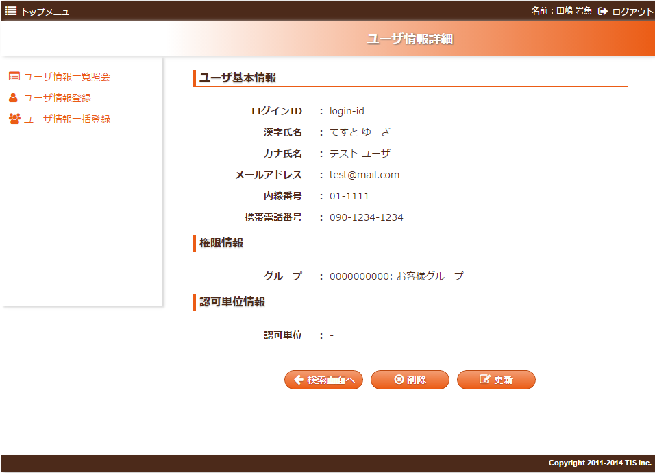

# 業務画面テンプレートとUI部品を使用して業務画面JSPを作成する

**公式ドキュメント**: [業務画面テンプレートとUI部品を使用して業務画面JSPを作成する](https://nablarch.github.io/docs/LATEST/doc/development_tools/ui_dev/guide/widget_usage/create_with_widget.html)

## 画面のテンプレートを用意する

業務画面JSPに業務画面テンプレート・UI部品を使用するための必須記述内容:

1. **DOCTYPE宣言**:
```html
<!DOCTYPE HTML PUBLIC "-//W3C//DTD HTML 4.01 Transitional//EN" "http://www.w3.org/TR/html4/loose.dtd">
```

2. **ローカルJSPレンダリング機能スクリプトタグ**（本番稼働時はコメントアウトすること）:
```jsp
<!-- <%/* --> <script src="js/devtool.js"></script><meta charset="utf-8"><body> <!-- */%> -->
```

3. **JSPディレクティブ**:
```jsp
<%@page language="java" contentType="text/html; charset=UTF-8" pageEncoding="UTF-8" %>
```

4. **タグライブラリ宣言**:

| prefix | tagdir/uri | 提供されるUI部品 |
|---|---|---|
| `t` | `/WEB-INF/tags/template` | 業務画面テンプレート |
| `field` | `/WEB-INF/tags/widget/field` | 入力項目・表示項目 |
| `button` | `/WEB-INF/tags/widget/button` | ボタン |
| `table` | `/WEB-INF/tags/widget/table` | 検索結果等テーブル表示 |
| `column` | `/WEB-INF/tags/widget/column` | 表の列 |
| `tab` | `/WEB-INF/tags/widget/tab` | タブ形式 |
| `link` | `/WEB-INF/tags/widget/link` | リンク |
| `spec` | `/WEB-INF/tags/widget/spec` | 画面状態設計情報（[spec_condition_widget](testing-framework-spec_condition.md) 参照） |
| `n` | `http://tis.co.jp/nablarch` | Nablarchタグライブラリ（`nablarch.jar`同梱） |

5. **業務画面テンプレートの使用** (`t:テンプレート名`):
```jsp
<t:page_template
    title="画面タイトル"
    confirmationPageTitle="確認画面タイトル（入力・確認画面でJSPを共用しない場合は不要）">
  <jsp:attribute name="contentHtml">
      <%-- 業務領域 --%>
  </jsp:attribute>
</t:page_template>
```

サンプルファイル: [このファイル](../../../knowledge/development-tools/testing-framework/assets/testing-framework-create_with_widget/sample_template.jsp)

<details>
<summary>keywords</summary>

JSPテンプレート作成, taglibディレクティブ, 業務画面テンプレート, DOCTYPE宣言, page_template, tagdir, ローカルJSPレンダリング, taglib宣言

</details>

## 画面をブラウザで表示する

作成した業務画面JSPは業務JSP作成用プロジェクトのサブシステムIDのディレクトリ配下に配置する（[project_structure](testing-framework-project_structure.md) 参照）。ローカル画面確認.batを実行すると作成した画面に遷移してレイアウト確認が可能。

> **重要**: IEを使用する場合は開発者ツールで以下の設定を確認すること。
> - **ブラウザモード**: 使用しているIEのバージョンと同じ
> - **ドキュメントモード**: 標準
>
> 開発者ツールを開いた状態では画面表示が崩れる場合があるため、設定確認後はツールを閉じること。



<details>
<summary>keywords</summary>

ブラウザ表示確認, IE設定, ローカル画面確認, ブラウザモード, ドキュメントモード, project_structure

</details>

## UI部品（ウィジェット）を配置していく

業務画面テンプレートのJSPにウィジェットをタグ形式で記述して配置する。具体的なウィジェット使用方法は [example](#s7) を参照。

> **重要**: ウィジェットは自己終了エレメントとして記述しないこと。自己終了エレメントとして記述すると、そのタグ以降の内容がブラウザで表示されなくなる。
>
> OK（正しい記述）:
> ```jsp
> <field:label title="ログインID" sample="login-id"></field:label>
> ```
>
> NG（自己終了エレメント）:
> ```jsp
> <field:label title="ログインID" sample="login-id" />
> ```

<details>
<summary>keywords</summary>

ウィジェット配置, 自己終了エレメント, field:label, JSPウィジェット記述

</details>

## ウィジェットに定義されている属性について

**name属性**:
- PG・UT工程で定義するため設計段階では空で定義可
- ローカル表示でname属性が必要なウィジェットが一部あるため各ウィジェットのガイドを確認
- 設計時に物理名の設定が困難な場合は項目論理名を指定（PG担当者が実装開始時に物理名へ変換必要）

**sample属性**:
- ブラウザ表示時のダミー値を設定
- 複数値は `|` 区切りで記載（プルダウン・チェックボックス・ラジオボタン・テーブル等）
- `[]` で囲んだ値は初期表示時の選択状態になる
- sample属性未指定時: `codeId`・`pattern`・`optionColumnName`属性値を元に `js/devtool/resource/コード値定義.js` からコード名称を取得

**key属性**（`<column:label>` 等）:
- レコードセットのキー名を指定する属性。PG・UT工程で決定するため設計段階では指定不要
- key属性未指定かつsample属性が未指定または空文字の場合、別項目のsample値が表示される問題あり → keyに適当な文字列を指定するか、sampleにスペース文字を指定

**domain属性**:
- 画面項目定義出力のためにドメイン物理名を記載
- `field:label`・`column:label`・`column:link` ではHTMLのclass属性にドメイン物理名を出力し表示レイアウトを制御
- デフォルト動作: `Number`ドメインが指定された項目は右寄せ表示

**dataFrom属性**:
- 表示データ取得元を `表示情報取得元.表示項目名` の形式で記載

**hint属性**:
- 指定した文言が項目に対する備考として表示

設計段階で決定できない必須属性は空で定義しておけばよい。

<details>
<summary>keywords</summary>

name属性, sample属性, key属性, domain属性, dataFrom属性, hint属性, column:label, field:label, column:link, コード値定義, codeId, pattern, optionColumnName

</details>

## 画面遷移について

buttonウィジェットの `dummyUri` 属性を使用して、JSPをブラウザで直接開いた場合のボタンクリック時の遷移先JSPを指定できる。

- 顧客への説明をより容易にするための属性であり、条件によって遷移先を変えるなど実際の遷移の忠実な再現はできない
- 実際の遷移はPG・UT工程で実装される
- 不要な場合は `dummyUri` 属性の指定は不要

<details>
<summary>keywords</summary>

dummyUri, 画面遷移, buttonウィジェット, 紙芝居, 遷移先JSP

</details>

## ウィジェットの作成について

「住所」「電話番号」「氏名」など典型的で複数画面で使用されうる項目については、内線番号ウィジェット（`field:text`ウィジェットの組み合わせで作成）のように各プロジェクトでカスタムウィジェットを作成することを推奨。

作成方法の詳細はUI開発基盤用プロジェクトテンプレートの内線番号ウィジェットの実装を参照。

<details>
<summary>keywords</summary>

カスタムウィジェット作成, field:text, 内線番号ウィジェット, 共通ウィジェット

</details>

## 入力画面と確認画面の共用

`field`ウィジェットの入力項目は入力画面と確認画面で自動的に切り替わる（入力画面: テキストボックス、確認画面: 表示のみ）。

入力画面と確認画面を同一JSPで共用する場合、確認画面は以下のように作成:
```jsp
<!DOCTYPE html>
<!-- <%/* --> <script src="js/devtool.js"></script><meta charset="utf-8"><body> <!-- */%> -->
<%@ taglib prefix="n" uri="http://tis.co.jp/nablarch" %>
<n:confirmationPage path="./W11AC0201.jsp" />
```

入力画面と確認画面で異なる項目を表示する場合:
- 入力画面専用項目: `<n:forInputPage>` で囲む
- 確認画面専用項目: `<n:forConfirmationPage>` で囲む

<details>
<summary>keywords</summary>

入力画面確認画面共用, n:confirmationPage, n:forInputPage, n:forConfirmationPage, confirmationPage

</details>

## 業務画面JSPの例

業務画面JSPの作成例:

- [入力画面](#)
- [確認画面](#)
- [検索・一覧画面](#)
- [詳細画面](#)

<details>
<summary>keywords</summary>

業務画面JSP例, 入力画面, 確認画面, 一覧検索画面, 詳細画面

</details>

## 入力画面

入力画面サンプル: [W11AC0201.jsp](../../../knowledge/development-tools/testing-framework/assets/testing-framework-create_with_widget/W11AC0201.jsp)



<details>
<summary>keywords</summary>

入力画面サンプル, W11AC0201.jsp, 入力画面JSP例

</details>

## 確認画面

確認画面サンプル: [W11AC0202.jsp](../../../knowledge/development-tools/testing-framework/assets/testing-framework-create_with_widget/W11AC0202.jsp)



<details>
<summary>keywords</summary>

確認画面サンプル, W11AC0202.jsp, 確認画面JSP例

</details>

## 一覧・検索画面

一覧・検索画面サンプル: [W11AC0101.jsp](../../../knowledge/development-tools/testing-framework/assets/testing-framework-create_with_widget/W11AC0101.jsp)



<details>
<summary>keywords</summary>

一覧検索画面サンプル, W11AC0101.jsp, 一覧画面JSP例

</details>

## 詳細画面

詳細画面サンプル: [W11AC0102.jsp](../../../knowledge/development-tools/testing-framework/assets/testing-framework-create_with_widget/W11AC0102.jsp)



<details>
<summary>keywords</summary>

詳細画面サンプル, W11AC0102.jsp, 詳細画面JSP例

</details>
