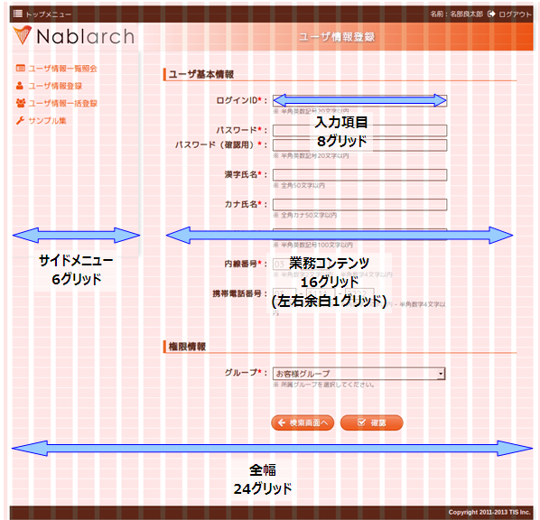

# CSSフレームワーク

**公式ドキュメント**: [CSSフレームワーク](https://nablarch.github.io/docs/LATEST/doc/development_tools/ui_dev/doc/internals/css_framework.html)

## 概要

**CSSフレームワーク**は**UI標準**に定義されたレイアウト・デザインを実装するスタイルシート群。

<details>
<summary>keywords</summary>

CSSフレームワーク, UI標準, スタイルシート, レイアウト

</details>

## 表示モード切替え

CSS Media Queryを用いて以下の3つのCSSファイルを動的に切り替えることで、UI標準「2.1 端末の画面サイズと表示モード」を実現する：

- `wide.css`（ワイド表示用）
- `compact.css`（コンパクト表示用）
- `narrow.css`（ナロー表示用）

<details>
<summary>keywords</summary>

CSS Media Query, wide.css, compact.css, narrow.css, 表示モード, ワイド表示, コンパクト表示, ナロー表示

</details>

## ファイル構成

- CSSファイルはすべてLESSファイル形式で記述する
- LESS→CSSへのコンパイルとファイル結合は [executing_ui_build](testing-framework-initial_setup.md) で実行。詳細は [ui_genless](testing-framework-plugin_build.md) を参照
- コンパイル済みCSSファイルは `/css/built/` 配下に配置され、各画面から外部参照される
- linkタグは `/WEB-INF/tags/device/media.tag`（`/WEB-INF/include/html_head.jsp` から使用）に定義

```jsp
<%@tag pageEncoding="UTF-8" description="表示モードによってスタイルを読み込むウィジェット" %>
<%@taglib prefix="n" uri="http://tis.co.jp/nablarch" %>
<%@taglib prefix="c" uri="http://java.sun.com/jsp/jstl/core" %>

<%-- (本番用) --%>
<!--[if lte IE 8]>
<n:link rel="stylesheet" type="text/css" href="/css/built/wide-minify.css" />
<![endif]-->
<!--[if gte IE 9]>
<n:link rel="stylesheet" type="text/css" href="/css/built/wide-minify.css" media="screen and (min-width: 980px)" />
<n:link rel="stylesheet" type="text/css" href="/css/built/compact-minify.css" media="screen and (min-width: 640px) and (max-width: 979px)" />
<n:link rel="stylesheet" type="text/css" href="/css/built/narrow-minify.css" media="screen and (max-width: 639px)" />
<![endif]-->
<!--[if !IE]> -->
<n:link rel="stylesheet" type="text/css" href="/css/built/wide-minify.css" media="screen and (min-width: 980px)" />
<n:link rel="stylesheet" type="text/css" href="/css/built/compact-minify.css" media="screen and (min-width: 640px) and (max-width: 979px) and (orientation: portrait)" />
<n:link rel="stylesheet" type="text/css" href="/css/built/compact-minify.css" media="screen and (min-width: 640px) and (max-width: 979px) and (max-height: 979px) and (orientation: landscape)" />
<n:link rel="stylesheet" type="text/css" href="/css/built/narrow-minify.css" media="screen and (max-width: 639px)" />
<n:link rel="stylesheet" type="text/css" href="/css/built/wide-minify.css" media="screen and (device-width: 768px) and (device-height: 1024px) and (orientation:landscape)" />
<!-- <![endif]-->
```

> **注意**: IE8以下はCSS Media Queryをサポートしないため、IEコンディショナルコメントを使用して常にワイドモードで表示する。

<details>
<summary>keywords</summary>

LESS, /css/built/, media.tag, executing_ui_build, ui_genless, CSSコンパイル, IE8

</details>

## 構成ファイル一覧

動作環境の列定義：
- **サーバ**: 実働環境にデプロイして使用するかどうか
- **ローカル**: ローカル動作時に使用するかどうか

動作環境の凡例：
- ○: 使用する
- △: 直接は使用しないがミニファイしたファイルの一部として使用する
- ×: 使用しない

> **補足**: 未ミニファイCSSファイルとミニファイ済みCSSファイルの違いはコメントの有無のみ。開発中からミニファイ済みファイルを使用しても開発効率を落とさないため、常にミニファイ済みファイルを使用し、未ミニファイファイルは使用しない。

<details>
<summary>keywords</summary>

動作環境, ミニファイ, minify, サーバ, ローカル

</details>

## ビルド済みCSSファイル

| 名称 | ローカル | サーバ | パス | 内容 |
|---|---|---|---|---|
| ワイドモードスタイル（ミニファイ済み） | ○ | ○ | `/css/built/wide-minify.css` | ワイドモード時に使用するミニファイ済みCSSファイル |
| ワイドモードスタイル（未ミニファイ） | × | × | `/css/built/wide.css` | コンパイル済み/未ミニファイのもの（使用しない） |
| コンパクトモードスタイル（ミニファイ済み） | ○ | ○ | `/css/built/compact-minify.css` | コンパクトモード時に使用するミニファイ済みCSSファイル |
| コンパクトモードスタイル（未ミニファイ） | × | × | `/css/built/compact.css` | コンパイル済み/未ミニファイのもの（使用しない） |
| ナローモードスタイル（ミニファイ済み） | ○ | ○ | `/css/built/narrow-minify.css` | ナローモード時に使用するミニファイ済みCSSファイル |
| ナローモードスタイル（未ミニファイ） | × | × | `/css/built/narrow.css` | コンパイル済み/未ミニファイのもの（使用しない） |

<details>
<summary>keywords</summary>

wide-minify.css, compact-minify.css, narrow-minify.css, wide.css, compact.css, narrow.css, ビルド済みCSS, ワイドモード, コンパクトモード, ナローモード, 未ミニファイ

</details>

## LESSファイル

LESSファイルはすべてローカル・サーバともに△（直接使用せず、ミニファイファイルの一部として使用）。

| 名称 | パス | 内容 |
|---|---|---|
| CSS3互換ルール | `/css/core/css3.less` | ブラウザ間で仕様の異なるスタイルを単一記述で対応するルール |
| デフォルトスタイルリセット | `/css/core/reset.less` | ブラウザ間で仕様の異なるデフォルトスタイルをすべてリセット |
| グリッドレイアウトシステム | `/css/core/grid.less` | グリッドレイアウトを実装する基本ルール群 |
| 基本スタイル定義 | `/css/style/base.less` | htmlの各タグのスタイル定義を標準化 |
| 業務画面領域スタイル定義 | `/css/template/*.less` | UI標準の各業務画面領域のスタイル定義。表示モード別（base-wide.less、base-compact.less、base-narrow.less等）も提供 |
| UI部品ウィジェットスタイル | `/css/button/*.less`、`/css/field/*.less`、`/css/box/*.less`、`/css/table/*.less`、`/css/column/*.less` | 各UI部品ウィジェットのスタイル定義。表示モード別定義も提供 |
| JavaScript UI部品スタイル | `/css/ui/*.less` | 各JavaScript UI部品のスタイル定義 |

<details>
<summary>keywords</summary>

css3.less, reset.less, grid.less, base.less, LESSファイル, ブラウザ互換, スタイルリセット

</details>

## グリッドベースレイアウト

ワイド表示モードの業務画面は横幅965pxを24グリッドに分割。業務画面内のすべてのオブジェクトは原則としてグリッドを使用して配置する。



<details>
<summary>keywords</summary>

グリッドベースレイアウト, 24グリッド, 965px, グリッドレイアウト, 業務画面レイアウト

</details>

## グリッドレイアウトフレームワークの使用方法

グリッドレイアウトに使用するCSSクラス：

| クラス名 | 用途 |
|---|---|
| `.grid-row` | グリッドの横列を定義するブロック要素に指定。ページ全幅分の領域を固定確保するため、業務コンテンツ部など全幅より狭い領域で使用すると横スクロールバーが表示される原因となる |
| `.content-row` | 業務コンテンツ部での横列を定義するブロック要素に指定 |
| `.grid-col-(横幅)` | グリッドの横列内のコンテンツに指定。(横幅)にはグリッド数を指定 |
| `.grid-offset-(左余白)` | グリッドの横列内のコンテンツに指定。(左余白)には左側余白のグリッド数を指定 |

> **補足**: 通常は [../internals/jsp_widgets](testing-framework-jsp_widgets.md) を使用して実装するため、直接グリッドクラスを記述することはない。


実装例（JSP）：

```jsp
<div class="content-row">
  <label class="grid-col-5">ログインID：</label>
  <n:text name="11AC_W11AC01.loginId" size="25" maxlength="20" cssClass="grid-col-8" />
</div>
<div class="content-row">
  <label class="grid-col-5">パスワード：</label>
  <n:password name="11AC_W11AC01.kanjiName" size="25" maxlength="20" cssClass="grid-col-8" />
  <n:error name="11AC_W11AC01.kanjiName"/>
</div>
```

<details>
<summary>keywords</summary>

grid-row, content-row, grid-col, grid-offset, グリッドCSSクラス, コンテンツ配置

</details>

## アイコンの使用

`<i>` タグに `fa` クラスと `fa-` で始まるアイコン名クラスを指定してアイコンを表示できる。アイコンは画像ではなくフォントとして実装されており、サイズ・色・配置を通常の文字と同様に調整できる。

```html
<h3>
  <i class="fa fa-bar-chart-o"></i> 統計表示
</h3>
```

使用可能なアイコン一覧: [Font Awesome Icons](https://fontawesome.com/v5/search)

<details>
<summary>keywords</summary>

FontAwesome, fa, アイコン, iタグ, フォントアイコン

</details>
