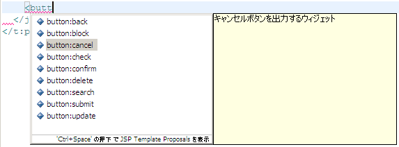
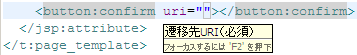

# 統合開発環境を使用して業務画面JSPを作成する

統合開発環境(以下、IDE)を使用して業務画面JSPを作成することで、IDEの持つ補完機能やドキュメント参照機能を使用して効率よく開発できる。

Nablarchでは、標準の開発環境として、 [Eclipse](https://www.eclipse.org/) を提供している。以下に、Nablarchで提供している開発環境での業務画面JSP作成のイメージを示す。

※記載してあるショートカットは、標準から変更していない場合のショートカット。

## 統合開発環境の補完機能を使用する

画面部品を表すタグを途中まで入力し `C-SPC` を押下すると、以下の図のように、使用できるタグのうち、途中まで入力してある文字にマッチするものが表示される。

また、 [UI部品の実装サンプルで提供しているEclipse補完テンプレート](../../development-tools/testing-framework/testing-framework-template-list.md#eclipse-template) を導入することで、テンプレートを使用した補完も行えるようになる。

## 統合開発環境のドキュメント参照機能を使用する

タグのタグ名や属性にマウスカーソルをフォーカスすると、各項目に関する簡単な説明がポップアップする。（ `F2` キー押下でも表示される。）

