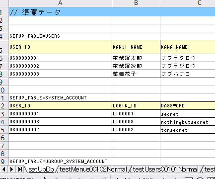
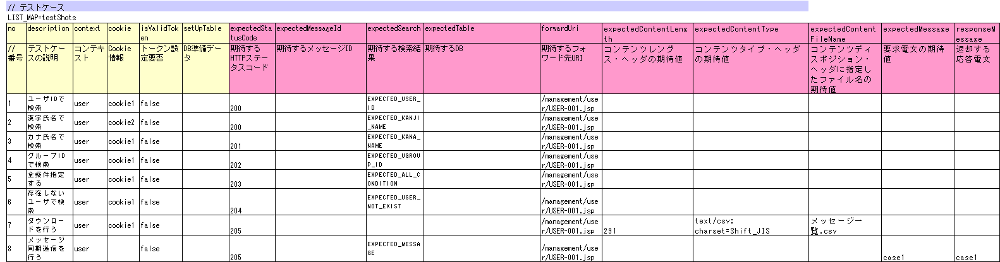
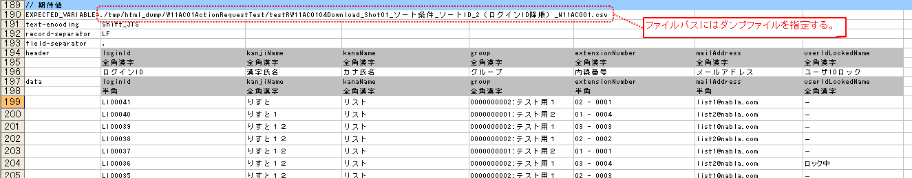
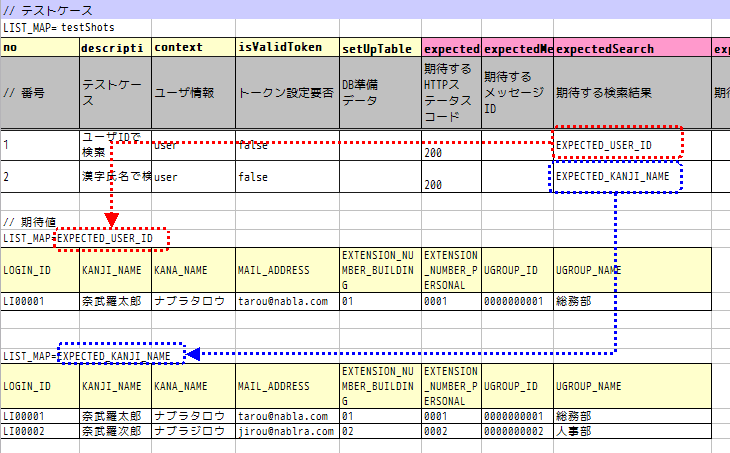

# リクエスト単体テストの実施方法

**公式ドキュメント**: [リクエスト単体テストの実施方法](https://nablarch.github.io/docs/LATEST/doc/development_tools/testing_framework/guide/development_guide/05_UnitTestGuide/02_RequestUnitTest/index.html)

## テストクラスの書き方

テストクラス作成ルール: (1) テスト対象Actionクラスと同一パッケージ (2) クラス名は `{Actionクラス名}RequestTest` (3) `nablarch.test.core.http.BasicHttpRequestTestTemplate` を継承（プロジェクト拡張実装がある場合を除く）

```java
package nablarch.sample.management.user;
public class UserSearchActionRequestTest extends BasicHttpRequestTestTemplate {
```

> **補足**: `BasicHttpRequestTestTemplate` はリクエスト単体テストに必要な各種メソッドと `DbAccessTestSupport` の機能を兼ね備えており、データベース設定もクラス単体テストと同様に実行できる。

**クラス**: `BasicHttpRequestTestTemplate`

`BasicHttpRequestTestTemplate`を継承する。テスト実行フロー:

1. データシートからtestShots LIST_MAPを取得
2. 取得したテストケース分、以下を繰り返し実行
   1. データベース初期化
   2. `ExecutionContext`、HTTPリクエストを生成
   3. `beforeExecuteRequest`メソッド呼出（業務テストコード用拡張ポイント）
   4. トークンが必要な場合、トークンを設定
   5. テスト対象のリクエスト実行
   6. 実行結果の検証（HTTPステータスコード/メッセージID、HTTPレスポンス値(リクエストスコープ値)、検索結果、テーブル更新結果）
   7. `afterExecuteRequest`メソッド呼出（業務テストコード用拡張ポイント）

抽象メソッド`getBaseUri()`をオーバーライドしてURIの共通部分を返却する:

```java
public class UserSearchActionRequestTest extends BasicHttpRequestTestTemplate {
    @Override
    protected String getBaseUri() {
        return "/action/management/user/UserSearchAction/";
    }
}
```

## リクエスト単体テストクラス作成時の注意点

### ThreadContextへの値設定は不要

リクエスト単体テストでは、ThreadContextへの値設定はWeb Frameworkのハンドラで実施される。**テストクラスからThreadContextへの値を設定する必要はない。**

### テストクラスでのトランザクション制御は不要

リクエスト単体テストでは、トランザクション制御はハンドラで行われるため、**テストクラス内で明示的にトランザクションコミットを行う必要はない。**

<details>
<summary>keywords</summary>

BasicHttpRequestTestTemplate, DbAccessTestSupport, リクエスト単体テスト, テストクラス命名規則, BasicHttpRequestTestTemplate継承, testShots, getBaseUri, リクエスト単体テスト実行フロー, beforeExecuteRequest, afterExecuteRequest, ExecutionContext, ThreadContext, トランザクション制御, ハンドラ, テストクラス設定不要

</details>

## テストメソッド分割

テストメソッド分割ルール:
1. リクエストID（Actionメソッド）ごとに正常系・異常系のテストメソッドを作成する
2. 異常系ケースがない場合（メニューからの単純な画面遷移など）は正常系メソッドのみ作成する
3. 画面表示検証項目は正常系または異常系のメソッドに含める。同一シートでの条件分岐が煩雑になる場合は画面表示検証用メソッドを別途作成する

分割例（USERS00101の場合）:

| リクエストID | Actionメソッド名 | 正常系 | 異常系 | 画面表示検証用 |
|---|---|---|---|---|
| USERS00101 | doUsers00101 | testUsers00101Normal | testUsers00101Abnormal | testUsers00101View |

> **補足**: 1つのテストデータシートにさまざまなテストケースを詰め込んで可読性が下がる場合は、テストデータシートを分割する。

準備したテストシートに対応するメソッドを作成する:

```java
@Test
public void testMenus00101() {
}
```

<details>
<summary>keywords</summary>

テストメソッド分割, 正常系テスト, 異常系テスト, 画面表示検証, テストデータシート分割, テストメソッド作成, @Test

</details>

## テストデータの書き方

テストデータを記載したExcelファイルはテストソースコードと同じディレクトリに同じ名前で格納する（拡張子のみ異なる）。

### setUpDb（共通DB初期値）

Excelファイルに `setUpDb` という名前のシートを用意し、テストクラスで共通のデータベース初期値を記載する。テストメソッド実行時に自動テストフレームワークにより投入される。



テストメソッド内でスーパクラスの以下のいずれかのメソッドを呼び出す:
- `void execute()` — 通常の場合に使用
- `void execute(Advice advice)` — 固有の処理が必要な場合

```java
@Test
public void testUsers00101Normal() {
    execute();
}
```

固有の処理（リクエストスコープのエンティティ内容確認等）が必要な場合は`execute(Advice advice)`を使用してリクエスト送信前後に処理を挿し込む。

**クラス**: `BasicAdvice`
- `void beforeExecute(TestCaseInfo testCaseInfo, ExecutionContext context)` — リクエスト送信前にコールバック
- `void afterExecute(TestCaseInfo testCaseInfo, ExecutionContext context)` — リクエスト送信後にコールバック

> **補足**: 両方のオーバーライドは不要。必要なものだけオーバーライドすること。処理が長くなる場合やテストメソッド間で共通する処理はプライベートメソッドに切り出すこと。

### SqlResultSetが複数種類格納されている場合

```java
@Test
public void testMenus00103() {
    execute(new BasicAdvice() {
        @Override
        public void afterExecute(TestCaseInfo testCaseInfo, ExecutionContext context) {
            String message = testCaseInfo.getTestCaseName();
            String sheetName = testCaseInfo.getSheetName();
            String no = testCaseInfo.getTestCaseNo();

            SqlResultSet actualGroup = (SqlResultSet) context.getRequestScopedVar("allGroup");
            assertSqlResultSetEquals(message, sheetName, "expectedUgroup" + no, actualGroup);

            SqlResultSet actualUseCase = (SqlResultSet) context.getRequestScopedVar("allUseCase");
            assertSqlResultSetEquals(message, sheetName, "expectedUseCase" + no, actualUseCase);
        }
    });
}
```

### Formやエンティティがリクエストスコープにあるとき（assertEntity）

```java
String expectedSystemAccountId = "systemAccount" + testCaseInfo.getTestCaseNo();
Object actualSystemAccount = context.getRequestScopedVar("systemAccount");
assertEntity(sheetName, expectedSystemAccountId, actualSystemAccount);
```

期待値はエンティティのクラス単体テスト（:ref:`entityUnitTest_SetterGetterCase`）と同様の書式で記述する（setterの欄は不要）。


> **補足**: FormのプロパティにFormが格納されている場合は、そのFormを取得してEntityと同様にテストできる。以下に例を示す。
>
> ```java
> // Formをリクエストスコープから取り出す
> Object actualForm = context.getRequestScopedVar("form");
> // Formのプロパティである別のFormを取得
> Object actualSystemAccount = actualForm.getSystemAccount();
> // エンティティを比較するメソッドを呼び出す
> assertEntity(sheetName, expectedSystemAccountId, actualSystemAccount);
> ```

### SqlRowが格納されている場合（assertSqlRowEquals）

```java
SqlRow actual = (SqlRow) context.getRequestScopedVar("user");
assertSqlRowEquals(message, sheetName, "expectedUser" + no, actual);
```

### リクエストパラメータを検証する場合

:ref:`ウィンドウスコープ<tag-window_scope>`のリセットのためリクエストパラメータを書き換える場合など、テスト対象実行後のリクエストパラメータを検証する:

```java
HttpRequest request = testCaseInfo.getHttpRequest();
assertEquals("", getParam(request, "resetparameter"));
```

### その他（SqlResultSet/SqlRow以外のオブジェクト）

Excelからデータを取得して検証する手順: (1) テストデータをExcelファイルから取得 (2) リクエストスコープ等から実際の値を取得 (3) 自動テストフレームワークまたはJUnitのAPIで結果を検証。

```java
List<Map<String, String>> expected = getListMap("doRW25AA0303NormalEnd", "result_1");
List<Map<String, String>> actual = context.getRequestScopedVar("pageData");
assertListMapEquals(expected, actual);
```

テストデータの取得方法は[how_to_get_data_from_excel](testing-framework-03_Tips.md)を参照。

<details>
<summary>keywords</summary>

テストデータシート, setUpDb, 共通DB初期値, テストクラス共通データベース初期値, Excelファイル, execute, BasicAdvice, beforeExecute, afterExecute, TestCaseInfo, ExecutionContext, assertSqlResultSetEquals, assertEntity, assertSqlRowEquals, HttpRequest, getHttpRequest, getParam, getListMap, assertListMapEquals, SqlResultSet, SqlRow, リクエストスコープ検証, 固有処理

</details>

## テストケース一覧（testShots）

LIST_MAPのデータタイプで1テストメソッド分のケース表を記載する。IDは `testShots`。



| カラム名 | 説明 | 必須 |
|---|---|---|
| no | テストケース番号（1からの連番） | ○ |
| description | テストケースの説明。HTMLダンプファイルのファイル名に使用（OSで許可された文字のみ可。改行コードを含むとIOException発生） | ○ |
| context | リクエスト送信時のユーザ情報（詳細はユーザ情報セクション参照） | ○ |
| cookie | Cookie情報（詳細はCookie情報セクション参照） | |
| queryParams | クエリパラメータ情報（詳細はクエリパラメータ情報セクション参照） | |
| isValidToken | トークンを設定する場合はtrueを設定。サーバ側の二重サブミット防止参照 | |
| setUpTable | 各テストケース実行前にDBに登録するデータの :ref:`グループID<tips_groupId>` | |
| expectedStatusCode | 期待するHTTPステータスコード | ○ |
| expectedMessageId | 期待するメッセージID（複数はカンマ区切り）。空欄の場合はメッセージなしとしてアサート。空欄なのにメッセージが出力された場合はテスト失敗 | |
| expectedSearch | 期待する検索結果のLIST_MAP ID。リクエストスコープからの取得キーは `searchResult` | |
| expectedTable | 期待するDB状態の :ref:`グループID<tips_groupId>` | |
| forwardUri | 期待するフォワード先URI。空欄の場合はJSPフォワードなしとしてアサート。システムエラー画面（`/jsp/systemError.jsp`）などへの遷移もここで指定 | |
| expectedContentLength | コンテンツレングスヘッダの期待値（ファイルダウンロード用） | |
| expectedContentType | コンテンツタイプヘッダの期待値（ファイルダウンロード用） | |
| expectedContentFileName | コンテンツディスポジションヘッダのファイル名期待値（ファイルダウンロード用） | |
| expectedMessage | メッセージ同期送信の期待する要求電文 :ref:`グループID<tips_groupId>` | |
| responseMessage | メッセージ同期送信で返却する応答電文 :ref:`グループID<tips_groupId>` | |
| expectedMessageByClient | HTTPメッセージ同期送信の期待する要求電文 :ref:`グループID<tips_groupId>` | |
| responseMessageByClient | HTTPメッセージ同期送信で返却する応答電文 :ref:`グループID<tips_groupId>` | |

HTTP `リクエストパラメータ` はこの表ではなく別の表（`requestParams`）に記載する。

:ref:`batch_request_test`と同じ方法でExcelファイルに期待値を記載してテストする。ファイルパスにはダンプファイルを指定する。

ダウンロード処理の場合のダンプファイル命名規則: `Excelファイルのシート名_テストケース名_ダウンロードされたファイル名`

ダンプ出力結果が格納されるディレクトリの詳細は[html_dump_dir](#)を参照。

期待値定義例:



`FileSupport`クラスの`assertFile`メソッドを使用してダウンロードファイルをアサートする:

```java
private FileSupport fileSupport = new FileSupport(getClass());

@Test
public void testRW11AC0104Download() {
    execute(new BasicAdvice() {
        @Override
        public void afterExecute(TestCaseInfo testCaseInfo, ExecutionContext context) {
            String msgOnFail = "ダウンロードしたユーザ一覧照会結果のCSVファイルのアサートに失敗しました。";
            fileSupport.assertFile(msgOnFail, "testRW11AC0104Download");
        }
    });
}
```

<details>
<summary>keywords</summary>

testShots, LIST_MAP, no, description, context, cookie, queryParams, isValidToken, setUpTable, expectedStatusCode, expectedMessageId, expectedSearch, expectedTable, forwardUri, expectedContentLength, expectedContentType, expectedContentFileName, expectedMessage, responseMessage, expectedMessageByClient, responseMessageByClient, FileSupport, assertFile, ダウンロードファイルテスト, batch_request_test, html_dump_dir, ダンプファイル命名規則

</details>

## ユーザ情報・Cookie情報・クエリパラメータ情報

### ユーザ情報（context）

リクエストID・ユーザ・HTTPメソッドをLIST_MAPのデータタイプで記載する。HTTPメソッドは任意項目（省略時はPOSTが設定される）。複数のユーザ情報を使い分けることで、権限やHTTPメソッドによって処理が異なる機能をテストできる。

### Cookie情報（cookie）

LIST_MAPのデータタイプで記載する。任意項目のためCookieを必要としないケースは記載不要。Cookieが不要なケースの場合は値を空白にする。

### クエリパラメータ情報（queryParams）

LIST_MAPのデータタイプで記載する。任意項目のためクエリパラメータを必要としないケースは記載不要。クエリパラメータが不要なケースの場合は値を空白にする。

クラス単体テストと同様。通常のJUnitテストと同じように実行する。

<details>
<summary>keywords</summary>

context, ユーザ情報, Cookie情報, クエリパラメータ情報, HTTPメソッド, リクエストID, LIST_MAP, JUnit, テスト起動方法, リクエスト単体テスト実行

</details>

## リクエストパラメータ

各テストケースで送信するHTTPパラメータをLIST_MAPのデータタイプで記載する。IDは `requestParams`。

:ref:`http_dump_tool` を使用してデータを作成する（初期画面表示リクエストを除く）。テストケース一覧（testShots）と行単位で関連付けられる（先頭ケース→先頭データ）。:ref:`marker_column` としてテストケース番号を記載すること。

> **補足**: リクエストパラメータが存在しない場合（初期画面表示など）でも `LIST_MAP=requestParams` には必ず列を定義すること。パラメータが不要な場合はテストケース番号列のみ記載し、テストケース数分の行を用意する（3ケースなら3行、10ケースなら10行）。
> 
> ※ `[no]` 列はテストケース番号を視覚的に表すマーカー列（:ref:`marker_column`）であるため、リクエストパラメータには含まれない。

1リクエスト毎にHTMLダンプファイルが出力される。ファイルをブラウザで開き目視確認する。

> **補足**: リクエスト単体テストで生成されたHTMLファイルは自動テストフレームワークにて自動的にチェックされる。[../../08_TestTools/03_HtmlCheckTool/index](testing-framework-guide-development-guide-08-TestTools-03-HtmlCheckTool.md)を用いてHTMLファイルをチェックし、HTMLファイル内に構文エラー等の違反があった場合は違反内容に応じた例外が発生してそのテストケースは失敗となる。

<details>
<summary>keywords</summary>

requestParams, リクエストパラメータ, LIST_MAP, http_dump_tool, マーカー列, marker_column, HTMLダンプ, HTMLCheckTool, テスト結果確認

</details>

## ひとつのキーに対して複数の値を設定する場合

HTTPリクエストパラメータで1つのキーに複数の値を設定する場合は、**値をカンマ区切りで記述する**。

例: `foo` キーに `one` と `two` を設定:

| foo | bar |
|---|---|
| one,two | three |

- 値にカンマ自体を含める場合は `\` でエスケープする（例: `\,`）
- 値に `\` 自体を含める場合は `\\` と記述する

例: `\1,000` という値を表す場合の記述: `\\1\,000`

テスト用プロジェクトのルートディレクトリに`tmp/html_dump`ディレクトリが作成され、その配下にHTMLダンプファイルが出力される。ダンプ出力結果が格納されるディレクトリの詳細は[dump-dir-label](testing-framework-02_RequestUnitTest.md)を参照。


> **補足**: HTMLダンプファイル名には、テストケース一覧（testShots）のdescription欄の記述が使用される。

<details>
<summary>keywords</summary>

複数値設定, カンマ区切り, エスケープ, リクエストパラメータ複数値, html_dump, dump-dir-label, HTMLダンプ出力結果, testShots, description

</details>

## 期待する検索結果

テストケース一覧の `expectedSearch` カラムに期待する検索結果のLIST_MAP IDを指定することで、検索結果とテストケースを関連付ける。



<details>
<summary>keywords</summary>

expectedSearch, 検索結果期待値, searchResult, テストケース関連付け

</details>

## 期待するデータベースの状態

更新系テストケースでは、テストケース一覧の `expectedTable` カラムに期待するDB状態の :ref:`グループID<tips_groupId>` を指定することで、期待するデータベース状態とテストケースを関連付ける。


<details>
<summary>keywords</summary>

expectedTable, データベース期待値, 更新系テスト, グループID

</details>
