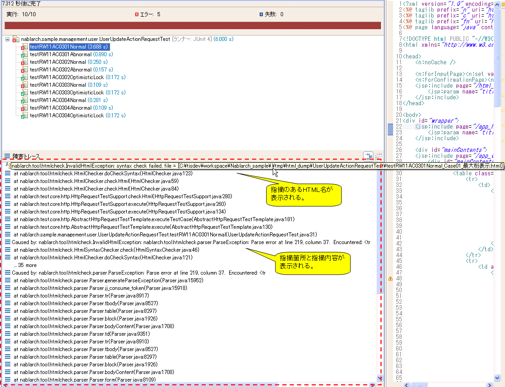

# HTMLチェックツール

**公式ドキュメント**: [HTMLチェックツール](https://nablarch.github.io/docs/LATEST/doc/development_tools/testing_framework/guide/development_guide/08_TestTools/03_HtmlCheckTool/index.html)

## 目的・仕様・HTML4.01との相違点

## 目的

- 終了タグ忘れ等の構文不正による画面表示ズレを防ぐ
- プロジェクト規約で禁止されているタグの使用を防ぐ

## 仕様

リクエスト単体テストに標準で組み込まれており、テスト実行時に自動実行される。不正なHTMLを検出した場合、テスト失敗となる。

- デフォルトでHTML4.01準拠の構文チェックを行う（設定変更でカスタマイズ可能）
- 開始タグ・終了タグの記述漏れをチェック。HTML4.01で省略可能と規定されているタグも省略不可
- 設定ファイルに記載されたタグ・属性の使用チェックを行う
- 大文字・小文字の区別なし（例: `<tr>`、`<TR>`、`<Tr>`、`<tR>` はすべて同一扱い）
- boolean属性は使用可能（例: `<textarea disabled>`）
- 属性指定のクォーテーション省略不可（○ `<table align="center">` × `<table align=center>`）
- デフォルト設定ファイルには[W3C公式サイト](https://www.w3.org/TR/html401/)で非推奨とされているタグ・属性が設定されている（カスタマイズ方法は [01_custom](#s2) を参照）

> **補足**: JavaScriptに「-」が2つ以上連続で現れた場合はテスト失敗となる（例: デクリメント演算子 `count--`、文字列 `"--"`）。
>
> エラーメッセージ例:
> ```
> Lexical error at line 965, column 31.  Encountered: "-" (45), after : "--"
> ```
>
> 対応: JavaScriptをHTML(JSP)に直接記述せず、外部ファイルとして記述する。

## HTML4.01との相違点

本ツールではボディが空のタグを許容する（クライアントサイドでの動的DOM操作を考慮）。

以下はエラーとならない例:

```html
<!-- 空のspanタグ -->
<span id="foo"></span>

<!-- optionのないselectタグ -->
<select id="bar"></select>
```

<details>
<summary>keywords</summary>

HTMLチェックツール, HTML構文チェック, HTML4.01準拠, 禁止タグ・属性チェック, boolean属性, クォーテーション省略不可, JavaScriptハイフン連続, 空タグ許容, 仕様

</details>

## 前提条件

HTMLチェックツールの使用前提条件: リクエスト単体テストを実行可能であること。

<details>
<summary>keywords</summary>

HTMLチェックツール前提条件, リクエスト単体テスト, 使用方法

</details>

## 使用禁止タグ・属性のカスタマイズ方法

デフォルトの設定をそのまま使用する場合、プロジェクト開始時に下記に述べる設定変更を行う必要はない。

`htmlCheckerConfig` プロパティに禁止タグ・属性を記述した設定ファイルへのパスを指定する。設定ファイルを配布時とは異なる場所に配置する場合はこのプロパティを修正する。

```xml
<component name="httpTestConfiguration" class="nablarch.test.core.http.HttpTestConfiguration">
    (省略)
    <property name="htmlCheckerConfig" value="test/resources/httprequesttest/html-check-config.csv" />
    (省略)
</component>
```

設定ファイルの記述形式: 1行にカンマ区切りでタグ名・属性名を記述する。1つのタグに複数の属性を設定する場合は複数行で記述する。

```
body,bgcolor
body,link
body,text
table,align
table,bgcolor
td,bgcolor
td,height
td,nowrap
th,bgcolor
th,height
th,nowrap
tr,bgcolor
```

- タグ自体の使用を禁止する場合は属性欄を空にする（カンマは省略不可）
  例: `body,`

<details>
<summary>keywords</summary>

htmlCheckerConfig, 禁止タグカスタマイズ, 禁止属性カスタマイズ, HttpTestConfiguration, html-check-config.csv, タグ属性設定ファイル

</details>

## HTMLチェック実行要否の設定方法

`checkHtml` プロパティで制御する。`true` の場合はHTMLチェックを実施し、`false` の場合は実施しない。

```xml
<component name="httpTestConfiguration" class="nablarch.test.core.http.HttpTestConfiguration">
    (省略)
    <property name="checkHtml" value="true" />
    (省略)
</component>
```

<details>
<summary>keywords</summary>

checkHtml, HTMLチェック有効化, HTMLチェック無効化, HttpTestConfiguration, HTMLチェック設定

</details>

## HTMLチェック内容の変更

`nablarch.test.core.http.HttpTestConfiguration` の `htmlChecker` プロパティを変更することでHTMLチェック内容を変更できる。

`HtmlChecker` インターフェースを実装したクラスを作成する。以下は `<html>` タグで始まることを確認するシンプルな実装例:

```java
public class SimpleHtmlChecker implements HtmlChecker {
    private String encoding;

    @Override
    public void checkHtml(File html) throws InvalidHtmlException {
        StringBuilder sb = new StringBuilder();
        InputStreamReader reader = null;

        try {
            reader = new InputStreamReader(new FileInputStream(html), encoding);

            char[] buf = new char[1024];
            int len = 0;
            while ((len = reader.read(buf)) > 0) {
                sb.append(buf, 0, len);
            }
        } catch (Exception e) {
            throw new RuntimeException(e);
        } finally {
            FileUtil.closeQuietly(reader);
        }

        if (!sb.toString().trim().startsWith("<html>")) {
            throw new InvalidHtmlException("html not starts with <html>");
        }
    }

    public void setEncoding(String encoding) {
        this.encoding = encoding;
    }
}
```

リソースのクローズには Nablarch の `FileUtil.closeQuietly` を使用する。

設定例:

```xml
<component name="httpTestConfiguration" class="nablarch.test.core.http.HttpTestConfiguration">
    (省略)
    <!-- HTMLチェッカの設定 -->
    <property name="htmlChecker" ref="htmlChecker" />
</component>

<component name="htmlChecker" class="nablarch.test.core.http.example.htmlcheck.SimpleHtmlChecker">
    <property name="encoding" value="UTF-8"/>
</component>
```

<details>
<summary>keywords</summary>

HtmlChecker, htmlChecker, InvalidHtmlException, HttpTestConfiguration, HTMLチェッカーカスタマイズ, SimpleHtmlChecker, FileUtil.closeQuietly, InputStreamReader, FileInputStream

</details>

## テスト実行時指摘確認方法

リクエスト単体テスト実行時、自動生成されたHTMLファイルに指摘が存在した場合、該当するテストケースは失敗する。JUnitコンソールに指摘箇所と指摘内容が出力される。



指摘を確認後、該当するHTMLの出力元となるJSPを修正してテストを再実行する。

<details>
<summary>keywords</summary>

テスト失敗, JUnitコンソール, 指摘箇所確認, HTMLチェック結果, JSP修正

</details>
