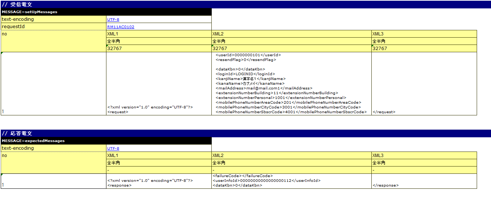

# リクエスト単体テストの実施方法（HTTP同期応答メッセージ受信処理）

**公式ドキュメント**: [リクエスト単体テストの実施方法（HTTP同期応答メッセージ受信処理）](https://nablarch.github.io/docs/LATEST/doc/development_tools/testing_framework/guide/development_guide/05_UnitTestGuide/02_RequestUnitTest/http_real.html)

## 

HTTP同期応答メッセージ受信処理のリクエスト単体テストは :ref:`real_request_test` との記述方法が一部異なる。本項は差分箇所のみを解説する。

keywords

HTTP同期応答メッセージ受信処理, リクエスト単体テスト, real_request_test, 差分解説

## テストデータの書き方

テストショット一覧（`testShots`、LIST_MAPデータタイプ）に記載するHTTP同期応答メッセージ受信処理特有のカラム:

| カラム名 | 説明 | 必須 |
|---|---|---|
| diConfig | HTTP同期応答メッセージ受信リクエスト単体テスト用コンポーネント設定ファイルへのパス（例：`http-messaging-test-component-configuration.xml`） | ○ |
| expectedStatusCode | JSON/XMLデータ形式使用時は空欄にする | ○ |
| requestPath | アクション実行URLからホスト名を除いたパス（例：`/msgaction/ss11AC/RM11AC0102`） | ○ |
| userId | 認証認可チェックに使用するユーザID | ○ |

> **補足**: JSON/XMLデータ形式使用時は、ステータスコードの比較もExcelファイルのメッセージボディとの比較で行う（フレームワーク制御ヘッダもメッセージボディに含まれるため）。

keywords

テストショット一覧, diConfig, expectedStatusCode, requestPath, userId, testShots, LIST_MAP, HTTP同期応答メッセージ受信処理テスト設定カラム

## リクエストメッセージ

要求電文（`MESSAGE=setUpMessages`固定）の記述形式:

1. **先頭行**: `MESSAGE=setUpMessages` 固定
2. **共通情報**: ディレクティブおよびフレームワーク制御ヘッダをkey-value形式で記載（全メッセージ共通値）

> **重要**: フレームワーク制御ヘッダの項目をPJで変更している場合、propertiesファイルに `reader.fwHeaderfields` キーでフレームワーク制御ヘッダ名をカンマ区切りで指定する必要がある。例: `reader.fwHeaderfields=requestId,addHeader`

keywords

MESSAGE=setUpMessages, reader.fwHeaderfields, フレームワーク制御ヘッダ, ディレクティブ, 要求電文, setUpMessages

## 

メッセージボディ（フレームワーク制御ヘッダ以降）の記述形式:

| 行 | 記述内容 | 備考 |
|---|---|---|
| 1行目 | フィールド名称 | 先頭セルは `no` |
| 2行目 | データタイプ | 先頭セルは空白 |
| 3行目 | フィールド長 | 先頭セルは空白 |
| 4行目以降 | XMLデータまたはJSONデータ | 先頭セルは1からの通番。フィールドを跨いで記載可能 |

> **補足**: JSON/XMLデータ形式使用時は、1Excelシートに1テストケースのみ記述すること（各行の文字列長が同一であることを期待するNTFの制約による。JSON/XMLは要求電文の長さがリクエスト毎に異なるため事実上1テストケースのみ）。

> **重要**: フィールド名称に**重複した名称は許容されない**（例：「氏名」フィールドが2つ以上存在してはならない）。

keywords

メッセージボディ, フィールド名称, XMLデータ, JSONデータ, 1テストケース制約, フィールド名重複禁止

## 

テスト実施に必要な各種準備データ: データベースおよびリクエストメッセージ（要求電文）を準備する。各種期待値として、レスポンスメッセージ（応答電文）を準備する。

keywords

各種準備データ, 各種期待値, データベース準備, レスポンスメッセージ期待値

## レスポンスメッセージ

レスポンスメッセージの記述形式はリクエストメッセージ（`MESSAGE=setUpMessages`）と同一。名前は `MESSAGE=expectedMessages` とする。応答電文のフィールド長は `"-"` (ハイフン) を設定する。

keywords

MESSAGE=expectedMessages, レスポンスメッセージ, フィールド長ハイフン, 期待値電文, expectedMessages

