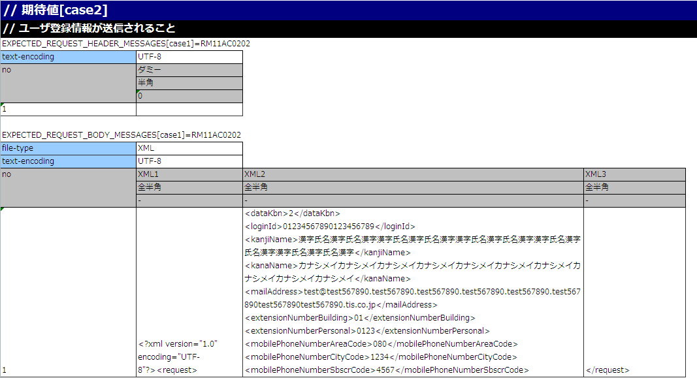
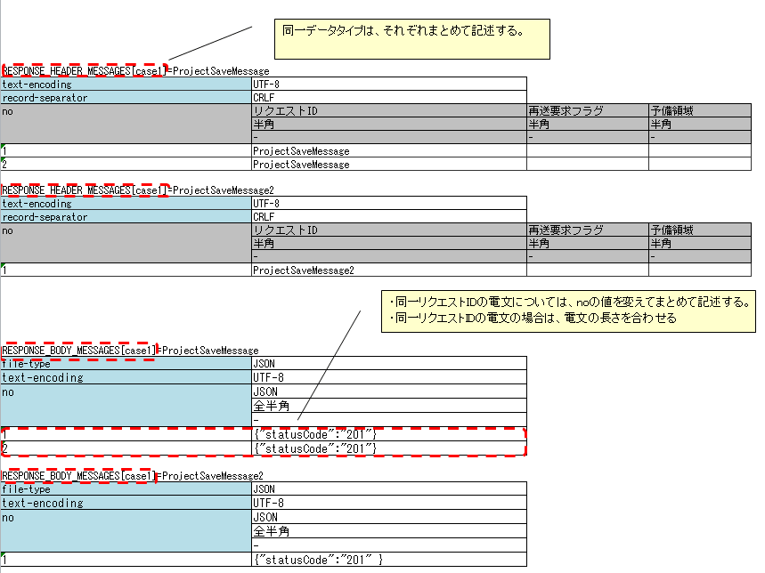
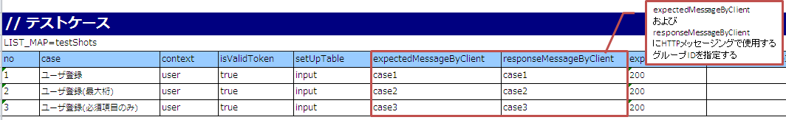

# リクエスト単体テストの実施方法(HTTP同期応答メッセージ送信処理)

**公式ドキュメント**: [リクエスト単体テストの実施方法(HTTP同期応答メッセージ送信処理)](https://nablarch.github.io/docs/LATEST/doc/development_tools/testing_framework/guide/development_guide/05_UnitTestGuide/02_RequestUnitTest/http_send_sync.html)

## 概要

HTTP同期応答メッセージ送信処理のリクエスト単体テストは :ref:`message_sendSyncMessage_test` と同様に実施する。ただし「送信キュー」「受信キュー」は「通信先」と読み替えること。

本セクションは :ref:`message_sendSyncMessage_test` との相違点のみを解説する。

<details>
<summary>keywords</summary>

HTTP同期応答メッセージ送信処理, リクエスト単体テスト, 通信先, 送信キュー, 受信キュー, message_sendSyncMessage_test

</details>

## テストデータの書き方

## 電文を1回送信する場合

応答電文（レスポンスメッセージ）の記述例:


> **補足**: RESPONSE_BODY_MESSAGES（およびEXPECTED_REQUEST_BODY_MESSAGES）は複数フィールドに分割して記述可能。可読性のため分割する場合、フィールド名は任意の文字列を指定する（例: XML1、XML2、XML3）。

要求電文の期待値の記述例:



> **補足**: JSON/XMLデータ形式使用時は、1Excelシートに1テストケースのみ記述すること。メッセージボディの各行の文字列長が同一であることを期待するNTFの制約による。JSON/XMLは要求電文の長さがリクエストごとに異なるのが一般的なため、事実上1テストケースしか記述できない。

## 電文を2回以上送信する場合

複数回送信のテスト記述ルール:
- 同一データタイプ（例: `RESPONSE_HEADER_MESSAGES` と `RESPONSE_BODY_MESSAGES`）はまとめて記述すること（:ref:`tips_groupId`、[auto-test-framework_multi-datatype](testing-framework-01_Abstract.md) 参照）
- 同一リクエストIDの電文はnoの値を変えてまとめて記述する
- 同一リクエストIDの電文は電文の長さを揃えること（揃えられない場合は手動テストを行うこと）

応答電文の記述例:



要求電文の期待値の記述例:


> **補足**: 送信対象のリクエストIDが複数存在する場合、送信順のテストは不可能。上記の例では `ProjectSaveMessage` より先に `ProjectSaveMessage2` が送信された場合でもテストは成功となる。

<details>
<summary>keywords</summary>

テストデータ, RESPONSE_BODY_MESSAGES, RESPONSE_HEADER_MESSAGES, EXPECTED_REQUEST_BODY_MESSAGES, JSON/XMLデータ形式, 複数電文送信, tips_groupId, auto-test-framework_multi-datatype, 応答電文, 要求電文の期待値, フィールド分割

</details>

## 障害系のテスト

応答電文の表のヘッダおよび本文両方の「no」を除く最初のフィールドに `errorMode:` から始まる値を設定することで障害系テストを実施できる。

| 設定値 | 障害内容 | 動作 |
|---|---|---|
| `errorMode:timeout` | メッセージ送信中のタイムアウトエラー | `HttpMessagingTimeoutException`（`MessagingException`のサブクラス）をスロー |
| `errorMode:msgException` | メッセージ送受信エラー | `MessagingException`をスロー |

> **注意**: `errorMode:timeout` では :ref:`message_sendSyncMessage_test` と異なるクラス（`HttpMessagingTimeoutException`）をスローする。

業務アクション内で `MessagingException` を明示的に制御していない場合、個別のリクエスト単体テストで障害系テストを行う必要はない。

<details>
<summary>keywords</summary>

障害系テスト, errorMode, HttpMessagingTimeoutException, MessagingException, タイムアウトエラー, errorMode:timeout, errorMode:msgException

</details>

## モックアップを使用するための記述

## モックアップを使用するための記述

testShotsの `expectedMessageByClient` および `responseMessageByClient` にグループIDを設定する。モックアップ自体は :ref:`dealUnitTest_send_sync` を参照。グループIDの関連については :ref:`message_sendSyncMessage_test` における `expectedMessage`/`responseMessage` の場合と同様。



同一アクション内でMOMによる同期応答メッセージ送信処理とHTTP同期応答メッセージ送信処理が同時に行われる場合:
- `expectedMessage`/`responseMessage`: MOMによる同期応答メッセージ送信処理のグループID
- `expectedMessageByClient`/`responseMessageByClient`: HTTP同期応答メッセージ送信処理のグループID


> **補足**: グループIDはMOMとHTTPでそれぞれ異なる値を設定すること。同一のグループIDを指定した場合、正しく結果検証が行われない。

## 要求電文のアサート

テストデータのディレクティブ行に設定されたfile-typeの値によって要求電文のアサート方法が変わる。詳細は :ref:`real_request_test` のレスポンスメッセージの項を参照。

<details>
<summary>keywords</summary>

モックアップ, testShots, expectedMessageByClient, responseMessageByClient, expectedMessage, responseMessage, グループID, MOM, HTTP同期応答, dealUnitTest_send_sync, real_request_test, 要求電文アサート, file-type

</details>

## フレームワークで使用するクラスの設定

通常はアーキテクトが設定するため、アプリケーションプログラマが設定する必要はない。

コンポーネント設定ファイルに `defaultMessageSenderClient` として `nablarch.test.core.messaging.RequestTestingMessagingClient` を設定する。

```xml
<component name="defaultMessageSenderClient" 
           class="nablarch.test.core.messaging.RequestTestingMessagingClient">
  <property name="charset" value="Shift-JIS"/>
</component>
```

`charset` プロパティ: ログ出力の文字コードを指定する。省略時はUTF-8。

<details>
<summary>keywords</summary>

RequestTestingMessagingClient, defaultMessageSenderClient, charset, モックアップクラス設定, nablarch.test.core.messaging.RequestTestingMessagingClient

</details>
