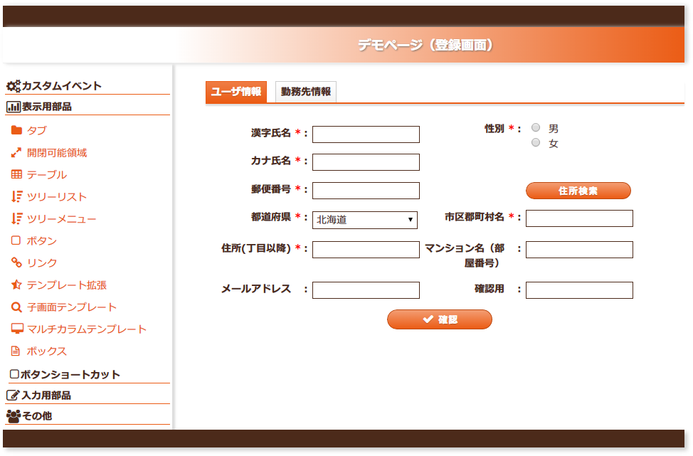
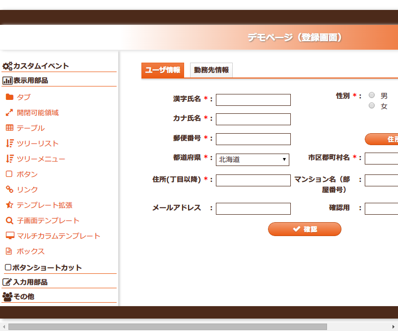

# マルチレイアウト用CSSフレームワーク

**公式ドキュメント**: [マルチレイアウト用CSSフレームワーク](https://nablarch.github.io/docs/LATEST/doc/development_tools/ui_dev/doc/internals/multicol_css_framework.html)

## 概要

マルチレイアウト用CSSフレームワークは [css_framework](testing-framework-css_framework.md) のワイドモードベースのスタイルシート群。以下が実現可能:

- UI部品ウィジェットを複数個並べて配置できる（画面ごとに自由にレイアウト）
- UI部品ウィジェットの出力幅を指定できる



## マルチレイアウトモード使用時の重要ポイント

- UI部品ウィジェットは必ず行内（`layout:row`）に配置する
  - ただし、出力幅の指定機能を提供しないUI部品ウィジェットはこれ自体が行を表すため、行内配置不要
- 各UI部品ウィジェット使用時には、そのウィジェットの幅（グリッド数）を指定する
- 行内に配置するUI部品ウィジェットの幅（グリッド数）の合計は、業務コンテンツ部の幅（グリッド数）以内とする
  - 業務コンテンツ部のグリッド数は、`@contentGridSpan` で定義された値
  - 合計が超えた場合、自動的に折り返されて次の行に出力される
  - 折り返し位置はブラウザ依存のため、業務コンテンツ部の幅に収まるようUI部品ウィジェットを配置すること

<details>
<summary>keywords</summary>

マルチレイアウト, CSSフレームワーク, ワイドモード, UI部品ウィジェット並べて配置, 出力幅指定, css_framework, マルチレイアウトモード, layout:row, layout:cell, グリッド数指定, UI部品配置, @contentGridSpan, 業務コンテンツ部, 折り返し

</details>

## 制約事項

**表示モード切替機能は提供しない**: 画面サイズを変更しても常にワイドモードベースの表示となる（非表示部分は横スクロールバーで表示）。複数UI部品を並べたレイアウトは別モードで同じレイアウトで表示不可能なため、モード切替はサポートしない。



**出力幅の指定機能を提供しないウィジェット**: タイトル部を出力するウィジェットは常に業務コンテンツ領域と同じ幅で出力され、幅の指定機能は提供しない:

- [../reference_jsp_widgets/field_block](testing-framework-field_block.md) (`/WEB-INF/tags/widget/field/block.tag`)
- テーブル関連ウィジェット (`/WEB-INF/tags/widget/table/*.tag`):
  - [../reference_jsp_widgets/table_plain](testing-framework-table_plain.md)
  - [../reference_jsp_widgets/table_search_result](testing-framework-table_search_result.md)
  - [../reference_jsp_widgets/table_treelist](testing-framework-table_treelist.md)
- [../reference_jsp_widgets/tab_group](testing-framework-tab_group.md) (`/WEB-INF/tags/widget/tab/*.tag`)

## 1行に複数のUI部品を並べる場合

**実装ポイント**

- UI部品ウィジェットを並べる場合には、行（`layout:row`）を定義する
- タイトル部・入力部の幅を統一する場合には変数に切り出す（サイズ変更時に変数の値を変更するだけで済む）
- 並べるUI部品にマージンを設ける場合は、空の列（`layout:cell`）を配置し、`gridSize` でマージン幅を指定する

```jsp
<n:form windowScopePrefixes="user">
  <n:set var="titleSize" value="10" />
  <n:set var="inputSize" value="10" />
  <tab:group name="userTab">
    <tab:content title="ユーザ情報" value="userInfo" selected="true">
      <layout:row>
        <field:text title="郵便番号" required="true" name="user.postNo"
            titleSize="${titleSize}" inputSize="${inputSize}">
        </field:text>
        <layout:cell gridSize="10"></layout:cell>
        <n:forInputPage>
          <button:submit label="住所検索" uri="dummy" size="10"></button:submit>
        </n:forInputPage>
      </layout:row>
      <layout:row>
        <field:pulldown title="都道府県" name="user.address1" required="true"
            listName="都道府県リスト" elementLabelProperty="name" elementValueProperty="cd"
            titleSize="${titleSize}" inputSize="${inputSize}">
        </field:pulldown>
        <field:text title="市区郡町村名" name="user.address2" required="true"
            titleSize="${titleSize}" inputSize="${inputSize}">
        </field:text>
      </layout:row>
    </tab:content>
  </tab:group>
  <layout:row>
    <n:forInputPage>
      <layout:cell gridSize="17"></layout:cell>
      <button:check size="10" uri="./確認画面_ページ.jsp"></button:check>
    </n:forInputPage>
    <n:forConfirmationPage>
      <layout:cell gridSize="10"></layout:cell>
      <button:back uri="./登録画面.jsp" size="10"></button:back>
      <layout:cell gridSize="5"></layout:cell>
      <button:confirm uri="dummy" size="10"></button:confirm>
    </n:forConfirmationPage>
  </layout:row>
</n:form>
```

<details>
<summary>keywords</summary>

表示モード切替機能なし, 幅指定不可ウィジェット, field_block, table_plain, table_search_result, table_treelist, tab_group, レイアウト崩れ, マルチカラムレイアウト, layout:row, layout:cell, gridSize, マージン配置, 変数切り出し, タイトル部幅統一, n:forInputPage, n:forConfirmationPage

</details>

## マルチレイアウトモードの適用方法

マルチレイアウトモードのプロジェクトへの適用手順:

**1. package.json へのプラグイン追加** (`ui_plugins/package.json`):

| プラグイン | 役割 | 注意 |
|---|---|---|
| `nablarch-css-conf-multicol` | マルチレイアウト用グリッド数・画面幅定義 | `nablarch-css-conf-wide/compact/narrow` は削除 |
| `nablarch-template-multicol-head` | multicol用HTML headタグ出力・表示モード切替無効化 | `nablarch-template-head` は削除 |
| `nablarch-widget-multicol-row` / `nablarch-widget-multicol-cell` | 業務コンテンツ部への行・列定義（自由配置を実現） | — |

**2. pjconf.json の修正** (`ui_plugins/pjconf.json`、詳細: [pjconf_json](testing-framework-plugin_build.md)):

```javascript
{
  "cssMode": ["multicol"],
  "plugins": [
    { "pattern": "nablarch-template-.*" },
    { "pattern": "nablarch-template-multicol-head" }
  ]
}
```

- `"cssMode": ["multicol"]` を設定する
- `nablarch-template-multicol-head` を明示的に記述し `nablarch-template-.*` パターンより下に置く（下に書いた設定が優先されるため、通常の `nablarch-template-head` が使用されないようにする）

**3. lessインポート定義ファイルの修正** (`ui_plugins/css/ui_public(または ui_local)/multicol.less`): [ui_genless](testing-framework-plugin_build.md) および :ref:`lessImport_less` を参照。[サンプルのmulticol.lessのダウンロード](../../../knowledge/development-tools/testing-framework/assets/testing-framework-multicol_css_framework/multicol.less)

**4. ビルドコマンドの実行**: `ui_plugins/bin/ui_build.bat` を実行。各ウェブプロジェクトに `multicol.css`・`multicol-minify.css` が生成され、各種UI部品が展開される。

## 列によって異なる行数を定義する場合

**実装ポイント**

- 列ごとに異なる行数（htmlのtableのrowspanに相当）を定義する場合には、行内にネストした行を定義する
  - 行内に列（`layout:cell`）を定義し、列内にネストした行を配置することで特定の列に複数の行を定義できる
- ネストした行内に配置するUI部品の幅の合計は、列（`layout:cell`）の `gridSize` を超えてはならない

```jsp
<layout:row>
  <layout:cell gridSize="20">
    <layout:row>
      <field:text title="漢字氏名" name="user.kanjiName" required="true"
          titleSize="10" inputSize="10">
      </field:text>
    </layout:row>
    <layout:row>
      <field:text title="カナ氏名" name="user.kanaName" required="true"
          titleSize="10" inputSize="10">
      </field:text>
    </layout:row>
  </layout:cell>
  <field:radio title="性別" name="user.sex" required="true"
      listName="sexList" listFormat="br"
      elementLabelProperty="name" elementValueProperty="cd"
      titleSize="${titleSize}" inputSize="${inputSize}">
  </field:radio>
</layout:row>
```

<details>
<summary>keywords</summary>

nablarch-css-conf-multicol, nablarch-template-multicol-head, nablarch-widget-multicol-row, nablarch-widget-multicol-cell, package.json, pjconf.json, cssMode, ui_build.bat, multicol.less, マルチレイアウト適用手順, rowspan, ネストした行, layout:cell, layout:row, gridSize, 列ごと異なる行数, ネスト構造

</details>

## レイアウトの調整方法

デフォルト設定を変更する場合、プラグイン (`nablarch-css-conf-multicol`・`nablarch-template-app_aside`) をプロジェクト側にコピーして修正する（プラグイン作成方法: [add_plugin](testing-framework-modifying_code_and_testing.md)）。

**nablarch-css-conf-multicol の修正ポイント**:

- 業務画面部全体の幅変更: `@columns` を変更
- 業務コンテンツ部の幅変更: `@contentGridSpan` を変更（`@fieldGridSpan`・`@tableGridSpan` も合わせて変更）

```
@columns      : 64;         // 1ページ内のグリッド数
@trackWidth   : 13px;       // 1グリッドのグリッド幅
@gutterWidth  : 2px;        // 1グリッドあたりのマージン幅
@totalWidth   : @columns * (@trackWidth + @gutterWidth);  // 1ページの横幅

@labelGridSpan  : 10;       // ラベル部のグリッド数
@inputGridSpan  : 21;       // 入力欄のグリッド数
@buttonGridSpan : 8;        // 標準ボタンのグリッド数
@unitGridSpan   : 3;        // 単位表示部のグリッド数

@fieldGridSpan  : 45;       // 業務画面部に配置する要素のグリッド数
@tableGridSpan  : 45;       // 標準テーブルのグリッド数
@contentGridSpan: 45;       // 業務面部のグリッド数
```

**nablarch-template-app_aside の修正ポイント**:

- サイドバー幅変更: `#aside` の `.grid-col()` 値を変更
- メニューなし画面のサイドバーマージン調整: `#aside.noMenu` の `.grid-col()` 値を変更

```
#aside { .grid-col(16); ... }
#aside.noMenu { .grid-col(8); }
```

<details>
<summary>keywords</summary>

@columns, @contentGridSpan, @fieldGridSpan, @tableGridSpan, nablarch-css-conf-multicol, nablarch-template-app_aside, グリッド数変更, 画面幅変更, サイドバー幅

</details>
