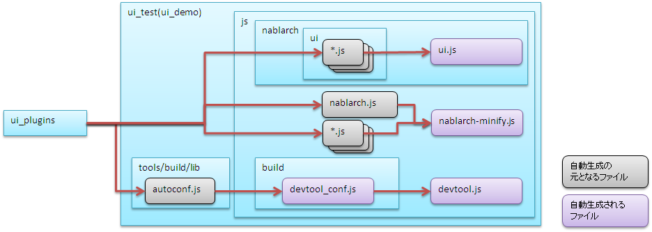

# プラグインビルドコマンド仕様

**公式ドキュメント**: [プラグインビルドコマンド仕様](https://nablarch.github.io/docs/LATEST/doc/development_tools/ui_dev/doc/plugin_build.html)

## 概要

プラグインビルドコマンドの仕様として [project-structure](#s1) および [config-command-detail](#s5) を説明する。プロジェクトの標準的な構成については [structure/directory_layout](testing-framework-directory_layout.md)、開発時のフローについては [development_environment/initial_setup](testing-framework-initial_setup.md) を参照。

**配置**: `ui_plugins/pjconf.json`（[install](#s9) で配置フォルダ変更可、[ui_build](#) でファイル名変更可）

| 設定項目 | 必須 | デフォルト値 | 説明 |
|---|---|---|---|
| pathSettings/projectRootPath | ○ | | プロジェクトルートパス（絶対パスまたは起動ディレクトリからの相対パス） |
| pathSettings/webProjectPath | ○ | | デプロイ対象プロジェクトのパス（プロジェクトルートからの相対パス） |
| pathSettings/demoProjectPath | | `ui_demo` | UIローカルデモプロジェクトのパス（プロジェクトルートからの相対パス） |
| pathSettings/testProjectPath | | `ui_test` | UI開発基盤テストプロジェクトのパス（プロジェクトルートからの相対パス） |
| pathSettings/pluginProjectPath | | `ui_plugins` | プラグインプロジェクトのパス（プロジェクトルートからの相対パス） |
| cssMode | | `["wide", "compact", "narrow"]` | ビルド対象CSSモードの配列 |
| plugins | | 全プラグイン・全ファイル | 展開対象プラグインリスト（定義順に展開）。各要素: `pattern`（必須、正規表現）、`exclude`（任意、除外ファイルの正規表現配列） |
| libraryDeployMappings | | | サードパーティライブラリの展開マッピング。パッケージ名をキーとして、値に`{展開元: 展開先}`オブジェクトを設定する。展開元はパッケージ内の相対パスで指定する。展開元にフォルダを指定した場合、フォルダ配下のファイルが全て展開される。展開先はui_test等からの相対パスで指定する。展開元と異なるファイル名を指定することでリネームして配置することが可能。 |
| imgcopy | | 画像コピーなし | 高解像度→低解像度ディレクトリへの画像コピー設定。`fromdirs`（必須）、`todirs`（必須）を配列で指定。 |
| excludedirs | | 隠しディレクトリ（`.`始まり） | 展開時に共通的に除外するディレクトリ名の配列 |

```json
{ "pathSettings" :
  { "projectRootPath"   : "../.."
  , "webProjectPath"    : "web/main/web"
  , "demoProjectPath"   : "ui_demo"
  , "testProjectPath"   : "ui_test"
  , "pluginProjectPath" : "ui_plugins"
  }
, "cssMode" : ["wide", "compact", "narrow"]
, "plugins" :
  [ { "pattern": "nablarch-.*", "exclude" : [ "hogeRegExp1", "hogeRegExp2" ] }
  , { "pattern": "web_project-.*" }
  , { "pattern": "requirejs" }
  , { "pattern": "sugar" }
  , { "pattern": "jquery" }
  , { "pattern": "requirejs-text" }
  , { "pattern": "font-awesome" }
  , { "pattern": "less" }
  ]
, "libraryDeployMappings":
  { "jquery" : { "dist/jquery.js": "js/jquery.js" }
  , "requirejs" : { "require.js": "js/require.js" }
  , "sugar" : { "release/sugar-full.development.js": "js/sugar.js" }
  , "font-awesome": { "fonts/fonts*": "fonts/fonts*", "css/font-awesome.min.css": "css/font-awesome.min.css" }
  }
, "imgcopy":
  { "fromdirs": [ "img/narrow/high", "img/wide/high" ]
  , "todirs":   [ "img/wide/low", "img/narrow/high", "img/narrow/low" ]
  }
, "excludedirs" : [ "hoge" ]
}
```

**実行ファイル**: `nablarch_plugins_bundle/bin/install.bat` (Windows), `install.sh` (Linux)

**環境変数**:

| 環境変数名 | 必須 | 設定内容 |
|---|---|---|
| PROJECT_ROOT | ○ | インストール先業務プロジェクトのルートフォルダ（例: web_project） |
| UI_PLUGINS_DIRS | | プラグインのインストール先（プロジェクトルートからの相対パス）。複数の場合はカンマ区切り。省略時は `ui_plugins` |

**処理内容**:
1. package.jsonとlastInstallPackage.jsonを比較し不要パッケージを削除、キャッシュ情報も削除
2. 全プラグインをキャッシュとして登録、ローカルレジストリサーバを起動し、package.jsonの `dependencies`/`devDependencies` に従い必要なパッケージをインストール

> **補足**: install.batを使用して変更管理済みのpluginを削除するとIDE上からコミットできないことがある。その場合、別のクライアントを使用してコミットすること。

<details>
<summary>keywords</summary>

プラグインビルドコマンド, プロジェクト構成, コマンド仕様, 設定ファイル詳細, pjconf.json, pathSettings, projectRootPath, webProjectPath, demoProjectPath, testProjectPath, pluginProjectPath, cssMode, plugins, libraryDeployMappings, imgcopy, excludedirs, ビルドコマンド設定, プラグイン展開設定, CSSモード設定, install.bat, install.sh, PROJECT_ROOT, UI_PLUGINS_DIRS, nablarch_plugins_bundle, プラグインインストール, キャッシュ管理, パッケージ管理, lastInstallPackage.json

</details>

## 想定されるプロジェクト構成ごとの設定例

想定されるプロジェクト構成ごとのプラグインビルドコマンド設定例。設定例に示していない項目については [config-file](#s6) や [build-command](#s8) を参照し、必要に応じて修正すること。

**配置**: `ui_plugins/css/${デプロイ先種別}/${表示モード}.less`（[install](#s9) で配置フォルダ変更可）

表示モードごとにインポートするlessファイルの定義。デプロイ先種別・表示モードごとにファイルを作成する。

| デプロイ先種別 | デプロイ先 |
|---|---|
| `ui_public` | デプロイ対象プロジェクトのルートフォルダ（web） |
| `ui_test` | UI開発基盤テスト用フォルダ（ui_test）、UIローカルデモ用フォルダ（ui_demo） |

[pjconf_json](#s7) の`cssMode`で指定されたモードと対応するファイルをそれぞれ作成する必要がある。例えば`["wide", "compact", "narrow"]`の場合:

```
ui_plugins/
 └── css/
      ├── ui_public/
      │    ├── wide.less
      │    ├── compact.less
      │    └── narrow.less
      └── ui_test/
           ├── wide.less
           ├── compact.less
           └── narrow.less
```

lessファイルの形式:

```css
@import "インポート対象ファイル名";
@import "インポート対象ファイル名";
```

インポート対象ファイル名はファイルの配置フォルダからの相対パスで指定する。

```css
@import "../../node_modules/nablarch-widget-field-base/ui_public/css/field/base";
@import "../../node_modules/nablarch-widget-field-base/ui_public/css/field/base-wide";
```

> **重要**: 複数のlessファイル内で同一のセレクタが記述されている場合、後に記述されたセレクタの内容で上書きされる。lessファイルをインポートする順序が重要であり、[ui_genless](#) で作成した雛形を適宜修正する必要がある。

**実行ファイル**: 業務プロジェクト(web_project) `/ui_plugins/bin/ui_build.bat` (Windows), `ui_build.sh` (Linux)

**環境変数**:

| 環境変数名 | 必須 | 設定内容 |
|---|---|---|
| PROJECT_CONF | ○ | 使用するファイル展開設定ファイルのパス |

**処理内容（実行順）**:
1. 前回ビルドファイルの削除
2. Nablarch提供プラグインの展開
3. 外部ライブラリの展開
4. JavaScriptの自動生成
5. CSSの自動生成
6. ドキュメントの生成
7. 画像ファイルのコピー
8. 重複ファイルの表示

<details>
<summary>keywords</summary>

プロジェクト構成, 設定例, プラグインビルド, pjconf.json, install.bat, lessインポート, CSS表示モード, ui_public, ui_test, @import, wide.less, compact.less, narrow.less, デプロイ先種別, ui_build.bat, ui_build.sh, PROJECT_CONF, UIビルド, JavaScript自動生成, CSS自動生成, プラグイン展開, 重複ファイル

</details>

## デプロイ対象プロジェクトが１つの場合

全ての画面で共通のプラグインを使用する場合のプロジェクト構成。Nablarch標準UIプラグイン、プロジェクト固有UIプラグイン、UIローカルデモ用プロジェクト、UI開発基盤テスト用プロジェクト、デプロイ対象プロジェクトがそれぞれ１つずつ配置される。

## [install](#s9) の設定

ファイル: `/nablarch_plugins_bundle/bin/install.bat`

| 環境変数名 | 設定値 | 備考 |
|---|---|---|
| PROJECT_ROOT | "../../web_project" | コマンド起動フォルダ(nablarch_plugins_bundle/bin)からの相対パス |
| UI_PLUGINS_DIRS | "ui_plugins" | |

## [pjconf_json](#s7) の設定

ファイル: `/web_project/ui_plugins/pjconf.json`

| 設定項目 | 設定値 | 備考 |
|---|---|---|
| pathSettings/projectRootPath | "../.." | コマンド起動フォルダ(web_project/ui_plugins/bin)からの相対パス |
| pathSettings/webProjectPath | "web/src/main/webapp" | |
| pathSettings/demoProjectPath | "ui_demo" | |
| pathSettings/testProjectPath | "ui_test" | |
| pathSettings/pluginProjectPath | "ui_plugins" | |

プラグインや外部ライブラリをui_test、ui_demoなどの環境毎に展開後、CSSおよびJavaScriptファイルの一部を各環境毎に自動生成する。CSSの自動生成については「CSSの自動生成」、JavaScriptの自動生成については「JavaScriptの自動生成」セクション参照。

**実行ファイル**: 業務プロジェクト(web_project) `/ui_plugins/bin/ui_genless.bat` (Windows), `ui_genless.sh` (Linux)

**環境変数**:

| 環境変数名 | 必須 | 設定内容 |
|---|---|---|
| PROJECT_CONF | ○ | 使用するファイル展開設定ファイルのパス |

**処理内容**: lessファイルを抽出し、lessインポート定義ファイルの雛形を自動生成する。lessファイルはインポート順序が重要なため、生成された雛形を適宜修正する必要がある。

**インポート定義のソート順**:
1. `nablarch-css-core/**/reset.less`
2. `nablarch-css-core/**/*.less`
3. `nablarch-css-*/**/*.less`
4. `(プラグイングループ)-base/**/*.less`
5. `(プラグイングループ)-base/**/*-(表示モード).less`
6. `(プラグイングループ)-*/**/*.less`
7. `(プラグイングループ)-*/**/*-(表示モード).less`

**プラグイングループ**: プラグイン名の最後のハイフンより前の部分でグルーピング（例: `nablarch-widget-box-base`, `nablarch-widget-box-content`, `nablarch-widget-box-img` → `nablarch-widget-box` グループ）

`nablarch-css-*` 以外の各プラグインは [pjconf_json](#s7) の `plugins` で指定された順序でソートされる。

<details>
<summary>keywords</summary>

デプロイ対象プロジェクト単一, プラグイン共通, install.bat, pjconf.json, PROJECT_ROOT, UI_PLUGINS_DIRS, pathSettings, CSS自動生成, JavaScript自動生成, ファイル自動生成, minify, ui_genless.bat, ui_genless.sh, PROJECT_CONF, lessインポート定義, lessファイル, プラグイングループ, インポート順序, pjconf_json

</details>

## デプロイ対象プロジェクト複数の場合(プラグインは共通)

複数のデプロイ対象プロジェクトを分割するが、サイト間で基本的な画面レイアウトが大きく変化しない場合（同一のUI標準を適用する場合）の構成。Nablarch標準UIプラグイン・プロジェクト固有UIプラグイン・UI開発基盤テスト用プロジェクトはそれぞれ１つ、UIローカルデモ用・デプロイ対象プロジェクトは外部公開サイト用および管理サイト用にそれぞれ２つ配置される。

## [install](#s9) の設定

ファイル: `/nablarch_plugins_bundle/bin/install.bat`

| 環境変数名 | 設定値 | 備考 |
|---|---|---|
| PROJECT_ROOT | "../../web_project" | コマンド起動フォルダ(nablarch_plugins_bundle/bin)からの相対パス |
| UI_PLUGINS_DIRS | "ui_plugins" | |

## [pjconf_json](#s7) の設定（外部公開サイト用）

ファイル: `/web_project/ui_plugins/pjconf_public.json`（標準のpjconf.jsonをコピー）

| 設定項目 | 設定値 | 備考 |
|---|---|---|
| pathSettings/projectRootPath | "../.." | コマンド起動フォルダ(web_project/ui_plugins/bin)からの相対パス |
| pathSettings/webProjectPath | "web_public/src/main/webapp" | |
| pathSettings/demoProjectPath | "ui_demo_public" | 業務画面は個別作成のため管理サイトと分ける |
| pathSettings/testProjectPath | "ui_test" | プラグイン共通のため管理サイト用と共用 |
| pathSettings/pluginProjectPath | "ui_plugins" | プラグイン共通のため管理サイト用と共用 |

## [ui_build](#) の設定（外部公開サイト用）

ファイル: `/web_project/ui_plugins/bin/ui_build_public.bat`（標準のui_build.batをコピー）

| 環境変数名 | 設定値 | 備考 |
|---|---|---|
| PROJECT_CONF | "../pjconf_public.json" | コマンド起動フォルダ(nablarch_plugins_bundle/bin)からの相対パス |

## [pjconf_json](#s7) の設定（管理サイト用）

ファイル: `/web_project/ui_plugins/pjconf_manage.json`（標準のpjconf.jsonをコピー）

| 設定項目 | 設定値 | 備考 |
|---|---|---|
| pathSettings/projectRootPath | "../.." | コマンド起動フォルダ(web_project/ui_plugins/bin)からの相対パス |
| pathSettings/webProjectPath | "web_manage/src/main/webapp" | |
| pathSettings/demoProjectPath | "ui_demo_manage" | 業務画面は個別作成のため外部公開サイトと分ける |
| pathSettings/testProjectPath | "ui_test" | プラグイン共通のため外部公開サイト用と共用 |
| pathSettings/pluginProjectPath | "ui_plugins" | プラグイン共通のため外部公開サイト用と共用 |

## [ui_build](#) の設定（管理サイト用）

ファイル: `/web_project/ui_plugins/bin/ui_build_manage.bat`（標準のui_build.batをコピー）

| 環境変数名 | 設定値 | 備考 |
|---|---|---|
| PROJECT_CONF | "../pjconf_manage.json" | コマンド起動フォルダ(nablarch_plugins_bundle/bin)からの相対パス |

**自動生成ファイル**:

| 生成先フォルダ | 生成ファイル | 元になるファイル |
|---|---|---|
| `css/built` | `${cssMode}-minify.css` | :ref:`lessImport_less` で定義されたcssファイル |

`cssMode`で指定されたモードのみ生成対象。例えば`["wide", "compact", "narrow"]`の場合:

```
css/
 └── built/
      ├── wide-minify.css
      ├── compact-minify.css
      └── narrow-minify.css
```


**実行ファイル**: 業務プロジェクト(web_project) `/ui_test` または `/ui_demo`: `ローカル画面確認.bat` (Windows), `localServer.sh` (Linux)

**処理内容**: ローカル動作確認用のサーバを起動する。

<details>
<summary>keywords</summary>

デプロイ対象プロジェクト複数, プラグイン共通, pjconf_public.json, pjconf_manage.json, ui_build_public.bat, ui_build_manage.bat, PROJECT_CONF, 外部公開サイト, 管理サイト, CSS自動生成, minify.css, css/built, cssMode, lessファイル, wide-minify.css, compact-minify.css, narrow-minify.css, localServer.sh, ローカル画面確認.bat, ローカルサーバ起動, 動作確認, ui_test, ui_demo

</details>

## デプロイ対象プロジェクト複数の場合(プラグインも個別)

複数のデプロイ対象プロジェクトを分割し、サイト間で基本的な画面レイアウトが大きく変化する場合（適用するUI標準が変化する場合）の構成。Nablarch標準UIプラグインは１つ、プロジェクト固有UIプラグイン・UI開発基盤テスト用プロジェクト・UIローカルデモ用プロジェクト・デプロイ対象プロジェクトは外部公開サイト用および管理サイト用にそれぞれ２つ配置される。

## [install](#s9) の設定

ファイル: `/nablarch_plugins_bundle/bin/install.bat`

| 環境変数名 | 設定値 | 備考 |
|---|---|---|
| PROJECT_ROOT | "../../web_project" | コマンド起動フォルダ(nablarch_plugins_bundle/bin)からの相対パス |
| UI_PLUGINS_DIRS | "ui_plugins_public,ui_plugins_manage" | |

## [pjconf_json](#s7) の設定（外部公開サイト用）

ファイル: `/web_project/ui_plugins_public/pjconf.json`（標準のui_pluginsフォルダ全体をコピー）

| 設定項目 | 設定値 | 備考 |
|---|---|---|
| pathSettings/projectRootPath | "../.." | コマンド起動フォルダ(web_project/ui_plugins_public/bin)からの相対パス |
| pathSettings/webProjectPath | "web_public/src/main/webapp" | |
| pathSettings/demoProjectPath | "ui_demo_public" | 業務画面は個別作成のため管理サイトと分ける |
| pathSettings/testProjectPath | "ui_test_public" | プラグイン個別のため管理サイトと分ける |
| pathSettings/pluginProjectPath | "ui_plugins_public" | プラグイン個別のため管理サイトと分ける |

## [pjconf_json](#s7) の設定（管理サイト用）

ファイル: `/web_project/ui_plugins_manage/pjconf.json`（標準のui_pluginsフォルダ全体をコピー）

| 設定項目 | 設定値 | 備考 |
|---|---|---|
| pathSettings/projectRootPath | "../.." | コマンド起動フォルダ(web_project/ui_plugins_manage/bin)からの相対パス |
| pathSettings/webProjectPath | "web_manage/src/main/webapp" | |
| pathSettings/demoProjectPath | "ui_demo_manage" | 業務画面は個別作成のため外部公開サイトと分ける |
| pathSettings/testProjectPath | "ui_test_manage" | プラグイン個別のため外部公開サイトと分ける |
| pathSettings/pluginProjectPath | "ui_plugins_manage" | プラグイン個別のため外部公開サイトと分ける |

**自動生成ファイル**（表の記述順に生成）:

| 生成先フォルダ | 生成ファイル | 元になるファイル |
|---|---|---|
| `js/nablarch` | `ui.js` | `js/nablarch/ui`配下のJavaScriptファイル |
| `js` | `nablarch-minify.js` | 業務画面から参照されるJavaScriptファイル |
| `js/build` | `devtool_conf.js` | `autoconf.js`で検出されたJavaScriptファイル |
| `js` | `devtool.js` | `devtool_conf.js`で定義されたJavaScriptファイル |



**実行ファイル**: 業務プロジェクト(web_project) `/ui_test/サーバ動作確認.bat` (Windows), `uiTestServer.sh` (Linux)

**処理内容**: サーバ動作確認用のサーバを起動する。

<details>
<summary>keywords</summary>

デプロイ対象プロジェクト複数, プラグイン個別, ui_plugins_public, ui_plugins_manage, UI_PLUGINS_DIRS, 外部公開サイト, 管理サイト, UI標準異なる, JavaScript自動生成, ui.js, nablarch-minify.js, devtool_conf.js, devtool.js, js/nablarch, js/build, autoconf.js, uiTestServer.sh, サーバ動作確認.bat, サーバ動作確認, UIテスト, ui_test

</details>

## プラグインビルドで使用するコマンドや設定ファイルの詳細仕様

プラグインビルドで使用するコマンドや設定ファイルの詳細仕様として以下を説明する:

- [config-file](#s6) - 設定ファイル
- [generate-file](#) - 生成ファイル
- [build-file](#) - ビルドファイル
- [build-command](#s8) - ビルドコマンド

プラグインや外部ライブラリを各種設定ファイルの内容に基づきui_test、ui_demoなどの環境毎に展開する。参照設定ファイル: [pjconf_json](#s7)

<details>
<summary>keywords</summary>

コマンド仕様, 設定ファイル, 生成ファイル, ビルドファイル, ビルドコマンド, config-file, build-command, プラグイン展開, 外部ライブラリ展開, ui_test, ui_demo, pjconf.json

</details>

## 設定ファイル

プラグインビルドコマンドで使用する設定ファイル一覧:

| ファイル名 | 実ファイル名 | 概要 |
|---|---|---|
| [pjconf_json](#s7) | pjconf.json | 環境毎のファイル展開設定ファイル |
| :ref:`lessImport_less` | ${cssMode}.less | 表示モードごとにインポートするファイルの定義 |

**参照設定ファイル**: [pjconf_json](#s7)

各プラグインに含まれるフォルダごとの展開先:

| プラグイン内のフォルダ | プロジェクト上の配布先 |
|---|---|
| `ui_public` | UIローカルデモ用プロジェクト、UI開発基盤テスト用プロジェクト、デプロイ対象プロジェクト |
| `ui_local` | UIローカルデモ用プロジェクト、UI開発基盤テスト用プロジェクト |
| `ui_test` | UI開発基盤テスト用プロジェクト |

> **重要**: 各プラグインに含まれるlessファイルは展開されず、自動生成された`*-minify.css`ファイルのみ展開される（[generate-file](#) 参照）。

> **補足**: プラグイン間で同一の展開先となるファイルを検出した場合、重複ファイルとしてコマンド終了時に一覧が表示される。各ファイルは最後に表示されたプラグインのものが適用される。問題がある場合は [pjconf_json](#s7) で反映順序を制御するか、プラグイン内のファイル構成を見直す。

<details>
<summary>keywords</summary>

pjconf.json, lessImport.less, 設定ファイル一覧, ファイル展開設定, cssMode, 表示モード, プラグイン展開, ui_public, ui_local, ui_test, 展開先, 重複ファイル, lessファイル除外, duplicate file detected

</details>

## 外部ライブラリの展開

**参照設定ファイル**: [pjconf_json](#s7)

[pjconf_json](#s7) の`libraryDeployMappings`の内容に従い、ライブラリ内の必要なファイルのみを配布する。`libraryDeployMappings`の詳細は [pjconf_json](#s7) 参照。

<details>
<summary>keywords</summary>

外部ライブラリ展開, libraryDeployMappings, サードパーティライブラリ, ファイルリネーム

</details>

## ビルドコマンド

| コマンド名 | Windows用実行ファイル名 | 概要 |
|---|---|---|
| [install](#s9) | `install.bat` | Nablarch提供プラグインおよび外部ライブラリをプロジェクトフォルダ配下に取り込む |
| [ui_build](#) | `ui_build.bat` | Nablarch提供プラグイン、プロジェクト開発プラグインおよび外部ライブラリをプロジェクトフォルダ内の各フォルダに展開し、各環境固有の自動生成ファイルを生成する |
| [ui_genless](#) | `ui_genless.bat` | 各表示モード毎のlessインポート定義ファイルの雛形を作成する |
| :ref:`localServer` | `ローカル画面確認.bat` | ローカル動作確認用のサーバを起動する |
| [ui_demo](#) | `サーバ動作確認.bat` | サーバ動作確認用のサーバを起動する |

<details>
<summary>keywords</summary>

install.bat, ui_build.bat, ui_genless.bat, ローカル画面確認.bat, サーバ動作確認.bat, install, ui_build, ui_genless, localServer, ui_demo

</details>
