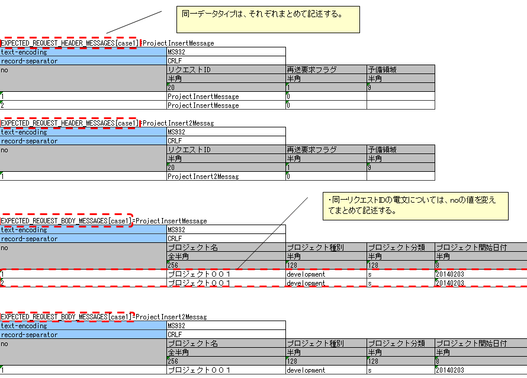

# リクエスト単体テストの実施方法(同期応答メッセージ送信処理)

**公式ドキュメント**: [リクエスト単体テストの実施方法(同期応答メッセージ送信処理)](https://nablarch.github.io/docs/LATEST/doc/development_tools/testing_framework/guide/development_guide/05_UnitTestGuide/02_RequestUnitTest/send_sync.html)

## 出力ライブラリ(同期応答メッセージ送信処理)の構造とテスト範囲

同期応答メッセージ送信処理のリクエスト単体テストは、リクエストID単位で行う。

> **補足**: ここでのリクエストIDは、メッセージ送信先システムの機能を一意に識別するIDであり、Webアプリケーションやバッチ処理で使用するリクエストIDとは意味が異なる。このIDに基づき、要求電文・応答電文のフォーマット、送信キュー名、受信キュー名が決定する。

テスト実施時の処理フロー:

1. 自動テストフレームワークがNablarch Application Frameworkを起動
2. Nablarch Application FrameworkがActionへの入力パラメータ（画面ならリクエスト、バッチならファイル/DB）を読み込み、Actionを起動
3. ActionがNablarch Application Frameworkのメッセージ同期送信処理を実行; Nablarch Application Frameworkがパラメータを要求電文に変換
4. 自動テストフレームワークがテストデータをもとに要求電文をアサート（キューにはPUTしない）
5. 自動テストフレームワークがテストデータをもとに応答電文を生成し、Actionへ返却（キューからはGETしない）

> **補足**: 自動テストフレームワークは送信/受信キューを使用せず、キューの手前で要求電文のアサートおよび応答電文の生成を行うため、特別なミドルウェアのインストールや環境設定は不要。

特色と利点:

1. **書きやすいテストデータ**: Excelファイルを使用し、外部インタフェース設計書のフォーマット定義に沿ってテストデータを記載できる。同期応答メッセージ送信処理用のテストデータ書式が提供されており、テストデータを容易に作成・保守できる。

2. **テストコードの記述不要**: 要求電文の期待値および応答電文をExcelに記載するだけで、自動テストフレームワークがアサートと応答電文返却を自動的に行う。典型的な定型処理を実装したスーパークラスが提供されており、これを使用することでほぼコーディングなしでテストが実行可能。

keywords

同期応答メッセージ送信処理, リクエスト単体テスト, 自動テストフレームワーク, キューなしテスト, ミドルウェア不要, 要求電文, 応答電文, テストデータ

## テストの実施方法

同期応答メッセージ送信処理のテストは、ウェブアプリケーションやバッチ処理などのテスト方式を踏襲して行われる。テストクラスの書き方や各種準備データの準備方法については、それぞれのテストの実施方法を参照すること。本節では同期応答メッセージ送信処理固有の実施方法についてのみ解説する。

keywords

同期応答メッセージ送信, テスト実施方法, ウェブアプリケーション, バッチ処理, テストクラス

## テストデータファイルの配置

テストデータを記載したExcelファイルは、テストソースコードと同じディレクトリに同じ名前で格納する（拡張子のみ異なる）。

テストデータの記述方法詳細については、:ref:`how_to_write_excel` を参照。

keywords

テストデータ, Excelファイル, ファイル配置, テストソースコード, how_to_write_excel

## テストデータの書き方

テストケースと要求電文の期待値・応答電文は、グループIDで対応付ける。テストケースの `expectedMessage` および `responseMessage` フィールドに記載されたグループIDが、対応する識別子を持つ表と対応する。

- テストケース一覧に `expectedMessage` および `responseMessage` の欄がない場合、検証は行われない
- これらが空欄でメッセージ同期送信処理が行われた場合はテストが失敗する
- メッセージ同期送信処理を行う場合は `expectedMessage` および `responseMessage` を必ず記載すること

1つのテストケースで同一グループIDかつ同一リクエストIDの電文が複数件送信される場合、その件数分のデータ行を記載すること。`no` 列の順番（連番）は送信される順番に一致する。

テストケースの書き方の参照先:
- ウェブアプリケーション: :ref:`request_test_testcases`
- バッチ処理: :ref:`batch_test_testcases`

> **補足**: Nablarch標準の同期応答メッセージ送信機能では、要求電文と応答電文のヘッダ部は共通フォーマットを使用するため、テストデータのヘッダ部フォーマット定義はリクエスト単位で統一すること。ボディ部については要求電文と応答電文で異なるフォーマットを定義できる。

keywords

グループID, expectedMessage, responseMessage, 要求電文期待値, 応答電文, テストケース対応付け, リクエストID

## 要求電文・応答電文の表書式

要求電文の期待値および応答電文の表は以下の書式で記載する。

識別子の書式:
- 要求電文の期待値（ヘッダ）: `EXPECTED_REQUEST_HEADER_MESSAGES[グループID]=リクエストID`
- 要求電文の本文の期待値: `EXPECTED_REQUEST_BODY_MESSAGES[グループID]=リクエストID`
- 応答電文のヘッダ: `RESPONSE_HEADER_MESSAGES[グループID]=リクエストID`
- 応答電文の本文: `RESPONSE_BODY_MESSAGES[グループID]=リクエストID`

| 名称 | 説明 |
|---|---|
| 識別子 | 電文の種類を示すID。テストケース一覧の `expectedMessage`/`responseMessage` のグループIDと紐付ける |
| ディレクティブ行 | ディレクティブ名のセルの右に設定値を記載（複数行指定可） |
| no | ディレクティブ行の下の行には必ず「no」を記載する |
| フィールド名称 | フィールドの数だけ記載する |
| データ型 | 日本語名称で記述（例: 半角英字）。[BasicDataTypeMapping](https://github.com/nablarch/nablarch-testing/blob/master/src/main/java/nablarch/test/core/file/BasicDataTypeMapping.java) のメンバ変数 `DEFAULT_TABLE` を参照 |
| フィールド長 | フィールドの数だけ記載する |
| データ | フィールドに格納されるデータ。複数レコードの場合は次の行に続けて記載。1テストケースで同一リクエストIDの複数回同期送信がある場合も同様 |

ディレクティブに記述不要な項目:
- `file-type`: テスティングフレームワークが固定長のみ対応のため
- `record-length`: フィールド長に記載したサイズでパディングするため

> **重要**: フィールド名称に重複した名称は許容されない。例えば「氏名」というフィールドが2つ以上存在してはならない（「本会員氏名」「家族会員氏名」のようにユニークなフィールド名称を付与すること）。

> **補足**: フィールド名称、データ型、フィールド長の記述は、外部インタフェース設計書からコピー＆ペーストすることで効率良く作成できる。ペーストする際は「**行列を入れ替える**」オプションにチェックすること。

keywords

EXPECTED_REQUEST_HEADER_MESSAGES, EXPECTED_REQUEST_BODY_MESSAGES, RESPONSE_HEADER_MESSAGES, RESPONSE_BODY_MESSAGES, 識別子, フィールド定義, BasicDataTypeMapping, DEFAULT_TABLE, ディレクティブ, データ型, 行列を入れ替える, 外部インタフェース設計書

## 要求電文の記載例と注意事項

要求電文の本文の期待値の記載例（リクエストID `RM21AA0104`、文字コード `Windows-31J`、レコード区切り文字 `CRLF`、レコード区分 `1`、ユーザID `0000000001`、ログインID `nabura`）:

> **重要**: 要求電文に複数のレコードが存在する場合、ヘッダと業務データを交互に記載する必要がある。ヘッダを1回だけ定義して複数の業務データを記載した場合、業務データとヘッダの数が一致しないためアサーションエラーが発生する。
>
> 正しい記載順: ヘッダ → 業務データ(1件目) → ヘッダ → 業務データ(2件目) → ヘッダ → 業務データ(3件目)

複数回電文を送信する場合の注意:
- 同一データタイプ（`RESPONSE_HEADER_MESSAGES` と `RESPONSE_BODY_MESSAGES` など）はそれぞれまとめて記述する（:ref:`tips_groupId` および [auto-test-framework_multi-datatype](testing-framework-01_Abstract.md) 参照）
- 同一リクエストIDの電文は `no` の値を変えてまとめて記述する

> **補足**: 送信対象のリクエストIDが複数存在する場合、送信順のテストは不可能。例えば `ProjectInsertMessage` より先に `ProjectInsert2Messag` が送信された場合でもテストは成功となる。

keywords

複数レコード, ヘッダ重複定義, アサーションエラー, 複数回送信, tips_groupId, auto-test-framework_multi-datatype

## 障害系のテスト

応答電文の表の「no」を除く最初のフィールドに「`errorMode:`」から始まる特定の値を設定することで障害系のテストを行うことができる。この値はヘッダおよび本文両方の最初のフィールドに記載すること。

| 設定値 | 障害内容 | 動作 |
|---|---|---|
| `errorMode:timeout` | メッセージ送信中にタイムアウトエラーが発生する場合のテスト | `MessageSendSyncTimeoutException`（`MessagingException` のサブクラス）を送出する |
| `errorMode:msgException` | メッセージ送受信エラーが発生する場合のテスト | `MessagingException` をスローする |

業務アクション内で明示的に `MessagingException` を制御していない場合、個別のリクエスト単体テストで障害系のテストを行う必要はない。

keywords

errorMode:timeout, errorMode:msgException, MessageSendSyncTimeoutException, MessagingException, 障害系テスト, タイムアウトエラー

## テスト結果検証

要求電文の期待値を定義した場合、自動テストフレームワーク側で以下の検証が行われる。

- 要求電文の内容の検証
- 要求電文の送信件数の検証

keywords

要求電文アサート, 送信件数検証, テスト結果検証, 期待値

