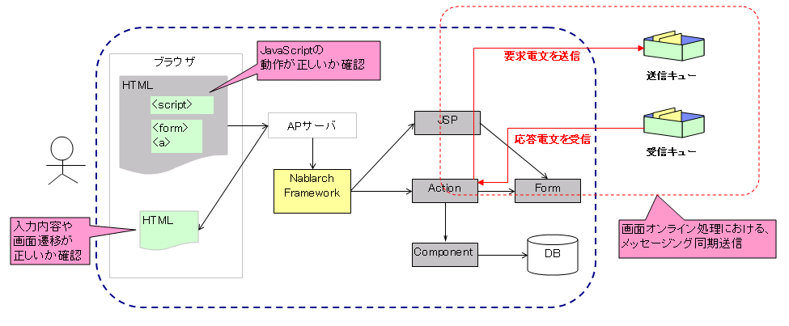
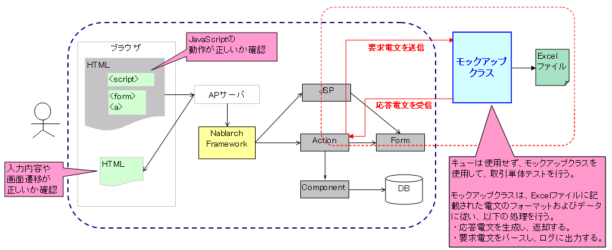

# 同期応答メッセージ送信処理を伴う取引単体テストの実施方法

**公式ドキュメント**: [同期応答メッセージ送信処理を伴う取引単体テストの実施方法](https://nablarch.github.io/docs/LATEST/doc/development_tools/testing_framework/guide/development_guide/05_UnitTestGuide/03_DealUnitTest/send_sync.html)

## 概要

同期応答メッセージ送信処理を伴うウェブアプリケーションの取引単体テストには、Nablarchが提供するモックアップクラスを使用する。モックアップクラスを使用することで、キューを用意することなく（特別なミドルウェアのインストールや環境設定不要で）取引単体テストを行うことができる。





モックアップクラスが提供する機能:

1. **任意の応答電文を返却する機能**: 送信キューおよび受信キューに接続することなく、取引単体テストに必要な応答電文を返却する。
2. **要求電文をログに出力する機能**: 画面から同期送信された要求電文をログに出力する。出力されたログはエビデンスとして使用できる。
3. **障害系のテストを行う機能**: タイムアウトエラーやメッセージ送受信エラーを発生させることができる。

> **補足**: 要求電文＝キューへ送信するメッセージ、応答電文＝キューから受信するメッセージ。

<details>
<summary>keywords</summary>

MockMessagingProvider, 同期応答メッセージ送信, モックアップクラス, 取引単体テスト, キュー接続不要, 要求電文, 応答電文

</details>

## モックアップクラスを使用した取引単体テストの実施方法

応答電文のフォーマット・データをExcelファイルに定義する（要求電文はフォーマットのみ定義）。ExcelファイルはリクエストIDごとに用意し、ファイル名をリクエストIDと一致させる（例: リクエストID「RM21AA0101」→「RM21AA0101.xlsx」）。ファイルの配置ディレクトリは設定ファイルに定義する（[send_sync_test_data_path](#s2) 参照）。

> **注意**: ここで扱うリクエストIDは相手先システムの機能を一意に識別するIDであり、ウェブアプリケーションやバッチ処理で使用するリクエストIDとは意味が異なる。

### Excelファイルの書き方

シート名は「message」固定。以下を定義する:

- 返却する応答電文のFW制御ヘッダ・本文のフォーマット
- 返却する応答電文のFW制御ヘッダ・本文のデータ
- 要求電文のFW制御ヘッダ・本文のフォーマット（データは定義不要）

### 電文のフォーマットおよびデータの記載方法

識別子（電文の種類を示すID）の書式:

| 識別子 | 対象 |
|---|---|
| `EXPECTED_REQUEST_HEADER_MESSAGES=リクエストID` | 要求電文のヘッダ |
| `EXPECTED_REQUEST_BODY_MESSAGES=リクエストID` | 要求電文の本文 |
| `RESPONSE_HEADER_MESSAGES=リクエストID` | 応答電文のヘッダ |
| `RESPONSE_BODY_MESSAGES=リクエストID` | 応答電文の本文 |

フィールド定義の各項目:

- **no**: ディレクティブ行の下の行には必ず「no」を記載する（必須）
- **フィールド名称**: フィールドの数だけ記載
- **データ型**: 「半角英字」のように日本語名称で記述。データ型と日本語名称のマッピングは [BasicDataTypeMapping](https://github.com/nablarch/nablarch-testing/blob/master/src/main/java/nablarch/test/core/file/BasicDataTypeMapping.java) の `DEFAULT_TABLE` を参照
- **フィールド長**: 「-」を記載した場合はデータの記載内容を元にサイズを自動計算
- **データ**: 応答電文の場合のみ記載。複数件の場合は次の行に続けて記載

ディレクティブで記述不要な項目:

| 項目 | 理由 |
|---|---|
| `file-type` | テスティングフレームワークが固定長のみしか対応していないため |
| `record-length` | フィールド長に記載したサイズでパディングするため |

> **補足**: フィールド名称・データ型・フィールド長は外部インタフェース設計書からコピー＆ペーストで効率的に作成できる。ペースト時は「行列を入れ替える」オプションにチェックすること。

### Excelファイルの再読み込み

Excelファイルのタイムスタンプが更新された場合、アプリケーションサーバ起動中にファイルを再読み込みする。

- 応答電文を返却するたびにnoがインクリメントされ、サーバ起動中は初期化されない
- Excelファイルを編集・上書きしてタイムスタンプを更新することで、noをリセットしてテストをやり直せる

### 障害系のテスト

応答電文の本文の最初のフィールドに以下の値を設定することで障害系のテストを行う:

| 設定値 | 障害内容 | 動作 |
|---|---|---|
| `errorMode:timeout` | タイムアウトエラー | sendSyncメソッドの戻り値としてnullを返却 |
| `errorMode:msgException` | メッセージ送受信エラー | MessagingExceptionをスロー |

### 要求電文のログ出力

要求電文のログはMap形式とCSV形式で出力される:

- **Map形式**: デバッグ用（標準出力・アプリケーションログファイルに出力）
- **CSV形式**: エビデンス取得用（専用ログファイルに出力）

ログの出力例:

* Map形式の場合

```bash
2011-10-26 13:16:10.958 MESSAGING_SEND_MAP request id=[RM11AD0101]. following message has been sent: 
  message fw header = {requestId=RM11AD0101, testCount=, resendFlag=0, reserved=}
  message body      = {authors=test3, title=test1, publisher=test2}
```

* CSV形式の場合

```bash
2011-10-26 13:16:10.958 MESSAGING_SEND_CSV request id=[RM11AD0102]. following message has been sent: 
header: 
"requestId","testCount","resendFlag","reserved"
"RM11AD0102","","0",""
body: 
"authors","title","publisher"
"test3","test1","test2"
```

log.propertiesの設定例:

```bash
# CSV形式のメッセージログのライタ（./messaging-evidence.logに出力する）
writer.MESSAGING_CSV.className=nablarch.core.log.basic.FileLogWriter
writer.MESSAGING_CSV.filePath=./messaging-evidence.log
writer.MESSAGING_CSV.formatter.className=nablarch.core.log.basic.BasicLogFormatter
writer.MESSAGING_CSV.formatter.format=$message$

# CSV形式のメッセージログのロガー
loggers.MESSAGING_CSV.nameRegex=MESSAGING_CSV
loggers.MESSAGING_CSV.level=DEBUG
loggers.MESSAGING_CSV.writerNames=MESSAGING_CSV

# Map形式のメッセージログのロガー
loggers.MESSAGING_MAP.nameRegex=MESSAGING_MAP
loggers.MESSAGING_MAP.level=DEBUG
loggers.MESSAGING_MAP.writerNames=stdout,appFile
```

### フレームワークで使用するクラスの設定

テスト用プロファイルにのみ設定する。通常はアーキテクトが設定するため、アプリケーションプログラマが設定する必要はない。環境ごとのコンポーネント切り替えは [how_to_change_componet_define](../../setup/setting-guide/setting-guide-ManagingEnvironmentalConfiguration.md) を参照。

**モックアップクラスの設定** (`nablarch.test.core.messaging.MockMessagingProvider`):

```xml
<component name="messagingProvider"
           class="nablarch.test.core.messaging.MockMessagingProvider">
</component>
```

**Excelファイルの配置場所の設定** (`nablarch.core.util.FilePathSetting`):

```xml
<component name="filePathSetting"
         class="nablarch.core.util.FilePathSetting" autowireType="None">
   <property name="basePathSettings">
     <map>
       <entry key="sendSyncTestData" value="file:///C:/nablarch/workspace/Nablarch_sample/test/message" />
       <entry key="format" value="classpath:web/format" />
     </map>
   </property>
   <property name="fileExtensions">
     <map>
       <entry key="sendSyncTestData" value="xlsx" />
       <entry key="format" value="fmt" />
     </map>
   </property>
</component>
```

> **補足**: 配置ディレクトリのパスはclasspath:ではなくfile:（ファイルシステムのパス）で指定することを推奨する。file:を指定することで、サーバ起動中に直接Excelファイルを編集してテストが可能になる。

**テストデータ解析クラスの設定** (`nablarch.test.core.reader.BasicTestDataParser`):

```xml
<component name="messagingTestDataParser" class="nablarch.test.core.reader.BasicTestDataParser">
  <property name="testDataReader">
    <component name="xlsReaderForPoi" class="nablarch.test.core.reader.PoiXlsReader"/>
  </property>
  <property name="interpreters" ref="messagingTestInterpreters" />
</component>
<list name="messagingTestInterpreters">
  <component class="nablarch.test.core.util.interpreter.NullInterpreter"/>
  <component class="nablarch.test.core.util.interpreter.QuotationTrimmer"/>
  <component class="nablarch.test.core.util.interpreter.CompositeInterpreter">
    <property name="interpreters">
      <list>
        <component class="nablarch.test.core.util.interpreter.BasicJapaneseCharacterInterpreter"/>
      </list>
    </property>
  </component>
</list>
```

**モジュール**:
```xml
<dependency>
  <groupId>com.nablarch.framework</groupId>
  <artifactId>nablarch-testing</artifactId>
  <exclusions>
    <exclusion>
      <groupId>org.mortbay.jetty</groupId>
      <artifactId>*</artifactId>
    </exclusion>
    <exclusion>
      <groupId>com.google.code.findbugs</groupId>
      <artifactId>*</artifactId>
    </exclusion>
  </exclusions>
</dependency>
```

<details>
<summary>keywords</summary>

MockMessagingProvider, BasicTestDataParser, PoiXlsReader, BasicDataTypeMapping, NullInterpreter, QuotationTrimmer, CompositeInterpreter, BasicJapaneseCharacterInterpreter, FilePathSetting, FileLogWriter, BasicLogFormatter, MessagingException, Excelファイル定義, 応答電文フォーマット, 障害系テスト, errorMode, ログ出力設定, sendSyncTestData

</details>
