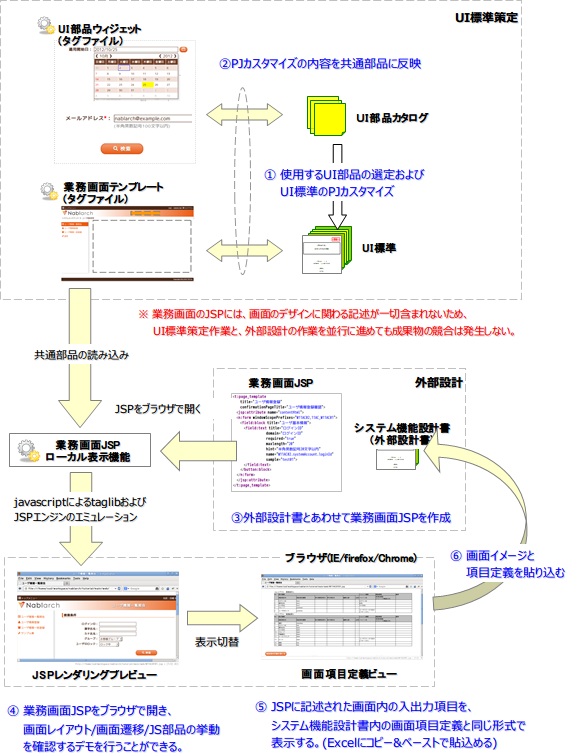

# UI開発ワークフロー

**公式ドキュメント**: [UI開発ワークフロー](https://nablarch.github.io/docs/LATEST/doc/development_tools/ui_dev/doc/introduction/ui_development_workflow.html)

## UI開発ワークフロー

NablarchのUI開発ワークフローでは、画面項目定義書と同じ抽象度のカスタムタグをJSPに記述し、デモ用モックをそのままサーバ上で稼動するJSPとして使用できる。

JSPソースから画面の見た目情報が排除され、共通部品側に集約される。これにより：

1. 各画面担当者は業務機能に関わる本質的な部分のみに集中でき、作業負荷を軽減できる
2. 画面設計とデザインのワークフローを完全に並列に進めることができる。開発終盤のUI変更要望にも最小工数で対応可能

この仕組みを支えるのがNablarch 1.3以降に同梱される [../internals/jsp_widgets](testing-framework-jsp_widgets.md) および [../internals/jsp_page_templates](testing-framework-jsp_page_templates.md) である。これらはUI標準に準拠した挙動・表示になるようあらかじめ実装されており、開発者がUI標準を意識しなくても標準に沿った画面が作成できる。

> **重要**: PJごとにUI標準に変更が発生した場合、その内容を共通部品側に反映する必要がある（図中②）。この修正が滞ると、顧客要望がデモ画面や設計書のイメージに反映されず、設計工程に支障をきたす可能性がある。

> **重要**: 共通部品を改修する担当者には、クライアントサイド技術の高度な知識・実装技術に加え、Nablarchを含むサーバサイド技術への十分な理解が必要。

keywords

UI開発ワークフロー, JSPカスタムタグ, 共通部品, 画面設計並列開発, jsp_widgets, jsp_page_templates, UI標準

