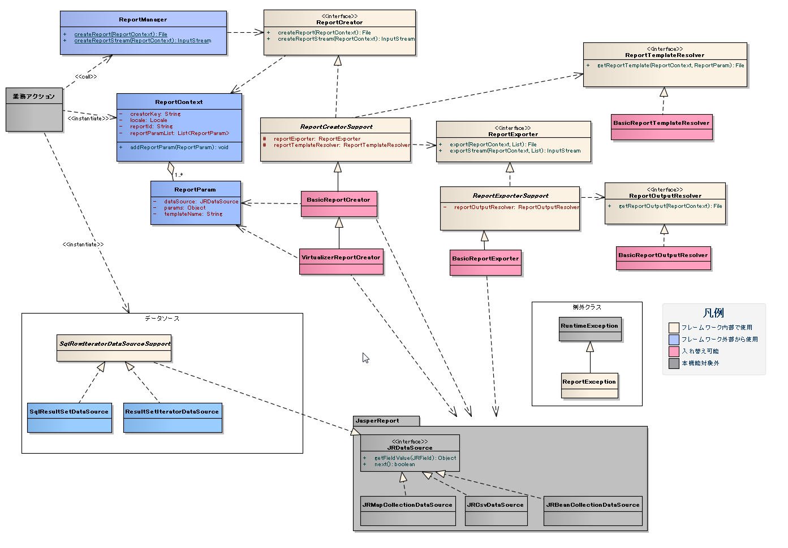

# 帳票ライブラリ

**公式ドキュメント**: [帳票ライブラリ](https://nablarch.github.io/docs/LATEST/doc/extension_components/report/index.html)

## 概要

## 概要

JasperReportsを利用したPDF帳票出力ライブラリ。JasperReports 5.6.1 (GNU LESSER GENERAL PUBLIC LICENSE version 3) を使用。

URL: [https://community.jaspersoft.com/download-jaspersoft/community-edition/](https://community.jaspersoft.com/download-jaspersoft/community-edition/) (2014/12/16時点)

> **重要**: `com.lowagie:iTextAsian:1.0.0` が現在入手困難なため、今後メンテナンスは行われない。帳票出力機能が必要な場合は以下の代替手段を検討すること。
> - 商用製品を利用する
> - ブラウザやOfficeのPDF出力機能を利用する

## リソースの配置

帳票テンプレートのルートは `FilePathSetting` で `report` キーとして指定する。

```bash
src/main/resource/
└─ report/           # FilePathSettingで"report"として指定
    └─ R001/         # REPORT ID = R001用ディレクトリ（業務コードで指定）
        ├─ index.jasper      # デフォルトテンプレート
        └─ userdata.jasper   # テンプレート名指定で利用
```

## 実装例

**クラス**: `ReportParam`, `ReportContext`, `ReportManager`

テンプレート名未指定の場合は `index.jasper` を使用:

```java
ReportParam param = new ReportParam(data);
ReportContext ctx = new ReportContext("R001");
ctx.addReportParam(param);
return ReportManager.createReport(ctx);
```

`ReportParam` の第1引数でテンプレート名を指定した場合はそのテンプレートを使用:

```java
ReportParam param = new ReportParam("userdata", data);
ReportContext ctx = new ReportContext("R001");
ctx.addReportParam(param);
return ReportManager.createReport(ctx);
```

> **補足**: 帳票のテストは出力結果のPDFファイルを目視で確認すること。

## コンポーネント設定

**クラス**: `nablarch.integration.report.creator.BasicReportCreator`, `nablarch.integration.report.templateresolver.BasicReportTemplateResolver`, `nablarch.integration.report.exporter.BasicReportExporter`, `nablarch.integration.report.outputresolver.BasicReportOutputResolver`

デフォルトのコンポーネント名は `reportCreator`:

```xml
<component name="reportCreator" class="nablarch.integration.report.creator.BasicReportCreator">
  <property name="reportTemplateResolver">
    <component class="nablarch.integration.report.templateresolver.BasicReportTemplateResolver" />
  </property>
  <property name="reportExporter">
    <component class="nablarch.integration.report.exporter.BasicReportExporter">
      <property name="reportOutputResolver">
        <component class="nablarch.integration.report.outputresolver.BasicReportOutputResolver" />
      </property>
    </component>
  </property>
</component>
```

`FilePathSetting` でレポートベースフォルダを設定:

```properties
file.path.report=classpath:report
```

```xml
<component name="filePathSetting" class="nablarch.core.util.FilePathSetting" autowireType="None">
  <property name="basePathSettings">
    <map>
      <entry key="report" value="${file.path.report}" />
    </map>
  </property>
</component>
```

<details>
<summary>keywords</summary>

JasperReports, PDF帳票出力, iTextAsian, 依存ライブラリ入手困難, メンテナンス終了, 代替手段, 帳票ライブラリ, BasicReportCreator, BasicReportTemplateResolver, BasicReportExporter, BasicReportOutputResolver, ReportParam, ReportContext, ReportManager, FilePathSetting, 帳票テンプレート配置, reportCreator, 帳票出力

</details>

## 要求

## 要求

### 実装済み機能

1. PDF形式の帳票を作成し、ファイルまたはストリーム形式で出力できる
2. 帳票テンプレートをプログラム内で指定した言語のものに切り替えることができる
3. 異なる帳票フォーマットのPDFを連結して1つのファイルとして出力できる

> **補足**: ディレード処理制御、同時実行制御、流量制御、タイムアウト設計、使用可能文字集合、使用フォント、帳票の参照権限、帳票テンプレートの管理方式、帳票データの管理・帳票クリーニング機能についてはPJにて検討すること。

> **補足**: `BasicReportOutputResolver` はPDFを帳票テンプレートと同一フォルダに一意なファイル名で作成するため、実行のたびにPDFが増えていく。対象システムの帳票出力の頻度とディスク容量より、出力後不要となった帳票ファイルを定期的に削除する処理を検討する必要がある。

> **補足**: JasperReportsの標準機能を用いることでPDFにパスワードや暗号化、ブックマーク、作成者などの各種ドキュメントプロパティを設定することが出来る。その場合には本ライブラリの修正が必要となる。

### 未実装機能

- **帳票サーバ機能**: 帳票の作成・出力を行うWebサービスを公開する機能
- **プリンタ直接印刷機能**: PDF出力を介することなく、直接プリンタに印刷要求を発行する機能

## 帳票テンプレートの言語指定

言語ごとに帳票テンプレートを用意し、プログラム側で `java.util.Locale` を指定することで、使用する帳票テンプレートを切り替える。

`BasicReportTemplateResolver` は `java.util.Locale#getLanguage` の値をアンダースコア付きで末尾に付与したファイル名を探す。

| 指定前 | 指定後（`java.util.Locale.US` の場合） |
|--------|----------------------------------------|
| index.jasper | index_en.jasper |

`index_en.jasper` が見つからない場合は、`index.jasper` にフォールバックする。

ロケール設定方法は「帳票アプリケーション開発ガイド」を参照すること。

<details>
<summary>keywords</summary>

PDF帳票出力, ストリーム出力, 言語切り替え, 帳票連結, BasicReportOutputResolver, PDF定期削除, 未実装機能, 帳票サーバ, プリンタ直接印刷, BasicReportTemplateResolver, java.util.Locale, Locale, ロケール指定, i18n, 多言語

</details>

## 構造 — クラス図

## 構造 — クラス図



## 帳票テンプレートのコンパイル（Antタスク）

アプリケーションパッケージング時、全ての `.jrxml` は `.jasper` ファイルにコンパイルしておく必要がある。

`net.sf.jasperreports.ant.JRAntCompileTask` を使ったAntタスク実装例（`[...]` 箇所はプロジェクトに適したパスに置き換える）:

```xml
<path id="classpath">
    <fileset dir="[JasperReportsライブラリ格納フォルダ]">
        <include name="**/*.jar" />
    </fileset>
</path>

<target name="compile">
    <taskdef name="jrc" classname="net.sf.jasperreports.ant.JRAntCompileTask">
        <classpath refid="classpath" />
    </taskdef>
    <jrc destdir="[コンパイルファイル出力先]" tempdir="[コンパイルファイル出力先]" keepjava="false">
        <src>
            <fileset dir="[帳票テンプレート(jrxml)格納先ルートフォルダ]">
                <include name="**/*.jrxml" />
            </fileset>
        </src>
        <classpath refid="classpath" />
    </jrc>
</target>
```

<details>
<summary>keywords</summary>

クラス図, 帳票ライブラリ構造, jrxmlコンパイル, JRAntCompileTask, jasper, jrxml, Ant, パッケージング

</details>

## 構造 — インターフェース定義

## 構造 — インターフェース定義

**a) 帳票生成処理パッケージ**
- **クラス**: `ReportCreator` — 帳票生成インタフェース

**b) 帳票出力処理パッケージ**
- **クラス**: `ReportExporter` — 帳票出力インタフェース

**c) 帳票出力先解決パッケージ**
- **クラス**: `ReportOutputResolver` — 帳票出力先のパス解決インタフェース

**d) 帳票テンプレートファイルパス解決パッケージ**
- **クラス**: `ReportTemplateResolver` — 帳票テンプレートのパス解決インタフェース

<details>
<summary>keywords</summary>

ReportCreator, ReportExporter, ReportOutputResolver, ReportTemplateResolver, インターフェース定義, 帳票生成処理パッケージ, 帳票出力処理パッケージ, 帳票出力先解決パッケージ, 帳票テンプレートファイルパス解決パッケージ

</details>

## 構造 — クラス定義

## 構造 — クラス定義

**a) 帳票管理パッケージ**
- **クラス**: `ReportManager` — 業務機能からの要求を受付、システムリポジトリ経由でReportCreatorに処理を委譲
- **クラス**: `ReportContext` — 帳票出力に関する情報を保持（出力情報・帳票ID・ReportCreatorのキー）
- **クラス**: `ReportParam` — テンプレート名と帳票テンプレートにバインドする情報を保持
- **クラス**: `ReportException` — 帳票機能でチェック例外が発生した場合に送出される実行時例外

**b) データソースパッケージ**
- **クラス**: `SqlRowIteratorDataSourceSupport` — `nablarch.core.db.statement.SqlRow` を用いた帳票テンプレートのフィールド項目バインド処理サポートクラス
- **クラス**: `SqlResultSetDataSource` — `nablarch.core.db.statement.SqlResultSet` を利用した帳票テンプレートのフィールド項目バインド実装クラス
- **クラス**: `ResultSetIteratorDataSource` — `nablarch.core.db.statement.ResultSetIterator` を利用した帳票テンプレートのフィールド項目バインド実装クラス

**c) 帳票生成処理パッケージ**
- **クラス**: `ReportCreatorSupport` — 帳票生成のサポートクラス（実際の帳票出力はReportExporterに委譲）
- **クラス**: `BasicReportCreator` — 帳票生成の基本実装クラス（帳票出力用データをJasperReportライブラリのインスタンスに変換）
- **クラス**: `VirtualizerReportCreator` — 大量データ出力をサポートするクラス

**d) 帳票出力処理パッケージ**
- **クラス**: `ReportExporterSupport` — 帳票出力のサポートクラス
- **クラス**: `BasicReportExporter` — 帳票出力の基本実装クラス

**e) 帳票出力先解決パッケージ**
- **クラス**: `BasicReportOutputResolver` — 帳票出力先のパス解決を行う基本実装クラス（帳票テンプレートと同一フォルダに一意なファイル名を生成し作成）

**f) 帳票テンプレートファイルパス解決パッケージ**
- **クラス**: `BasicReportTemplateResolver` — 帳票テンプレートのパス解決を行う基本実装クラス

<details>
<summary>keywords</summary>

ReportManager, ReportContext, ReportParam, ReportException, SqlRowIteratorDataSourceSupport, SqlResultSetDataSource, ResultSetIteratorDataSource, ReportCreatorSupport, BasicReportCreator, VirtualizerReportCreator, ReportExporterSupport, BasicReportExporter, BasicReportOutputResolver, BasicReportTemplateResolver, クラス定義

</details>

## 実装例

## 実装例

帳票出力のレイアウトおよびデータの埋め込み箇所を帳票テンプレートで管理する。帳票テンプレートの作成については [帳票アプリケーションガイド](../../../knowledge/extension/report/assets/report-report/帳票アプリケーション開発ガイド.docx) を参照すること。（ファイル: `assets/report-report/帳票アプリケーション開発ガイド.docx`）

### 帳票テンプレートのコンパイル

設計時に作成する帳票テンプレート（jrxml）は、実行時にはjasperファイルにコンパイルしておく必要がある。

### 帳票テンプレートの配置

> **補足**: 基本実装クラス（`BasicReportTemplateResolver` など）がベースとなっているため、PJ側でカスタマイズすることでマッピングの変更が可能。

<details>
<summary>keywords</summary>

帳票テンプレート, jrxml, jasperファイル, コンパイル, テンプレート配置, BasicReportTemplateResolver, 帳票アプリケーションガイド

</details>
