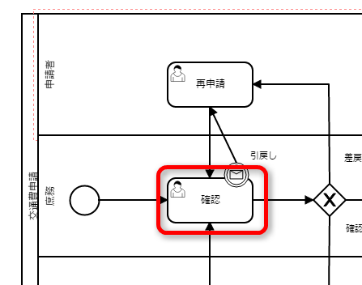
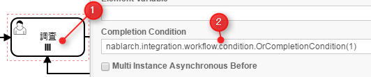
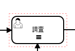
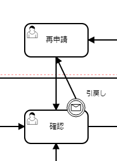
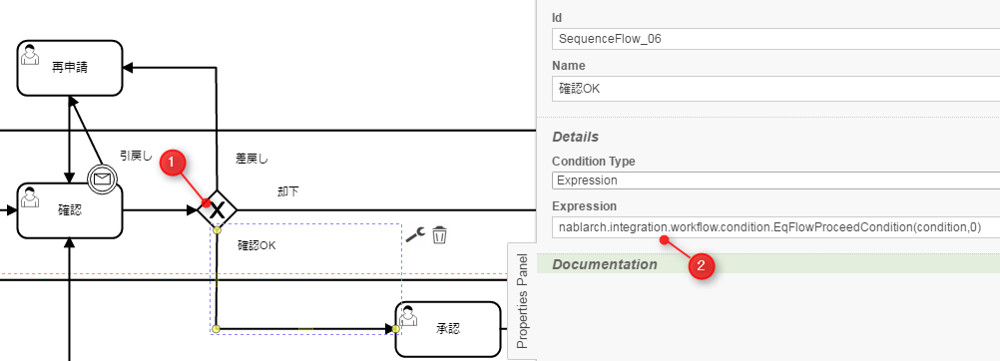
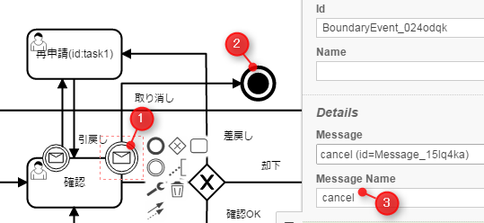
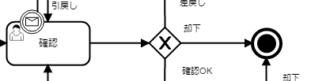
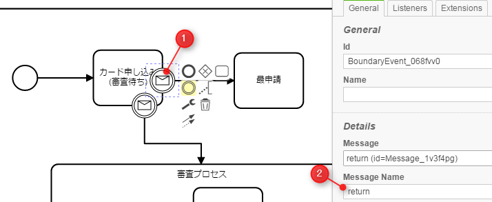
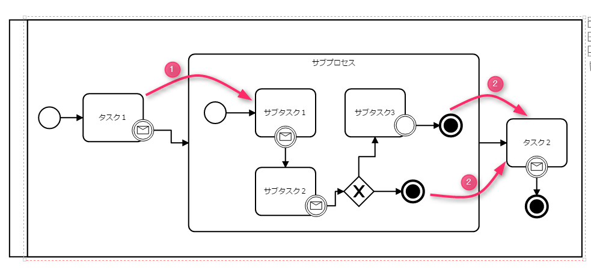
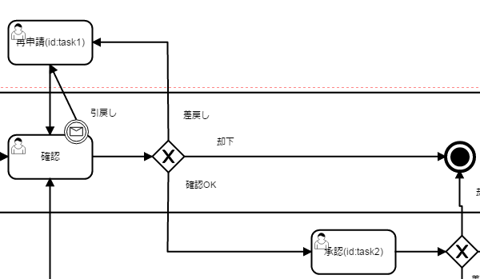

# ワークフローライブラリ

**目次**

* 機能概要

  * ワークフローが実現できる
  * ステートマシンが実現できる
* モジュール一覧
* 使用方法

  * ワークフロー(ステートマシン)の定義及び進行に必要なテーブルの作成と設定
  * ワークフローやステートマシンを定義する
  * ワークフロー(ステートマシン)を開始する
  * ワークフローのタスクに担当者やグループを割り当てる
  * ワークフローのタスクに担当者やグループを複数割り当てる
  * ワークフローの状態を遷移(タスクを完了)させる
  * アプリケーションでの処理結果に応じて遷移先のタスクを変更する
  * ワークフローの状態を元の状態に戻す（差し戻し）
  * ワークフローの申請を再度行う（再申請）
  * ワークフロー申請の取り消しを行う
  * ワークフロー申請を却下する
  * ワークフロー申請の引き戻しを行う
  * ステートマシンの状態を遷移させる
  * ステートマシンでサブプロセスを定義する
  * ワークフロー（ステートマシン）の現在の状態を取得する
  * ワークフロー（ステートマシン）の定義を変更する
* XORゲートウェイの進行先ノードの判定方法
* マルチインスタンスの完了条件の判定方法

申請フローや承認フローの進行状況およびワークフロー内の各タスクに対する担当ユーザの割り当てや、割り当て状態の管理をするために必要なワークフロー機能を提供する。
また、単純に状態のみを遷移させるステートマシン機能も提供する。

> **Tip:**
> ワークフローライブラリを使用したアプリケーションの実例は、 [Exampleアプリケーション](https://github.com/nablarch/nablarch-example-workflow) を参照。

## 機能概要

### ワークフローが実現できる

* [状態を遷移できる。](../../extension/workflow/workflow-doc.md#workflow-complete-task)
* [条件に応じて遷移先のタスクを切り替えることができる。](../../extension/workflow/workflow-doc.md#workflow-flow-condition)
* [差し戻しができる。](../../extension/workflow/workflow-doc.md#workflow-return)
* [再申請ができる。](../../extension/workflow/workflow-doc.md#workflow-reapplication)
* [取り消しができる。](../../extension/workflow/workflow-doc.md#workflow-cancel)
* [却下ができる。](../../extension/workflow/workflow-doc.md#workflow-reject)
* [引き戻しができる。](../../extension/workflow/workflow-doc.md#workflow-pullback)
* [ワークフロー定義をバージョン毎に定義できる。](../../extension/workflow/workflow-doc.md#workflow-version)

### ステートマシンが実現できる

* [状態を遷移できる。](../../extension/workflow/workflow-doc.md#workflow-statemachine-trigger)
* [条件に応じて遷移先のタスクを切り替えることができる。](../../extension/workflow/workflow-doc.md#workflow-flow-condition)
* [サブプロセスを定義できる。](../../extension/workflow/workflow-doc.md#workflow-subprocess)
* [ステートマシン定義をバージョン毎に定義できる。](../../extension/workflow/workflow-doc.md#workflow-version)

## モジュール一覧

```xml
<dependency>
    <groupId>com.nablarch.workflow</groupId>
    <artifactId>nablarch-workflow</artifactId>
</dependency>
```

## 使用方法

### ワークフロー(ステートマシン)の定義及び進行に必要なテーブルの作成と設定

この機能では、ワークフロー(ステートマシン)の定義情報をテーブルに格納し管理する。
また、状態遷移やタスクに割り当てたユーザやグループの管理もテーブルを用いて行う。
このため、これらのテーブルを事前に作成し、コンポーネント設定ファイルにテーブル名やカラム名を設定する必要がある。

以下にテーブルの構造及び設定例を示す。

テーブルの構造
ワークフロー(ステートマシン)に必要なテーブルは以下の通り。
カラム定義などの詳細は、 [workflow_model.edm](../../../knowledge/assets/workflow-doc/workflow_model.edm) を参照。
(本edmは、Oracle用に作成しているため、使用するデータベースや要件に応じてカラムの型やサイズを変更すること)

ワークフロー(ステートマシン)の定義を管理するテーブル
ワークフローやステートマシンの定義情報を管理するテーブル

レーンを管理するテーブル

フローノードを管理するテーブル

タスクを管理するテーブル

イベント(開始 or 停止イベント)を管理するテーブル

XORゲートウェイを管理するテーブル

境界イベントの定義を管理するテーブル

境界イベントトリガーの定義を管理するテーブル

シーケンスフローの定義を管理するテーブル
ワークフロー(ステートマシン)の進行状況や割当ユーザ(グループ)を管理するテーブル
進行中のワークフロー(ステートマシン)を管理するテーブル

進行中のワークフロー(ステートマシン)に含まれるタスクの情報を管理するテーブル

タスクに割り当てられた担当ユーザを管理するテーブル。
(タスクに対するユーザ割当が存在しないステートマシンでは利用しない)

タスクに割り当てられた担当グループを管理するテーブル
(タスクに対するグループ割当が存在しないステートマシンでは利用しない)

アクティブフローノードの情報を保持するテーブル

ユーザが実行可能なタスクを管理するテーブル
(タスクに対するユーザ割当が存在しないステートマシンでは利用しない)

グループが実行可能なタスクを管理するテーブル
(タスクに対するグループ割当が存在しないステートマシンでは利用しない)
コンポーネント設定ファイル
[テーブルの構造](../../extension/workflow/workflow-doc.md#workflow-table-definition) で定義したテーブルのテーブル名やカラム名をコンポーネント定義する必要がある。
[テーブルの構造](../../extension/workflow/workflow-doc.md#workflow-table-definition) からダウンロードできるedmファイルに対応したコンポーネント設定ファイルを
以下からダウンロードし必要に応じてテーブル名などを変更し利用するとよい。

* [コンポーネント設定ファイル](../../../knowledge/assets/workflow-doc/workflow-schema.xml)

ワークフロー(ステートマシン)の定義をデータベースからロードするための設定や、状態を進行させるための設定も必要となる。
以下の設定例を参考にしカスタマイズなどを行うこと。

```xml
<!--
ワークフロー(ステートマシン)全体の設定
-->
<component name="workflowConfig"
    class="nablarch.integration.workflow.WorkflowConfig">
  <property name="workflowDefinitionHolder" ref="workflowDefinitionHolder" />
  <property name="workflowInstanceDao" ref="workflowInstanceDao" />
  <property name="workflowInstanceFactory">
    <component class="nablarch.integration.workflow.BasicWorkflowInstanceFactory" />
  </property>
</component>

<!-- ワークフロー(ステートマシン)の定義を保持する機能に関する設定 -->
<component name="workflowDefinitionHolder"
    class="nablarch.integration.workflow.definition.WorkflowDefinitionHolder">
  <property name="workflowDefinitionLoader" ref="workflowLoader" />
  <property name="systemTimeProvider" ref="systemTimeProvider" />
</component>

<!-- ワークフロー(ステートマシン)の定義をロードする機能に関する設定 -->
<component name="workflowLoader"
    class="nablarch.integration.workflow.definition.loader.DatabaseWorkflowDefinitionLoader">
  <property name="transactionManager" ref="defaultDbTransactionManager" />
  <property name="workflowDefinitionSchema" ref="workflowDefinitionSchema" />
</component>

<!-- ワークフロー(ステートマシン)の進行機能に関する設定 -->
<component name="workflowInstanceDao"
    class="nablarch.integration.workflow.dao.WorkflowInstanceDao">
  <property name="instanceIdGenerator" ref="idGenerator" />
  <property name="workflowInstanceSchema" ref="workflowInstanceSchema" />
  <!-- シーケンス名 -->
  <property name="instanceIdGenerateId" value="WF_INSTANCE_ID" />
</component>

<!-- シーケンスを使ってインスタンスIDを設定するための設定 -->
<component name="idGenerator" class="nablarch.common.idgenerator.SequenceIdGenerator" />

<!-- 初期化が必要なコンポーネントを定義する(ワークフローのコンポーネントのみ記載) -->
<component name="initializer"
    class="nablarch.core.repository.initialization.BasicApplicationInitializer">
  <property name="initializeList">
    <list>
      <component-ref name="workflowInstanceDao" />
      <component-ref name="workflowDefinitionHolder" />
    </list>
  </property>
</component>
```

### ワークフローやステートマシンを定義する

ワークフローやステートマシンの定義は、 [テーブル定義](../../extension/workflow/workflow-doc.md#workflow-table-definition) で説明したように、テーブルを用いて管理する。
しかし、テーブルに直接ワークフローやステートマシンの定義を投入すること誤りなどが発生しやすく現実的ではない。

このため、ワークフローやステートマシンの定義は、BPMNモデリングツールを用いて行い、その内容をテーブルに投入する手順を推奨する。
なお、 [ワークフロー定義データ生成ツール](../../extension/workflow/workflow-tool.md#workflow-tool) を使うことでBPMNモデルからテーブルへ投入するデータを作成できる。

> **Tip:**
> BPMNのモデリングは、以下の製品などで行える。

> * >   [https://camunda.com/](https://camunda.com/)

### ワークフロー(ステートマシン)を開始する

WorkflowManager#startInstance を使用してワークフロー(ステートマシン)を開始する。

> **Tip:**
> 本APIから戻される、 WorkflowInstance からインスタンスIDを取得しアプリケーション側のテーブルなどで保持すること。
> インスタンスIDは、ワークフロー(ステートマシン)の状態を遷移させるために必要となるため、必ずアプリケーション側で保持する必要がある。

実装例
```java
// startInstanceを呼び出しワークフロー(ステートマシン)を開始する。
// 引数には開始したいワークフローのIDを指定する
final WorkflowInstance instance = WorkflowManager.startInstance("new-card");

// インスタンスIDを取得しアプリケーションのテーブルに登録する。
String instanceId = instance.getInstanceId()
```
開始後の状態
ワークフロー(ステートマシン)を開始すると最初のタスクがアクティブ状態となる。
例えば、下記の定義の場合には、赤枠のタスクがアクティブ状態となる。



### ワークフローのタスクに担当者やグループを割り当てる

WorkflowInstance#assignUser を使用してタスクに対して担当者を割り当てることができる。
また、 WorkflowInstance#assignGroup を使用してタスクにグループを割り当てることができる。
既にタスクに担当者（グループ）が割り当て済みの場合は、割り当て済みの情報を削除し再度割り当てる。

担当者（グループ）の割り当ては任意のタイミングで行える。
タスク完了時に次のタスクに対して担当者（グループ）を割り当てることもできる。

実装例
```java
// ワークフローを開始する
final WorkflowInstance instance = WorkflowManager.startInstance("new-card");

// 担当者を割り当てる
instance.assignUser("task", "admin-user");

// グループを割り当てる
instance.assignGroup("task", "group");
```

### ワークフローのタスクに担当者やグループを複数割り当てる

1つのタスクに対して、承認や確認などを行うユーザ（グループ）を複数割り当てることができる。
割り当てられたユーザ（グループ）は、順次処理をさせるか並行して処理をさせるかを選ぶことができる。
また、完了条件を適切に使用することでOR承認やAND承認といったことも実現できる。

[ワークフローのタスクに担当者やグループを割り当てる](../../extension/workflow/workflow-doc.md#workflow-assign) と同じように、ユーザやグループの割り当ては、タスクが開始される前であれば、任意のタイミングで行える。

ワークフロー定義
ユーザタスクをマルチインスタンス(①)として設定する。
Completion Condition(②)には、完了条件を設定する。この例では、複数ユーザのうち1人が処理をしたらタスクが完了するOR承認となる。
完了条件の定義方法などの詳細は [マルチインスタンスの完了条件の判定方法](../../extension/workflow/workflow-doc.md#workflow-multi-completion) を参照。



上記の定義では、平行処理となる。順次処理の場合には、タスクを以下のように定義する。


実装例
```java
// ワークフローを開始する
final WorkflowInstance instance = WorkflowManager.startInstance("new-card");

// 担当者を割り当てる。
// 順次処理の場合、Listに格納されている順に処理を行う必要がある。
instance.assignUsers("task1", Arrays.asList("user1", "user2"));

// グループを割り当てる。
// 順次処理の場合、Listに格納されている順に処理を行う必要がある。
instance.assignGroups("task1", Arrays.asList("group1", "group2"));
```

### ワークフローの状態を遷移(タスクを完了)させる

WorkflowInstance#completeUserTask や
WorkflowInstance#completeGroupTask
を使用してタスクを完了し、次のタスクに状態を遷移させることができる。
対象の WorkflowInstance は、
[ワークフロー開始時](../../extension/workflow/workflow-doc.md#workflow-start) にアプリケーション側で保持したインスタンスIDを使用して事前に取得する必要がある。

タスク完了後のワークフローの状態の取得方法は、 [ワークフロー（ステートマシン）の現在の状態を取得する](../../extension/workflow/workflow-doc.md#workflow-status) を参照。

実装例
```java
// アプリケーションのテーブルで保持しているワークフローのインスタンスIDを取得する。
final String instanceId = findInstanceId();

// WorkflowManagerからWorkflowInstanceを取得する。
WorkflowInstance instance = WorkflowManager.findInstance(instanceId);

// completeUserTaskを呼び出し、現在のタスクを完了する
// 現在ログイン中のユーザ(ThreadContext.getUserId())を使用してタスクを完了する
instance.completeUserTask();

// タスクを完了するユーザを明示的に指定できる
instance.completeUserTask("user1");

// グループの場合、必ずタスクを完了するグループを指定する必要がある
instance.completeGroupTask("group");
```
タスク完了後の状態の遷移
下記の定義の場合、再申請タスクを完了することで確認タスクがアクティブ状態となる。



### アプリケーションでの処理結果に応じて遷移先のタスクを変更する

アプリケーションでの処理結果（タスクの結果）を元に遷移先のタスクを切り替えたい場合がある。
このような場合は、XORゲートウェイを使用して進行条件及び遷移先のフローノードを定義する。

タスク完了後の状態(アクティブになったタスクやワークフローが終了したかどうか)を判定したい場合は、 [ワークフロー（ステートマシン）の現在の状態を取得する](../../extension/workflow/workflow-doc.md#workflow-status) を参照。

XORゲートウェイの定義
下記定義の用に、XORゲートウェイ(①)を用いて複数の遷移先を定義する。
XORゲートウェイから伸びるシーケンスフローには、このシーケンスフローで遷移するための条件(②)を定義する。
進行条件の定義方法などは、 [XORゲートウェイの進行先ノードの判定方法](../../extension/workflow/workflow-doc.md#workflow-xor-flow) を参照。


実装例
上記ワークフロー定義に対して、下記の実装では `condition` に対して `0` を設定しているため、
`確認OK` へと遷移し承認タスクがアクティブとなる。

```java
// 進行先を判定するために使用するパラメータを定義する。
// パラメータは、Mapとして定義しする。
Map<String, Object> parameter = new HashMap<String, Object>();
parameter.put("condition", "0");

// WorkflowInstanceを取得し、パラメータを設定してタスクを完了する。
WorkflowInstance workflow = WorkflowManager.findInstance(instanceId);
workflow.completeGroupTask(parameter, groupId);

// 遷移先のタスクを判断したい場合には、isActiveメソッドを呼び出し
// アクティブとなったタスクが何かを判断する。isActiveにはタスクのIDを指定する。
if (workflow.isActive("task1")) {
  // タスク1がアクティブとなった場合の処理
} else {
  // タスク1以外がアクティブとなった場合の処理
}
```

### ワークフローの状態を元の状態に戻す（差し戻し）

確認結果がNGだった場合などに、申請者に差し戻し処理を行いたい場合がある。
このような場合は、 [遷移先の条件分岐](../../extension/workflow/workflow-doc.md#workflow-flow-condition) を用いて差し戻しを実現する。

ワークフロー定義
下記の定義のように、遷移先を分岐させ条件に応じて再申請用のタスクに遷移させることで実現する。


### ワークフローの申請を再度行う（再申請）

[差し戻し](../../extension/workflow/workflow-doc.md#workflow-return) や [引き戻し](../../extension/workflow/workflow-doc.md#workflow-pullback) 後に再度申請するようなフローを定義したい場合がある。
このような場合は、再申請用のタスクを定義することで対応できる。

なお、再申請のタスクについては、 [通常のタスクの完了](../../extension/workflow/workflow-doc.md#workflow-complete-task) により次のタスクに遷移させれば良い。

ワークフロー定義
下記の定義のように再申請ようのタスクを作成することで実現する。


### ワークフロー申請の取り消しを行う

申請者が進行中の申請自体を取り消ししたい場合がある。
このような場合は、取り消し可能なタスクに対して境界イベントを関連付けることで対応する。

境界イベントの実行は、 WorkflowInstance#triggerEvent を使用して行う。

ワークフロー定義
取り消し可能なタスクに対して境界イベント(①)を定義する。
取り消しにより、申請フローを終了させるため境界イベントの遷移先は停止イベント(②)を指定する。
境界イベントの `Message Name` (③)に指定した値が、境界イベントを実行する `triggerEvent` に指定する値となる。


実装例
```java
// 対象のWorkflowInstanceを取得する。
final WorkflowInstance instance = WorkflowManager.findInstance(instanceId);

// triggerEventを呼び出し状態を遷移させる。
instance.triggerEvent("cancel");
```

### ワークフロー申請を却下する

確認者や承認者などが申請を却下したい場合がある。
このような場合は、 [差し戻し](../../extension/workflow/workflow-doc.md#workflow-return) と同じようにXORゲートウェイを定義し、却下の場合の遷移先を停止イベントとする。

ワークフロー定義
下記の定義のように、遷移先を分岐させ条件に応じて停止イベントに遷移させることで実現する。



### ワークフロー申請の引き戻しを行う

既に進行中の承認処理の途中で、申請者が申請内容の修正などを行うために自身のタスクにフローを強制的に戻す場合などに使用する。

[取り消し](../../extension/workflow/workflow-doc.md#workflow-cancel) と同じように、引き戻し可能なタスクに対して境界イベントを設定する。
境界イベントの遷移先には、申請者が処理可能なタスク（例えば再申請タスク）などを指定する。

ワークフロー定義
下記の定義のように、境界イベントを設定し遷移先を申請者のタスクとする。
詳細な定義方法や実装例は、 [取り消し](../../extension/workflow/workflow-doc.md#workflow-cancel) を参照。


### ステートマシンの状態を遷移させる

ステートマシンの状態を遷移させる場合は、
WorkflowInstance#triggerEvent
を使用して状態を遷移させることができる。
対象の WorkflowInstance は、
ワークフロー開始時 にアプリケーション側で保持したインスタンスIDを使用して事前に取得する必要がある。

なお、 WorkflowInstance#triggerEvent
にパラメータを指定することで、 [アプリケーションでの処理結果に応じて遷移先のタスクを変更する](../../extension/workflow/workflow-doc.md#workflow-flow-condition) を実現できる。

タスク完了後のワークフローの状態の取得方法は、 [ワークフロー（ステートマシン）の現在の状態を取得する](../../extension/workflow/workflow-doc.md#workflow-status) を参照。

ステートマシン定義
ステートマシンの場合は、タスクから遷移するシーケンスフローは全て境界イベント(①)として定義する。
境界イベントの `Message Name` (②)に定義した値が、`triggerEvent` に指定する値となる。


実装例
```java
// 対象のWorkflowInstanceを取得する。
final WorkflowInstance workflowInstance = WorkflowManager.findInstance(instanceId);

// triggerEventを呼び出し状態を遷移させる
workflowInstance.triggerEvent("return");
```

### ステートマシンでサブプロセスを定義する

ステートマシンでは、サブプロセスを使用することで、状態遷移の流れの見通しを良くできる。
サブプロセスは、BPMNのモデリングツールでの定義でのみ使用し、本ライブラリがステートマシンの進行時にサブプロセスを意識することはない。
このため、アプリケーションの実装時もサブプロセスを意識する必要はなく、 状態遷移は [ステートマシンの状態を遷移させる](../../extension/workflow/workflow-doc.md#workflow-statemachine-trigger) を使用して行えば良い。

サブプロセスの定義例
サブプロセスは下記のように定義する。親子間のサブプロセスの状態遷移は以下の通り。

* タスク１からサブプロセスに遷移すると、サブタスク１がアクティブ状態となる。(①の流れ)
* サブプロセス内で停止イベントに遷移すると、タスク２がアクティブ状態となる。（②の流れ）



### ワークフロー（ステートマシン）の現在の状態を取得する

ワークフロー（ステートマシン）の状態遷移後の状態を取得できる。
これにより、 [分岐](../../extension/workflow/workflow-doc.md#workflow-flow-condition) を使用した場合に、どのタスクがアクティブとなったかやワークフロー（ステートマシン）が完了したかを判断できるようになる。

ワークフロー（ステートマシン）の状態は、
WorkflowInstance#isActive や
WorkflowInstance#isCompleted
を使用して問い合わせることができる。

定義

実装例
```java
// 対象のWorkflowInstanceを取得する。
final WorkflowInstance instance = WorkflowManager.findInstance(instanceId);

// 上記の定義の場合で、再申請がアクティブの場合trueとなる。
if (instance.isActive("task1")) {
}

// 上記の定義の場合で、承認がアクティブの場合trueとなる。
if (instance.isActive("task2")) {

}

// 上記の定義の場合で却下となり停止イベントに遷移した場合trueとなる
if (instance.isCompleted()) {

}
```

### ワークフロー（ステートマシン）の定義を変更する

ワークフロー（ステートマシン）の定義を変更する際に、既に進行中のものについては旧バージョンの定義に従い進行できる機能を提供する。
この機能を使用することで、進行中のフローに影響をあたえることなく、ある日時点から新しいバージョンのフローを進行できるようになる。

バージョンは、ワークフロー（ステートマシン）開始時点で有効なものが自動的に適用される。
ワークフロー定義テーブルの適用日が [システム日付](../../component/libraries/libraries-date.md#date-system-time-settings) 以前で最もバージョンの大きいものが自動的に適用される。

> **Tip:**
> ワークフロー（ステートマシン）の定義の変更によっては、アプリケーションのロジックに影響をあたえるものがある。
> そのような場合は、アプリケーション側で進行中のフローのバージョンを取得しロジックを切り替える必要がある。

> バージョンの取得例
> ```java
> // 対象のWorkflowInstanceを取得する。
> final WorkflowInstance instance = WorkflowManager.findInstance(instanceId);
> 
> if (instance.getVersion() == 1L) {
>   // バージョン1の処理を行う
> } else {
>   // バージョン2以降の処理を行う
> }
> ```

## XORゲートウェイの進行先ノードの判定方法

XORゲートウェイの進行先ノードは、シーケンスフローテーブルのフロー進行条件により判定する。
フロー進行条件には、条件を判定するクラスの完全修飾名を格納する。

条件を判定するクラスは、 FlowProceedCondition を実装し作成する。
本機能で提供するクラスは、 nablarch.integration.workflow.condition パッケージ配下に格納されている。

FlowProceedCondition実装クラスの例
* 実装クラスはコンストラクタでパラメータを受け取る事ができる。（パラメータはString限定)
  パラメータを受け取るクラスを使用する場合、テーブルのフロー進行条件には `sample.SampleFlowProceedCondition("key", "value")`
  のように引数に設定する値を含めて格納する必要がある。
* isMatch
  で指定のシーケンスフローに対して遷移可能かどうかの結果を返す。

```java
public class SampleFlowProceedCondition implements FlowProceedCondition {

  // コンストラクタ
  // パラメータを受け取る場合は、文字列型(String)で定義する。
  public StringEqualFlowProceedCondition(String paramKey, String expectedValue) {
  }

  // isMatchで指定されたSequenceFlowに遷移可能かどうかを判定する。
  @Override
  public boolean isMatch(String instanceId, Map<String, ?> param, SequenceFlow sequenceFlow) {
  }
}
```

## マルチインスタンスの完了条件の判定方法

マルチインスタンの完了は、タスクテーブルの完了条件により判定する。
完了条件には、条件を判定するクラスの完全修飾名を格納する。

条件を判定するクラスは、 CompletionCondition を実装し作成する。
本機能で提供するクラスは、 nablarch.integration.workflow.condition パッケージ配下に格納されている。

CompletionConditionの実装例
* 実装クラスはコンストラクタでパラメータを受け取る事ができる。（パラメータはString限定)
  パラメータを受け取るクラスを使用する場合、テーブルのフロー進行条件には `sample.SampleCompletionCondition("1")`
  のように引数に設定する値を含めて格納する必要がある。
* isCompletedUserTask
  でユーザタスクの完了判定を行う。
* isCompletedGroupTask
  でグループタスクの完了判定を行う。

```java
public class OrCompletionCondition implements CompletionCondition {

  // コンストラクタ
  // パラメータを受け取る場合は、文字列型(String)で定義する。
  public OrCompletionCondition(String threshold) {
  }

  // ユーザタスクの完了判定を行う。
  @Override
  public boolean isCompletedUserTask(Map<String, ?> param, String instanceId, Task task) {
  }

  // グループタスクの完了判定を行う。
  @Override
  public boolean isCompletedGroupTask(Map<String, ?> param, String instanceId, Task task) {
  }
}
```
