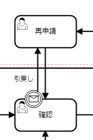
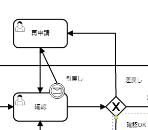

# ワークフローライブラリ

**公式ドキュメント**: [1](https://nablarch.github.io/docs/LATEST/doc/extension_components/workflow/doc/index.html) [2](https://nablarch.github.io/docs/LATEST/javadoc/nablarch/integration/workflow/WorkflowManager.html) [3](https://nablarch.github.io/docs/LATEST/javadoc/nablarch/integration/workflow/WorkflowInstance.html) [4](https://nablarch.github.io/docs/LATEST/javadoc/nablarch/integration/workflow/condition/FlowProceedCondition.html) [5](https://nablarch.github.io/docs/LATEST/javadoc/nablarch/integration/workflow/condition/package-summary.html) [6](https://nablarch.github.io/docs/LATEST/javadoc/nablarch/integration/workflow/condition/CompletionCondition.html)

## 機能概要

申請フロー・承認フローの進行状況管理、タスク担当者/グループの割り当て・管理を行うワークフロー機能と、状態のみを遷移させるステートマシン機能を提供する。

**ワークフローが実現できる機能**:
- [状態遷移](#s7)
- [条件に応じた遷移先切り替え](#s8)
- [差し戻し](#s9)
- [再申請](#s10)
- [取り消し](#s11)
- [却下](#s12)
- [引き戻し](#s13)
- [ワークフロー定義のバージョン管理](#)

**ステートマシンが実現できる機能**:
- [状態遷移](#)
- [条件に応じた遷移先切り替え](#s8)
- [サブプロセス定義](#)
- [ステートマシン定義のバージョン管理](#)

ワークフロー申請の引き戻しは、進行中の承認処理の途中で申請者が自身のタスクにフローを強制的に戻す場合に使用する。

[取り消し](#s11) と同様に、引き戻し可能なタスクに対して境界イベントを設定する。境界イベントの遷移先には、申請者が処理可能なタスク（例: 再申請タスク）を指定する。

**ワークフロー定義**: 境界イベントを設定し遷移先を申請者のタスクとする。詳細な定義方法や実装例は [取り消し](#s11) を参照。



<details>
<summary>keywords</summary>

ワークフロー, ステートマシン, 状態遷移, 差し戻し, 再申請, 取り消し, 却下, 引き戻し, バージョン管理, サブプロセス, ワークフロー引き戻し, 境界イベント, 申請者タスク返戻, フロー強制返戻, workflow-cancel

</details>

## モジュール一覧

**モジュール**:
```xml
<dependency>
    <groupId>com.nablarch.workflow</groupId>
    <artifactId>nablarch-workflow</artifactId>
</dependency>
```

ステートマシンの状態を遷移させるには `WorkflowInstance#triggerEvent` を使用する。対象の `WorkflowInstance` は、ワークフロー開始時にアプリケーション側で保持したインスタンスIDを使用して事前に取得する必要がある。

`WorkflowInstance#triggerEvent` にパラメータを指定することで [workflow-flow_condition](#s8) を実現できる。

**ステートマシン定義**: タスクから遷移するシーケンスフローは全て境界イベントとして定義する。境界イベントの `Message Name` に定義した値が `triggerEvent` に指定する値となる。


```java
// 対象のWorkflowInstanceを取得する。
final WorkflowInstance workflowInstance = WorkflowManager.findInstance(instanceId);

// triggerEventを呼び出し状態を遷移させる
workflowInstance.triggerEvent("return");
```

<details>
<summary>keywords</summary>

nablarch-workflow, com.nablarch.workflow, Maven依存, WorkflowInstance, WorkflowManager, triggerEvent, findInstance, ステートマシン状態遷移, 境界イベントMessage Name, workflow-flow_condition

</details>

## ワークフロー(ステートマシン)の定義及び進行に必要なテーブルの作成と設定

ワークフロー(ステートマシン)の定義情報、状態遷移、タスク担当者/グループをテーブルで管理する。テーブルを事前作成し、コンポーネント設定ファイルにテーブル名・カラム名を設定すること。カラム定義の詳細は [workflow_model.edm](../../../knowledge/extension/workflow/assets/workflow-doc/workflow_model.edm) を参照（Oracle用のため、使用するDBや要件に合わせて型・サイズを変更すること）。

**定義管理テーブル**:
- ワークフロー定義テーブル: ワークフロー/ステートマシンの定義情報
- レーンテーブル: レーン管理
- フローノードテーブル: フローノード管理
- タスクテーブル: タスク管理
- イベントテーブル: 開始/停止イベント管理
- ゲートウェイテーブル: XORゲートウェイ管理
- 境界イベントテーブル: 境界イベント定義
- 境界イベントトリガーテーブル: 境界イベントトリガー定義
- シーケンスフローテーブル: シーケンスフロー定義

**進行状況管理テーブル**:
- ワークフローインスタンステーブル: 進行中のワークフロー/ステートマシン
- インスタンスフローノードテーブル: 進行中インスタンスのタスク情報
- タスク担当ユーザテーブル: タスクの担当ユーザ（ユーザ割当なしのステートマシンでは不要）
- タスク担当グループテーブル: タスクの担当グループ（グループ割当なしのステートマシンでは不要）
- アクティブフローノードテーブル: アクティブフローノード情報
- アクティブユーザタスクテーブル: ユーザが実行可能なタスク（ユーザ割当なしのステートマシンでは不要）
- アクティブグループタスクテーブル: グループが実行可能なタスク（グループ割当なしのステートマシンでは不要）

コンポーネント設定ファイルは [workflow-schema.xml](../../../knowledge/extension/workflow/assets/workflow-doc/workflow-schema.xml) をダウンロードして利用可能。

**コンポーネント設定例**:
```xml
<!-- ワークフロー(ステートマシン)全体の設定 -->
<component name="workflowConfig"
    class="nablarch.integration.workflow.WorkflowConfig">
  <property name="workflowDefinitionHolder" ref="workflowDefinitionHolder" />
  <property name="workflowInstanceDao" ref="workflowInstanceDao" />
  <property name="workflowInstanceFactory">
    <component class="nablarch.integration.workflow.BasicWorkflowInstanceFactory" />
  </property>
</component>

<component name="workflowDefinitionHolder"
    class="nablarch.integration.workflow.definition.WorkflowDefinitionHolder">
  <property name="workflowDefinitionLoader" ref="workflowLoader" />
  <property name="systemTimeProvider" ref="systemTimeProvider" />
</component>

<component name="workflowLoader"
    class="nablarch.integration.workflow.definition.loader.DatabaseWorkflowDefinitionLoader">
  <property name="transactionManager" ref="defaultDbTransactionManager" />
  <property name="workflowDefinitionSchema" ref="workflowDefinitionSchema" />
</component>

<component name="workflowInstanceDao"
    class="nablarch.integration.workflow.dao.WorkflowInstanceDao">
  <property name="instanceIdGenerator" ref="idGenerator" />
  <property name="workflowInstanceSchema" ref="workflowInstanceSchema" />
  <property name="instanceIdGenerateId" value="WF_INSTANCE_ID" />
</component>

<component name="idGenerator" class="nablarch.common.idgenerator.SequenceIdGenerator" />

<!-- 初期化が必要なコンポーネントの定義 -->
<component name="initializer"
    class="nablarch.core.repository.initialization.BasicApplicationInitializer">
  <property name="initializeList">
    <list>
      <component-ref name="workflowInstanceDao" />
      <component-ref name="workflowDefinitionHolder" />
    </list>
  </property>
</component>
```

ステートマシンではサブプロセスを使用することで、状態���移の流れの見通しを良くできる。

- サブプロセスはBPMNのモデリングツールでの定義でのみ使用する。本ライブラリはステートマシンの進行時にサブプロセスを意識しない。
- アプリケーションの実装時もサブプロセスを意識する必要はなく、状態遷移は [workflow-statemachine_trigger](#) を使用して行えば良い。

**サブプロセスの状態遷移**:
1. タスク１からサブプロセスに遷移すると、サブタスク１がアクティブ状態となる
2. サブプロセス内で停止イベントに遷移すると、タスク２がアクティブ状態となる


<details>
<summary>keywords</summary>

テーブル定義, WorkflowConfig, WorkflowDefinitionHolder, DatabaseWorkflowDefinitionLoader, WorkflowInstanceDao, BasicWorkflowInstanceFactory, SequenceIdGenerator, BasicApplicationInitializer, workflowDefinitionSchema, workflowInstanceSchema, ワークフロー定義テーブル, アクティブフローノードテーブル, サブプロセス定義, ステートマシン, BPMN, サブタスク状態遷移, workflow-statemachine_trigger

</details>

## ワークフローやステートマシンを定義する

テーブルへの直接投入は誤りが発生しやすいため、BPMNモデリングツール（[Camunda](https://camunda.com/) など）でワークフロー/ステートマシンを定義し、[workflow_tool](workflow-tool.md) を使ってBPMNモデルからテーブル投入データを作成する手順を推奨する。

ワークフロー（ステートマシン）の状態遷移後の状態を取得できる。[分岐](#s8) を使用した場合に、どのタスクがアクティブとなったかやワークフローが完了したかを判断できる。

- `WorkflowInstance#isActive`: 指定タスクIDがアクティブかどうかを判定
- `WorkflowInstance#isCompleted`: ワークフローが完了したかどうかを判定


```java
// 対象のWorkflowInstanceを取得��る。
final WorkflowInstance instance = WorkflowManager.findInstance(instanceId);

// 再申請がアクティブの場合trueとなる。
if (instance.isActive("task1")) {
}

// 承認がアクティブの場合trueとなる。
if (instance.isActive("task2")) {
}

// 却下となり停止イベントに遷移した場合trueとなる
if (instance.isCompleted()) {
}
```

<details>
<summary>keywords</summary>

BPMNモデリング, workflow_tool, Camunda, ワークフロー定義, テーブル投入, WorkflowInstance, WorkflowManager, isActive, isCompleted, findInstance, ワークフロー状態取得, アクティブタスク確認, 完了確認

</details>

## ワークフロー(ステートマシン)を開始する

`WorkflowManager#startInstance` を使用してワークフロー(ステートマシン)を開始する。引数には開始するワークフローのIDを指定する。

> **補足**: 戻り値の `WorkflowInstance` からインスタンスIDを取得し、アプリケーション側のテーブル等で保持すること。インスタンスIDは状態遷移に必要なため、必ずアプリケーション側で保持する必要がある。

開始後、最初のタスクがアクティブ状態となる。

**実装例**:
```java
// ワークフローIDを引数に指定して開始
final WorkflowInstance instance = WorkflowManager.startInstance("new-card");

// インスタンスIDを取得してアプリケーションのテーブルに登録
String instanceId = instance.getInstanceId();
```

ワークフロー（ステートマシン）の定義を変更する際、既に進行中のものについては旧バージョンの定義に従い進行できる。これにより、進行中のフローに影響を与えることなく、ある日時点から新しいバージョンのフローを進行できる。

バージョンはワークフロー開始時点で有効なものが自動的に適用される。ワークフロー定義テーブルの適用日が [システム日付](../../component/libraries/libraries-date.md) 以前で最もバージョンの大きいものが自動的に適用される。

> **補足**: 定義変更によってアプリケーションのロジックに影響を与える場合は、アプリケーション側で進行中のフローのバージョンを取得しロジックを切り替える必要がある。

```java
// 対象のWorkflowInstanceを取得する。
final WorkflowInstance instance = WorkflowManager.findInstance(instanceId);

if (instance.getVersion() == 1L) {
  // バージョン1の処理を行う
} else {
  // バージョン2以降の処理を行う
}
```

<details>
<summary>keywords</summary>

WorkflowManager, startInstance, WorkflowInstance, getInstanceId, インスタンスID, ワークフロー開始, getVersion, ワークフロー定義バージョン管理, 旧バージョン継続実行, バージョン切り替え, date-system_time_settings

</details>

## ワークフローのタスクに担当者やグループを割り当てる

- `WorkflowInstance#assignUser`: タスクに担当者を割り当てる
- `WorkflowInstance#assignGroup`: タスクにグループを割り当てる

既に担当者(グループ)が割り当て済みの場合、既存の割り当てを削除して再割り当てする。割り当ては任意のタイミングで行える（タスク完了時に次タスクへ割り当てることも可能）。

**実装例**:
```java
final WorkflowInstance instance = WorkflowManager.startInstance("new-card");

// 担当者を割り当てる
instance.assignUser("task", "admin-user");

// グループを割り当てる
instance.assignGroup("task", "group");
```

XORゲートウェイの進行先ノードは、シーケンスフローテーブルのフロー進行条件により判定する。フロー進行条件には、条件を判定するクラスの完全修飾名を格納する。

条件クラスは `FlowProceedCondition` を実装して作成する。提供クラスは `condition` パッケージ配下に格納されている。

- 実装クラスはコンストラクタでパラメータを受け取ることができる（パラメータはString限定）
- パラメータを受け取るクラスを使用する場合、テーブルのフロー進行条件に `sample.SampleFlowProceedCondition("key", "value")` のように引数を含めて格納する必要がある
- `isMatch` で指定シーケンスフローへの遷移可否を返す

```java
public class SampleFlowProceedCondition implements FlowProceedCondition {

  // パラメータを受け取る場合は、文字列型(String)で定義する。
  public StringEqualFlowProceedCondition(String paramKey, String expectedValue) {
  }

  @Override
  public boolean isMatch(String instanceId, Map<String, ?> param, SequenceFlow sequenceFlow) {
  }
}
```

<details>
<summary>keywords</summary>

WorkflowInstance, assignUser, assignGroup, タスク担当者割り当て, タスクグループ割り当て, FlowProceedCondition, XORゲートウェイ, フロー進行条件, シーケンスフロー, FlowProceedCondition実装, isMatch, SequenceFlow

</details>

## ワークフローのタスクに担当者やグループを複数割り当てる

1つのタスクに対して複数のユーザ/グループを割り当て可能。並行処理または順次処理を選択できる。Completion Condition（完了条件）の設定でOR承認・AND承認を実現できる。完了条件の詳細は [workflow-multi_completion](#) を参照。

ワークフロー定義でユーザタスクをマルチインスタンス(①)として設定し、Completion Condition(②)に完了条件を設定する。上記の定義は平行処理となる。順次処理の場合は、タスクを別の方法で定義する必要がある。

割り当ては [workflow-assign](#s5) と同様、タスクが開始される前であれば任意のタイミングで行える。

**実装例**:
```java
final WorkflowInstance instance = WorkflowManager.startInstance("new-card");

// 複数担当者を割り当てる（順次処理の場合はList順に処理）
instance.assignUsers("task1", Arrays.asList("user1", "user2"));

// 複数グループを割り当てる（順次処理の場合はList順に処理）
instance.assignGroups("task1", Arrays.asList("group1", "group2"));
```

マルチインスタンスの完了は、タスクテーブルの完了条件により判定する。完了条件には、条件を判定するクラスの完全修飾名を格納する。

条件クラスは `CompletionCondition` を実装して作成する。提供クラスは `condition` パッケージ配下に格納されている。

- 実装クラスはコンストラクタでパラメータを受け取ることができる（パラメータはString限定）
- パラメータを受け取るクラスを使用する場合、テーブルのフロー進行条件には `sample.SampleCompletionCondition("1")` のように引数に設定する値を含めて格納する必要がある
- `isCompletedUserTask`: ユーザタスクの完了判定
- `isCompletedGroupTask`: グループタスクの完了判定

```java
public class OrCompletionCondition implements CompletionCondition {

  // パラメータを受け取る場合は、文字列型(String)で定義する。
  public OrCompletionCondition(String threshold) {
  }

  @Override
  public boolean isCompletedUserTask(Map<String, ?> param, String instanceId, Task task) {
  }

  @Override
  public boolean isCompletedGroupTask(Map<String, ?> param, String instanceId, Task task) {
  }
}
```

<details>
<summary>keywords</summary>

assignUsers, assignGroups, マルチインスタンス, OR承認, AND承認, 並行処理, 順次処理, Completion Condition, workflow-multi_completion, WorkflowManager, WorkflowInstance, CompletionCondition, isCompletedUserTask, isCompletedGroupTask, マルチインスタンス完了条件, CompletionCondition実装, ユーザタスク完了判定, グループタスク完了判定, Task

</details>

## ワークフローの状態を遷移(タスクを完了)させる

`WorkflowInstance#completeUserTask` または `WorkflowInstance#completeGroupTask` でタスクを完了し、次タスクへ状態を遷移させる。

事前に [ワークフロー開始時](#s4) に保持したインスタンスIDで `WorkflowManager.findInstance()` を呼び出し、WorkflowInstanceを取得すること。タスク完了後のワークフロー状態取得は [workflow-status](#) を参照。

**実装例**:
```java
final String instanceId = findInstanceId();
WorkflowInstance instance = WorkflowManager.findInstance(instanceId);

// 現在ログイン中のユーザ(ThreadContext.getUserId())でタスクを完了
instance.completeUserTask();

// ユーザを明示的に指定して完了
instance.completeUserTask("user1");

// グループの場合、必ずグループを指定
instance.completeGroupTask("group");
```

<details>
<summary>keywords</summary>

completeUserTask, completeGroupTask, findInstance, WorkflowManager, タスク完了, 状態遷移, ThreadContext

</details>

## アプリケーションでの処理結果に応じて遷移先のタスクを変更する

XORゲートウェイを使用して進行条件と遷移先フローノードを定義する。XORゲートウェイから伸びるシーケンスフローに遷移条件を設定する。進行条件の定義方法は [workflow-xor_flow](#) を参照。

タスク完了後の状態（アクティブなタスクの判断、ワークフロー終了の判断）は [workflow-status](#) を参照。

**実装例**（`condition=0` で「確認OK」へ遷移し承認タスクがアクティブとなる場合）:
```java
// 進行先を判定するパラメータをMapで定義
Map<String, Object> parameter = new HashMap<String, Object>();
parameter.put("condition", "0");

WorkflowInstance workflow = WorkflowManager.findInstance(instanceId);
workflow.completeGroupTask(parameter, groupId);

// isActiveでアクティブなタスクを判断（引数にタスクIDを指定）
if (workflow.isActive("task1")) {
  // タスク1がアクティブとなった場合の処理
} else {
  // タスク1以外がアクティブとなった場合の処理
}
```

<details>
<summary>keywords</summary>

XORゲートウェイ, isActive, 条件分岐, workflow-xor_flow, 進行条件, completeGroupTask, workflow-status, WorkflowManager, findInstance

</details>

## ワークフローの状態を元の状態に戻す（差し戻し）

[遷移先の条件分岐](#s8) (XORゲートウェイ)を使用して差し戻しを実現する。条件に応じて再申請用タスクへ遷移させるようにワークフローを定義する。



<details>
<summary>keywords</summary>

差し戻し, XORゲートウェイ, 遷移先分岐, 再申請タスク

</details>

## ワークフローの申請を再度行う（再申請）

[差し戻し](#s9) や [引き戻し](#s13) 後の再申請は、ワークフロー定義に再申請用タスクを作成することで対応する。再申請タスクは [通常のタスク完了](#s7) で次タスクへ遷移させる。

<details>
<summary>keywords</summary>

再申請, 再申請タスク, completeUserTask, 差し戻し後再申請

</details>

## ワークフロー申請の取り消しを行う

取り消し可能なタスクに境界イベントを関連付けることで実現する。境界イベントの実行は `WorkflowInstance#triggerEvent` を使用する。

境界イベントの `Message Name` に設定した値が `triggerEvent` の引数となる。取り消し時にフローを終了させるため、境界イベントの遷移先は停止イベントを指定する。

**実装例**:
```java
final WorkflowInstance instance = WorkflowManager.findInstance(instanceId);
instance.triggerEvent("cancel");
```

<details>
<summary>keywords</summary>

境界イベント, triggerEvent, WorkflowInstance, 取り消し, 停止イベント, Message Name

</details>

## ワークフロー申請を却下する

XORゲートウェイを使用して遷移先を分岐させ、却下の場合は停止イベントへ遷移させることで却下を実現する。[差し戻し](#s9) と同様の手法を使用する。


<details>
<summary>keywords</summary>

却下, XORゲートウェイ, 停止イベント, 遷移先分岐

</details>
