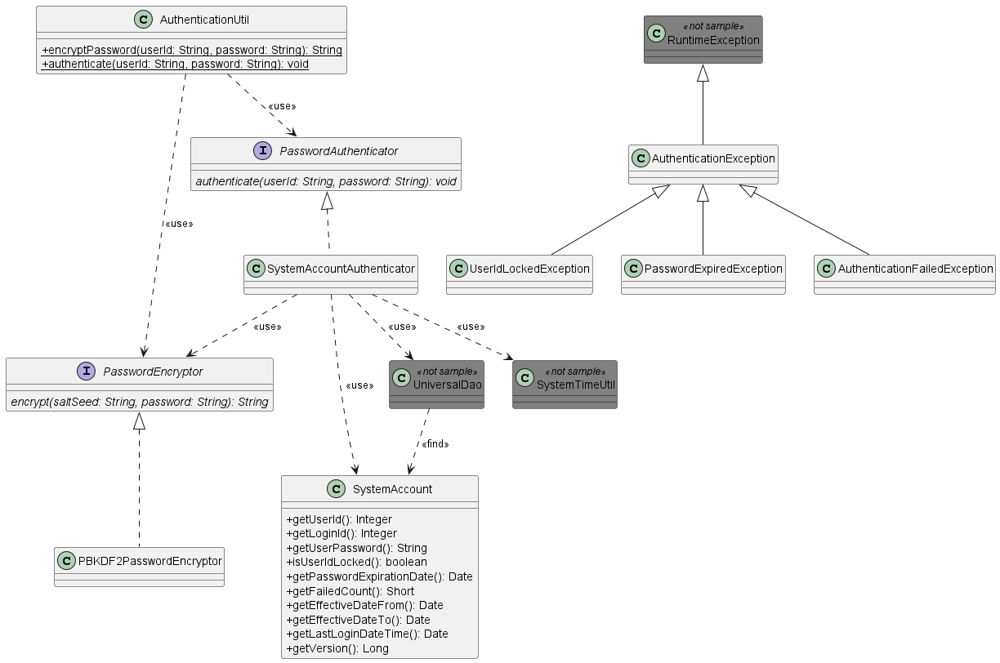

# データベースを用いたパスワード認証機能サンプル

**公式ドキュメント**: [データベースを用いたパスワード認証機能サンプル](https://nablarch.github.io/docs/LATEST/doc/biz_samples/01/index.html)

## 提供パッケージ

**パッケージ**: `please.change.me.common.authentication`

<details>
<summary>keywords</summary>

please.change.me.common.authentication, パッケージ, common.authentication

</details>

## 概要

ウェブアプリケーションのユーザ認証（ユーザID/パスワード）の実装サンプル。ログイン処理の業務処理内で使用する想定。

> **補足**: Nablarch導入プロジェクトでは、要件を満たすよう本サンプル実装を修正し使用すること。

ログイン処理を実行する業務処理は本機能では提供しない。Nablarch導入プロジェクトにて、要件に応じてログイン処理を作成すること。

デフォルトで[PBKDF2](https://www.ietf.org/rfc/rfc2898.txt)を使用してパスワードを暗号化する。各プロジェクトで、ストレッチング回数やソルトなどを設定する必要がある。設定内容の詳細については [0101_PBKDF2PasswordEncryptor](biz-samples-0101_PBKDF2PasswordEncryptor.md) を参照。

<details>
<summary>keywords</summary>

PBKDF2, パスワード暗号化, ユーザ認証, ストレッチング, ソルト, 0101_PBKDF2PasswordEncryptor

</details>

## 構成 - クラス図



<details>
<summary>keywords</summary>

クラス図, Authentication_ClassDiagram

</details>

## 構成 - クラスの責務

**インタフェース**:

| インタフェース名 | 概要 |
|---|---|
| `PasswordAuthenticator` | ユーザを認証するインタフェース |
| `PasswordEncryptor` | パスワードを暗号化するインタフェース |

**クラス**:

| クラス名 | 概要 |
|---|---|
| `SystemAccountAuthenticator` | PasswordAuthenticatorの実装。データベースのアカウント情報に対してパスワード認証する |
| `PBKDF2PasswordEncryptor` | PasswordEncryptorの実装。PBKDF2を使用してパスワードを暗号化する |
| `AuthenticationUtil` | システムリポジトリからPasswordAuthenticatorおよびPasswordEncryptorを取得し、ユーザ認証・パスワード暗号化を行うユーティリティ |
| `SystemAccount` | ユーザのアカウント情報を保持するエンティティクラス（ユニバーサルDAOの検索結果を格納） |

> **補足**: エンティティクラスは [gsp-dba-maven-plugin(DBA作業支援ツール)](../../setup/blank-project/blank-project-addin_gsp.md) を使用して自動生成する。本サンプルのエンティティクラスをそのまま使用せず、各プロジェクトで自動生成したものを使用すること。

<details>
<summary>keywords</summary>

PasswordAuthenticator, PasswordEncryptor, SystemAccountAuthenticator, PBKDF2PasswordEncryptor, AuthenticationUtil, SystemAccount, インタフェース定義, クラス定義, gsp-maven-plugin

</details>

## 構成 - 例外クラスとテーブル定義

**例外クラス**:

| クラス名 | 概要 |
|---|---|
| `AuthenticationException` | 認証失敗例外の基底クラス。認証方式に応じてサブクラスを作成する |
| `AuthenticationFailedException` | アカウント情報不一致による認証失敗例外。対象ユーザのユーザIDを保持 |
| `PasswordExpiredException` | パスワード有効期限切れ例外。ユーザID、有効期限、チェックに使用した業務日付を保持 |
| `UserIdLockedException` | ユーザIDロック例外。ユーザIDとロックする認証失敗回数を保持 |

**テーブル定義（SYSTEM_ACCOUNT）**:

| 論理名 | 物理名 | Javaの型 | 制約 |
|---|---|---|---|
| ユーザID | USER_ID | `java.lang.Integer` | 主キー |
| ログインID | LOGIN_ID | `java.lang.String` | |
| パスワード | USER_PASSWORD | `java.lang.String` | |
| ユーザIDロック | USER_ID_LOCKED | `boolean` | ロックしている場合はtrue |
| パスワード有効期限 | PASSWORD_EXPIRATION_DATE | `java.util.Date` | |
| 認証失敗回数 | FAILED_COUNT | `java.lang.Short` | |
| 有効日(From) | EFFECTIVE_DATE_FROM | `java.util.Date` | |
| 有効日(To) | EFFECTIVE_DATE_TO | `java.util.Date` | |
| 最終ログイン日時 | LAST_LOGIN_DATE_TIME | `java.util.Date` | |

> **補足**: 本サンプル導入時には、導入プロジェクトのテーブル定義に従いSQLファイルおよびソースコードを修正すること。必要なユーザ属性を追加したり、1対1で紐づくユーザ情報テーブルを作成するなど、要件を満たすようテーブル設計すること。

<details>
<summary>keywords</summary>

AuthenticationException, AuthenticationFailedException, PasswordExpiredException, UserIdLockedException, SYSTEM_ACCOUNT, テーブル定義, USER_ID, LOGIN_ID, USER_PASSWORD, FAILED_COUNT, PASSWORD_EXPIRATION_DATE, USER_ID_LOCKED, EFFECTIVE_DATE_FROM, EFFECTIVE_DATE_TO, LAST_LOGIN_DATE_TIME

</details>

## 使用方法 - 概要と特徴

パスワード認証の特徴:

- 認証時にアカウント情報の有効日（From/To）をチェックする
- 認証時にパスワードの有効期限をチェックする
- 連続で指定回数認証失敗するとユーザIDをロックする。認証成功すると失敗回数をリセット
- 暗号化されたパスワード（デフォルトはPBKDF2）を使用して認証する
- 認証成功時のみシステム日時で最終ログイン日時を更新する

業務機能（ログイン、ユーザ登録等）からは `AuthenticationUtil` を使用すること。

<details>
<summary>keywords</summary>

パスワード認証, 有効日, 有効期限チェック, ユーザIDロック, 最終ログイン日時, AuthenticationUtil

</details>

## SystemAccountAuthenticatorの使用方法

```xml
<component name="authenticator" class="please.change.me.common.authentication.SystemAccountAuthenticator">
  <property name="passwordEncryptor" ref="passwordEncryptor" />
  <property name="dbManager">
    <component class="nablarch.core.db.transaction.SimpleDbTransactionManager">
      <property name="dbTransactionName" value="authenticator"/>
      <property name="connectionFactory" ref="connectionFactory"/>
      <property name="transactionFactory" ref="transactionFactory"/>
    </component>
  </property>
  <property name="failedCountToLock" value="5"/>
</component>
```

| プロパティ名 | 必須 | 説明 |
|---|---|---|
| passwordEncryptor | ○ | パスワード暗号化に使用するPasswordEncryptor。[0101_PBKDF2PasswordEncryptor](biz-samples-0101_PBKDF2PasswordEncryptor.md) を参照して設定したコンポーネント名をrefに指定すること |
| dbManager | ○ | SimpleDbTransactionManagerのインスタンスを指定する |
| failedCountToLock | | ユーザIDをロックする認証失敗回数。未指定時は0（ロック機能無効） |

> **重要**: SystemAccountAuthenticatorのトランザクション制御が個別アプリケーションの処理に影響を与えないよう、個別アプリケーションとは別のトランザクションを使用すること。設定例では`dbTransactionName`に"authenticator"を指定しているため、個別アプリケーションでは同じ名前を使用しないこと。

<details>
<summary>keywords</summary>

SystemAccountAuthenticator, passwordEncryptor, dbManager, failedCountToLock, SimpleDbTransactionManager, dbTransactionName, authenticator

</details>

## AuthenticationUtilの使用方法と使用例

AuthenticationUtilでは、以下のユーティリティメソッドを実装している。コンポーネント名はシステムリポジトリの登録名と一致させる必要がある。

| メソッド | 説明 |
|---|---|
| `encryptPassword` | コンポーネント名`passwordEncryptor`でPasswordEncryptorを取得し、`PasswordEncryptor#encrypt(String, String)`を呼び出す |
| `authenticate` | コンポーネント名`authenticator`でPasswordAuthenticatorを取得し、`PasswordAuthenticator#authenticate(String, String)`を呼び出す |

**使用例**:

```java
try {
    AuthenticationUtil.authenticate(userId, password);
} catch (AuthenticationFailedException e) {
    // 認証失敗
} catch (UserIdLockedException e) {
    // ユーザIDロック
} catch (PasswordExpiredException e) {
    // パスワード有効期限切れ
}
```

細かく処理を分ける必要がない場合は基底クラスで捕捉可能:

```java
try {
    AuthenticationUtil.authenticate(userId, password);
} catch (AuthenticationException e) {
    // 例外処理
}
```

<details>
<summary>keywords</summary>

AuthenticationUtil, encryptPassword, authenticate, AuthenticationException, AuthenticationFailedException, PasswordExpiredException, UserIdLockedException

</details>
