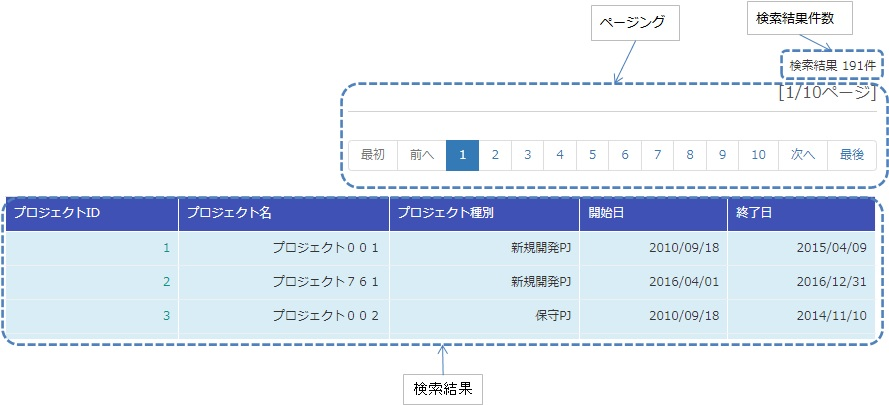

# 検索結果の一覧表示

**公式ドキュメント**: [1](https://nablarch.github.io/docs/LATEST/doc/biz_samples/03/index.html) [2](https://nablarch.github.io/docs/LATEST/javadoc/nablarch/common/dao/UniversalDao.html) [3](https://nablarch.github.io/docs/LATEST/javadoc/nablarch/core/db/support/ListSearchInfo.html) [4](https://nablarch.github.io/docs/LATEST/javadoc/nablarch/common/dao/EntityList.html)

## 提供パッケージ

**提供パッケージ**: `resources/META-INF/tags/listSearchResult`

[ソースコード](https://github.com/nablarch/nablarch-biz-sample-all/tree/v5-main)

## 基本属性

| 属性 | 必須 | 説明 |
|---|---|---|
| resultSetName | ○ | `EntityList` をリクエストスコープから取得する名前。ページ数・件数情報も含む |
| headerRowFragment | | ヘッダ行のJSPフラグメント |
| bodyRowFragment | | ボディ行のJSPフラグメント |

## 検索結果件数

- `useResultCount=true`（デフォルト）かつ検索結果がリクエストスコープに存在する場合に表示
- デフォルト書式：`検索結果 <resultCount>件`
- `resultCountFragment`属性にJSPフラグメントを指定して書式変更可能

```jsp
<app:listSearchResult resultSetName="searchResult" useResultCount="true">
  <jsp:attribute name="resultCountFragment">
    [サーチ結果 <n:write name="searchResult.pagination.resultCount" />件]
  </jsp:attribute>
</app:listSearchResult>
```

## ページング

- `usePaging=true`（デフォルト）の場合に表示
- **ページング使用時は、`searchFormName`で指定するフォームが`pageNumber`という名前でページ番号を受け取る実装が必要**

```java
public class ProjectSearchForm {
  @Required
  @Domain("pageNumber")
  private String pageNumber;
  public String getPageNumber(){ return this.pageNumber; }
  public void setPageNumber(String pageNumber){ this.pageNumber = pageNumber; }
}
```

**ページング全体は検索結果件数が1件以上の場合に表示。**

| ページングの画面要素 | 説明 |
|---|---|
| 現在のページ番号 | `useCurrentPageNumber=true`の場合に表示 |
| 最初、前へ、次へ、最後 | 遷移可能な場合はサブミット表示、不可の場合はラベル表示 |
| ページ番号 | 総ページ数が2以上の場合のみ表示（ラベル変更不可） |

**ページング時の検索条件：** 検索条件をパラメータにセットしたURIを`searchUri`属性に渡す

```jsp
<c:url value="/action/project/list" var="uri" context="/">
  <c:param name="searchForm.projectName" value="${searchForm.projectName}"/>
</c:url>
<app:listSearchResult resultSetName="searchResult" searchUri="${uri}" ...
```

**検索結果が減少した場合の動作：** 指定ページ番号で検索しページング要素を表示。現在ページ番号とサブミット要素の対応が取れているため操作不能にはならず、サブミット選択でページ遷移可能。

## 検索結果テーブル構成

- ヘッダ行とボディ行で構成（`headerRowFragment`/`bodyRowFragment`属性にJSPフラグメント指定）
- 検索結果がリクエストスコープに存在する場合は常に表示（0件の場合はヘッダ行のみ）
- ボディ行JSPフラグメントはJSTLの`c:forEach`ループ内で呼び出されて評価される

**ボディ行の変数属性：**

| 属性 | デフォルト値 | 説明 |
|---|---|---|
| varRowName | "row" | 行データ（c:forEachのvar属性）を参照する変数名 |
| varStatusName | "status" | ステータス（c:forEachのstatus属性）を参照する変数名 |
| varCountName | "count" | ステータスのcountプロパティを参照する変数名 |
| varRowCountName | "rowCount" | 検索結果カウント（取得開始位置＋ステータスカウント）を参照する変数名 |
| varOddEvenName | "oddEvenCss" | 奇偶行class属性を参照する変数名 |
| oddValue | "nablarch_odd" | 奇数行のclass属性 |
| evenValue | "nablarch_even" | 偶数行のclass属性 |

> **補足**: `n:write`タグでステータスにアクセスするとEL式とのアクセス方法の違いによりエラーが発生する。`n:set`タグを使用してアクセスすること。
> ```jsp
> <n:set var="rowCount" value="${status.count}" />
> <n:write name="rowCount" />
> ```

**プロジェクト検索の実装例（タグプレフィックス app）：**

```jsp
<app:listSearchResult resultSetName="searchResult">
  <jsp:attribute name="headerRowFragment">
    <tr>
      <th>プロジェクトID</th><th>プロジェクト名</th><th>プロジェクト種別</th><th>開始日</th><th>終了日</th>
    </tr>
  </jsp:attribute>
  <jsp:attribute name="bodyRowFragment">
    <tr class="info">
      <td><n:a href="/action/project/show/${row.projectId}"><n:write name="row.projectId"/></n:a></td>
      <td><n:write name="row.projectName" /></td>
      <td>
        <c:forEach var="projectType" items="<%= ProjectType.values() %>">
          <c:if test="${projectType.code == row.projectType}"><n:write name="projectType.label" /></c:if>
        </c:forEach>
      </td>
      <td><n:write value="${n:formatByDefault('dateTime', row.projectStartDate)}" /></td>
      <td><n:write value="${n:formatByDefault('dateTime', row.projectEndDate)}" /></td>
    </tr>
  </jsp:attribute>
</app:listSearchResult>
```

## ページ番号（ページ番号をラベルとして使用するためラベル指定がない）

| プロパティ名 | 型 | 必須 | デフォルト値 | 説明 |
|---|---|---|---|---|
| usePageNumberSubmit | | | false | ページ番号のページに遷移するサブミットを使用するか否か |
| pageNumberSubmitCss | | | "nablarch_pageNumberSubmit" | ページ番号のページに遷移するサブミットをラップするdivタグのclass属性 |
| pageNumberSubmitName | | | "pageNumberSubmit" | ページ番号のページに遷移するサブミットに使用するタグのname属性。ページ番号とページングの表示位置を表すサフィックス（上側は"_top"、下側は"_bottom"）を付けて出力する。例: デフォルトかつ上側でページ番号3の場合は"pageNumberSubmit3_top" |

<details>
<summary>keywords</summary>

提供パッケージ, listSearchResult, タグファイル, resources/META-INF/tags, resultSetName, headerRowFragment, bodyRowFragment, varRowName, varStatusName, varCountName, varRowCountName, varOddEvenName, oddValue, evenValue, EntityList, 検索結果表示, ページング動作, ボディ行変数, ヘッダ行, 検索結果件数表示, ページング時検索条件, usePageNumberSubmit, pageNumberSubmitCss, pageNumberSubmitName, ページ番号ページング, ページ番号サブミット, name属性サフィックス

</details>

## 概要

listSearchResultタグは [universal_dao](../../component/libraries/libraries-universal_dao.md) の検索機能と連携して以下の機能を提供する:

1. 検索結果件数の表示
2. 検索結果を指定件数毎に表示（ページング）

`listSearchResult`パッケージを業務アプリケーションに配置する。

- **コピー元**: `META-INF/tags/listSearchResult`
- **コピー先**: 業務アプリケーションの `/WEB-INF/tags` ディレクトリ

## 次へ

| プロパティ名 | 型 | 必須 | デフォルト値 | 説明 |
|---|---|---|---|---|
| useNextSubmit | | | true | 次のページに遷移するサブミットを使用するか否か |
| nextSubmitCss | | | "nablarch_nextSubmit" | 次のページに遷移するサブミットをラップするdivタグのclass属性 |
| nextSubmitLabel | | | "次へ" | 次のページに遷移するサブミットに使用するラベル |
| nextSubmitName | | | "nextSubmit" | 次のページに遷移するサブミットに使用するタグのname属性。ページングの表示位置を表すサフィックス（上側は"_top"、下側は"_bottom"）を付けて出力する。例: デフォルトかつ上側の場合は"nextSubmit_top" |

<details>
<summary>keywords</summary>

検索結果件数表示, ページング, listSearchResult, universal_dao連携, 一覧表示, タグファイル取り込み, WEB-INF/tags, META-INF/tags, サンプル実装配置, useNextSubmit, nextSubmitCss, nextSubmitLabel, nextSubmitName, 次ページ遷移サブミット, ページング次へボタン

</details>

## 構成

ページングを実現したい場合、フレームワークが提供するクラスとサンプル提供のタグファイルがページングに必要な処理を行うため、アプリケーションプログラマはページングを作り込みせずに実現できる。

**フレームワーク提供クラス**:

| クラス名 | 概要 |
|---|---|
| UniversalDao | 汎用的なDAO機能を提供するクラス。基本的な使い方は [universal_dao](../../component/libraries/libraries-universal_dao.md) を参照。 |
| ListSearchInfo | 一覧検索用の情報を保持する抽象クラス。 |
| Pagination | ListSearchInfoを継承した具象クラス。 |
| EntityList | ユニバーサルDAOから返される結果リストの保持クラス。 |

**タグファイル**:

| タグ名 | 概要 |
|---|---|
| listSearchResult | 検索結果の一覧表示を行うタグ。 |
| listSearchPaging | ページングを出力するタグ。 |
| listSearchSubmit | ページングのサブミット要素を出力するタグ。 |
| table | テーブルを出力するタグ。 |

`listSearchResultタグ`は、検索結果の一覧表示を行う。属性は画面要素ごとに分類される（全体、検索結果件数、ページング、現在のページ番号、最初、前へ、次へ、最後、ページ番号、検索結果）。

## 最後

| プロパティ名 | 型 | 必須 | デフォルト値 | 説明 |
|---|---|---|---|---|
| useLastSubmit | | | false | 最後のページに遷移するサブミットを使用するか否か |
| lastSubmitCss | | | "nablarch_lastSubmit" | 最後のページに遷移するサブミットをラップするdivタグのclass属性 |
| lastSubmitLabel | | | "最後" | 最後のページに遷移するサブミットに使用するラベル |
| lastSubmitName | | | "lastSubmit" | 最後のページに遷移するサブミットに使用するタグのname属性。ページングの表示位置を表すサフィックス（上側は"_top"、下側は"_bottom"）を付けて出力する。例: デフォルトかつ上側の場合は"lastSubmit_top" |



<details>
<summary>keywords</summary>

UniversalDao, ListSearchInfo, Pagination, EntityList, listSearchPaging, listSearchSubmit, table, クラス構成, タグファイル構成, listSearchResultタグ, タグリファレンス, 検索結果一覧表示タグ, listSearchResult属性一覧, useLastSubmit, lastSubmitCss, lastSubmitLabel, lastSubmitName, 最終ページ遷移サブミット, ページング最後ボタン

</details>

## UniversalDaoクラス

**クラス**: `UniversalDao`

複数件の検索結果をEntityListとして返すAPIを持つ。ページング機能を使う際は [universal_dao-paging](../../component/libraries/libraries-universal_dao.md) を参照。

| 属性 | デフォルト値 | 説明 |
|---|---|---|
| listSearchResultWrapperCss | "nablarch_listSearchResultWrapper" | ページング付きテーブル全体（検索結果件数、ページング、検索結果）をラップするdivタグのclass属性 |
| searchFormName | | 検索フォームをリクエストスコープから取得する名前。検索条件とページ番号を保持する。一覧表示のみの場合は指定不要 |

## 検索結果

| プロパティ名 | 型 | 必須 | デフォルト値 | 説明 |
|---|---|---|---|---|
| showResult | | | true | 検索結果を表示するか否か |
| resultSetName | | ○ | | `EntityList` をリクエストスコープから取得する際に使用する名前。ページネーションのためのページ数や検索条件に一致した件数も含まれる |
| resultSetCss | | | "nablarch_resultSet" | 検索結果テーブルのclass属性 |
| headerRowFragment | | | | ヘッダ行のJSPフラグメント |
| bodyRowFragment | | | | ボディ行のJSPフラグメント |
| varRowName | | | "row" | ボディ行のフラグメントで行データ（c:forEachタグのvar属性）を参照する際の変数名 |
| varStatusName | | | "status" | ボディ行のフラグメントでステータス（c:forEachタグのstatus属性）を参照する際の変数名 |
| varCountName | | | "count" | ステータスのcountプロパティを参照する際の変数名 |
| varRowCountName | | | "rowCount" | 検索結果のカウント（取得開始位置＋ステータスカウント）を参照する際の変数名 |
| varOddEvenName | | | "oddEvenCss" | ボディ行のclass属性を参照する際の変数名（1行おきにclass属性を変更する場合に使用） |
| oddValue | | | "nablarch_odd" | ボディ行の奇数行に使用するclass属性 |
| evenValue | | | "nablarch_even" | ボディ行の偶数行に使用するclass属性 |

> **補足**: `varStatusName`で指定した変数をn:writeタグでアクセスすると、EL式とアクセス方法が異なるためエラーが発生し値を取得できない。n:setタグを使用してステータスにアクセスすることでこのエラーを回避できる。

```jsp
<n:set var="rowCount" value="${status.count}" />
<n:write name="rowCount" />
```

<details>
<summary>keywords</summary>

UniversalDao, nablarch.common.dao.UniversalDao, EntityList, ページング, 検索結果取得, listSearchResultWrapperCss, searchFormName, 全体属性, ラッパーCSS, nablarch_listSearchResultWrapper, showResult, resultSetName, resultSetCss, headerRowFragment, bodyRowFragment, varRowName, varStatusName, varCountName, varRowCountName, varOddEvenName, oddValue, evenValue, 検索結果テーブル, JSPフラグメント, ページネーション

</details>

## ListSearchInfoクラス

**クラス**: `ListSearchInfo`

一覧検索用の情報を保持する抽象クラス。ページネーションのページ数や検索条件に一致した件数などのフィールドおよびアクセッサメソッドを定義する。

| 属性 | デフォルト値 | 説明 |
|---|---|---|
| useResultCount | true | 検索結果件数を表示するか否か |
| resultCountCss | "nablarch_resultCount" | 検索結果件数をラップするdivタグのclass属性 |
| resultCountFragment | "検索結果 &lt;resultCount&gt;件" | 検索結果件数を出力するJSPフラグメント |

<details>
<summary>keywords</summary>

ListSearchInfo, nablarch.core.db.support.ListSearchInfo, 一覧検索情報, ページネーション, 抽象クラス, useResultCount, resultCountCss, resultCountFragment, nablarch_resultCount, 件数表示制御

</details>

## Paginationクラス

PaginationクラスはListSearchInfoを継承し、ページネーションの情報を参照するために使用される。

| 属性 | デフォルト値 | 説明 |
|---|---|---|
| usePaging | true | ページングを表示するか否か |
| pagingPosition | "top" | ページングの表示位置。`top`（上側のみ）/`bottom`（下側のみ）/`both`（両方）/`none`（表示なし）のいずれかを指定 |
| pagingCss | "nablarch_paging" | ページングのサブミット要素全体をラップするdivタグのclass属性 |
| searchUri | | ページングのサブミット要素に使用するURI。**ページングを表示する場合は必ず指定すること** |

<details>
<summary>keywords</summary>

Pagination, ListSearchInfo, ページネーション情報, usePaging, pagingPosition, pagingCss, searchUri, nablarch_paging, ページング表示位置, top, bottom, both, none

</details>

## EntityListクラス

EntityListクラスはUniversalDaoから返される結果リストの保持クラス。`java.util.ArrayList`を継承し、Paginationクラスのインスタンスをフィールドに持つ。

| 属性 | デフォルト値 | 説明 |
|---|---|---|
| useCurrentPageNumber | true | 現在のページ番号を使用するか否か |
| currentPageNumberCss | "nablarch_currentPageNumber" | 現在のページ番号をラップするdivタグのclass属性 |
| currentPageNumberFragment | "[pageNumber/pageCountページ]" | 現在のページ番号を出力するJSPフラグメント |

<details>
<summary>keywords</summary>

EntityList, Pagination, 検索結果リスト, ArrayList, useCurrentPageNumber, currentPageNumberCss, currentPageNumberFragment, nablarch_currentPageNumber, 現在ページ番号

</details>

## listSearchResultタグ

listSearchResultタグは検索結果のリストを表示するタグ。全属性の詳細は :ref:`ListSearchResult_Tag` を参照。

> **注意**: resultSetName属性で指定された検索結果がリクエストスコープに存在しない場合、listSearchResultタグは何も出力しない（検索画面の初期表示が何も出力されないケースに該当）。

| 属性 | デフォルト値 | 説明 |
|---|---|---|
| useFirstSubmit | false | 最初のページに遷移するサブミットを使用するか否か |
| firstSubmitCss | "nablarch_firstSubmit" | 最初のページサブミットをラップするdivタグのclass属性 |
| firstSubmitLabel | "最初" | 最初のページに遷移するサブミットのラベル |
| firstSubmitName | "firstSubmit" | サブミットのname属性。ページング表示位置のサフィックス（上側は`_top`、下側は`_bottom`）を付けて出力する。例：デフォルトかつ上側の場合は`firstSubmit_top` |

<details>
<summary>keywords</summary>

listSearchResult, 検索結果一覧表示タグ, resultSetName, 初期表示, useFirstSubmit, firstSubmitCss, firstSubmitLabel, firstSubmitName, nablarch_firstSubmit, 最初のページ遷移, _top, _bottom

</details>

## 全体

| 属性 | 説明 |
|---|---|
| searchFormName | 検索フォームをリクエストスコープから取得する際に使用する名前。検索フォームは検索条件とページングのためのページ番号を保持する。一括削除確認画面など、一覧表示のみを行う場合は指定しない。 |

| 属性 | デフォルト値 | 説明 |
|---|---|---|
| usePrevSubmit | true | 前のページに遷移するサブミットを使用するか否か |
| prevSubmitCss | "nablarch_prevSubmit" | 前のページサブミットをラップするdivタグのclass属性 |
| prevSubmitLabel | "前へ" | 前のページに遷移するサブミットのラベル |
| prevSubmitName | "prevSubmit" | サブミットのname属性。ページング表示位置のサフィックス（上側は`_top`、下側は`_bottom`）を付けて出力する。例：デフォルトかつ上側の場合は`prevSubmit_top` |

<details>
<summary>keywords</summary>

searchFormName, 検索フォーム, ページ番号, リクエストスコープ, usePrevSubmit, prevSubmitCss, prevSubmitLabel, prevSubmitName, nablarch_prevSubmit, 前のページ遷移

</details>

## 検索結果件数

| 属性 | デフォルト | 説明 |
|---|---|---|
| useResultCount | true | 検索結果件数を表示するか否か。 |

次のページへ遷移するサブミット要素。現在のページ番号から次のページに遷移可能な場合はサブミット可能な状態で表示され、遷移不可の場合はラベルで表示される。

属性の詳細については、 :ref:`ListSearchResult_Tag` を参照。

<details>
<summary>keywords</summary>

useResultCount, 検索結果件数表示, デフォルトtrue, 次のページ遷移, 次へサブミット, ページング次へ

</details>

## ページング

| 属性 | デフォルト | 説明 |
|---|---|---|
| usePaging | true | ページングを表示するか否か。 |
| searchUri | | ページングのサブミット要素に使用するURI。ページングを表示する場合は必ず指定すること。 |

最後のページへ遷移するサブミット要素。現在のページ番号から最後のページに遷移可能な場合はサブミット可能な状態で表示され、遷移不可の場合はラベルで表示される。

属性の詳細については、 :ref:`ListSearchResult_Tag` を参照。

<details>
<summary>keywords</summary>

usePaging, searchUri, ページング表示, URI設定, 最後のページ遷移, 最後サブミット, ページング最後

</details>

## ページ番号

ページ番号全体（1..n）は、総ページ数が2以上の場合のみ表示される。ページ番号はページ番号をラベルに使用するため変更不可。

検索結果が10件で総ページ数が1の場合、ページ番号は表示されない。

<details>
<summary>keywords</summary>

ページ番号リンク, ページ番号一覧, 総ページ数, ページ番号表示条件

</details>

## 検索結果（タグ属性）

タグリファレンスにおける検索結果（テーブル表示）の属性。

| 属性 | 必須 | 説明 |
|---|---|---|
| resultSetName | ○ | `EntityList` をリクエストスコープから取得する際に使用する名前。検索結果にはページネーションのためのページ数や検索条件に一致した件数なども含まれる |
| headerRowFragment | | ヘッダ行のJSPフラグメント |
| bodyRowFragment | | ボディ行のJSPフラグメント |

<details>
<summary>keywords</summary>

resultSetName, headerRowFragment, bodyRowFragment, 検索結果属性, タグリファレンス検索結果

</details>
