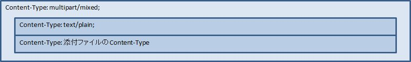
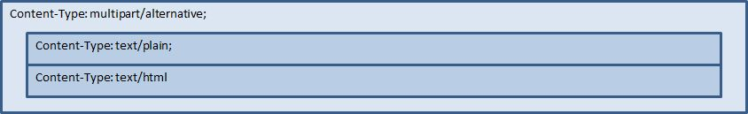

# HTMLメール送信機能サンプル

**公式ドキュメント**: [HTMLメール送信機能サンプル](https://nablarch.github.io/docs/LATEST/doc/biz_samples/08/index.html)

## 実装済み

> **注意**: 本機能はサンプル実装のため、導入プロジェクトで使用する際には、ソースコード（プロダクション、テストコード共に）をプロジェクトに取り込み、使用すること。

> **重要**: 本サンプルはキャンペーン通知などのHTMLメール一括送信には非対応。以下の場合はプロダクト使用を推奨：
> - キャンペーン通知・メールマガジンなど大量一括送信
> - 開封率・クリックカウントの測定
> - メールアドレスからクライアントを判別して送信メールを切替
> - 絵文字・デコメール使用
> - 顧客によるコンテンツ作成（本サンプルにはドローツール・コンテンツ作成機能なし）

> **重要**: 一部のクライアントでHTMLメールが期待通り表示されない可能性があるため、業務要件でユーザ通知が重要なメールにはHTMLメールを使用しないこと。

> **重要**: **HTMLメールのレイアウト**: メールクライアントにより表示差異があるため、HTMLメール標準を策定し顧客と合意すること。PJで検討すべき点：
> - テスト対象とするメールクライアント・デバイス・OS
> - HTMLタグ・スタイル（CSSプロパティ）などの使用範囲
> - フォント・配色などの使用範囲
> - コンテンツの横幅
>
> **コンテンツ作成時の留意点**:
> - `<head>`タグの内容を無視するメールクライアントがあるため、スタイルをCSSファイルや`<style>`タグに切り出すことは**推奨されていない**
> - 極力シンプルなデザインにすること
> - メディアクエリをサポートしないメールクライアントがあるため、極力レスポンシブデザインは採用しないこと

実装済み要求：
- HTMLメール（代替テキストを含む）を送信できる
- 本文のプレースホルダー部分の文字列にHTMLエスケープ（通常のオンライン画面と同様のセキュリティ対策）

<details>
<summary>keywords</summary>

HTMLメール送信, 一括送信非対応, TemplateHtmlMailContext, レスポンシブデザイン非推奨, HTMLエスケープ, メールクライアント差異, HTMLメール標準, サンプル導入手順, ソースコード取り込み

</details>

## 取り下げ

以下の要求は取り下げ（本サンプルでは未提供）：

- **メールクライアント毎の差異吸収**: HTMLデザインおよび対象クライアントの選定はPJにて行うため、コンテンツ作成時に対応するものとし本サンプルでは提供しない
- **画像の埋めこみ**: メール容量増大・メールサーバ負荷増大の懸念があるため提供しない。コンシューマ向けWebサービスではURL形式の使用が多いため、URL形式を推奨する

<details>
<summary>keywords</summary>

取り下げ機能, 画像埋めこみ非対応, メールクライアント差異吸収, URL形式推奨

</details>

## メールの形式

HTMLメールはコンテンツの内容に応じて、RFC 2557に準拠した下記のパターンのContent-Typeで送信する。

本サンプルで送信できるメールの形式：

| メール形式 | 業務Actionが使用するコンテキストクラス | 添付ファイル | メール構造のパターン |
|---|---|---|---|
| TEXT | TemplateMailContext | 無し | 1 |
| TEXT | TemplateMailContext | 有り | 2 |
| HTML | TemplateHtmlMailContext | 無し | 3 |
| HTML | TemplateHtmlMailContext | 有り | 4 |

各パターンのメール構造：







<details>
<summary>keywords</summary>

TemplateMailContext, TemplateHtmlMailContext, メール構造パターン, 添付ファイル, TEXT形式, HTML形式, RFC 2557, Content-Type

</details>

## クラス図

各クラスの責務：

| クラス名 | 概要 |
|---|---|
| `please.change.me.common.mail.html.HtmlMailRequester` | MailRequesterを拡張したHTMLメール送信要求を受け付けるクラス |
| `please.change.me.common.mail.html.TemplateHtmlMailContext` | TemplateMailContextを拡張し、HTMLメールに必要な情報を保持するクラス。代替テキストを本文に変換することで、HTMLメール用テンプレートを使用してプレーンテキスト形式メールも送信可能 |
| `please.change.me.common.mail.html.HtmlMailTable` | HTMLメール用テーブルにアクセスするクラス |
| `please.change.me.common.mail.html.HtmlMailSender` | MailSenderを拡張したHTMLメール送信サポートクラス。HTMLメール用の要求でない場合は親クラスに委譲してプレーンテキスト形式で送信 |
| `please.change.me.common.mail.html.HtmlMailContentCreator` | HTMLメール用コンテンツを生成するクラス |

設定例：

```xml
<component name="mailRequester" class="please.change.me.common.mail.html.HtmlMailRequester">
    <property name="mailRequestConfig" ref="mailRequestConfig" />
    <property name="mailRequestIdGenerator" ref="mailRequestIdGenerator" />
    <property name="mailRequestTable" ref="mailRequestTable" />
    <property name="mailRecipientTable" ref="mailRecipientTable" />
    <property name="mailAttachedFileTable" ref="mailAttachedFileTable" />
    <property name="mailTemplateTable" ref="mailTemplateTable" />
    <!-- 拡張したテーブルへのアクセス機能を設定する -->
    <property name="htmlMailTable" ref="htmlMailTable" />
</component>

<!--
Nablarchアプリケーションフレームワークのメール送信機能ではスキーマ定義を行うが、
本ライブラリではソースコードを直接修正すれば良いため、設定ファイルでの定義は行わない。
ただし、テーブルアクセスの機能はRequester,Senderで共通のため、コンポーネントの定義を行うこと。
-->
<component name="htmlMailTable" class="please.change.me.common.mail.html.HtmlMailTable" />
```

<details>
<summary>keywords</summary>

HtmlMailRequester, TemplateHtmlMailContext, HtmlMailTable, HtmlMailSender, HtmlMailContentCreator, please.change.me.common.mail.html, XML設定, htmlMailTable, スキーマ定義, コンポーネント定義

</details>

## データモデル

メール関連テーブルにHTML用の拡張テーブルを関連付けることでTEXT+HTMLメールとして動作させる方式。

> **補足**: DDLはテスト資源に含まれている。

**HTMLメール用代替テキストテンプレートテーブル**（メールテンプレートの関連テーブル）：

| 定義 | Javaの型 | 備考 |
|---|---|---|
| メールテンプレートID | java.lang.String | PK |
| 言語 | java.lang.String | PK |
| 代替テキスト | java.lang.String | HTMLメールを表示できないメーラーのためのテキスト |

**HTMLメール用代替テキストテーブル**（メール送信要求の関連テーブル）：

| 定義 | Javaの型 | 備考 |
|---|---|---|
| メール送信要求ID | java.lang.String | PK |
| 代替テキスト | java.lang.String | HTMLメールを表示できないメーラーのためのテキスト |

<details>
<summary>keywords</summary>

データモデル, 代替テキストテンプレートテーブル, 代替テキストテーブル, DDL, 拡張テーブル, メール送信要求ID, メールテンプレートID, 言語, 代替テキスト

</details>

## HTMLメールの送信

[メール送信機能](../../component/libraries/libraries-mail.md) の定型メール送信と同様の実装。業務アクションで使用するコンテキストクラスが `TemplateHtmlMailContext` になるだけで、実装方法は同じ。

<details>
<summary>keywords</summary>

HTMLメール送信実装, TemplateHtmlMailContext, 定型メール送信, MailRequester

</details>

## コンテンツの動的な切替

`TemplateHtmlMailContext` の `contentType` に **text/plain** を指定すると、代替テキストを本文に差し替えてプレーンテキスト形式で送信する。

| コンテキストクラス | 指定されたType | 本文への移送元 | Content-Type |
|---|---|---|---|
| TemplateMailContext | — | メールテンプレート.本文 | text/plain |
| TemplateHtmlMailContext | *text/plain* | *代替テキストテンプレート.代替テキスト* | *text/plain* |
| TemplateHtmlMailContext | text/html | メールテンプレート.本文 | text/html |

```java
TemplateHtmlMailContext mail = new TemplateHtmlMailContext();
// ユーザがContentType.PLAINを選択していれば、代替テキストが本文に切り替わる
mail.setContentType(form.getType());
// その他のプロパティを設定し、MailRequesterを呼び出す
```

<details>
<summary>keywords</summary>

TemplateHtmlMailContext, contentType, text/plain, text/html, コンテンツ動的切替, 代替テキスト, setContentType

</details>

## 電子署名の併用

[電子署名の拡張サンプル](biz-samples-09.md) とHTMLメールサンプルを併用する場合：

- メール送信要求の登録処理：本サンプルを使用
- メール送信バッチ：`HtmlMailContentCreator` クラスを使用してHTMLメールコンテンツを作成できるように電子署名の拡張サンプル（`SMIMESignedMailSender`）を拡張して使用

実装例：

```java
@Override
protected void addBodyContent(MimeMessage mimeMessage, MailRequestTable.MailRequest mailRequest,
        List<? extends MailAttachedFileTable.MailAttachedFile> attachedFiles, ExecutionContext context) throws MessagingException {

    String mailSendPatternId = context.getSessionScopedVar("mailSendPatternId");
    Map<String, CertificateWrapper> certificateChain = SystemRepository.get(CERTIFICATE_REPOSITORY_KEY);
    CertificateWrapper certificateWrapper = certificateChain.get(mailSendPatternId);

    try {
        SMIMESignedGenerator smimeSignedGenerator = new SMIMESignedGenerator();
        // ---中略---

        MimeBodyPart bodyPart;
        HtmlMailTable htmlTable = SystemRepository.get("htmlMailTable");
        SqlRow alternativeText = htmlTable.findAlternativeText(mailRequest.getMailRequestId());
        if (alternativeText != null) {
            bodyPart = new MimeBodyPart();
            bodyPart.setContent(HtmlMailContentCreator.create(mailRequest.getMailBody(), mailRequest.getCharset(),
                                                              alternativeText.getString("alternativeText"), attachedFiles));
            mimeMessage.setContent(smimeSignedGenerator.generate(bodyPart));
        } else {
          // SMIMESignedMailSenderの実装
          bodyPart = new MimeBodyPart();
          bodyPart.setText(mailRequest.getMailBody(), mailRequest.getCharset());
          // ---後略---
    } catch (Exception e) {
        MailConfig mailConfig = SystemRepository.get("mailConfig");
        String mailRequestId = mailRequest.getMailRequestId();
        throw new TransactionAbnormalEnd(
                mailConfig.getAbnormalEndExitCode(), e,
                mailConfig.getSendFailureCode(), mailRequestId);
    }
}
```

<details>
<summary>keywords</summary>

SMIMESignedMailSender, HtmlMailContentCreator, 電子署名, bouncycastle_mail_sample, SMIMESignedGenerator, addBodyContent, HtmlMailTable

</details>

## タグを埋めこむ

> **重要**: タグの埋めこみは以下の理由から実装しておらず、推奨もしていない：
> - HTMLメールのレイアウト確認が困難になる
> - セキュリティ対策もPJにて実施する必要がある
>
> 安易に使用せず、テンプレートを複数用意することで対応できないか検討すること。テンプレートの作成コストでセキュリティ上のリスクを補填できる点も考慮すること。

本サンプルではHTMLエスケープを強制するため、動的にHTMLタグをテンプレートに埋めこむことはできない。

動的に埋めこむ必要がある場合は、PJにて `TemplateHtmlMailContext` を修正し、`TemplateMailContext#setReplaceKeyValue` を呼び出すAPIを追加すること：

```java
// HTMLエスケープをせずにタグを埋めこむ
public void setReplaceKeyRawValue(String key, String tag) {
    super.setReplaceKeyValue(key, tag);
}
```

> **補足**: HTMLメールのテストは通常のメールと同様：
> - HTMLテキストはメール送信要求のテーブルを検証する
> - 実際のメールクライアントでのレイアウト確認は送信バッチを使用してメールを送信して確認する

<details>
<summary>keywords</summary>

タグ埋めこみ, HTMLエスケープ, setReplaceKeyValue, setReplaceKeyRawValue, TemplateHtmlMailContext, 動的HTML, TemplateMailContext

</details>
