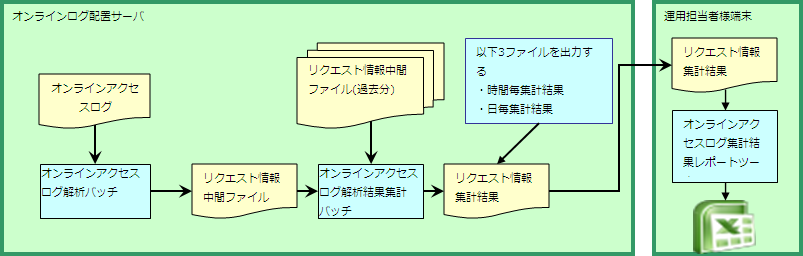

# オンラインアクセスログ集計機能

**公式ドキュメント**: [オンラインアクセスログ集計機能](https://nablarch.github.io/docs/LATEST/doc/biz_samples/10/contents/OnlineAccessLogStatistics.html)

## オンラインアクセスログ集計機能

オンラインアクセスログ集計機能は、画面機能から出力されるアクセスログをリクエストID単位に以下の情報を集計する。

- リクエスト数
- 閾値を超えた処理時間のリクエスト数
- 処理時間（平均）
- 処理時間（中央値）
- 処理時間（最大値）

> **補足**: リクエストIDは設定ファイルに指定することで、集計対象の機能を絞り込むことができる。

keywords

アクセスログ集計, リクエストID単位集計, 処理時間統計, リクエスト数, 閾値超えリクエスト数

## サンプル構成

本サンプルは以下の3種類で構成される。

| サンプル名 | 概要 |
|---|---|
| オンラインアクセスログ解析バッチ | オンラインアクセスログを解析し、集計時に必要となる情報のみをCSVファイルに出力するバッチ処理 |
| オンラインアクセスログ解析結果集計バッチ | 解析バッチで出力されたCSVファイルを元に集計処理を行うバッチ処理。集計期間は設定ファイルに指定された日数分 |
| オンラインアクセスログ集計結果レポートサンプル | 集計結果を元にExcelにレポート（集計結果表）を出力するExcelマクロ |

keywords

オンラインアクセスログ解析バッチ, オンラインアクセスログ解析結果集計バッチ, オンラインアクセスログ集計結果レポートサンプル, サンプル一覧, 3種類

## 処理の流れ

> **補足**: 上記図ではオンラインログ配置サーバと運用担当者様端末を明示的に分けて記載している。これはオンラインアクセスログには個人情報が含まれている可能性があり、セキュリティで保護された環境で実行することを推奨するためである。なお、リクエスト情報集計結果には個人情報等の項目は含まれないため、セキュリティで保護された環境以外で実行することも可能であるが、ログの解析及び集計処理を実行した環境で実行することに特に問題はない。

keywords

処理フロー, ログ解析フロー, 個人情報, セキュリティ, 運用手順

## 各サンプルの仕様及び実行手順

## オンラインアクセスログ解析バッチ

日次実行を想定。解析結果のCSVファイルは削除せずに蓄積すること（過去分の解析結果CSVを蓄積することで後続の集計処理が正確に行える）。

ファイル名形式: `REQUEST_INFO_{システム日付8桁}.csv`

**CSVファイルへの出力内容**

| 項目名 | 備考 |
|---|---|
| 年 | リクエストの終了(END)ログ出力日時の年 |
| 月 | リクエストの終了(END)ログ出力日時の月 |
| 日 | リクエストの終了(END)ログ出力日時の日 |
| プロセス名 | プロセス名（ログにプロセス名が出力されていない場合はブランク） |
| リクエストID | リクエストID |
| 処理時間 | リクエストの処理時間 |
| ステータスコード | 処理ステータスコード |

## オンラインアクセスログ解析結果集計バッチ

解析バッチで出力されたCSVファイルを元に集計処理を行う。集計期間は設定ファイルに指定された日数分。

> **補足**: 対象日数の判定はファイル名に含まれる日付を使用する。解析処理が日次実行でない場合（例: 2日に1回）、1つのCSVファイルに複数日分のデータが含まれるため、指定した集計期間より前のデータが集計結果に含まれることがある。

集計結果CSVファイルは以下の3種類を出力する。

| ファイル種別 | 出力内容 |
|---|---|
| 時間別集計結果 | 時間単位の集計処理を出力 |
| 日別集計結果 | 日単位の集計結果を出力 |
| 年月別集計結果 | 年月単位の集計結果（システム日付の年月データのみ対象）。過去分の集計結果は削除せず蓄積すること |

> **補足**: 集計範囲が1ヶ月未満（例: 10日）の場合、年月集計結果はその期間分のみとなる（30日実行で集計範囲10日なら20日〜30日が対象）。

**CSVファイルへの出力内容**

| 項目名 | 備考 |
|---|---|
| リクエストID | リクエストID |
| 集計対象期間 | 時間別: 0〜23、日別: 1〜31、年月別: システム日付の年月 |
| プロセス名 | プロセス名 |
| リクエスト数 | 集計対象期間内のリクエスト数 |
| 処理時間が閾値を超えたリクエスト数 | 設定ファイルで指定された閾値時間を超えたリクエスト数 |
| 処理時間（平均） | 集計対象期間内での平均値 |
| 処理時間（中央値） | 集計対象期間内での中央値 |
| 処理時間（集計対象期間内での最大処理時間） | 集計対象期間内での最大処理時間 |

## オンラインアクセスログ集計結果レポートサンプル

集計結果を元にExcelに集計結果表を出力するExcelマクロ。グラフ作成はExcelの機能を使用すること。

実行方法の詳細: ログ集計プロジェクト配下 `/tool/ウェブアプリケーションリクエストレポートツール.xls` を参照。

## オンラインアクセスログ解析及び集計サンプルの設定

**クラス**: `please.change.me.statistics.action.settings.OnlineStatisticsDefinition`

全プロパティ必須。標準設定は以下ファイルに用意されているため、変更が必要な項目のみ修正すること。

- `main/resources/statistics/onlineStatisticsDefinition.xml`
- `main/resources/statistics/statistics.config`

| 設定プロパティ名 | 設定内容 |
|---|---|
| accessLogDir | 解析対象オンラインアクセスログのディレクトリパス（絶対パス or 相対パス） |
| accessLogFileNamePattern | アクセスログのファイル名パターン（ワイルドカードは`*`を使用、正規表現ではない。例: `access*`） |
| accessLogParseDir | ログ解析に使用する一時ディレクトリパス（解析対象ログをコピーして解析処理を行う）（絶対パス or 相対パス） |
| endLogPattern | アクセスログの終了ログを特定するための正規表現パターン |
| includeRequestIdList | 解析対象のリクエストIDリスト（リクエストIDが増減した場合は追加・削除すること） |
| findRequestIdPattern | 終了ログからリクエストIDを抽出する正規表現（リクエストID部分をグループ化すること） |
| findProcessNamePattern | 終了ログからプロセス名を抽出する正規表現（プロセス名部分をグループ化すること） |
| findStatusCodePattern | 終了ログからステータスコードを抽出する正規表現（ステータスコード部分をグループ化すること） |
| logOutputDateTimeStartPosition | ログ出力日時の開始位置（0始まりの文字数、String#substringと同仕様） |
| logOutputDateTimeEndPosition | ログ出力日時の終了位置（0始まりの文字数、String#substringと同仕様） |
| logOutputDateTimeFormat | ログ出力日時のフォーマット（SimpleDateFormat形式） |
| findExecutionTimePattern | リクエストの処理時間を抽出する正規表現（処理時間部分をグループ化すること） |
| thresholdExecutionTime | 1リクエスト要求の処理時間の閾値（ミリ秒）。例: 3000 → 3秒超のリクエスト数を集計 |
| aggregatePeriod | 集計期間（年月集計を漏れなく行うために最低30を推奨） |
| requestInfoFormatName | 解析結果CSVのフォーマット定義ファイル名（デフォルト: `main/format/requestInfo.fmt`）。解析・集計バッチ両方で使用。拡張して項目を追加した場合は新しいファイル名を設定すること |
| requestInfo.dir | 解析結果CSV出力先ディレクトリの論理名（実ディレクトリとのマッピングは`main/resources/statistics/file.xml`参照） |
| requestInfoSummaryBaseName | 集計結果CSV出力先ディレクトリの論理名（実ディレクトリとのマッピングは`main/resources/statistics/file.xml`参照） |
| requestInfoSummaryFormatName | 集計結果CSVファイルのフォーマット定義ファイル名（デフォルト: `main/format/requestInfoAggregate.fmt`）。拡張して項目を追加した場合は新しいファイル名を設定すること |

keywords

OnlineStatisticsDefinition, accessLogDir, accessLogFileNamePattern, accessLogParseDir, endLogPattern, includeRequestIdList, findRequestIdPattern, findProcessNamePattern, findStatusCodePattern, logOutputDateTimeStartPosition, logOutputDateTimeEndPosition, logOutputDateTimeFormat, findExecutionTimePattern, thresholdExecutionTime, aggregatePeriod, requestInfoFormatName, requestInfo.dir, requestInfoSummaryBaseName, requestInfoSummaryFormatName, REQUEST_INFO_, 時間別集計, 日別集計, 年月別集計, 設定プロパティ, CSV出力内容

## 本サンプルを実行するための設定情報（解析バッチ）

設定値の詳細は「オンラインアクセスログ解析及び集計サンプルの設定」セクション（`please.change.me.statistics.action.settings.OnlineStatisticsDefinition`のプロパティ）を参照。

keywords

解析バッチ設定, OnlineAccessLogParseAction設定

## 実行方法（解析バッチ）

[Nablarchのバッチ方式](../../processing-pattern/nablarch-batch/nablarch-batch-nablarch_batch.md) を使用。

実行パラメータ:

| パラメータ | 設定値 |
|---|---|
| diConfig | `statistics-batch.xml`（resourcesディレクトリにクラスパスを設定した場合） |
| requestPath | `OnlineAccessLogParseAction` |
| userId | バッチユーザID |

keywords

OnlineAccessLogParseAction, statistics-batch.xml, バッチ実行, diConfig, requestPath

## 本サンプルを実行するための設定情報（集計バッチ）

設定値の詳細は「オンラインアクセスログ解析及び集計サンプルの設定」セクション（`please.change.me.statistics.action.settings.OnlineStatisticsDefinition`のプロパティ）を参照。

keywords

集計バッチ設定, RequestInfoAggregateAction設定

## 実行方法（集計バッチ）

[Nablarchのバッチ方式](../../processing-pattern/nablarch-batch/nablarch-batch-nablarch_batch.md) を使用。

実行パラメータ:

| パラメータ | 設定値 |
|---|---|
| diConfig | `statistics-batch.xml`（resourcesディレクトリにクラスパスを設定した場合） |
| requestPath | `RequestInfoAggregateAction` |
| userId | バッチユーザID |

keywords

RequestInfoAggregateAction, statistics-batch.xml, バッチ実行, diConfig, requestPath

## 実行方法（レポートサンプル）

使用方法の詳細はログ集計プロジェクト配下の以下ファイルを参照。

- `/tool/ウェブアプリケーションリクエストレポートツール.xls`

keywords

Excelレポート, ウェブアプリケーションリクエストレポートツール, 集計結果表, Excelマクロ実行

