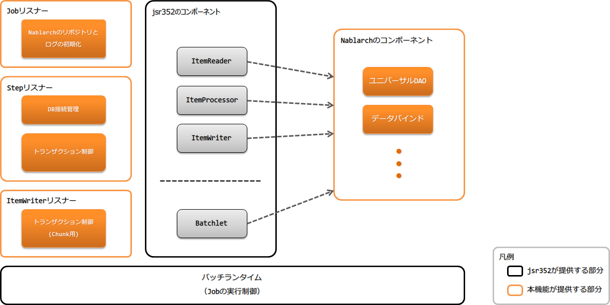
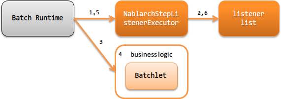

# アーキテクチャ概要

**公式ドキュメント**: [1](https://nablarch.github.io/docs/LATEST/doc/application_framework/application_framework/batch/jsr352/architecture.html) [2](https://nablarch.github.io/docs/LATEST/javadoc/nablarch/fw/batch/ee/cdi/StepScoped.html) [3](https://nablarch.github.io/docs/LATEST/javadoc/nablarch/fw/batch/ee/listener/step/NablarchStepListenerExecutor.html) [4](https://nablarch.github.io/docs/LATEST/javadoc/nablarch/fw/batch/ee/listener/chunk/NablarchItemWriteListenerExecutor.html) [5](https://nablarch.github.io/docs/LATEST/javadoc/nablarch/fw/batch/ee/listener/job/JobProgressLogListener.html) [6](https://nablarch.github.io/docs/LATEST/javadoc/nablarch/fw/batch/ee/listener/job/DuplicateJobRunningCheckListener.html) [7](https://nablarch.github.io/docs/LATEST/javadoc/nablarch/fw/batch/ee/listener/step/StepProgressLogListener.html) [8](https://nablarch.github.io/docs/LATEST/javadoc/nablarch/fw/batch/ee/listener/step/DbConnectionManagementListener.html) [9](https://nablarch.github.io/docs/LATEST/javadoc/nablarch/fw/batch/ee/listener/step/StepTransactionManagementListener.html) [10](https://nablarch.github.io/docs/LATEST/javadoc/nablarch/fw/batch/ee/listener/chunk/ChunkProgressLogListener.html) [11](https://nablarch.github.io/docs/LATEST/javadoc/nablarch/fw/batch/ee/listener/chunk/ItemWriteTransactionManagementListener.html)

## バッチアプリケーションの構成

JSR352準拠のバッチアプリケーション実行にはJSR352の実装が必要。実装は主に以下の2つから選択する。ドキュメントが豊富でMaven Centralからライブラリを取得できる手軽さから**jBeret**の使用を推奨する。

- **jBeret**: https://jberet.gitbooks.io/jberet-user-guide/content/
- **参照実装のjBatch**: https://github.com/WASdev/standards.jsr352.jbatch



> **重要**: JobContext/StepContextの一時領域（`TransientUserData`）はグローバル領域への値保持と同義のため、アプリケーション側で使用してはならない。StepContextの一時領域は `StepScoped` がステップ内の値共有に使用しているため、アプリケーション側ではStepContextの一時領域は使用できない。

> **補足**: [jsr352_batch](jakarta-batch-jsr352.md) のアーキテクチャはJSR352準拠であり、[nablarch_architecture](../../about/about-nablarch/about-nablarch-architecture.md) のハンドラベースとは異なる。横断的処理（ログ出力、トランザクション制御等）はJSR352のリスナーで実現。ただし、リスナーはハンドラと異なり入力・出力への直接処理はできないため、入力値のフィルタ処理や変換処理はリスナーでは実現できない。

<details>
<summary>keywords</summary>

StepScoped, TransientUserData, jBeret, jBatch, バッチアプリケーション構成, JSR352実装選択, ハンドラとリスナーの違い, リスナーの制限

</details>

## バッチの種類

JSR352では実装方法としてBatchletとChunkの2種類がある。バッチごとに以下の基準で選択すること。

**Batchlet**
タスク指向の場合に使用。例：外部システムからのファイル取得、SQL1つで処理が完結する処理。

**Chunk**
ファイルやデータベースなどの入力データソースからレコードを読み込み業務処理を実行する場合に使用。

<details>
<summary>keywords</summary>

Batchlet, Chunk, バッチ種類選択基準, タスク指向, データ読み込みバッチ, ファイル取得バッチ

</details>

## Batchletの処理の流れ

Batchletタイプのバッチアプリケーションの処理の流れを以下に示す。



1. `NablarchStepListenerExecutor` がBatchletステップ実行前コールバックとして呼び出される
2. Batchletステップ実行前のリスナーを順次実行
3. Batchletが実行される
4. Batchletで業務ロジックを実行（責務配置は [jsr352-batchlet_design](jakarta-batch-application_design.md) 参照）
5. `NablarchStepListenerExecutor` がBatchletステップ実行後コールバックとして呼び出される
6. Batchletステップ実行後のリスナーをNo.2とは逆順に実行

<details>
<summary>keywords</summary>

NablarchStepListenerExecutor, Batchletフロー, Batchletステップ実行前, Batchletステップ実行後, リスナー逆順実行, jsr352-batchlet_design

</details>

## Chunkの処理の流れ

Chunkタイプのバッチアプリケーションの処理の流れを以下に示す。


1. `NablarchStepListenerExecutor` がChunkステップ実行前コールバックとして呼び出される
2. Chunkステップ実行前のリスナーを順次実行
3. `ItemReader` が実行され、入力データソースからデータを読み込む
4. `ItemProcessor` が実行される
5. `ItemProcessor` はFormやEntityを使って業務ロジックを実行（DBへのデータ書き込み・更新はここでは実施しない）
6. `NablarchItemWriteListenerExecutor` が `ItemWriter` 実行前コールバックとして呼び出される
7. `ItemWriter` 実行前のリスナーを順次実行
8. `ItemWriter` が実行され、テーブルへの登録（更新・削除）やファイル出力などの結果反映処理を行う
9. `NablarchItemWriteListenerExecutor` が `ItemWriter` 実行後コールバックとして呼び出される
10. `ItemWriter` 実行後のリスナーをNo.7とは逆順で実行
11. `NablarchStepListenerExecutor` がChunkステップ実行後コールバックとして呼び出される
12. Chunkステップ実行後のリスナーをNo.2とは逆順に実行

No.3〜No.10は入力データソースのデータが終わるまで繰り返し実行される。Chunkステップの責務配置は [jsr352-chunk_design](jakarta-batch-application_design.md) 参照。

<details>
<summary>keywords</summary>

NablarchStepListenerExecutor, NablarchItemWriteListenerExecutor, ItemReader, ItemProcessor, ItemWriter, Chunkフロー, Chunkステップ実行, jsr352-chunk_design

</details>

## 例外発生時の処理の流れ

Nablarchは例外を捕捉せず、JSR352の実装側で例外ハンドリングを行う。これはJSR352準拠バッチ特有の振る舞いであり、[web_application](../web-application/web-application-web.md) や [nablarch_batch](../nablarch-batch/nablarch-batch-nablarch_batch.md) とは異なる。

> **補足**: JSR352準拠バッチがこの方針を採用した理由は、JSR352上でNablarchを使用するためのコンポーネントのみの提供であり実行制御自体はJSR352実装によって行われるため、Nablarchによる全例外の捕捉が不可能であること、また例外制御がNablarchとJSR352で分散することで設計が複雑化するのを防ぐためである。

### 例外発生時のバッチの状態

例外発生時のバッチ状態（batch status、exit status）はJSR352仕様を参照。例外の種類に応じたリトライや継続有無もジョブ定義に従った動作となる。Javaプロセスからのリターンコードは [jsr352-failure_monitoring](jakarta-batch-operation_policy.md) 参照。

### ログ出力

JSR352実装で捕捉された例外はJSR352実装によりログ出力される。ログの設定（フォーマットや出力先など）はJSR352実装が使用しているロギングフレームワークのマニュアルを参照すること。

アプリケーションのエラーログをJSR352と同じログファイルに出力したい場合は [log_adaptor](../../component/adapters/adapters-log_adaptor.md) を使用してJSR352実装とロギングフレームワークを統一する。

<details>
<summary>keywords</summary>

例外処理, log_adaptor, リターンコード, batch status, exit status, JSR352例外ハンドリング, ログ出力, jsr352-failure_monitoring

</details>

## バッチアプリケーションで使用するリスナー

JSR352準拠バッチではJSR352のリスナーを使用してNablarchのハンドラ相当の機能を実現する。

> **補足**: JSR352ではリスナーを複数設定した場合の実行順が保証されない。Nablarchでは各レベルのリスナーに実行順を保証するリスナーのみを設定し、[repository](../../component/libraries/libraries-repository.md) からリスナーリストを取得して定義順に実行することで対応している。実際の定義方法は [jsr352-listener_definition](#s7) を参照。

### ジョブレベルリスナー

ジョブの起動および終了直前にコールバックされるリスナー。

- `JobProgressLogListener`: ジョブの起動・終了ログを出力
- `DuplicateJobRunningCheckListener`: 同一ジョブの多重起動防止

### ステップレベルリスナー

ステップの実行前および実行後にコールバックされるリスナー。

- `StepProgressLogListener`: ステップの開始・終了ログを出力
- `DbConnectionManagementListener`: データベースへ接続
- `StepTransactionManagementListener`: トランザクションを制御

### ItemWriterレベルのリスナー

`ItemWriter` の実行前および実行後にコールバックされるリスナー。

- `ChunkProgressLogListener`: Chunkの進捗ログを出力（**非推奨**。[jsr352-progress_log](jakarta-batch-progress_log.md) を使用すること）
- `ItemWriteTransactionManagementListener`: トランザクションを制御

<details>
<summary>keywords</summary>

JobProgressLogListener, DuplicateJobRunningCheckListener, StepProgressLogListener, DbConnectionManagementListener, StepTransactionManagementListener, ChunkProgressLogListener, ItemWriteTransactionManagementListener, 多重起動防止, リスナー実行順

</details>

## 最小のリスナー構成

### ジョブレベルの最小リスナー構成

| No. | リスナー | ジョブ起動直前の処理 | ジョブ終了直前の処理 |
|---|---|---|---|
| 1 | `JobProgressLogListener` | 起動するジョブ名をログに出力 | ジョブ名称とバッチステータスをログに出力 |

### ステップレベルの最小リスナー構成

| No. | リスナー | ステップ実行前の処理 | ステップ実行後の処理 |
|---|---|---|---|
| 1 | `StepProgressLogListener` | 実行するステップ名称をログに出力 | ステップ名称とステップステータスをログに出力 |
| 2 | `DbConnectionManagementListener` | DB接続を取得 | DB接続を解放 |
| 3 | `StepTransactionManagementListener` | トランザクションを開始 | トランザクションを終了（commit or rollback） |

### ItemWriterレベルの最小リスナー構成

| No. | リスナー | ItemWriter実行前の処理 | ItemWriter実行後の処理 |
|---|---|---|---|
| 1 | `ItemWriteTransactionManagementListener` [^1] | — | トランザクションを終了（commit or rollback） |

[^1]: ItemWriterレベルのリスナーで行うトランザクション制御は、ステップレベルで開始されたトランザクションに対して行う。

<details>
<summary>keywords</summary>

JobProgressLogListener, DbConnectionManagementListener, StepTransactionManagementListener, ItemWriteTransactionManagementListener, 最小リスナー構成, StepProgressLogListener

</details>

## リスナーの指定方法

各レベルへのリスナーリスト定義手順：

1. JSR352のジョブ定義XMLファイルに実行順を保証するリスナーを設定する
2. コンポーネント設定ファイルにリスナーリストを設定する

### ジョブ定義ファイルへの設定

```xml
<job id="chunk-integration-test" xmlns="http://xmlns.jcp.org/xml/ns/javaee" version="1.0">
  <listeners>
    <!-- ジョブレベルのリスナー -->
    <listener ref="nablarchJobListenerExecutor" />
  </listeners>

  <step id="myStep">
    <listeners>
      <!-- ステップレベルのリスナー -->
      <listener ref="nablarchStepListenerExecutor" />
      <!-- ItemWriterレベルのリスナー -->
      <listener ref="nablarchItemWriteListenerExecutor" />
    </listeners>

    <chunk item-count="10">
      <reader ref="stringReader">
        <properties>
          <property name="max" value="25" />
        </properties>
      </reader>
      <processor ref="createEntityProcessor" />
      <writer ref="batchOutputWriter" />
    </chunk>
  </step>
</job>
```

### コンポーネント設定ファイルへの設定

```xml
<!-- デフォルトのジョブレベルのリスナーリスト -->
<list name="jobListeners">
  <component class="nablarch.fw.batch.ee.listener.job.JobProgressLogListener" />
  <component class="nablarch.fw.batch.ee.listener.job.DuplicateJobRunningCheckListener">
    <property name="duplicateProcessChecker" ref="duplicateProcessChecker" />
  </component>
</list>

<!-- デフォルトのステップレベルのリスナーリスト -->
<list name="stepListeners">
  <component class="nablarch.fw.batch.ee.listener.step.StepProgressLogListener" />
  <component class="nablarch.fw.batch.ee.listener.step.DbConnectionManagementListener">
    <property name="dbConnectionManagementHandler">
      <component class="nablarch.common.handler.DbConnectionManagementHandler" />
    </property>
  </component>
  <component class="nablarch.fw.batch.ee.listener.step.StepTransactionManagementListener" />
</list>

<!-- デフォルトのItemWriterレベルのリスナーリスト -->
<list name="itemWriteListeners">
  <component class="nablarch.fw.batch.ee.listener.chunk.ChunkProgressLogListener" />
  <component class="nablarch.fw.batch.ee.listener.chunk.ItemWriteTransactionManagementListener" />
</list>

<!-- ジョブ単位でのジョブレベルリスナーリスト上書き例 -->
<list name="sample-job.jobListeners">
  <component class="nablarch.fw.batch.ee.listener.job.JobProgressLogListener" />
</list>

<!-- ステップ単位でのステップレベルリスナーリスト上書き例 -->
<list name="sample-job.sample-step.stepListeners">
  <component class="nablarch.fw.batch.ee.listener.step.StepProgressLogListener" />
</list>
```

**ポイント**:
- デフォルトのジョブレベルリスナーリストのコンポーネント名: `jobListeners`
- デフォルトのステップレベルリスナーリストのコンポーネント名: `stepListeners`
- デフォルトのItemWriterレベルリスナーリストのコンポーネント名: `itemWriteListeners`
- ジョブ単位での上書き: コンポーネント名を「ジョブ名称 + "." + 上書き対象コンポーネント名」とする（例: `sample-job.jobListeners`）
- 特定ステップでの上書き: コンポーネント名を「ジョブ名称 + "." + ステップ名称 + "." + 上書き対象コンポーネント名」とする（例: `sample-job.sample-step.stepListeners`）
- 特定ステップで上書き可能なのはステップレベルとItemWriterレベルのリスナーリストのみ

<details>
<summary>keywords</summary>

jobListeners, stepListeners, itemWriteListeners, リスナー定義方法, コンポーネント設定, ジョブ定義XML, nablarchJobListenerExecutor, nablarchStepListenerExecutor, nablarchItemWriteListenerExecutor, リスナーリスト上書き

</details>
