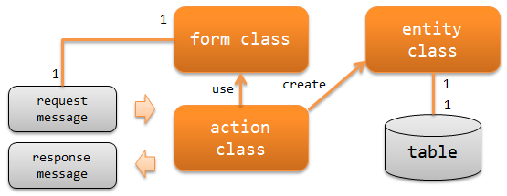

# アプリケーションの責務配置

**公式ドキュメント**: [1](https://nablarch.github.io/docs/LATEST/doc/application_framework/application_framework/messaging/mom/application_design.html) [2](https://nablarch.github.io/docs/LATEST/javadoc/nablarch/fw/messaging/reader/FwHeaderReader.html) [3](https://nablarch.github.io/docs/LATEST/javadoc/nablarch/fw/messaging/reader/MessageReader.html) [4](https://nablarch.github.io/docs/LATEST/javadoc/nablarch/fw/messaging/RequestMessage.html) [5](https://nablarch.github.io/docs/LATEST/javadoc/nablarch/fw/messaging/ResponseMessage.html) [6](https://nablarch.github.io/docs/LATEST/javadoc/nablarch/fw/Result.Success.html)

## アプリケーションの責務配置

**アクションクラス**

`FwHeaderReader` / `MessageReader` が読み込んだ `RequestMessage` を元に業務ロジックを実行し、`ResponseMessage` を返却する。

要求電文取り込みの業務ロジック:
1. 要求電文からフォームクラスを作成してバリデーションを行う
2. フォームクラスからエンティティクラスを作成してDBにデータを追加する
3. 応答電文を作成して返す

> **補足**: 応答不要メッセージングでは以下が異なる。(1) データ取り込みが目的で後続バッチが業務ロジックを行うため、バリデーションを行わない。(2) 電文を返さないので処理結果として `Success` を返す。

**フォームクラス**

データリーダが読み込んだ `RequestMessage` をマッピングするクラス。バリデーション用アノテーションの設定と相関バリデーションのロジックを持つ。プロパティは全て `String` で定義する（バイナリ項目はバイト配列）。`String` とすべき理由は [Bean Validation](../../component/libraries/libraries-bean_validation.md) を参照。

**エンティティクラス**

テーブルと1対1で対応するクラス。カラムに対応するプロパティを持つ。

> **重要**: メッセージングではシステムで共通のデータリーダを使うことを想定しているため、[Nablarchバッチアプリケーションの責務配置](../nablarch-batch/nablarch-batch-application_design.md) と異なり、アクションがデータリーダを生成する責務を持っていない。メッセージングで使用するデータリーダは、コンポーネント定義に `dataReader` という名前で追加する。

keywords

FwHeaderReader, MessageReader, RequestMessage, ResponseMessage, Success, アクションクラス, フォームクラス, エンティティクラス, MOMメッセージング責務配置, データリーダ, 応答不要メッセージング, バリデーション, dataReader

