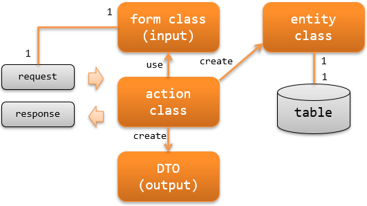

# RESTFulウェブサービスの責務配置

**公式ドキュメント**: [RESTFulウェブサービスの責務配置](https://nablarch.github.io/docs/LATEST/doc/application_framework/application_framework/web_service/rest/application_design.html)

## RESTFulウェブサービスの責務配置

**アクションクラス**: リクエストを元に業務ロジックを実行し、レスポンスを生成して返却する。フォームクラスからエンティティクラスを作成し、データベースに永続化するなどの処理を行う。

**フォームクラス**: クライアントから送信された値（http body）をマッピングするクラス。バリデーションアノテーションの設定や相関バリデーションのロジックを持つ。APIの仕様によっては階層構造（フォームクラスがフォームクラスを持つ）となる場合がある。

- **API単位にフォームクラスを作成する**: インタフェース（API）が異なる場合は別のフォームクラスとして作成する。登録用APIと更新用APIのように似た項目でも、APIが異なるため別フォームクラスにする必要がある。これによりインタフェース変更の影響範囲を限定でき、責務が明確で可読性や保守性が高くなる。相関バリデーションのロジックが複数フォームクラスで共通となる場合は、別クラスに抽出して共通化する。
- **フォームクラスのプロパティは全て `String` で定義する**: [Bean Validation](../../component/libraries/libraries-bean_validation.md) を参照。

**DTO（data transfer object）**: クライアントに応答する値（response body）にマッピングする値を保持するクラス。

**エンティティクラス**: テーブルと1対1で対応するクラス。カラムに対応するプロパティを持つ。

keywords

アクションクラス, フォームクラス, DTO, エンティティクラス, RESTfulウェブサービス, 責務配置, API単位フォームクラス, Stringプロパティ, バリデーション, 相関バリデーション, data transfer object

