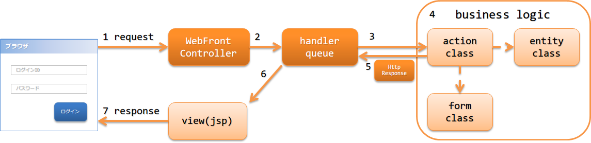

# アーキテクチャ概要

**目次**

* ウェブアプリケーションの構成
* ウェブアプリケーションの処理の流れ
* ウェブアプリケーションで使用するハンドラ

  * 最小ハンドラ構成

Nablarchでは、HTMLをベースとした画面UIを持つウェブアプリケーションを構築するための機能を提供している。

## ウェブアプリケーションの構成

Nablarchではウェブアプリケーションを構築する場合、ServletAPIの使用を前提としている。
以下にNablarchにおけるウェブアプリケーションの構成を示す。

[Nablarchサーブレットコンテキスト初期化リスナー](../../processing-pattern/web-application/web-application-nablarch-servlet-context-listener.md) (NablarchServletContextListener)

システムリポジトリやログの初期化処理を行うサーブレットコンテキストリスナー。

[Webフロントコントローラ](../../processing-pattern/web-application/web-application-web-front-controller.md) (WebFrontController)

受け取ったリクエストに対する処理をハンドラキューに委譲するサーブレットフィルタ。

## ウェブアプリケーションの処理の流れ

ウェブアプリケーションがリクエストを処理し、レスポンスを返却するまでの処理の流れを以下に示す。

1. [Webフロントコントローラ](../../processing-pattern/web-application/web-application-web-front-controller.md) ( javax.servlet.Filter の実装クラス)がrequestを受信する。
2. [Webフロントコントローラ](../../processing-pattern/web-application/web-application-web-front-controller.md) は、requestに対する処理をハンドラキュー(handler queue)に委譲する。
3. ハンドラキューに設定されたディスパッチハンドラ(DispatchHandler) が、URIを元に処理すべきaction classを特定しハンドラキューの末尾に追加する。
4. アクションクラス(action class)は、フォームクラス(form class)やエンティティクラス(entity class)を使用して業務ロジック(business logic) を実行する。
  各クラスの詳細は、 [アプリケーションの責務配置](../../processing-pattern/web-application/web-application-application-design.md) を参照。
5. action classは、処理結果を示す HttpResponse を作成し返却する。
6. ハンドラキュー内のHTTPレスポンスハンドラ(HttpResponseHandler)が、 HttpResponse をクライアントに返却するレスポンスに変換する。例えば、JSPのServlet Forwardなど。
7. responseが返却される。

## ウェブアプリケーションで使用するハンドラ

Nablarchでは、ウェブアプリケーションを構築するために必要なハンドラを標準で幾つか提供している。
プロジェクトの要件に従い、ハンドラキューを構築すること。(要件によっては、プロジェクトカスタムなハンドラを作成することになる)

各ハンドラの詳細は、リンク先を参照すること。

リクエストやレスポンスの変換を行うハンドラ

* [HTTP文字エンコード制御ハンドラ](../../component/handlers/handlers-http-character-encoding-handler.md)
* [HTTPレスポンスハンドラ](../../component/handlers/handlers-http-response-handler.md)
* [内部フォーワードハンドラ](../../component/handlers/handlers-forwarding-handler.md)
* [マルチパートリクエストハンドラ](../../component/handlers/handlers-multipart-handler.md)
* [セッション変数保存ハンドラ](../../component/handlers/handlers-SessionStoreHandler.md)
* [ノーマライズハンドラ](../../component/handlers/handlers-normalize-handler.md)
* [セキュアハンドラ](../../component/handlers/handlers-secure-handler.md)

リクエストのフィルタリングを行うハンドラ

* [サービス提供可否チェック](../../component/libraries/libraries-service-availability.md)
* [認可チェックハンドラ](../../component/handlers/handlers-permission-check-handler.md)

データベースに関連するハンドラ

* [データベース接続管理ハンドラ](../../component/handlers/handlers-database-connection-management-handler.md)
* [トランザクション制御ハンドラ](../../component/handlers/handlers-transaction-management-handler.md)

リクエストの検証を行うハンドラ

* [CSRFトークン検証ハンドラ](../../component/handlers/handlers-csrf-token-verification-handler.md)

エラー処理に関するハンドラ

* [HTTPエラー制御ハンドラ](../../component/handlers/handlers-HttpErrorHandler.md)
* [グローバルエラーハンドラ](../../component/handlers/handlers-global-error-handler.md)

その他

* [HTTPリクエストディスパッチハンドラ](../../component/handlers/handlers-http-request-java-package-mapping.md)
* [Nablarchカスタムタグ制御ハンドラ](../../component/handlers/handlers-nablarch-tag-handler.md)
* [スレッドコンテキスト変数管理ハンドラ](../../component/handlers/handlers-thread-context-handler.md)
* [スレッドコンテキスト変数削除ハンドラ](../../component/handlers/handlers-thread-context-clear-handler.md)
* [HTTPアクセスログハンドラ](../../component/handlers/handlers-http-access-log-handler.md)
* [出力ファイル開放ハンドラ](../../component/handlers/handlers-file-record-writer-dispose-handler.md)
* [ヘルスチェックエンドポイントハンドラ](../../component/handlers/handlers-health-check-endpoint-handler.md)

### 最小ハンドラ構成

Nablarchでウェブアプリケーションを構築する際の、必要最小限のハンドラキューを以下に示す。
これをベースに、プロジェクト要件に従ってNablarchの標準ハンドラやプロジェクトで作成したカスタムハンドラを追加する。

最小ハンドラ構成

| No. | ハンドラ | 往路処理 | 復路処理 | 例外処理 |
|---|---|---|---|---|
| 1 | [HTTP文字エンコード制御ハンドラ](../../component/handlers/handlers-http-character-encoding-handler.md) | リクエストとレスポンスに文字エンコーディングを設定する。 |  |  |
| 2 | [グローバルエラーハンドラ](../../component/handlers/handlers-global-error-handler.md) |  |  | 実行時例外、またはエラーの場合、ログ出力を行う。 |
| 3 | [HTTPレスポンスハンドラ](../../component/handlers/handlers-http-response-handler.md) |  | サーブレットフォーワード、リダイレクト、レスポンス書き込みのいずれかを行う。 | 実行時例外、またはエラーの場合、既定のエラーページを表示する。 |
| 4 | [セキュアハンドラ](../../component/handlers/handlers-secure-handler.md) |  | レスポンスオブジェクト(HttpResponse)にセキュリティ関連のレスポンスヘッダを設定する。 |  |
| 5 | [マルチパートリクエストハンドラ](../../component/handlers/handlers-multipart-handler.md) | リクエストがマルチパート形式の場合、その内容を一時ファイルに保存する。 | 保存した一時ファイルを削除する。 |  |
| 6 | [セッション変数保存ハンドラ](../../component/handlers/handlers-SessionStoreHandler.md) | セッションストアから内容を読み込む。 | セッションストアに内容を書き込む。 |  |
| 7 | [ノーマライズハンドラ](../../component/handlers/handlers-normalize-handler.md) | リクエストパラメータのノーマライズ処理を行う。 |  |  |
| 8 | [内部フォーワードハンドラ](../../component/handlers/handlers-forwarding-handler.md) |  | 遷移先が内部フォーワードの場合、後続のハンドラを再実行する。 |  |
| 9 | [HTTPエラー制御ハンドラ](../../component/handlers/handlers-HttpErrorHandler.md) |  |  | 例外の種類に応じたログ出力とレスポンスの生成を行う。 |
| 10 | [Nablarchカスタムタグ制御ハンドラ](../../component/handlers/handlers-nablarch-tag-handler.md) | Nablarchカスタムタグの動作に必要な事前処理を行う。 |  |  |
| 11 | [データベース接続管理ハンドラ](../../component/handlers/handlers-database-connection-management-handler.md) | DB接続を取得する。 | DB接続を解放する。 |  |
| 12 | [トランザクション制御ハンドラ](../../component/handlers/handlers-transaction-management-handler.md) | トランザクションを開始する。 | トランザクションをコミットする。 | トランザクションをロールバックする。 |
| 13 | [ルーティングアダプタ](../../component/adapters/adapters-router-adaptor.md) | リクエストパスをもとに呼び出すアクションを決定する。 |  |  |
