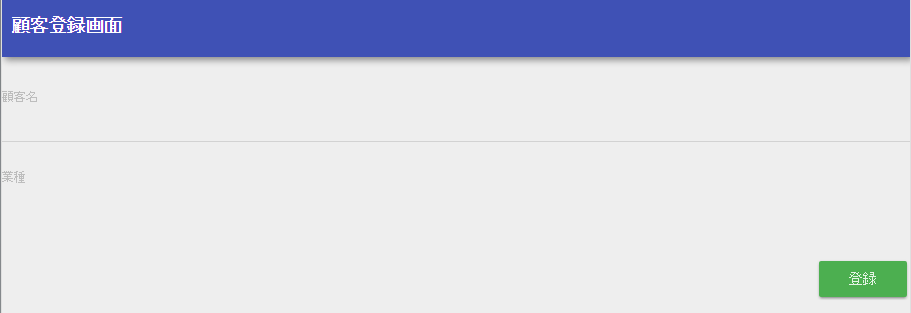
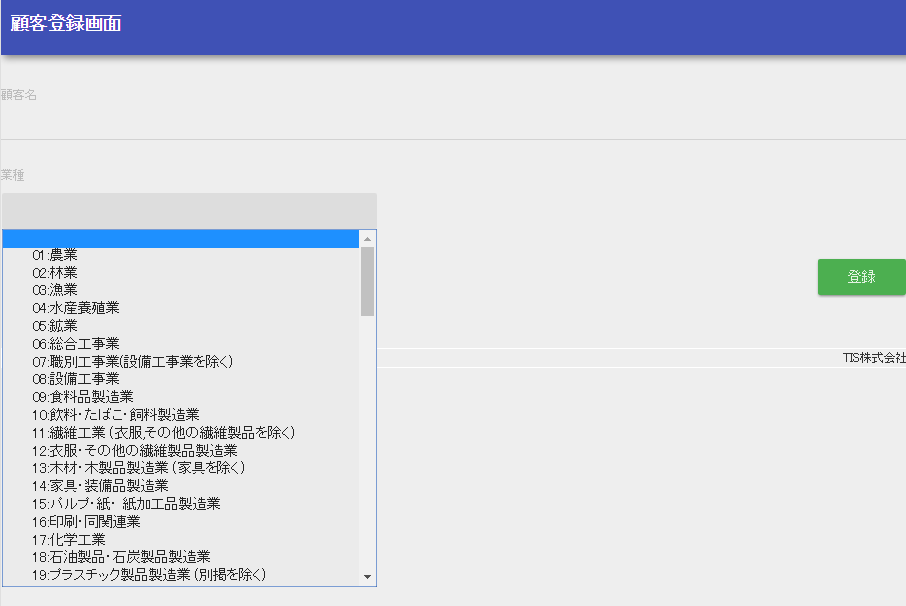

# 登録画面初期表示の作成

本章では、登録画面の初期表示について解説する。

登録画面のJSPを作成する
ひな形となるJSPを /src/main/webapp/WEB-INF/view/client 配下に配置する。

[create.jsp](../../../knowledge/assets/web-application-client-create1/create.jsp)
画面に初期表示する部分を実装する
create.jspに登録画面の内容を追加する。

/src/main/webapp/WEB-INF/view/client/create.jsp
```jsp
<n:form>
    <div class="form-group label-static is-empty">
        <label class="control-label">顧客名</label>
        <!-- 顧客名のテキストボックス -->
        <!-- フォーム作成前なので、name属性には仮の値を指定する -->
        <n:text name="tmp" cssClass="form-control input-text"/>
    </div>
    <div class="form-group label-static is-empty">
        <label class="control-label">業種</label>
        <!-- 業種のプルダウン -->
        <!-- フォーム作成前なので、name属性には仮の値を指定する -->
        <n:select
                listName="industries"
                elementValueProperty="industryCode"
                elementLabelProperty="industryName"
                name="tmp"
                withNoneOption="true"
                cssClass="btn dropdown-toggle"/>
    </div>
    <div class="button-nav">
        <!-- 登録ボタン -->
        <!-- 登録内容確認画面は作成前なので、uri属性には仮の値を指定する -->
        <n:button
                uri="tmp"
                cssClass="btn btn-raised btn-success">登録</n:button>
    </div>
</n:form>
```
この実装のポイント
* [JSPカスタムタグ](../../component/libraries/libraries-tag.md#tag) を使用し、テキスト入力フォーム、プルダウンを作成する。
  [入力フォームを作る](../../component/libraries/libraries-tag.md#tag-input-form) を参照。
* [selectタグ](../../component/libraries/libraries-tag-reference.md#tag-select-tag) の listName 属性に、
  後述の初期表示メソッドでリクエストスコープに登録する業種リストの名称を指定し、プルダウンに表示する。
  [選択項目(プルダウン/ラジオボタン/チェックボックス)を表示する](../../component/libraries/libraries-tag.md#tag-selection) を参照。
業務アクションに初期表示メソッドを作成する
ClientAction に、以下の処理を行う業務アクションメソッドを追加する

* プルダウンに表示するデータを取得しリクエストスコープに登録する。
* 初期表示画面のJSPへフォーワードする。

ClientAction.java
```java
public HttpResponse input(HttpRequest request, ExecutionContext context) {
    EntityList<Industry> industries = UniversalDao.findAll(Industry.class);
    context.setRequestScopedVar("industries", industries);
    return new HttpResponse("/WEB-INF/view/client/create.jsp");
}
```

業務アクションメソッドのシグネチャは以下とすること。
業務アクションメソッドが以下のシグネチャを満たさない場合、404エラーが発生する。

フレームワークから受け渡されるリクエストオブジェクト

フレームワークから受け渡される実行コンテキスト

遷移先を設定したレスポンスオブジェクト

この実装のポイント
* 登録画面に業種のプルダウンを表示するために、[ユニバーサルDAO](../../component/libraries/libraries-universal-dao.md#universal-dao) を使用してデータベースから業種情報を全件取得する。
* JSPへ値を受け渡すために、取得した業種リストをリクエストスコープに登録する。
URLと業務アクションのマッピングを行う
マッピング処理はOSSライブラリである [http_request_router(外部サイト)](https://github.com/kawasima/http-request-router) を使用して行う。
指定したURLと初期表示処理をマッピングするための設定を追加する。

routes.xml
```xml
<routes>
  <!-- 上から評価されるので、他のマッピングより前に設定する -->
  <get path="/action/client" to="Client#input"/>
  <!-- その他の設定は省略 -->
</routes>
```

> **Tip:**
> routes.xmlの指定方法は、[ライブラリのREADMEドキュメント(外部サイト)](https://github.com/kawasima/http-request-router/blob/master/README.ja.md) を参照。
登録画面へのリンクを作成する
ヘッダメニューに顧客登録画面へのリンクを作成する。

/src/main/webapp/WEB-INF/view/common/menu.jsp
```jsp
<ul class="nav navbar-nav">
  <!-- その他のリンクは省略 -->
  <li>
    <n:a href="/action/client">顧客登録</n:a>
  </li>
</ul>
```
この実装のポイント
* [JSPカスタムタグ](../../component/libraries/libraries-tag.md#tag) の [aタグ](../../component/libraries/libraries-tag-reference.md#tag-a-tag) を使用してリンクを作成する。
動作確認を行う
以下の手順で動作確認を行う。

1. アプリケーションにログインし、ヘッダメニューに「顧客登録」リンクが作成されていることを確認する。


1. 「顧客登録」リンクを押下すると顧客登録画面に遷移し、「顧客名」フォーム、「業種」プルダウン、登録ボタンが表示されていることを確認する。



1. 「業種」プルダウンが選択できることを確認する。



[次へ](../../processing-pattern/web-application/web-application-client-create2.md#client-create-2)
