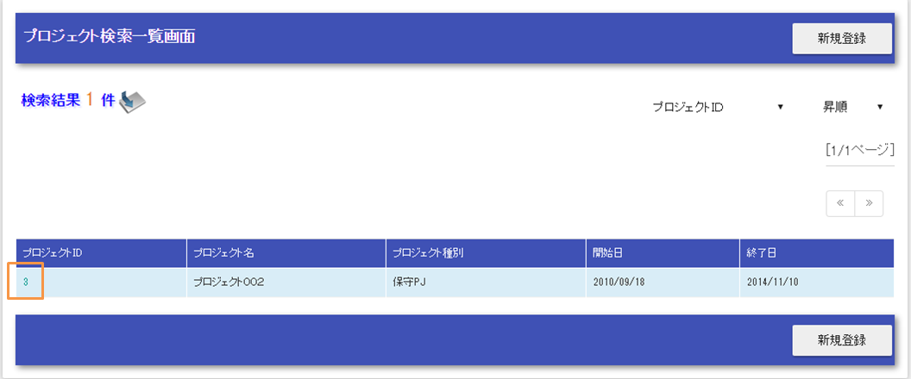
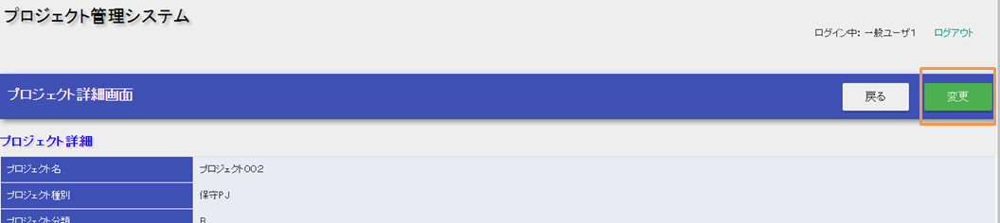
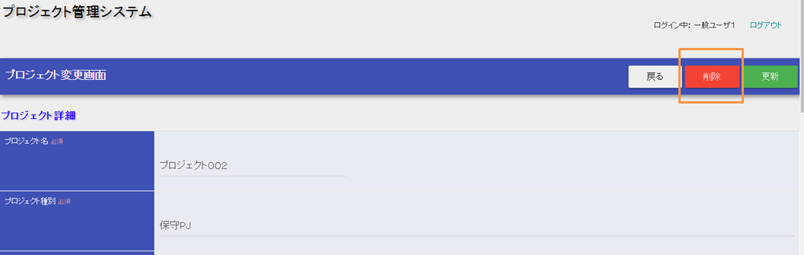
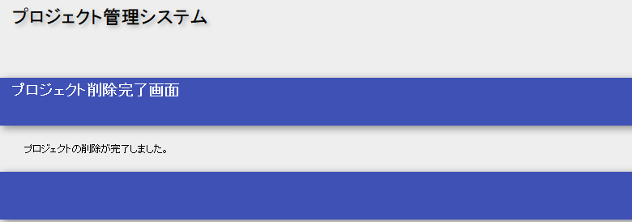

# 削除機能の作成

Exampleアプリケーションを元に削除機能を解説する。

作成する機能の説明

1. プロジェクト一覧のプロジェクトIDを押下する。



1. 詳細画面の変更ボタンを押下する。



1. 更新画面上の削除ボタンを押下する。



1. 完了画面が表示される。



## 削除を行う

削除機能の基本的な実装方法を、以下の順に説明する。

1. [更新画面上に削除ボタンを作成](../../processing-pattern/web-application/web-application-getting-started-project-delete.md#project-delete-update)
2. [削除を行う業務アクションメソッドの作成](../../processing-pattern/web-application/web-application-getting-started-project-delete.md#project-delete-delete-action)
3. [削除完了画面の作成](../../processing-pattern/web-application/web-application-getting-started-project-delete.md#project-delete-complete)

更新画面上に削除ボタンを作成

更新画面上に、削除ボタンを作成する。
更新画面の作成に関する説明は、 [更新画面を表示する業務アクションメソッドの作成](../../processing-pattern/web-application/web-application-getting-started-project-update.md#project-update-create-edit-action) 及び
[更新画面のJSPの作成](../../processing-pattern/web-application/web-application-getting-started-project-update.md#project-update-create-update-jsp) を参照。

削除を行う業務アクションメソッドの作成

データベースから対象プロジェクトを削除する業務アクションメソッドを作成する。

ProjectAction.java

```java
@OnDoubleSubmission
public HttpResponse delete(HttpRequest request, ExecutionContext context) {

    // 更新画面を表示する際にセッションにプロジェクト情報を格納している
    Project project = SessionUtil.delete(context, "project");
    UniversalDao.delete(project);

    return new HttpResponse(303, "redirect://completeOfDelete");
}
```

この実装のポイント

* 主キーを条件とした削除は、主キーが設定されたエンティティを引数に UniversalDao#delete
  を実行することで、SQLを作成しなくとも実行できる。

> **Tip:**
> [ユニバーサルDAO](../../component/libraries/libraries-universal-dao.md#universal-dao) は、主キーを条件とする削除機能のみを提供する。主キー以外を条件として削除する場合は、別途SQLを作成して実行する必要がある。
> SQLの実行方法については、 [SQLIDを指定してSQLを実行する](../../component/libraries/libraries-database.md#database-execute-sqlid) を参照。

削除完了画面の作成

削除完了画面を表示する。
完了画面の作成に関する説明は、 [完了画面を表示する業務アクションメソッドの作成](../../processing-pattern/web-application/web-application-getting-started-project-update.md#project-update-create-complete-action) 及び
[更新完了画面の作成](../../processing-pattern/web-application/web-application-getting-started-project-update.md#project-update-create-success-jsp) を参照。

削除機能の解説は以上。

[Getting Started TOPページへ](../../processing-pattern/web-application/web-application-getting-started.md#getting-started)
