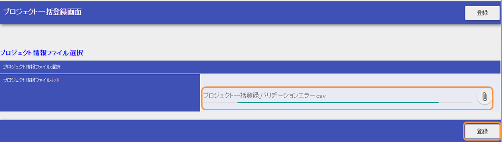
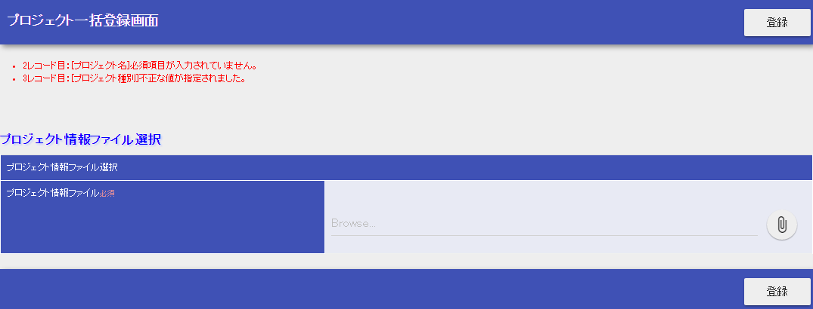
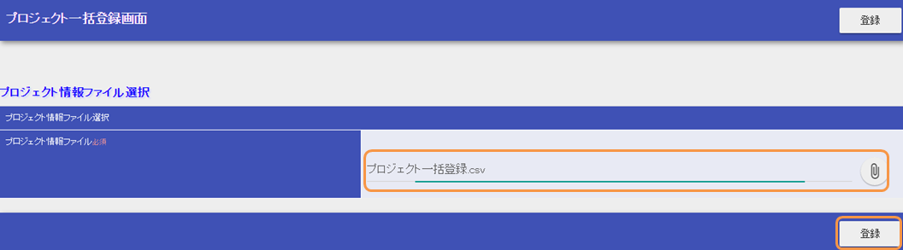
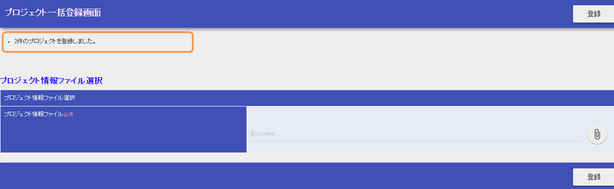

# アップロードを用いた一括登録機能の作成

Exampleアプリケーションを元に、CSVファイルをアップロードして一括登録する機能を解説する。

作成する機能の説明

1. ヘッダメニューの「プロジェクト一括登録」を押下する。


1. バリデーションエラーが発生する一括登録サンプルファイルを、下記からダウンロードする。

  [プロジェクト一括登録_バリデーションエラー.csv](../../../knowledge/assets/web-application-getting-started-project-upload/プロジェクト一括登録_バリデーションエラー.csv)
2. サンプルファイルをアップロードし、登録ボタンを押下する。



1. バリデーションエラーが発生する。



1. バリデーションエラーが発生しない一括登録サンプルファイルを、下記からダウンロードする。

[プロジェクト一括登録.csv](../../../knowledge/assets/web-application-getting-started-project-upload/プロジェクト一括登録.csv)

1. サンプルファイルをアップロードし、登録ボタンを押下する。



1. ファイルの内容がデータベースに登録され、完了メッセージが表示される。



## 作成する業務アクションメソッドの全体像

ProjectUploadAction.java

```java
@OnDoubleSubmission
@OnError(type = ApplicationException.class, path = "/WEB-INF/view/projectUpload/create.jsp")
public HttpResponse upload(HttpRequest request, ExecutionContext context) {

    // アップロードファイルの取得
    List<PartInfo> partInfoList = request.getPart("uploadFile");
    if (partInfoList.isEmpty()) {
        throw new ApplicationException(
                MessageUtil.createMessage(MessageLevel.ERROR, "errors.upload"));
    }
    PartInfo partInfo = partInfoList.get(0);

    LoginUserPrincipal userContext = SessionUtil.get(context, "userContext");

    // アップロードファイルの読み込みとバリデーション
    List<Project> projects = readFileAndValidate(partInfo, userContext);

    // DBへ一括登録する
    insertProjects(projects);

    // 完了メッセージの追加
    context.setRequestScopedVar("uploadProjectSize", projects.size());

    // ファイルの保存
    saveFile(partInfo);

    return new HttpResponse("/WEB-INF/view/projectUpload/create.jsp");
}
```

業務アクションメソッドの処理の流れは次のようになっている。

1. [ファイルを取得する](../../processing-pattern/web-application/web-application-getting-started-project-upload.md#project-upload-file-upload-action)
2. [CSVファイルの内容をBeanにバインドしてバリデーションする](../../processing-pattern/web-application/web-application-getting-started-project-upload.md#project-upload-validation)
3. [DBへ一括登録する](../../processing-pattern/web-application/web-application-getting-started-project-upload.md#project-upload-bulk-insert)
4. [ファイルを保存する](../../processing-pattern/web-application/web-application-getting-started-project-upload.md#project-upload-file-upload-action)

それぞれの処理の詳細は次節以降の
[ファイルアップロード機能の実装](../../processing-pattern/web-application/web-application-getting-started-project-upload.md#project-upload-file-upload-impl) と
[一括登録機能の実装](../../processing-pattern/web-application/web-application-getting-started-project-upload.md#project-upload-bulk-insert-impl) で説明する。

## ファイルアップロード機能の実装

まず、アップロードを用いた一括登録機能のうち、アップロード部分の作成方法に関して説明する。

1. [ファイルアップロード画面の作成](../../processing-pattern/web-application/web-application-getting-started-project-upload.md#project-upload-upload-jsp)
2. [ファイルの取得と保存を行う業務アクションメソッドの作成](../../processing-pattern/web-application/web-application-getting-started-project-upload.md#project-upload-file-upload-action)

ファイルアップロード画面の作成

ファイルアップロード欄をもつ画面を作成する。

/src/main/webapp/WEB-INF/view/projectUpload/create.jsp

```jsp
<n:form useToken="true" enctype="multipart/form-data">
    <!-- 省略 -->
    <div class="message-area margin-top">
        <!-- 完了メッセージ表示部分 -->
        <c:if test="${not empty uploadProjectSize}">
            <ul><li class="message-info"><n:message messageId="success.upload.project" option0="${uploadProjectSize}" /></li></ul>
        </c:if>
        <!-- エラーメッセージ表示部分 -->
        <n:errors errorCss="message-error"/>
    </div>
    <!-- 省略 -->
    <h4 class="font-group">プロジェクト情報ファイル選択</h4>
    <table class="table">
        <!-- 画面デザインに関する記述は省略 -->
        <tbody>
            <tr>
                <th class="item-norequired" colspan="2">プロジェクト情報ファイル選択</th>
            </tr>
            <tr>
                <th class="width-250 required">プロジェクト情報ファイル</th>
                <td >
                    <div class="form-group is-fileinput">
                        <div class="input-group">
                            <n:file name="uploadFile" id="uploadFile"/>
                            <!-- 画面デザインに関する記述は省略 -->
                        </div>
                    </div>
                </td>
            </tr>
        </tbody>
    </table>
    <div class="title-nav">
        <div class="button-nav">
            <n:button uri="/action/projectUpload/upload"
                      allowDoubleSubmission="false"
                      cssClass="btn btn-raised btn-default">登録</n:button>
        </div>
    </div>
</n:form>
```

この実装のポイント

* マルチパートファイルを送信するため、 [formタグ](../../component/libraries/libraries-tag-reference.md#tag-form-tag) の enctype 属性を multipart/form-data と指定する。
* [fileタグ](../../component/libraries/libraries-tag-reference.md#tag-file-tag) を用いてファイルアップロード欄を作成する。 name 属性にはリクエストオブジェクトへの登録名を指定する。
  業務アクションでファイルを取得するには、 HttpRequest#getPart
  の引数にこの登録名を指定する。
* アップロード完了時に、 [messageタグ](../../component/libraries/libraries-tag-reference.md#tag-message-tag) でアップロード完了メッセージを表示する。
  完了メッセージにアップロード件数を含めるため、 option0 属性には、リクエストスコープに設定されたアップロード件数を指定する。
* [errorsタグ](../../component/libraries/libraries-tag-reference.md#tag-errors-tag) を用いて、対象ファイルに対するバリデーションエラーメッセージを一覧表示する領域を作成する。
  エラーメッセージ一覧の出力形式については [エラーメッセージの一覧表示](../../component/libraries/libraries-tag.md#tag-write-error-errors-tag) を参照。

業務アクションメソッドの作成

業務アクションメソッドでの、ファイルの取得及び保存方法を説明する。

ProjectUploadAction.java

```java
public HttpResponse upload(HttpRequest request, ExecutionContext context)
        throws IOException {

    List<PartInfo> partInfoList = request.getPart("uploadFile");
    if (partInfoList.isEmpty()) {
        throw new ApplicationException(MessageUtil.createMessage(MessageLevel.ERROR,
                 "errors.upload"));
    }
    PartInfo partInfo = partInfoList.get(0);

    // 一括登録処理は後述するので省略

    // ファイルの保存
    saveFile(partInfo);

    return new HttpResponse("/WEB-INF/view/projectUpload/create.jsp");
}

/**
 * ファイルを保存する。
 *
 * @param partInfo アップロードファイルの情報
 */
private void saveFile(final PartInfo partInfo) {
    String fileName = generateUniqueFileName(partInfo.getFileName());
    UploadHelper helper = new UploadHelper(partInfo);
    helper.moveFileTo("uploadFiles", fileName);
}
```

この実装のポイント

* HttpRequest#getPart を使用してファイルを取得する。
* ファイルが存在しない(アップロードされていない)場合は、取得した PartInfo リストのサイズは0となる。
  この値を使用して業務例外を送出するなどの制御を行う。
* アップロードされたファイルは [マルチパートリクエストハンドラ](../../component/handlers/handlers-multipart-handler.md#multipart-handler) によって一時領域に保存される。
  一時領域は自動で削除されるため、アップロードファイルを永続化（保存）する必要がある場合は、ファイルを任意のディレクトリへ移送する。
  ただし、ファイルの移送は [ファイルパス管理](../../component/libraries/libraries-file-path-management.md#file-path-management) を使用してファイルやディレクトリの入出力を管理している場合のみ可能である。
* ファイルの移送には UploadHelper#moveFileTo メソッドを使用する。
  第一引数には、設定ファイルに登録されたファイル格納ディレクトリのキー名を指定する。
  Exampleアプリケーションでは下記ファイルに設定が記載されている。

  filepath-for-webui.xml

  ```xml
  <!-- ファイルパス定義 -->
  <component name="filePathSetting"
          class="nablarch.core.util.FilePathSetting" autowireType="None">
    <property name="basePathSettings">
      <map>
        <!--省略 -->
        <!--アップロードファイルの格納ディレクトリ-->
        <entry key="uploadFiles" value="file:./work/input" />
      </map>
    </property>
    <!-- 省略 -->
  </component>
  ```

## 一括登録機能の実装

アップロードを用いた一括登録機能のうち、一括登録部分の作成方法に関して説明する。

1. [ファイルをバインドするBeanの作成](../../processing-pattern/web-application/web-application-getting-started-project-upload.md#project-upload-create-bean)
2. [ファイルを一括登録する業務アクションメソッドの作成](../../processing-pattern/web-application/web-application-getting-started-project-upload.md#project-upload-bulk-action)

ファイルの内容をバインドするBeanの作成

ファイルの内容をバインドするBeanを作成する。

ProjectUploadDto.java

```java
@Csv(headers = { /** ヘッダを記述 **/},
        properties = { /** バインド対象のプロパティ **/},
        type = Csv.CsvType.CUSTOM)
@CsvFormat(charset = "Shift_JIS", fieldSeparator = ',',ignoreEmptyLine = true,
        lineSeparator = "\r\n", quote = '"',
        quoteMode = CsvDataBindConfig.QuoteMode.NORMAL, requiredHeader = true, emptyToNull = true)
public class ProjectUploadDto implements Serializable {

    // 一部項目のみ抜粋。ゲッタ及びセッタは省略

    /** プロジェクト名 */
    @Required(message = "{nablarch.core.validation.ee.Required.upload}")
    @Domain("projectName")
    private String projectName;

    /** プロジェクト種別 */
    @Required(message = "{nablarch.core.validation.ee.Required.upload}")
    @Domain("projectType")
    private String projectType;

    // 処理対象行の行数を保持するプロパティ。セッタは省略。
    /** 行数 */
    private Long lineNumber;

    /**
     * 行数を取得する。
     * @return 行数
     */
    @LineNumber
    public Long getLineNumber() {
        return lineNumber;
    }
}
```

この実装のポイント

* アップロードされたCSVファイルの内容と、Beanのプロパティとの紐付けの設定は、 @Csv を使用する。
  受け付けるCSVのフォーマットの指定は、 @CsvFormat を使用する。
  （ [デフォルトのフォーマットの指定](../../component/libraries/libraries-data-bind.md#data-bind-csv-format-set) を使用する場合は、 @CsvFormat は不要）
  アノテーションの設定方法の詳細は、 [CSVファイルをJava Beansクラスにバインドする場合のフォーマット指定方法](../../component/libraries/libraries-data-bind.md#data-bind-csv-format-beans) を参照。
* プロパティに @Required や @Domain
  などのバリデーション用のアノテーションを付与して [Bean Validation](../../component/libraries/libraries-bean-validation.md#bean-validation) を行う。
* ファイルからの入力値を受け付けるため、 [プロパティはString型で定義し](../../component/libraries/libraries-bean-validation.md#bean-validation-form-property)、
  適切な型への変換はバリデーションを通過した安全な値に対して行う。
* 行数プロパティを定義し、ゲッタに LineNumber を付与することで、
  対象データが何行目のデータであるかを自動的に設定できる。

> **Tip:**
> 入力必須項目のバリデーションエラーメッセージを、ファイルアップロードに対するメッセージとして適切なものに変更している。
> バリデーションメッセージの指定方法については、 [入力値のチェックルールを設定する](../../processing-pattern/web-application/web-application-client-create2.md#client-create-validation-rule) を参照。

業務アクションメソッドの作成

アップロードされたファイルの内容をデータベースに登録する業務アクションメソッドを作成する。

1.CSVファイルの内容をBeanにバインドしてバリデーションする

ProjectUploadAction.java

```java
private List<Project> readFileAndValidate(final PartInfo partInfo, final LoginUserPrincipal userContext) {
    List<Message> messages = new ArrayList<>();
    List<Project> projects = new ArrayList<>();

    // ファイルの内容をBeanにバインドしてバリデーションする
    try (final ObjectMapper<ProjectUploadDto> mapper
             = ObjectMapperFactory.create(
                    ProjectUploadDto.class, partInfo.getInputStream())) {
        ProjectUploadDto projectUploadDto;

        while ((projectUploadDto = mapper.read()) != null) {

            // 検証して結果メッセージを設定する
            messages.addAll(validate(projectUploadDto));

            // エンティティを作成
            projects.add(createProject(projectUploadDto, userContext.getUserId()));
        }
    } catch (InvalidDataFormatException e) {
        // ファイルフォーマットが不正な行がある場合はその時点で解析終了
        messages.add(
            MessageUtil.createMessage(
                MessageLevel.ERROR, "errors.upload.format", e.getLineNumber()));
    }

    // 一件でもエラーがある場合はデータベースに登録しない
    if (!messages.isEmpty()) {
        throw new ApplicationException(messages);
    }
    return projects;
}

/**
 * プロジェクト情報をバリデーションして、結果をメッセージリストに格納する。
 *
 * @param projectUploadDto CSVから生成したプロジェクト情報Bean
 * @return messages         バリデーション結果のメッセージのリスト
 */
private List<Message> validate(final ProjectUploadDto projectUploadDto) {

    List<Message> messages = new ArrayList<>();

    // 単項目バリデーション。Dtoに定義したアノテーションを元にBean Validationを実行する
    try {
        ValidatorUtil.validate(projectUploadDto);
    } catch (ApplicationException e) {
        messages.addAll(e.getMessages()
                .stream()
                .map(message -> MessageUtil.createMessage(MessageLevel.ERROR,
                        "errors.upload.validate", projectUploadDto.getLineNumber(), message))
                .collect(Collectors.toList()));
    }

    // 顧客存在チェック
    if (!existsClient(projectUploadDto)) {
        messages.add(MessageUtil.createMessage(MessageLevel.ERROR,
                "errors.upload.client", projectUploadDto.getLineNumber()));
    }

    return messages;
}
```

この実装のポイント

* ファイルをBeanにバインドして取得するには、 [データバインド](../../component/libraries/libraries-data-bind.md#data-bind) が提供する、
  ObjectMapper を使用する。
* 取得した ObjectMapper オブジェクトに対して、
  ObjectMapper#read を実行することで、バインド済みBeanのリストを取得できる。
* ValidatorUtil#getValidator を使用して
  Validator オブジェクトを生成することで、任意のBeanに対して [Bean Validation](../../component/libraries/libraries-bean-validation.md#bean-validation) を実行できる。
* エラーが発生した時点でバリデーションを中止せず、最終行まで検証する場合、
  バリデーション終了後に全行分のエラーメッセージを格納した Message のリスト
  を引数に ApplicationException を生成して送出することで、
  [errorsタグ](../../component/libraries/libraries-tag-reference.md#tag-errors-tag) で画面に出力できる。
* バリデーションメッセージにプロパティ名を付与する方法については
  [バリデーションエラー時のメッセージに項目名を含めたい](../../component/libraries/libraries-bean-validation.md#bean-validation-property-name) を参照し実装する。

2.DBへ一括登録する

ProjectUploadAction.java

```java
public HttpResponse upload(HttpRequest request,ExecutionContext context)
        throws IOException {

    // バリデーションの実行は前述

    // DBへ一括登録する
    insertProjects(projects);

    // ファイル保存は前述
}

/**
 * 複数のプロジェクトエンティティを一括でデータベースに登録する。
 * @param projects 検証済みのプロジェクトリスト
 */
private void insertProjects(List<Project> projects) {

  List<Project> insertProjects = new ArrayList<Project>();

  for (Project project : projects) {
      insertProjects.add(project);
      // 100件ごとにbatchInsertする
      if (insertProjects.size() >= 100) {
          UniversalDao.batchInsert(insertProjects);
          insertProjects.clear();
      }
  }

  if (!insertProjects.isEmpty()) {
      UniversalDao.batchInsert(insertProjects);
  }
}
```

この実装のポイント

* 一括登録は、 UniversalDao#batchInsert
  を使用して実行する。
* 一度に登録する件数が膨大になるとパフォーマンスの低下を招く可能性があるため、一括登録１回ごとの件数に上限を設定する。

アップロードを用いた一括登録機能の解説は以上。

[Getting Started TOPページへ](../../processing-pattern/web-application/web-application-getting-started.md#getting-started)
