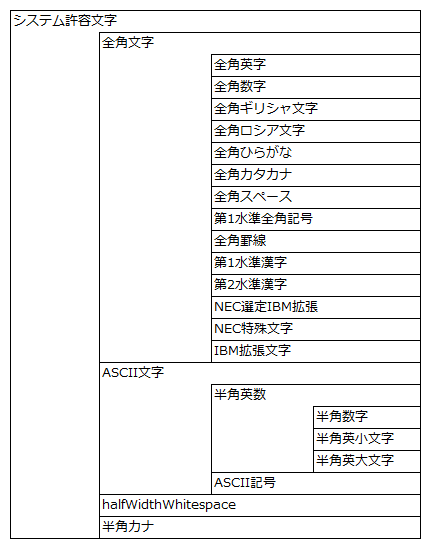

# 使用可能文字の追加手順

**公式ドキュメント**: [使用可能文字の追加手順](https://nablarch.github.io/docs/LATEST/doc/application_framework/application_framework/setting_guide/CustomizingConfigurations/CustomizeAvailableCharacters.html)

## 文字集合の包含関係

使用可能な文字集合は複数の文字集合から構成され、包含関係が存在する。



<details>
<summary>keywords</summary>

文字集合の包含関係, 使用可能文字構成, 文字集合図

</details>

## 文字集合定義の所在

以下の文字集合は、デフォルトコンフィギュレーション(jar)内の `nablarch/core/validation/charset-definition.config` に文字がリテラルで定義されている：

全角英字、全角数字、全角ギリシャ文字、全角ロシア文字、全角ひらがな、全角カタカナ、全角スペース、第1水準全角記号、全角罫線、第1水準漢字、第2水準漢字、NEC選定IBM拡張、NEC特殊文字、IBM拡張文字、半角数字、半角英小文字、半角英大文字、ASCII記号、半角カナ

`halfWidthWhitespace` はUnicodeコードポイントでデフォルトコンフィギュレーション(jar)内の `nablarch/core/validation/charset-definition.xml` に定義されている。

<details>
<summary>keywords</summary>

charset-definition.config, charset-definition.xml, 文字集合定義の所在, halfWidthWhitespace, デフォルトコンフィギュレーション, Unicodeコードポイント

</details>

## メッセージIDを設定するだけで使用できる使用可能文字

以下の使用可能文字はメッセージIDを設定するだけで精査エラーメッセージが使用できる：

- システム許容文字
- 全角文字
- 半角英数
- ASCII文字
- 半角数字
- 全角カタカナ

メッセージIDに対応するプレースホルダは :download:`デフォルト設定一覧 <../../configuration/デフォルト設定一覧.xlsx>` を参照。メッセージID及びメッセージ内容の変更手順については [./CustomizeMessageIDAndMessage](setting-guide-CustomizeMessageIDAndMessage.md) を参照。

<details>
<summary>keywords</summary>

メッセージIDのみで使用可能, システム許容文字, 全角文字, 半角英数, ASCII文字, 半角数字, 全角カタカナ, 使用可能文字設定

</details>

## メッセージIDを指定するだけでは使用できない使用可能文字

以下の使用可能文字はコンポーネント定義が必要（メッセージIDを定義していない場合、Nablarchアプリケーション起動時に警告が出力されるためデフォルト設定に組み込まれていない）：

- 全角英字、全角数字、全角ギリシャ文字、全角ロシア文字、全角ひらがな、第1水準全角記号、全角罫線、第1水準漢字、第2水準漢字、全角スペース、半角英小文字、半角英大文字、ASCII記号、半角カナ、NEC選定IBM拡張、NEC特殊文字、IBM拡張文字

Nablarchの設定ファイル（ウェブプロジェクトでは `web-component-configuration.xml` など）で `nablarch/core.xml` のインポート後にコンポーネント定義を追加する。

> **補足**: Nablarchのデフォルト設定を上書きするため、`nablarch/core.xml` のインポート後に定義すること。

**クラス**: `nablarch.core.validation.validator.unicode.LiteralCharsetDef`

定義例：

```xml
<import file="nablarch/core.xml"/>

<component name="全角英字" class="nablarch.core.validation.validator.unicode.LiteralCharsetDef">
  <property name="allowedCharacters" value="${nablarch.zenkakuAlphaCharset.allowedCharacters}"/>
  <property name="messageId" value="${nablarch.zenkakuAlphaCharset.messageId}"/>
</component>
```

各文字集合のプロパティ変数名：

| 文字集合 | allowedCharacters変数 | messageId変数 |
|---|---|---|
| 全角英字 | `${nablarch.zenkakuAlphaCharset.allowedCharacters}` | `${nablarch.zenkakuAlphaCharset.messageId}` |
| 全角数字 | `${nablarch.zenkakuNumCharset.allowedCharacters}` | `${nablarch.zenkakuNumCharset.messageId}` |
| 全角ギリシャ文字 | `${nablarch.zenkakuGreekCharset.allowedCharacters}` | `${nablarch.zenkakuGreekCharset.messageId}` |
| 全角ロシア文字 | `${nablarch.zenkakuRussianCharset.allowedCharacters}` | `${nablarch.zenkakuRussianCharset.messageId}` |
| 全角ひらがな | `${nablarch.zenkakuHiraganaCharset.allowedCharacters}` | `${nablarch.zenkakuHiraganaCharset.messageId}` |
| 第1水準全角記号 | `${nablarch.jisSymbolCharset.allowedCharacters}` | `${nablarch.jisSymbolCharset.messageId}` |
| 全角罫線 | `${nablarch.zenkakuKeisenCharset.allowedCharacters}` | `${nablarch.zenkakuKeisenCharset.messageId}` |
| 第1水準漢字 | `${nablarch.level1KanjiCharset.allowedCharacters}` | `${nablarch.level1KanjiCharset.messageId}` |
| 第2水準漢字 | `${nablarch.level2KanjiCharset.allowedCharacters}` | `${nablarch.level2KanjiCharset.messageId}` |
| 全角スペース | `${nablarch.zenkakuSpaceCharset.allowedCharacters}` | `${nablarch.zenkakuSpaceCharset.messageId}` |
| 半角英小文字 | `${nablarch.lowerAlphabetCharset.allowedCharacters}` | `${nablarch.lowerAlphabetCharset.messageId}` |
| 半角英大文字 | `${nablarch.upperAlphabetCharset.allowedCharacters}` | `${nablarch.upperAlphabetCharset.messageId}` |
| ASCII記号 | `${nablarch.asciiSymbolCharset.allowedCharacters}` | `${nablarch.asciiSymbolCharset.messageId}` |
| 半角カナ | `${nablarch.hankakuKanaCharset.allowedCharacters}` | `${nablarch.hankakuKanaCharset.messageId}` |
| NEC選定IBM拡張 | `${nablarch.necExtendedCharset.allowedCharacters}` | `${nablarch.necExtendedCharset.messageId}` |
| NEC特殊文字 | `${nablarch.necSymbolCharset.allowedCharacters}` | `${nablarch.necSymbolCharset.messageId}` |
| IBM拡張文字 | `${nablarch.ibmExtendedCharset.allowedCharacters}` | `${nablarch.ibmExtendedCharset.messageId}` |

メッセージID及びメッセージ内容の変更手順については [./CustomizeMessageIDAndMessage](setting-guide-CustomizeMessageIDAndMessage.md) を参照。

<details>
<summary>keywords</summary>

LiteralCharsetDef, nablarch.core.validation.validator.unicode.LiteralCharsetDef, コンポーネント定義, 全角英字, 全角ひらがな, 半角カナ, 第1水準漢字, web-component-configuration.xml, allowedCharacters, messageId, nablarch/core.xml

</details>

## 単独で使用できない使用可能文字

単独では使用できない使用可能文字として `halfWidthSpace` がある。

<details>
<summary>keywords</summary>

halfWidthSpace, 単独使用不可, 使用不可の使用可能文字

</details>
