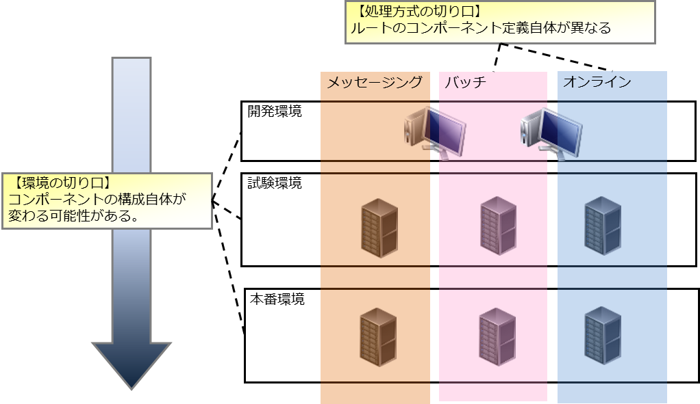
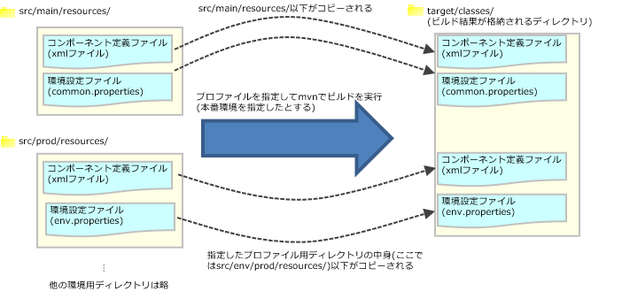

# 処理方式、環境に依存する設定の管理方法

**公式ドキュメント**: [処理方式、環境に依存する設定の管理方法](https://nablarch.github.io/docs/LATEST/doc/application_framework/application_framework/setting_guide/ManagingEnvironmentalConfiguration/index.html)

## アプリケーション設定の整理

Nablarchではアプリケーション設定を2つの観点で整理することを推奨する。

| 観点 | 具体例 | 説明 |
|---|---|---|
| 処理方式 | オンライン、バッチ | 処理方式が異なると、コンポーネント定義およびその環境設定値が異なる |
| 環境 | 開発環境、本番環境 | コンポーネント定義の一部を変更する必要がある（モック化など） |



<details>
<summary>keywords</summary>

処理方式と環境の設定管理, アプリケーション設定整理, コンポーネント定義, 環境設定値, オンライン, バッチ, モック化

</details>

## アプリケーション設定ファイル切り替えの前提

アプリケーション設定ファイルは、処理方式と環境の組み合わせで最小限必要なものを用意する。

アーキタイプから生成したプロジェクトのディレクトリ構造:

```text
web/batch
└─src
  ├─env
  │  ├─dev/
  │  │  └─env.properties     … 開発環境用の環境設定ファイル
  │  └─prod/
  │     └─env.properties     … 本番環境用の環境設定ファイル
  ├─main/
  │  └─resources/
  │     └─common.properties  … 環境非依存の環境設定ファイル
  └─test/
     └─resources/            … ユニットテスト環境
```

環境毎の環境設定値の切り替えは、環境毎に配置したenv.propertiesの差し替えにより実現する。

> **補足**:
> - 環境非依存のcommon.propertiesは全ての環境で使用する
> - アーキタイプ生成直後は、環境毎に変更する可能性が低い設定項目はcommon.propertiesに記載されている。common.propertiesに記載されている値を環境毎に変えたい場合は、項目をenv.propertiesに移動（カット＆ペースト）する
> - 環境が不足している場合は [how_to_add_profile](#s4) を参照して環境を追加する
> - 共通プロジェクトを使用している場合、共通プロジェクト単体の環境毎のアプリケーション設定ファイルは不要

<details>
<summary>keywords</summary>

ディレクトリ構造, env.properties, common.properties, アプリケーション設定ファイル, 環境設定ファイル, アーキタイプ, 環境設定値切り替え

</details>

## アプリケーション設定切り替えの仕組み

### ローカルでのAPサーバ起動時及び成果物生成時

Apache Mavenのプロファイル機能によりアプリケーション設定ファイルを切り替える。プロファイルはアーキタイプから生成したプロジェクトに初期状態で定義済み（定義済みプロファイルは :ref:`mavenModuleStructuresProfilesList` を参照）。

本番環境を指定したビルドコマンド例:

```bat
mvn -P prod package -DskipTests=true
```

- `-P`: プロファイル指定
- `-DskipTests=true`: ユニットテストのスキップ



> **重要**: src/main/resourcesと各環境毎のディレクトリでファイル名が重複した場合は、各環境毎のディレクトリのファイルが優先される。

> **補足**: resources以下のファイルは全てコピーされる。META-INF/MANIFEST.MFに`Target-Environment`エントリが追記される（例: `Target-Environment: 本番環境`）。

### ユニットテスト実行時

ユニットテスト実行時は、指定したプロファイル及び`src/test/resources`のリソースが使用される。明示的にプロファイルを指定しない場合、デフォルトでdevプロファイルが使用される。

```bat
mvn test
```

<details>
<summary>keywords</summary>

Mavenプロファイル, アプリケーション設定切り替え, ビルドコマンド, ユニットテスト, Target-Environment, MANIFEST.MF, devプロファイル, mavenModuleStructuresProfilesList, src/test/resources

</details>

## コンポーネント設定ファイル(xmlファイル)の作成方法

コンポーネントをモック等に切り替えるには、コンポーネント設定ファイル（xmlファイル）を環境毎に切り替えることで実現する。

作成手順:
1. Nablarchのデフォルト設定値をベースに、処理方式毎の本番用コンポーネント定義を作成する
2. 各本番コンポーネント定義に対して、環境毎のコンポーネント定義を本番からの差分として作成する
3. 作成したコンポーネント設定ファイルを環境毎のディレクトリに配置し、ビルド時に差し替える

<details>
<summary>keywords</summary>

コンポーネント設定ファイル切り替え, モック切り替え, 環境別コンポーネント定義, 差分設定, 本番コンポーネント定義

</details>

## プロファイルの定義

処理方式毎のプロジェクト（Web、バッチ等）のpom.xmlのprofiles内にプロファイル定義を追加する。

```xml
<profiles>
  <!-- 結合試験環境Aの例 -->
  <profile>
    <id>integration-test-a</id>
    <properties>
      <env.name>結合試験環境A</env.name>
      <env.dir>ita</env.dir>
      <env.classifier>ita</env.classifier>
      <webxml.path>src/main/webapp/WEB-INF/web.xml</webxml.path>
    </properties>
  </profile>
</profiles>
```

| 項目 | 説明 |
|---|---|
| id | mavenコマンド実行時に指定するプロファイルID。他のプロファイルと重複しないものを指定 |
| env.name | war/jarファイルのマニフェストに含める環境名 |
| env.dir | リソースを格納するディレクトリ |
| env.classifier | war/jarファイル名末尾につける識別子（半角英数）。pom.xml内のmaven-war-plugin及びmaven-jar-pluginのclassifierプロパティに設定することで実現 |
| webxml.path | 使用するweb.xmlを指定。JNDIの設定はweb.xmlにも記載が必要なため環境差異が発生する可能性がある。本番と同一の場合は`src/main/webapp/WEB-INF/web.xml`を設定 |

<details>
<summary>keywords</summary>

プロファイル定義, pom.xml, env.name, env.dir, env.classifier, webxml.path, maven-war-plugin, maven-jar-plugin, JNDI, 環境追加

</details>

## ディレクトリの追加

:ref:`addProfile` で指定したenv.dirのディレクトリを追加する。

例（integration-test-aの場合）: `src/env/ita/resources/` を作成する。

<details>
<summary>keywords</summary>

ディレクトリ追加, 環境ディレクトリ作成, リソースディレクトリ, addProfile

</details>

## アプリケーション設定ファイルの作成及び修正

類似しているプロファイルのアプリケーション設定ファイルをコピーし、内容を修正する。

<details>
<summary>keywords</summary>

アプリケーション設定ファイル作成, プロファイル設定コピー, 設定ファイル修正

</details>
