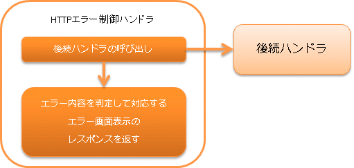

# HTTPエラー制御ハンドラ

## 概要

後続のハンドラで発生した例外に対するログ出力やレスポンスへの変換を行うハンドラ。

本ハンドラでは、以下の処理を行う。

* 例外の種類に応じたログ出力
* 例外の種類に応じたエラー用HttpResponseの生成と返却
* デフォルトページの設定


処理の流れは以下のとおり。



## ハンドラクラス名

* `nablarch.fw.web.handler.HttpErrorHandler`

<details>
<summary>keywords</summary>

HttpErrorHandler, nablarch.fw.web.handler.HttpErrorHandler, HTTPエラー制御ハンドラ, 例外ハンドラ, エラーレスポンス変換

</details>

## モジュール一覧

```xml
<dependency>
  <groupId>com.nablarch.framework</groupId>
  <artifactId>nablarch-fw-web</artifactId>
</dependency>
```

<details>
<summary>keywords</summary>

nablarch-fw-web, モジュール依存関係, com.nablarch.framework

</details>

## 制約

http_response_handler より後ろに配置すること
本ハンドラで生成した `HttpResponse` をHTTPレスポンスハンドラが処理するため、
本ハンドラは http_response_handler より後ろに配置する必要がある。

http_access_log_handler より後ろに配置すること
本ハンドラで生成したエラー用 `HttpResponse` を元にログ出力を行うため、
http_access_log_handler より後ろに配置する必要がある。

<details>
<summary>keywords</summary>

http_response_handler, http_access_log_handler, ハンドラ配置順序, 配置制約, HTTPレスポンスハンドラ, HTTPアクセスログハンドラ, HttpResponse

</details>

## 例外の種類に応じた処理とレスポンスの生成

`nablarch.fw.NoMoreHandlerException`
:ログレベル: INFO
:レスポンス: 404
:説明: リクエストを処理すべきハンドラが存在しなかったことを意味するため、証跡ログとして記録する。
また、処理すべき *action class* が存在しなかったことを意味するため、レスポンスは *404*  としている。

`nablarch.fw.web.HttpErrorResponse`
:ログレベル: ログ出力なし
:レスポンス: `HttpErrorResponse#getResponse()`
:説明: 後続のハンドラで業務例外(バリデーションなどを行った結果のエラーレスポンス送出)を送出したことを意味するのでログ出力は行わない。


`HttpErrorResponse` の原因例外が `ApplicationException` の場合は、
Viewでエラーメッセージを扱えるよう以下の処理を行う。

1. `ApplicationException` が保持するメッセージ情報を `ErrorMessages` に変換する。
2. `ErrorMessages` をリクエストスコープに設定する。
リクエストスコープに設定する際のキー名は、デフォルトでは `errors` となる。キー名は、コンポーネント設定ファイルで変更できる。

設定例
```xml
<component name="webConfig" class="nablarch.common.web.WebConfig">
  <!-- キーをmessagesに変更 -->
  <property name="errorMessageRequestAttributeName" value="messages" />
</component>
```
`nablarch.fw.Result.Error`
:ログレベル: 設定による
:レスポンス: `Error#getStatusCode()`
:説明: nablarch.fw.Result.Errorのログ出力について を参照

`java.lang.StackOverflowError`
:ログレベル: FATAL
:レスポンス: 500
:説明: データや実装バグに起因する可能性があるため、障害として通知する。
また予期しないエラーであるため、レスポンスは **500** としている。

`java.lang.ThreadDeath` と `java.lang.VirtualMachineError` ( `java.lang.StackOverflowError` 以外)
:ログレベル: \-
:レスポンス: \-
:説明: 本ハンドラでは何もせず上位のハンドラに処理を任せる。(エラーを再送出する)

上記以外の例外及びエラー
:ログレベル: FATAL
:レスポンス: 500
:説明: 上記に該当しない例外及びエラーの場合には、障害扱いとしてログ出力を行う。
また、予期しない例外やエラーであるため、レスポンスは **500** としている。

<details>
<summary>keywords</summary>

NoMoreHandlerException, HttpErrorResponse, ApplicationException, ErrorMessages, nablarch.fw.Result.Error, writeFailureLogPattern, errorMessageRequestAttributeName, 例外処理, ログ出力レベル, エラーレスポンス生成, StackOverflowError, ThreadDeath, VirtualMachineError, errors

</details>

## nablarch.fw.Result.Errorのログ出力について

後続のハンドラで発生した例外が、 `Error` の場合はログ出力を行うかどうかは、
`writeFailureLogPattern` に設定した値によって変わる。
このプロパティには正規表現が設定でき、その正規表現が `Error#getStatusCode()` とマッチした場合に `FATAL` レベルのログを出力する。

## デフォルトページの設定

後続のハンドラや本ハンドラのエラー処理で作成した `HttpResponse` に対して、デフォルトページを適用する。
この機能では、 `HttpResponse` が設定されていなかった場合、
`defaultPage` や
`defaultPages` で設定されたデフォルトのページを適用する。

以下に設定例を示す。

```xml
<component class="nablarch.fw.web.handler.HttpErrorHandler">
  <property name="defaultPages">
    <map>
      <entry key="4.." value="/USER_ERROR.jsp" />
      <entry key="404" value="/NOT_FOUND.jsp" />
      <entry key="5.." value="/ERROR.jsp" />
      <entry key="503" value="/NOT_IN_SERVICE.jsp" />
    </map>
  </property>
</component>
```
> **Important:** この機能を使用した場合、Servlet APIで規定されている `web.xml` へのエラーページ設定( `error-page` 要素)と重複してJSPの設定が必要となる。 `web.xml` へ設定しなかった場合、エラーの発生場所によっては、ウェブサーバのデフォルトのエラーページが表示される。 このため、本機能を使用するのではなく、デフォルトのエラーページの設定は、 `web.xml` へ行うことを推奨する。

<details>
<summary>keywords</summary>

defaultPage, defaultPages, デフォルトページ設定, エラーページ, web.xml, HttpErrorHandler, error-page, HttpResponse

</details>
