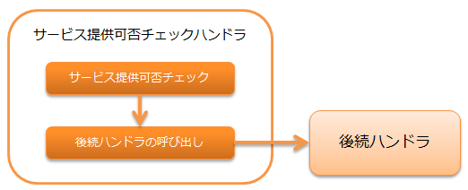

# サービス提供可否チェックハンドラ

<details>
<summary>keywords</summary>

ThreadContext, ServiceUnavailable, setUsesInternalRequestId, サービス提供可否チェック, リクエストID, 503

</details>

本ハンドラでは、 リクエストに対するサービス提供可否チェック を行う。

サービス提供可否チェックは、ライブラリの service_availability を使用して行う。
そのため、本ハンドラを使用するには、
`ServiceAvailability` を実装したクラスを本ハンドラに設定する必要がある。

本ハンドラでは、以下の処理を行う。

* サービス提供可否チェック

処理の流れは以下のとおり。



## ハンドラクラス名

* `nablarch.common.availability.ServiceAvailabilityCheckHandler`

<details>
<summary>keywords</summary>

ServiceAvailability, サービス提供可否チェック, 前提条件, 設定必須

</details>

## モジュール一覧

```xml
<dependency>
  <groupId>com.nablarch.framework</groupId>
  <artifactId>nablarch-common-auth</artifactId>
</dependency>
```

<details>
<summary>keywords</summary>

ServiceAvailabilityCheckHandler, nablarch.common.availability.ServiceAvailabilityCheckHandler, ハンドラクラス名

</details>

## 制約

スレッドコンテキスト変数管理ハンドラ より後ろに配置すること
本ハンドラではスレッドコンテキスト上に設定されたリクエストIDをもとにサービス提供可否チェックを行うため、
スレッドコンテキスト変数管理ハンドラ より後ろに本ハンドラを配置する必要がある。

内部フォーワードハンドラ より後ろに配置すること
内部フォーワードが行われた際に、フォーワード先のリクエストID（ 内部リクエストID ）をもとに
サービス提供可否チェックを行いたい場合は、 内部フォーワードハンドラ より後ろに本ハンドラを配置する必要がある。
合わせて、 スレッドコンテキスト変数管理ハンドラ の `attributes` に `InternalRequestIdAttribute` を追加すること。

<details>
<summary>keywords</summary>

nablarch-common-auth, com.nablarch.framework, モジュール依存関係, Maven依存

</details>

## リクエストに対するサービス提供可否チェック

`ThreadContext` からリクエストIDを取得し、サービス提供可否をチェックする。
チェックの詳細は、 service_availability を参照。

OK(サービス提供可)の場合
後続ハンドラを呼び出す。

NG(サービス提供不可)の場合
`ServiceUnavailable` (503) を送出する。

チェック対象のリクエストIDをフォーワード先のリクエストIDに変更したい場合は、
`ServiceAvailabilityCheckHandler.setUsesInternalRequestId`
でtrueを指定する。デフォルトはfalseである。

<details>
<summary>keywords</summary>

thread_context_handler, forwarding_handler, InternalRequestIdAttribute, ハンドラ配置順序, 制約

</details>
