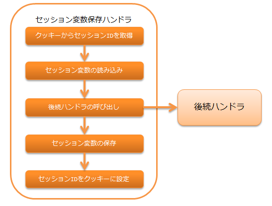

# セッション変数保存ハンドラ

## 概要

後続のハンドラやライブラリで追加・更新・削除されたセッション変数を、セッションストアに保存するハンドラ。

セッションストア機能の詳細は、 session_store を参照。

本ハンドラの処理の流れは以下の通りとなる。


> **Important:** 同一セッションの処理が複数のスレッドで実行された場合(例えば、タブブラウザで複数タブから同時にリクエストが有った場合)、 使用しているストアによっては後勝ちとなる。 詳細は、以下のイメージを参照。 .. image:: ../images/SessionStoreHandler/multi-thread.png 80 このため、使用するストアの特性をよく理解し、要件にあったストアを選択する必要がある。 ストアの詳細は、 セッションストアの特長と選択基準 を参照。

## ハンドラクラス名

* `nablarch.common.web.session.SessionStoreHandler`

<details>
<summary>keywords</summary>

セッション変数保存ハンドラ, セッションストア, 後勝ち, マルチスレッド, タブブラウザ, 複数スレッド, ストア選択, SessionStoreHandler, nablarch.common.web.session.SessionStoreHandler, セッション変数保存ハンドラ, ハンドラクラス名

</details>

## モジュール一覧

```xml
<dependency>
  <groupId>com.nablarch.framework</groupId>
  <artifactId>nablarch-fw-web</artifactId>
</dependency>

<!-- DBストア・有効期間のDB保存を使用する場合のみ -->
<dependency>
  <groupId>com.nablarch.framework</groupId>
  <artifactId>nablarch-fw-web-dbstore</artifactId>
</dependency>
```

<details>
<summary>keywords</summary>

nablarch-fw-web, nablarch-fw-web-dbstore, com.nablarch.framework, モジュール依存関係, DBストア

</details>

## 制約

HTTPレスポンスハンドラ より後ろに配置すること
サーブレットフォワード時、フォワード先でセッションストアの値にアクセスできるようにするため、
本ハンドラは HTTPレスポンスハンドラ より後ろに配置する必要がある。

HIDDENストア使用時は マルチパートリクエストハンドラ より後ろに配置すること
HIDDENストア使用時にリクエストパラメータにアクセスできるようにするため、
本ハンドラは マルチパートリクエストハンドラ より後ろに配置する必要がある。

内部フォーワードハンドラ より前に配置すること
内部フォーワードハンドラ を本ハンドラよりも前に設定した場合、セッションストアの読み込み、保存が複数回実行されるが、
HIDDENストアはリクエストパラメータからセッション変数を読み込み、リクエストスコープにセッション変数を保存するため、
内部フォーワード時にHIDDENストアを使用した場合、最新のセッション変数を取得できない問題がある。
このため、本ハンドラは 内部フォーワードハンドラ より前に配置すること。

<details>
<summary>keywords</summary>

http_response_handler, multipart_handler, forwarding_handler, HIDDENストア, ハンドラ配置順, 制約

</details>

## セッションストアを使用するための設定

セッションストアを使用するには、以下のとおり設定した `SessionManager`
を本ハンドラの `sessionManager` プロパティに設定する必要がある。

* アプリケーションで使用するセッションストア（複数指定可）
* デフォルトで使用するセッションストア名

以下の設定例を参考に、本ハンドラを設定すること。

```xml
<component class="nablarch.common.web.session.SessionStoreHandler">
  <property name="sessionManager" ref="sessionManager"/>
</component>

<!-- "sessionManager"というコンポーネント名で設定する -->
<component name="sessionManager" class="nablarch.common.web.session.SessionManager">
  <!-- プロパティの設定は省略 -->
</component>
```
`SessionManager` に設定するプロパティの詳細は セッションストアを使用するための設定 を参照。

<details>
<summary>keywords</summary>

SessionManager, nablarch.common.web.session.SessionManager, sessionManager, セッションストア設定, セッションマネージャ

</details>

## セッション変数を直列化してセッションストアに保存する

本ハンドラでセッション変数をセッションストアに保存する際、直列化の仕組みを選択できる。

選択可能な直列化の仕組みの詳細は セッション変数の直列化の仕組みを選択できる を参照。

<details>
<summary>keywords</summary>

session_store-serialize, 直列化, セッション変数シリアライズ, セッション変数保存

</details>

## セッションストアの改竄をチェックする

セッションストアからセッション変数を読み込む際、セッションストアが改竄されていないかをチェックする。

HIDDENストアの改竄を検知した場合
ステータスコード400の `HttpErrorResponse` を送出する。

それ以外のストアの改竄を検知した場合
セッションストアの復号処理時に発生した例外をそのまま送出する。

<details>
<summary>keywords</summary>

HttpErrorResponse, nablarch.fw.web.HttpErrorResponse, 改竄チェック, セッションストア改竄, ステータスコード400

</details>

## 改竄エラー時の遷移先を設定する

セッションストアの改竄を検知した場合に表示するエラーページは `web.xml` に記載する必要がある。
なぜなら、本ハンドラは 制約 に記載の通り、 内部フォーワードハンドラ よりも前に設定する必要がある。
この場合、以下の理由により本ハンドラで発生した例外に対して、 デフォルトページの設定 を適用できないため、
`web.xml` に対する設定が必要となる。

理由
内部フォーワードハンドラ は、 HTTPエラー制御ハンドラ よりも手前に設定する必要がある。
これは、 HTTPエラー制御ハンドラ  の デフォルトページの設定 に対して指定した
内部フォワードのパスを正しく扱うために必要な設定順となる。

この結果、 内部フォーワードハンドラ より前に設定される本ハンドラで発生した例外に対しては、
デフォルトページの設定 への設定値が適用できないため `web.xml` への設定が必要となる。

<details>
<summary>keywords</summary>

web.xml, 改竄エラー, HttpErrorHandler_DefaultPage, forwarding_handler, エラーページ設定

</details>

## セッションIDを保持するクッキーの名前や属性を変更する

セッションIDを保持するクッキーは以下のとおり設定されるが、名前や一部の属性を任意の値に変更できる。

:クッキー名:    | NABLARCH_SID
:Path属性:      | ホスト配下のすべてのパス
| 送信可能なパスを明示的に指定したい場合に別途設定すること
:Domain属性:    | 指定しない
| 送信可能なドメインを明示的に指定したい場合に別途設定すること
:Secure属性:    | 使用しない
| HTTPS環境で使用する場合は、`使用する` に設定すること
:MaxAge属性:    | 指定しない
| セッションIDを保持するクッキーをセッションクッキー(ブラウザを閉じれば破棄されるクッキー)とするため、MaxAge属性は使用しない
:HttpOnly属性:  | 使用する
| HttpOnly属性は常に使用され、設定ファイル等からは変更できない

> **Important:** セッションストアの有効期間は、デフォルトではHTTPセッションに保存される。 複数のストア間で異なる有効期間を設定した場合は、最も期間の長い値が使用される。 （有効期間の保存先をデータベースに変更する場合は db_managed_expiration を参照）
クッキー名や属性を変更したい場合は、以下の例を参考に設定すること。

```xml
<component class="nablarch.common.web.session.SessionStoreHandler">
  <!-- クッキー名 -->
  <property name="cookieName" value="NABLARCH_SID" />
  <!-- Path属性 -->
  <property name="cookiePath" value="/" />
  <!-- Domain属性 -->
  <property name="cookieDomain" value="" />
  <!-- Secure属性 -->
  <property name="cookieSecure" value="false" />
  <!-- セッションマネージャ -->
  <property name="sessionManager" ref="sessionManager"/>
</component>

<component name="sessionManager" class="nablarch.common.web.session.SessionManager">
  <property name="availableStores">
    <list>
      <component class="nablarch.common.web.session.store.DbStore">
        <!-- 有効期間 -->
        <property name="expires" value="1800" />
        <!-- その他のプロパティは省略 -->
      </component>
    </list>
  </property>
  <!-- その他のプロパティは省略 -->
</component>
```

<details>
<summary>keywords</summary>

cookieName, cookiePath, cookieDomain, cookieSecure, NABLARCH_SID, HttpOnly, セッションクッキー, クッキー属性, DbStore

</details>

## 有効期間をデータベースに保存する

セッションの有効期間保存先を変更できる。

デフォルトでは `HttpSessionManagedExpiration`
が使用されるためセッションの有効期間はHTTPセッションに保存される。

本ハンドラの `expiration`
プロパティを `DbManagedExpiration` に差し替えることでデータベースに保存できる。

<details>
<summary>keywords</summary>

HttpSessionManagedExpiration, DbManagedExpiration, nablarch.common.web.session.DbManagedExpiration, expiration, UserSessionSchema, SESSION_OBJECT, 有効期間データベース保存, SimpleDbTransactionManager, BasicApplicationInitializer, DbStore

</details>

## 使用方法

データベース上に有効期間を保存するためのテーブルは、DBストア に記載のDBストア使用時のテーブルを使用するものとする。

> **Important:** 有効期間をデータベースに保存する場合は、SESSION_OBJECT カラムを必須属性にしてはならない。 ログアウト時などに、セッションオブジェクトがNullのレコードが登録され得るため、必ずNull許容で定義すること。 5u15以前のアーキタイプから作成したプロジェクトでは、デフォルトで必須属性として定義されている。 必要に応じてALTER文の発行または、テーブルの再作成を実施する必要がある。
テーブル名およびカラム名を変更する場合は、 `DbManagedExpiration.userSessionSchema` に
`UserSessionSchema` のコンポーネントを定義する。
DBストアのテーブル・カラムも同じものに変更すること。

また有効期間は 初期化 が必要になる。

設定例を以下に示す。

```xml
<component name="sessionStoreHandler" class="nablarch.common.web.session.SessionStoreHandler">
  <!-- その他のプロパティは省略 -->
  <property name="expiration" ref="expiration" />
</component>

<component name="expiration" class="nablarch.common.web.session.DbManagedExpiration">
  <!-- データベースへのトランザクション制御を行うクラス -->
  <property name="dbManager">
    <component class="nablarch.core.db.transaction.SimpleDbTransactionManager">
      <property name="dbTransactionName" value="expirationTransaction"/>
    </component>
  </property>
  <!-- 上記のテーブル定義からテーブル名、カラム名を変更する場合のみ以下設定が必要 -->
  <property name="userSessionSchema" ref="userSessionSchema" />
</component>

<!-- テーブル定義を変更する場合はあわせてDBストアの定義も変更する -->
<component name="dbStore" class="nablarch.common.web.session.store.DbStore">
  <!-- その他のプロパティは省略 -->
  <property name="userSessionSchema" ref="userSessionSchema" />
</component>

<!-- 上記のテーブル定義からテーブル名、カラム名を変更する場合のみ以下設定が必要 -->
<component name="userSessionSchema" class="nablarch.common.web.session.store.UserSessionSchema">
  <property name="tableName" value="USER_SESSION_DB" />
  <property name="sessionIdName" value="SESSION_ID_COL" />
  <property name="sessionObjectName" value="SESSION_OBJECT_COL" />
  <property name="expirationDatetimeName" value="EXPIRATION_DATETIME_COL" />
</component>

<component name="initializer" class="nablarch.core.repository.initialization.BasicApplicationInitializer">
  <!-- 有効期間はinitializeが必要。 -->
  <property name="initializeList">
    <list>
      <component-ref name="expiration"/>
    </list>
  </property>
</component>
```
