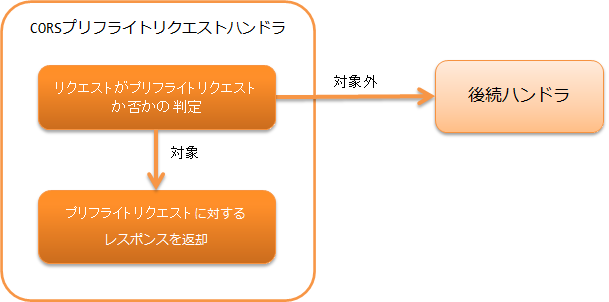

# CORSプリフライトリクエストハンドラ

## 概要

本ハンドラは、 RESTfulウェブサービス でCORS(Cross-Origin Resource Sharing)を実現するために使用する。

CORSを実現するには、実際のリクエストの前に送信されるプリフライトリクエストと実際のリクエストに対する処理が必要となる。
プリフライトリクエストは本ハンドラで処理し、実際のリクエストに対する処理は クライアントに返すレスポンスに共通処理を追加する で説明している
ResponseFinisherを実装した `CorsResponseFinisher` で処理する。

本ハンドラでは、以下の処理を行う。

* リクエストがプリフライトリクエストの場合はプリフライトリクエストに対するレスポンスを返す。

処理の流れは以下のとおり。



## ハンドラクラス名

* `nablarch.fw.jaxrs.CorsPreflightRequestHandler`

## モジュール一覧

```xml
<dependency>
  <groupId>com.nablarch.framework</groupId>
  <artifactId>nablarch-fw-jaxrs</artifactId>
</dependency>
```

## 制約

Jakarta RESTful Web Servicesレスポンスハンドラ より後ろに配置すること
本ハンドラで生成した `HttpResponse` を Jakarta RESTful Web Servicesレスポンスハンドラ が処理するため、
本ハンドラは Jakarta RESTful Web Servicesレスポンスハンドラ より後ろに配置する必要がある。

## CORSを実現する

CORSを実現するには本ハンドラと `CorsResponseFinisher` を設定する。

CORSの処理は `Cors` インタフェースが行う。
フレームワークはCORSの基本実装として `BasicCors` クラスを提供している。
本ハンドラとCorsResponseFinisherにBasicCorsを指定すればよい。

設定を以下に示す。

```xml
<!-- BasicCors -->
<component name="cors" class="nablarch.fw.jaxrs.cors.BasicCors">
  <!-- 許可するOriginの指定。この設定は必須 -->
  <property name="allowOrigins">
    <list>
      <value>https://www.example.com</value>
    </list>
  </property>
</component>

<!-- ハンドラキュー構成 -->
<component name="webFrontController" class="nablarch.fw.web.servlet.WebFrontController">
  <property name="handlerQueue">
    <list>
      <!-- 他のハンドラは省略 -->

      <!-- JaxRsResponseHandler -->
      <component class="nablarch.fw.jaxrs.JaxRsResponseHandler">
        <property name="responseFinishers">
          <list>
            <!-- CorsResponseFinisher -->
            <component class="nablarch.fw.jaxrs.cors.CorsResponseFinisher">
              <!-- BasicCorsを指定 -->
              <property name="cors" ref="cors" />
            </component>
          </list>
        </property>
      </component>

      <!-- CorsPreflightRequestHandler -->
      <component class="nablarch.fw.jaxrs.CorsPreflightRequestHandler">
        <!-- BasicCorsを指定 -->
        <property name="cors" ref="cors" />
      </component>

    </list>
  </property>
</component>
```
`BasicCors` はデフォルトで以下の処理を行う。

プリフライトリクエスト(CorsPreflightRequestHandlerが呼び出す処理)
- リクエストが以下の条件を全て満たす場合にプリフライトリクエストと判定する。

- HTTPメソッド：OPTIONS
- Originヘッダ：存在する
- Access-Control-Request-Methodヘッダ：存在する

- リクエストがプリフライトリクエストの場合は以下のレスポンスを返す。

.. textlint-disable ja-technical-writing/max-comma
- ステータスコード：204
- Access-Control-Allow-Methodsヘッダ：OPTIONS, GET, POST, PUT, DELETE, PATCH
- Access-Control-Allow-Headersヘッダ：Content-Type, X-CSRF-TOKEN
- Access-Control-Max-Ageヘッダ：-1
- 以下の「実際のリクエスト」と同じレスポンスヘッダも設定する。
.. textlint-enable ja-technical-writing/max-comma

実際のリクエスト(CorsResponseFinisherが呼び出す処理)
- 以下のレスポンスヘッダを設定する。

- Access-Control-Allow-Originヘッダ：リクエストのOriginヘッダ

- リクエストのOriginヘッダが許可するOriginに含まれる場合のみこのヘッダを設定
- Varyヘッダ：Origin

- リクエストのOriginヘッダが許可するOriginに含まれる場合のみこのヘッダを設定
- Access-Control-Allow-Credentialsヘッダ：true

デフォルトの処理のうち、レスポンスヘッダの内容を設定で変更できる。
設定で変更できる内容は `BasicCors` のJavadocを参照。
